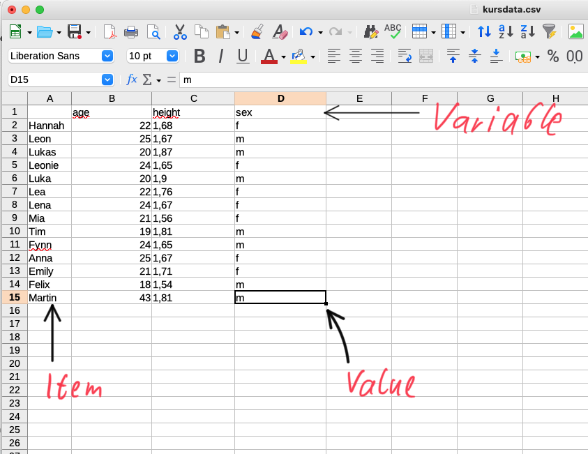
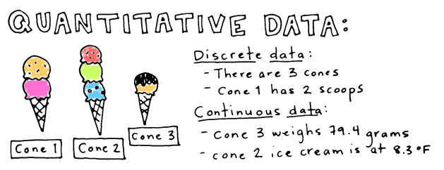
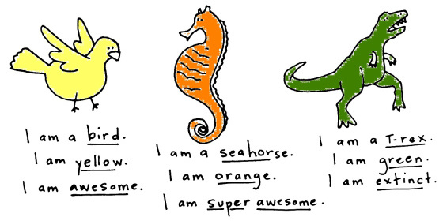
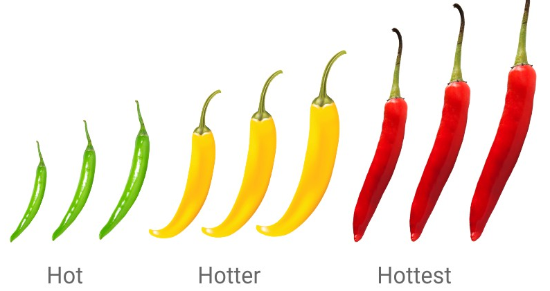
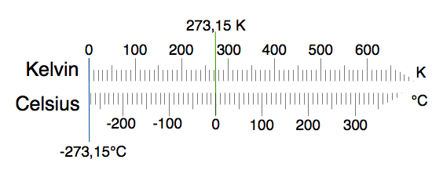

class: title-slide, center, middle
```{r, echo = FALSE}
# https://stackoverflow.com/questions/25646333/code-chunk-font-size-in-rmarkdown-with-knitr-and-latex
def.chunk.hook  <- knitr::knit_hooks$get("chunk")
knitr::knit_hooks$set(chunk = function(x, options) {
  x <- def.chunk.hook(x, options)
  ifelse(options$size != "normalsize", paste0("\\", options$size,"\n\n", x, "\n\n \\normalsize"), x)
})
```

```{r, echo = FALSE, results="asis"}
cat('# ', rmarkdown::metadata$title)
```

```{r, echo = FALSE, results="asis"}
cat('## ', rmarkdown::metadata$subtitle)
```

```{r, echo = FALSE, results="asis"}
cat('### ', rmarkdown::metadata$author)
```

```{r, echo = FALSE, results="asis"}
cat('#### ', rmarkdown::metadata$institute)
```

```{r, echo = FALSE, results="asis"}
cat(rmarkdown::metadata$date)
```

.footnote[
.right[
.tiny[
You can download a [pdf of this presentation](smada01.pdf).
]
]
]
---

## Synopsis

.pull-left[

]

.pull-right[
> "There will be no foolish wand-waving or silly incantations in this class. As such, I don't expect many of you to appreciate the subtle science and exact art that is statistics."
]
---

## Why statistics at all...

### For you:
Statistics are used! If you want to understand them, you have to learn it!

### For archaeology/science as discipline
Statistics make everything easier!

- Statements become more understandable and especially replicable
- Statistical statements are right or wrong no matter what reputation the scientist has
- Statements and data become comparable
- Getting the Knowledge of all the material for intuitive understanding of scientific/archaeological relations takes decades, learning statistics only months

---

## Figures don't lie, but liars figure.
Samuel Clemens (alias Mark Twain)

### Statistics are only correct if question, approach and method are correct

e.g.: is social stratification observable on metal grave goods? Or on
jewellery? What if this depends on the (not observed) sex of the
deceased...

### Measuring and especially coding of measurements requires subjective decisions all the time:

Reasons for the decisions are often not understandable → subjective influence

### Statistics for statistics sake?
A logic (archaeologic) meaning have to be behind an analysis. And the results of analyses have to be logical (archaeological) testable.

---

## Statistic tool R: history (after Theus)

R is the successor of S resp. S-Plus

- S history:
  - 1976-1980: S-Version 1; (development by AT&T Labs) collection of Fortran routines
  - 1980-1984: S-Version 2 Porting to UNIX, definition of the command language
  - 1988-1991: S-Version 3 Porting to C, object-oriented, models
  - 1999-today:

S-Version 4 improved object-orientation (parallel the commercial version S-Plus)

- R history
  - early 90th: Development in New Zealand (R. Ihaka, R. Gentleman) Lisp based, only platform was Mac
  - middle 90th: expansion onto other platforms
  - end 90th: distributed development by the R-Core-Team

- R-Core-Team: 17 developers all over the world
- R-”specialists”: ca. 50 contributer
- developers of R-packages: hundreds, daily more

---

## Why R?

### Open Source

- Free accessible source code: transparency of the program
- Free to distribute: you don't have to pay horrific prices or make illegal copies

### Reference of the used algorithms

- Scientific citable

### Power

- The tool can do everything! Really! Exept making coffee...

### Spread

- Runs on all (major) operating systems
- Is widely used in the scientific field

---

## Why R?

### Disadvantages

- Command line: unfamiliar (new/old way to work with a computer)
- GUIs look different
- Knowledge of the english language is helpful
- Names of functions and parameters have to be kept in mind: is it col.names, colnames or header?
- Documentation is partly not very intuitiv: you should know what you are searching for

---

## Basic literature

### Stephan Shennan, Quantifying Archaeology.

The textbook for this course.

### David L. Carlson, Quantitative Methods in Archaeology Using R

A archaeology specific R textbook

### Dubravko Dolić, Statistik mit R.
### John Verzani, Using R for Introductory Statistics.

R-specific (introductory) statistical books

---

## More literature

- M. Fletcher/G. R. Lock, Digging Numbers: Elementary Statistics for Archaeologists. Oxford Univ. Comm. Arch. Monogr. 332 (Oxford 2005).
-  M. J. Baxter, Exploratory Multivariate Analysis in Archaeology (Edinburgh 1994).
-  M. Baxter, Statistics in Archaeology (London 2003).
-  P. Ihm, Statistik in der Archäologie: Probleme der Anwendung, allgemeine Methoden, Seriation und Klassifikation. Archaeo-Physika 9 (Köln 1978).
- J. Bortz, Statistik für Sozialwissenschaftler4 (Berlin u. a. 1993).

---

## Schedule

```{r echo=FALSE}
library(magrittr)
library(kableExtra)

schedule <- c(
  "24.02.2021", "Session: Introduction](01_session/session_1_introduction.html)", "1+2",
"03.03.2021", "Session: Introduction into R", "-",
"10.03.2021", "Session: Explorative Statistics/Graph. Display", "3",
"17.03.2021", "Session: Descriptive Statistics", "4",
"24.03.2021", "Session: Nonparametric Tests", "5",
"31.03.2021", "Session: Chi-square test", "7",
"14.04.2021", "Session: Probability Theory and Distributions", "5",
"21.04.2021", "Session: Distributions", "6",
"28.04.2021", "Session: Parametric Tests", "6",
"05.05.2021", "Session: Regression & Correlation", "8",
"12.05.2021", "Session: Cluster Analysis", "11",
"26.05.2021", "Session: Correspondence Analysis", "13",
"02.06.2021",  "Test", "-"
)

schedule <- as.data.frame(matrix(schedule,ncol=3, byrow = T))
colnames(schedule) <- c("date", "topic", "chapt. Shennan")
knitr::kable(schedule)  %>%
  kable_styling(bootstrap_options = c("striped", "hover"),
                latex_options = "striped",
                full_width = T)
```

---

## Sample and Population

### Population:
- Amount of all items of relevance for an analysis.

### Sample
- Selection of items on basis of certain criteria (e.g. representativity) which
- will be analysed instead of the population

### Example opinion poll
- Population: all federal citizens who have a meaning
- Sample: the citizens who are polled by the polling organization

*complete record of all the values ↔ sampling*

**In archaeology only sampling is possible! The population can never be investigated!**

---

## Flavours of statistics

### Descriptive statistics
- Summary and description of data by using parameters (mean, standard deviation etc.)

### (graphical display)
- Summary and description of data by using graphs (bar charts, pie charts etc.)
- Useful for pattern detection and description, therefore intermediate position

### Explorative statistics
- Summary and description of data for pattern detection (e.g. correspondence analysis)

### Statistical inference or statistical induction
- testing of hypothesis on data (e.g. chi-squared test)

---

## Data, variables, values

.pull-left[
- variable:
  - What ist measured or analysed.
  - e.g. height
- item:
  - That whichs variable is measure
  - e.g. me as „possessor“ of a height, graves, persons...
- values:
  - The actual measurement.
  - e.g. my height is 1.81 m.
]

.pull-right[

]
---

## Flavours of Statistics 2: Troll math

.pull-left[
### one: univariate statistics:
- Only on variable is involved
- e.g. weight of bronze axes

### two: bivariate statistics:
- Two variables are involved, of interest is their relation
- e.g. relationship of length and width of bronze axes
]

.pull-right[

]

### many: multivariate statistik:
- More than two variables are involved, of interest is their relation
- e.g. place of finding of axes (grave, depot, settlement) in relation to their chemical composition (proportion of copper, tin, arsenic, lead etc.)
---

## More than one variable

### Independent Variable:
- The assumed cause of a relationship

### Dependent variable:
- The assumed effect of the independent variable in a relationship

### example:
- Number of pearls in a grave (Dependent) vs.
- sex of the deceased (independent)
- Hypothesis: The number of pearls in a grave depends on the sex of the deceased

### Can (have to be) not always to be defined
- e.g.: volume and height of a vessel...

---

## continuous vs. discrete

.pull-left[
### discrete variable:
  - Variable which can take only certain values without intermediate values
  - e.g. income, counts of ceramic objects, sex (?)
  - 'counted'
  
### continuous variables:
  - Variable which can take all value and intermediate value
  - e.g. height, temperature, proportion value
  - 'measured'
]

.pull-right[


.caption[Source: https://statsthewayilikeit.com]
]
---

## Levels of measurement



### nominal or categorical:
  - You can only decide if something belongs to a category
  - Categories which do not have a defined relationship among each other, only counting is possible (e.g. sex)
  
---

## Levels of measurement



### ordinal:
  - Categories which are comparable and differ from each other in their characteristic [size/power/intensity]
  - their rank is determinable (e.g. preservation conditions – bad < medium < good)

---

## Levels of measurement



### metric:
  - Variable has a defined system of measurement, all calculations are possible. To distinguish are

1. interval: The variable has an arbitrary choosen neutral point (°C)
2. ratio: The variable has an absolute neutral point (°K)

- Sometimes also used: absolut scale
  - counts (number of inhabitans)

---

## Levels of measurement


---

## Levels of measurement

```{r echo=FALSE}

lom <- c(
  "nominal", "equality, inequality", "Telephon numbers, illnesses, ceramic types",
  "ordinal", "bigger-smaller-relationship", "Wind forces, academic ranks, classes of wealth, stratigraphic relations",
  "interval", "Equality of differences", "Temperature in °C, calender age",
  "ratio", "Equality of ratios", "Measurement of lengths, weight, height of a vessel"
)

lom <- as.data.frame(matrix(lom,ncol=3, byrow = T))
colnames(lom) <- c("scale", "Meaningful statements", "Examples")
knitr::kable(lom)  %>%
  kable_styling(bootstrap_options = c("striped", "hover"),
                latex_options = "striped",
                full_width = T)
```

.caption[after Bortz 2005]

---

## Levels of measurement

Change of the level

### downscaling:
- Always possible.
- e.g. classification of measurements (small-medium-big)
- But: leads to loss of information

### upscaling:
- Sometimes possible
- e.g.: instead of classification of ceramics in coarse-fine ware measurement of grain size
- But: leads to larger data volume and higher complexity of measurement

### Conclusion:
- For analysis should the best fitting level of measurement be choosen.
- Because there can always occure a change in the requirements, rule of thumb: take one level finer than you think you will need in the end (as said, just a rule of thumb...)

---

## Data collection: list

Simple list of the data

example:
```{r echo=F}
this_list <- c(
154,
167,
187,
165,
190,
176,
167,
156,
154,
165,
167,
171,
154
)
this_list
```

---

## data preparation: matrix of data
Table of multiple values each item

example:
.tiny[
```{r echo=F}
this_data_matrix <- c(
"Hannah", "Leon", "Lukas", "Leonie", "Luka", "Lea", "Lena", "Mia", "Tim", "Fynn", "Anna", "Emily", "Felix",
154, 167, 187, 165, 190, 176, 167, 156, 154, 165, 167, 171, 154,
"2(female)", "1(male)", "1", "2", "1", "2", "2", "2", "1", "1", "2", "2", "1")
this_data_matrix <- as.data.frame(matrix(this_data_matrix,ncol=3, byrow = F))
colnames(this_data_matrix) <- c("name", "height", "sex")
knitr::kable(this_data_matrix)  %>%
  kable_styling(bootstrap_options = c("striped", "hover"),
                latex_options = "striped",
                full_width = T)
```
]
---

## data preparation: “tally sheet” / frequency table

Table of multiple items each value
example:

```{r echo=F}
this_tally_sheet <- c(154, 156, 167, 165, 171, 176, 187, 190,
"|||", "|", "|||", "||", "|", "|", "|", "|",
3, 1, 3, 2, 1, 1, 1, 1)
this_tally_sheet <- as.data.frame(matrix(this_tally_sheet,ncol=3, byrow = F))
colnames(this_tally_sheet) <- c("name", "Tally marks", "counts")
knitr::kable(this_tally_sheet)  %>%
  kable_styling(bootstrap_options = c("striped", "hover"),
                latex_options = "striped",
                full_width = T)
```

---

## data preparation: classification

Table of multiple items each class of value

example:

```{r echo=F}
this_tally_sheet_classed <- c(
"<150", "150-159", "160-169", "170-179", "180-189", ">190",
"", "||||", "|||||", "||", "|", "|",
0, 4, 5, 2, 1, 1)

this_tally_sheet_classed <- as.data.frame(matrix(this_tally_sheet_classed,ncol=3, byrow = F))
colnames(this_tally_sheet_classed) <- c("name", "Tally marks", "counts")
knitr::kable(this_tally_sheet_classed)  %>%
  kable_styling(bootstrap_options = c("striped", "hover"),
                latex_options = "striped",
                full_width = T)
```

Class width here 10 cm

Rule of thumb: ca. 8 – 12 classes or

Number of classes $k ≈ \sqrt{n}$, here therefore $k ≈ \sqrt{13} = `r sqrt(13)` ≈ 4$

---

## Equations & symbols

| meaning | symbol |
|-|-|
| ca. | $a≈b$ |
| count | $n$ |
| sum | $\sum_{i=1}^n x_i$ |
| This means | $x_1 =0, x_2 =4, x_3 =5, x_4 =2, x_5 =1, x_6 =1 ; n=6$
|  | $x_1 + x_2 + x_3 + x_4 + x_5 + x_6 =\sum_{i=1}^n x_i$ |
| Product the same way | $\prod_{i=1}^n x_i = x_1 ∗x_2 ∗x_3 ∗x_4 ∗x_5 ∗x_6 = 0$ |

---

## Example arithm. mean

Equations are recipes

$$ \bar{x}=\frac{\sum_{i=1}^n x_i} n $$

observations : $x_i$ ={154, 167, 187, 165, 190, 176, 167, 156, 154, 165, 167, 171, 154}

number of observations : n=13

$$ \bar{x}=\frac{154 + 167 + 187 + 165 + 190 + 176 + 167 + 156 + 154 + 165 + 167 + 171 + 154} {13} \\\\
\bar{x}=\frac{2173} {13} \\\\
\bar{x}=`r 2173/13` $$
.right[


.caption[.tiny[@charlesetoroma - unsplash]]
]
---
class: inverse
## Homework: description of the participants

**Choose one of the following five groups and collect the data about the participants accordingly**

Data to collect for the groups

- A) Email, number of the computer in front of you
- B) Sex, Age
- C) laptop yes/no, foot size
- D) actual cash in your purse, height
- E) homecountry, operation system used at home

Collect the data matrix, determine the level of measurement of each variable and send me your data collection via email until weekend.

**Make it a group work! organise yourself! No one is an island!**