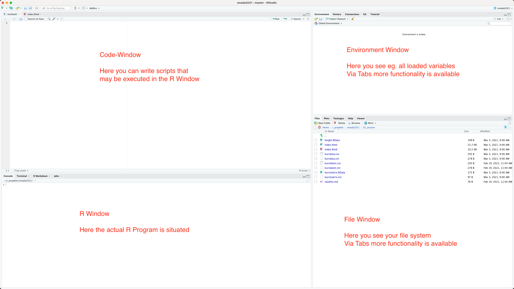

class: title-slide, center, middle

```{r setup, echo=F, error=FALSE, warning=F, message=F}
rm(list = ls())
```

```{r, echo = FALSE, results="asis"}
cat('# ', rmarkdown::metadata$title)
```

```{r, echo = FALSE, results="asis"}
cat('## ', rmarkdown::metadata$subtitle)
```

```{r, echo = FALSE, results="asis"}
cat('### ', rmarkdown::metadata$author)
```

```{r, echo = FALSE, results="asis"}
cat('#### ', rmarkdown::metadata$institute)
```

```{r, echo = FALSE, results="asis"}
cat(rmarkdown::metadata$date)
```

.footnote[
.right[
.tiny[
You can download a [pdf of this presentation](smada02.pdf).
]
]
]
---
## Start R-Studio



---

## Using R

### Start of the system:
After R is started, you end on the prompt.
```
>
```

### Change the working directory:

```{R eval=F}
getwd() # or something else

setwd("U:\R") # or something else
```

Change the path according to your needs

---

## R as calculator

### Simplest way of use:

```{R}
2+2

2^2
```

### Multiple commands are separated by ;

```{R}
(1 - 2) * 3; 1 - 2 * 3
```

---

## R as calculator

### Using functions:

```{R}
sqrt(2) #square root

log(10) #logarith base e

log(10, 10) #logarith base 10, like log(10, base=10)
```

---

## Getting help

Call of the help function:
```{R}
help(sqrt)
```

Even simpler?

```{R}
? sqrt
```

Searching the help:

```{R}
help.search('logarithm')
```

---

## Assignment of data to variables
Naming variables for Values (Assignment):

```{R}
x <- 2 # no message will be given back

x


pi # build in variable
```

### Arrow or equal sign?
Classic assignment symbol in R is the arrow. Also possible:

```{R}
x=2
```

Both are possible. Matter of tast.
<- is clearer, I am using it that way

---

## Working with variables

Display of already uses variables:
```{r}
ls()
```

Delete a variable:
```{r}
rm(x) # no message will be given back
ls()
```

---

## Using variables

Calculations with variables:
```{r}
x <- 2
y <- 2 * x
z <- sqrt(x) # no message will be given back
```

```{r}
ls()
y
z
```

---
class: inverse

## Exercise variables

### Calculation of a circle:
Given is a circle with the radius r=5. Calculate the diameter d (2 \* r), the circumference u (2 \* π \* r) and the area a (π \* r^2).

Add area a and circumference u, assign the result to the variable v and delete u and a.

---

## Scalars, vectors, matrices, data frames

Data types in R

### Scalar
A single number or date

```{r}
pi
```

### Vector
A row of numbers or data

```{r}
ls()
```

---

## Scalars, vectors, matrices, data frames

Data types in R

### Matrix:
A table of data of the same kind

```{r }
euro.cross
```

---

## Scalars, vectors, matrices, data frames

Data types in R

### Data frame:
A table of data of different kind

```{r}
mtcars
```


---
## Download data for further tasks

* [height.RData](height.RData)
* [kursmatrix.txt](kursmatrix.txt)
* [kursdata.txt](kursdata.txt)
* [kursdata.csv](kursdata.csv)

---
## Data import through reading of files

remember:
```{r eval=F}
getwd()
setwd("my/location/of/my/working/directory")
```

Simple text file:
```{r}
kursmatrix <- matrix(scan("kursmatrix.txt"),ncol=2)
```

Data frame as simple text file:
```{r}
kursdata <- read.table("kursdata.txt")
```

Data frame as csv file:
```{r}
kursdata <- read.csv2("kursdata.csv")
```
 
Read with rownames
```{r}
kursdaten <- read.csv2("kursdata.csv",row.names = 1)
```


---

## Using c() for data entry

Assignment of values to a vector:

```{r}
places <- c("Leubingen", "Melz", "Bruszczewo")
```

```{r}
categories <- c("Grab", "Hort", "Siedlung")
categories
```

```{r}
c(places, categories)
```

Naming the positions in a vector

```{r}
names(places)<-categories
places
```

---

## Functions on vectors [1]

### Data:
.pull-left[
```{r echo=F}
options(width = 30)
```
```{r}
load("height.RData")
height
```
```{r echo=F}
options(width = 80)
```
]

.small[
.pull-right[
```{r}
# Sum:
sum(height)

# Count:
length(height)

# Mean:
sum(height)/length(height)

# Or more convenient:
mean(height)
```
]
]
---

## Functions on vectors [2]

.small[
```{r}
# sort:
sort(height)

# minimum:
min(height)

# maximum:
max(height)

# Or more convenient:
range(height)
```
]

---

## Functions on vectors [3]

Change of the values through calculation:

```{r}
height.in.m <- height/100
height.in.m
```

but:

```{r}
test<-c(1,2,3,4,5,6,7,8,9,10,11,12,13,14,15)
height.in.m + test
```

---
class: inverse

## Exercise vectors

Data collection ceramics:

An excavation produced the following numbers of flint artefacts:

| flakes | blades | cores | debris |
| ------ | ------ | ----- | ------ | 
| 506    | 104    | 30    | 267    |


Assign the values to a named vector, calculate the proportion of the artefacts and sort the vector according to their percentage

During the data collection on box with artefacts was missing, the following numbers has to be added to the vector:

| flakes | blades | cores | debris |
| ------ | ------ | ----- | ------ | 
| 52     | 24     | 15    | 83     |

Moreover were 10 items each artefact type missing. Make a vector for the box, add it and the 10 missing to the original data and repeat the calculations.

---

## Sequences and repeated data

Simple sequence:

```{r}
1:10
```


Sequence with start value, end value and step size:
```{r}
seq(1,10,by=2)
seq(1,20,length=5)
```

Repeated data:
```{r}
rep(1,10)
rep(1:3,3)
rep(c("Anton","Berta","Claudius"),3)
```

---

## Data access by index
.tiny[
Access by position:

```{r}
height[1]
height[5]
height[1:3]
height[-(1:3)]
```

Access by name:

```{r}
height["Clara"]
```
]

---

## Data entry into vectors
.small[
Entry by position:
```{r}
height
height[1] <- 168
height
```


Entry by name:
```{r}
height["Till"] <- 181
height
```
]

---

## Logical values

true/false-values:
```{r}
pi>4
height > 175
```

---

## Logical values
Can be used for selection of values:
```{r}
height[height>175]
which(height>175)
sum(height>175)/length(height)
```

---

# Factors
For encoding nominal values:
```{r}
sex <- factor(c("m", "m", "m", "f", "m", "f", "f",
                "f", "f", "m", "m", "f", "m", "f", "f"))

sex

```

---

## missing (NA) values
.small[
Problem: values are missing

```{r}
height["Marlen"] <- 0

mean(height)

sum(height)/13
```

therefore: code as N(ot)A(vailable)
```{r}
height["Marlen"] <- NA

mean(height)

mean(height, na.rm=T)

```
]

---

## matrices [1]
Data of the same kind (numbers, factors...)
.pull-left[
```{r}
kursmatrix
```
]
.pull-right[
```{r}
rownames(kursmatrix) <- names(height)
colnames(kursmatrix)<-c("height","age")
kursmatrix
```

]

---

## matrices [2]
Operations on matrices

.pull-left[
```{r}
kursmatrix / 100
```
]
.pull-right[
```{r}
kursmatrix[, 1] / 100
```

```{r}
kursmatrix / c(1:15, rep(2, 15))
```
]

---

## Data frames [1]
.pull-left[
```{r}
kursdata <- 
  data.frame(age = kursmatrix[,2],
             height = kursmatrix[,1],
             sex=sex)
kursdata
```
]

.pull-right[
```{r}
kursdata[,"age"]

kursdata$age
```

]

---

## Data frames [2]

### Operation on data frames

```{r}
kursdata$height / 100

summary(kursdata)

tapply(kursdata$height, kursdata$sex, mean, na.rm=T)
```

---
## Build in datasets

```{r eval=F}
data()
```

```{r eval=F}
Data sets in package 'datasets':

AirPassengers           Monthly Airline Passenger Numbers 1949-1960
BJsales                 Sales Data with Leading Indicator
BJsales.lead (BJsales)
                        Sales Data with Leading Indicator
BOD                     Biochemical Oxygen Demand
CO2                     Carbon Dioxide Uptake in Grass Plants
ChickWeight             Weight versus age of chicks on different diets
DNase                   Elisa assay of DNase
EuStockMarkets          Daily Closing Prices of Major European Stock
                        Indices, 1991-1998
Formaldehyde            Determination of Formaldehyde
HairEyeColor            Hair and Eye Color of Statistics Students
Harman23.cor            Harman Example 2.3
Harman74.cor            Harman Example 7.4
Indometh                Pharmacokinetics of Indomethacin
InsectSprays            Effectiveness of Insect Sprays
JohnsonJohnson          Quarterly Earnings per Johnson & Johnson Share
LakeHuron               Level of Lake Huron 1875-1972
LifeCycleSavings        Intercountry Life-Cycle Savings Data
Loblolly                Growth of Loblolly pine trees
Nile                    Flow of the River Nile
Orange                  Growth of Orange Trees
```

---

## Data export through save

Simple text file:
```{r, eval=F}
write(kursmatrix,"kursmatrix.txt")
```

Data frame as simple text file:

```{r, eval=F}
write.table(kursdata,"kursdata.txt")
```

Data frame as csv file:

```{r, eval=F}
write.csv2(kursdata,"kursdata.csv")
```

Attention: decimal separator is . not ,
```{r, eval=F}
kursdata$height <- kursdata$height/100
write.csv(kursdata,"kursdata.csv")
```

problems with importing such csv into e.g. Excel
therefore:
```{r}
write.csv2(kursdata,"kursdata.csv")
```

---

## R <-> Excel

Always save as csv

There are packages for R to read and write Excel files but for them
additional software (Perl, Python e.a.) is neccessary
