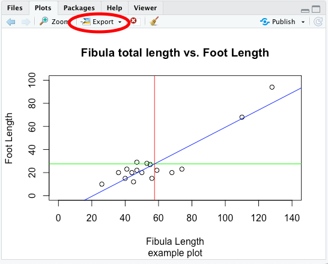

```{r include=FALSE}
knitr::opts_knit$set(root.dir = '03_session/')
xfun::pkg_load2(c("htmltools", "mime"))
remove(list = ls())
```

# Explorative statistics & graphical display

(The videos for this chapter are [here](http://vitutr.archaeological.science/categories/Statistical+methods+for+archaeological+data+analysis+I+2019/index.html), Number 10-16)

Like I already described in the introduction, statistics can be divided into different subfields. On the one hand there is the statistical inference, dealing with the testing of hypothesis on data. On the other hand there are fields like explorative statistics, in which the detection of pattern in the data is in the foreground. Decides that there also exists the field of descriptive statistics, in which parameters or distributions of data are the main object of investigation.

In this chapter we will deal with explorative statistics and descriptive statistics kind of at the same time, because we will learn how to visualise data with the help of R. Especially graphical visualisation is in between descriptive and explorative statistics.

## Dataset used for this chapter

The dataset, that we are using for this chapter, comes from the burial-ground of Münsingen/Rain. Maybe in the later version of this book I will give more details to the state of said. For the time being every Swiss archaeologist should have a slight idea what is burial-ground consist of. You can download the data using the following link: `r xfun::embed_file('muensingen_fib.csv', text = "muensingen_fib.csv")`.

The data is such represents different fibulae found on the side. Please download the file and save it into a directory of your choice. For this chapter, like with all of the chapters, you might like to specify a specific folder for this chapter. Save the data there, and, as we have learnt in the last chapter, select this folder as your current working directory.

If you have downloaded the data to this folder and correctly selected it as you're working directory, you should be able to reach the Münsingen data and inspect its structure. Since it is a dataset in the "Continental" CSV file, you can load the data into are using to `read.csv2()` format. Also you will realise, that the dataset already contains row numbers. You might like to specify 'row.names = 1'.

```{r}
muensingen <- read.csv2("muensingen_fib.csv", row.names = 1)
head(muensingen) # For getting a glimpse to the data
```

The dataset originally comes from the R package `archdata`. It is a data frame consisting of 30 observations with some variables describing the characteristics of the fibulae. If you want to full description of what the state of me, I suggest that you consult the documentation of the ice data package. There this dataset is called `Fibulae`. While we will graphically display different variables, I will explain what is variables mean.

## Cross tables (contingency tables)

The first category of visual representation of data is actually not a diagram. It is the table. Tables are today very widespread for the representation of information, so I don't think that I will need to explain to you what the table looks and our table works. A bit formalised, how we use tables here, is that in most of the cases the rules will hold the items of investigation, while the columns will contain different variables.

But this is not true all of the time. For a very specific type of table, that we will learn to know now, this is not true. The kind of table, that I'm talking about, is the contingency table. This kind of table is also known as cross tabulation, or crosstab. This kind of representation is used to show the interrelation between two variables. That means, contrary to what I have stated in the paragraph above, did hear both the rows and columns represent variables.

Let's have a look to one of these cross tabs, so it becomes clear, what is meant by that. For this, we will tabulate the scheme of the fibula against the grave in which it was found. Fibula Scheme is a standardised way of how different types of fibulae are are produced, they represent archaeological types. In one grave there may be more than one fibula. Therefore, the great number does not represent a unique identifier of the object fibula, the item of the investigation. It is just one variable among others.

In R, you can use to come on table to display the number of fibula in a specific fibula scheme per grave.

```{R}
my_table <- table(muensingen$fibula_scheme, muensingen$Grave) 
my_table
```

As you can see, the variable `muensingen$fibula_scheme` is given us the first parameter of the function, while the other variable `muensingen$Grave` represents the second parameter. The result is the table, in which the first parameter is mapped in the rows, while the second parameter, the grave number, is mapped to the columns. Each cell now represents the number of items, in this case of specific fibula types, in each burial. More abstract speaking, crosstab is the representation in which the current occurrence of two variable values are mapped.

If we also want to have an idea, how many items there are per row and how many per column, we might like to add the margins to the table. Table margins gives us to sum of the values for each role, each column, and in total. An R, the command for that is `addmargins()`.

```{R}
addmargins(my_table)
```

You can see, that we have a new row and a new column. The row contains the sum per column, while the column contains the sum per row. In the lower right most sell we have to total sum of all items.

In data sets of low dimensionality, this represents a rather straightforward and convenient way to investigate the relationship between two, probably more, variables. They also represent a starting point for different other statistical approaches and techniques, for example the Chi-square test, that we will learn about later. In the context of spreadsheet software, crosstabs are often also called pivot table.

## Basics about charts

Besides the tables, which also contains some graphical elements, like lines, the visualisation, which comes to the minds of most people in respect of statistics, are charts. Most charts or diagrams contain a certain set of elements, that can repeatedly be seen even with different types of graphical display. Most of the time we have some axis, which represents the structure of the variable underlying to representation. Quite often, this access has some marks, most of the time regularly spaced, and often also with some annotation. These marks are called tick marks. For the representation of one variable, one axis might be enough. But most of the time, we have a two-dimensional visualisation. This is already necessary, if we want to represent the category of some items and the count of items in that specific category. Very often, we have charts that represents the relationship of two variables. In both cases, we have two axis. In the area, that is defined by the axis, we have to representation of the actual data. This takes place, using different symbols, lines, or other graphical elements. Here, different types of charts different. Very often, we have also label for the axis, labels for the whole plot, and sometimes some subheadings describing more in detail, what the plot is about.


There are certain rules or guidelines, how shots should be designed, to be most efficient. Edward Tufte, a professor emeritus of statistics and computer science at University, is well known for his publications in respect to data visualisation. In one of his publications, he defined the principles for a good graphical representation of information. 

> Graphical excellence is that which gives to the viewer the greatest number of ideas in the shortest time with the least ink in the smallest space. E. Tufte 1983

Just rule of thumb it also known as the data-ink-ratio, the 'proportion of a graphic’s ink devoted to the non-redundant display of data-information'. As these are only guidelines, it is clear, that whole details are charged will be very much depends on its use case. But it's also clear, that one should aim for a reduced use of graphical elements, so that the information, that needs to be transmitted, is in the foreground. Also, certain bells and whistles might enhance this information transmission quite a bit. I trust your sense of style to choose the right amount of ink for the right purpose.

## The command `plot()`

The command `plot()` is the basic commands in R to produce a graphical visualisation. What happens, when you do use plot with different data sets very much depends on, what kind of dataset you have. This command is a kind of chameleon, changing its appearance according to the necessities. This philosophy is also true for different other commands in R. There are some standardisations, that comparable effects should result from comparable names. So, whenever you use the command `plot()`, a plot will be the result. How this plot looks like, depends on the package, from which the data structure is coming, that you are plotting. The same is true for example for the command `summary()`. This command gives a summary, least surprisingly, good structured according to the data underline the summary.

### Basic plotting

Lets come back to our command plot(). It's a basic manifestation can be seen, when we plot one variable. For this purpose, let's take the length of the fibulae from our dataset.

```{r}
plot(muensingen$Length)
```

You can see, that like with most other commands in R, within the brackets the parameters are written. Here it is a reference to the variable, that should be plotted. You also should be able to see elements from the general outline of the plot, that we just have introduced. In this basic implementation, the values to be plotted are visualised using the Y axis, while the X axis represents the order of the values in the vector. The values in the dataset themselves are represented as points, positions according to their actual value on the Y axis, and to their order in the dataset on the X axis. That is why the label of the X axis is index.

Some standard layouts in respect to specific data can be selected using the parameter 'type'. For example, `type="p"` is the default setting and results in the plots that we just saw. Specifying `type="b"` results in a plot of the points connected by lines, as you can see below.   

```{r}
plot(muensingen$Length, type = "b")
```

But this kind of visualisation is not correct here. Line implies that there is a continuous process going on, which is not the case between the individual values of our unconnected similar. Better representation of the nature of our data might be, if we are using the parameter `type="h"`, That gives us vertical lines from the origin of our coordinate system to the actual value.

```{r}
plot(muensingen$Length, type = "h")
```

Below you can find a list of possible options:

- p – points (default)
- l – solid line
- b – line with points for the values
- c – line with gaps for the values
- o – solid line with points for the values
- h – vertical lines up to the values
- s – stepped line from value to value
- n – empty coordinate system

The option `"n"`, although seemingly quite useless, will become one of the most interesting options to be selected here. This option can be used, to draw a coordinate system, without filling it in the first place. In this way, we can ask R to draw to coordinate system, that we can then fill with our own symbols or other graphical elements.

As I said, the command `plot()` is a chameleon that changes its appearance according to the dataset. For example, if we used to command on a dataset containing factor variables, the resulting visualisation will be a bar chart, counting the number of items per category, instead of the kind of visualisation that we have seen with the length data.

```{r}
plot(as.factor(muensingen$fibula_scheme))
```

### Enhancing the plot with optional components & Text

Of course, we can influence all the different elements of shops in such a flexible software like R. For example, we can specify the size of our X and Y axis, we can change the labels of both axis and also the heading and the subtitle of the chart. This is done using different parameters. By adding up so many parameters, the commands can become quite intimidating. But it is essentially just adding up parameter by parameter. So from a structural point of view there is no complex logic behind that. Also, when writing R commands, You can always us new lines behind elements that indicate, that our command is not finished yet. Such elements might be a mathematical symbols or for example commas like you can see below.

.tiny[
```{r, fig.height=5}
plot(muensingen$Length, muensingen$FL,
     xlim=c(0, 140), # limits of the x axis
     ylim = c(0, 100), # limits of the y axis
     xlab = "Fibula Length", # label of the y axis
     ylab = "Foot Length", # label of the x axis
     main = "Fibula total length vs. Foot Length", # main title
     sub="example plot" # subtitle
     )
```
]

So you can see the effects of the different parameters. The extent of the axis is defined by `xlim` and `ylim`. The labels of the axis is given by `xlab` and `ylab`. The explanatory headings are defined by `main` and `sub`. Also, this plot represented by various plots, in which we met do you already know length of the fibula against the length of the foot of the fibula. It is quite obvious, that the longer the fibula is, the longer also its foot by be. So using this kind of so-called scatterplot, we can visualise this relationship between the two variables.

Plot is doing a lot for you:

- Opens a window for display
- Determines the optimal size of the frame of reference
- Draws the coordinate system
- Draws the values

In the background, also the last plot is remembered, and this plot is still changeable. You can use specific commands, to add elements to the already existing plot. These elements can be:

- lines – additional lines to an existing plot
- points – additional points to an existing plot
- abline – additional special lines to an existing plot
- text – additional text on choosen position to an existing plot

This is the reason, why it sometimes might be reasonable, to plot an empty plot using the option "n". You can use this version, to add first create a coordinate system, and then fill it up with lines or points.

There are some more possibilities to change the layout and style of the plots. For example, the command `par()` will give you the tools to change a lot of the look of and feel. I suggest that you look up the help page for this command to see which possibilities exists to change the layout of the plot.

```{r}
? par
```

As an example, how you can add elements to an existing plot, we will draw some straight lines into the plot of the total length versus the foot length of the fibula. At first, we will draw a line in red at the mean value of the length of the fibula. Since the length is on the X axis, the line with the mean of the length must be a vertical line going up. Accordingly, the mean of the foot length, that is represented by the Y axis, must be a horizontal line. For both, we are using to command `abline()`. The difference is, that for vertical line specify the parameter 'v', for a horizontal line we specified a perimeter 'h'. In both cases the parameter 'col' specifies the colour of the line. The third line is somehow special: it represents the relationship between the foot length and the total length in the data. Therefore, it is a diagonal line. It is defined by linear model of these two parameters. What this means we will explain later, for now you can just keep in mind, that in this way we can represent the trends in the data, drawing a trend line.

```{r echo=3:5, fig.height=5}
plot(muensingen$Length, muensingen$FL, xlim = c(0, 140), ylim = c(0, 100), xlab = "Fibula Length", ylab = "Foot Length", main = "Fibula total length vs. Foot Length", sub="example plot")

abline(v = mean(muensingen$Length), col = "red")         # draw a red vertical line
abline(h = mean(muensingen$FL), col = "green")           # draw a green vertical line
abline(lm(FL~Length, data = muensingen), col = "blue")   # draw a blue diagonal line
```

## Export the graphics

Of course, if we have created a decent plot, we probably don't want it to remain in R. Most of the time, we would probably like to use it in other contexts, be at homework, an article or a presentation. To do that, we need to wait to explore our plots.

Using RStudio, probably the easiest way is to be used to graphical user interface, especially when it comes to exporting only individual plots. For this, in the plots window, there is a button called export.



Here, you can select if you want to export your plot as an image (roster image), or as a PDF (vector file). The export windows should be more or less self-explanatory, you can specify the size of the resulting image and also the location, where it should be saved.


Before RStudio, saving plots took place most of the time using commands from the command line. This still is very useful, if you use scripts and want to create multiple or even very many plots at once, changing the inputs data. Two very common formats when it comes to vector format or 'PDF' or probably more common 'eps' specifically for images. You can copy your current plot window to a vector file using the command `dev.copy2...()` and then the file format in which the result should be saved. So let's save our current plots to both formats using to come on spill.


```{r eval=F}
dev.copy2eps(file="test.eps")
dev.copy2pdf(file="test.pdf")
```

There are even more raster then vector file formats. By default, R is capable of exporting to PNG, JPEG, TIFF and BMP. You can use the command `savePlot()` for this.

```{r  eval=F}
savePlot(filename="test.tif", type="tiff")
```

If you really plan to use the graphical visualisation in R in that way, it is worthwhile to dive deeper into the export format and options then we can present here. For most of the basic use cases, exporting the files via the graphical user interface is the most convenient and most controllable way of storing your valuable plots on your file system.

## Pie chart

Let's not start discussing different plot types. We will begin with one of the most widespread used type of plots: the pie chart. You can see pie charts all over the media, newspapers, and also books, might it be scientific or popular books. Pie charts are used to display proportions of the total. For this reason, they are most suitable (if at all) for nominal data. Or, of course, percentage data, if this is the original data type. For example, results of the election that often represented in pie chart. Here, we see the percentage of voters voting for a specific party. Basically, this represents normal data, the choices of the individuals for one or the other party.

I would like to opportunity to throw in an unnecessary formula here:

$$
a_i = \frac{n_i} {N} * 360°
$$

The proportions of the categories $i$ in relation to the total number, represented by the number of items of that category $n_i$ divided by the total number $N$ is multiplied by 360°. The resulting angle is the angle, which can be used for a circular visualisation of this amount.

Pie charts have different disadvantages, some they share with other graphical representation of data, but some are unique to this kind of display. Examples to colour selection very influential when it comes to perception. Red as an aggressive colour is perceived larger then for example grey. Very specific to a pie chart is the fact that we as humans are more trained to see differences in length then in area. And in the pie chart, the differences are visualised using the area of the different pieces of the pie. This results in effect, that small differences are not so easily visible in a pie chart, then this would be the case for example with a bar chart, a visualisation technique that we will learn about below.

Like in many other cases, 3-D representation does not work so well on printed paper. Since the human eye and brain must compromise between both the perception that we are looking at a 3-D image but in reality it's a 2-D object, differences are distorted. Let's look at the following example that I took from the literature:


.caption[source: http://www.lrz-muenchen.de/~wlm]

The pieces »viel zu wenig«, »etwas zu wenig« und »gerade richtig« have exactly the same size, the piece »viel zu viel« is a bit smaller. Perception wise, the different shares seem to be quite different because of the reasons mentioned above. So in any case, 3-D or not, pie charts are inferior to a lot of other visualisation techniques. Nevertheless, because it is a very widespread used technique, still I would like to demonstrate how are you can create them using R.

The actual commands to draw a pie chart in R is `pie()`. This command expects the number of counts, and all the normalisation to percentages and then the visualisation will take place automatically. This means, that it might be necessary to recode data. In this case, we will use the fibula schemes and visualise there ratio. This variable comes in the form of a character vector indicating to different schemes. Here, we can use the command table, to transform the nominal presence into a table of counts.

```{r}
table(muensingen$fibula_scheme)
pie(table(muensingen$fibula_scheme))
```

Do you original colour scheme of the `pie()` command is rather pastel. Of course, you can change the colours, using the col parameter. Here, in the order of their appearance, you can specify different colours, that will be used to represent this category.

```{r}
pie(table(muensingen$fibula_scheme),
    col=c("red","green","blue"))
```

This should be enough to be set for the pie chart. It had already had the honour to be the first mentioned. That's enough. We will from now on turn to more scientifically useful visualisations.

## Bar plot

A worthy replacement for any kind of pie chart is a bar chart or a plot. Most of the time it is the better alternative. Since here, the differences are represented by the length of the bars, humans can more easily perceive the differences between different categories. Also, this kind of visualisation is more flexible, because you can also represent absolute data and measurements with a bar chart, not only percentages.

Also, the command `barplot()` requires a vector containing the data. This can be the number of fibulae in the different styles, like so:

```{r}
barplot(table(muensingen$fibula_scheme))
```

Or it can be length of the different fibulae.

```{r}
barplot(muensingen$Length)
```

Both versions are meaningful and can help visualising the data. Although especially the last plot is difficult to understand, because it it lacking some essential information. For example, what is represented here by the bars, in total, but also, what does the individual bars represent. Since the vector resulting from the table commands automatically had names, these names were used in the case of the fibula scheme. In the case of the length, we have to specify these names on our own. For this, there is the parameter "names.arg". Also, you might like to turn the names so that they become more readable and do not flow into each other. For this, you can use the parameter "las=2". Lastly, I'll give you a variant of how you can put the main title to a plot using to command `title()`.

```{r fig.height=4}
par(las=2)                          # turn labels 90°
barplot(muensingen$Length,          # plot fibulae length
        names.arg=muensingen$Grave) # with names of the graves
title("Fibulae length")             # add title
```

Of course, you can also turn the bar chart around, making it horizontal. In that case, you probably would like to turn the labels again. Also, you can influence the size of text using a parameter 'cex'. You can also specify what should be changed in size, in this case the names.

```{r fig.height=5}
par(las=1)                          # turn labels back again
barplot(table(muensingen$fibula_scheme), # Plot counts fibulae scheme
        horiz=T,                         # horizontal
        cex.names=2)                     # make the labels bigger
```

Bar charts are also much more flexible compared to pie charts in so far, as you can easily display more than two variables. In this way, your plot can become 3-D or more in a meaningful way.

Let's assume, we want to visualise the number of coils of the fibula in relationship to the style. We can use the table command to produce a table accordingly.

```{r}
my_new_table <- table(muensingen$fibula_scheme,
                      muensingen$Coils)
my_new_table
```

No, we can directly put this table into the `barplot()` command. Let's see the output:

```{r fig.height=5}
barplot(my_new_table)
```

You can see, that the different styles (fibula schemes) get different colours. With this, we not only seeing the number of items in respect to the different number of coils, but also at the same time, in which style to fibula is produced. This way of representing subcategory it's called 'stacked'. If you don't like this way of representation probably you like more the version where the different categories are put side-by-side like below.

```{r fig.height=5}
barplot(my_new_table, beside=T, legend.text=T)
```

Until now, we have only seen bars of different height. The beauty of the pie command was, that it automatically transformed absolute values into percentages. With a slight alteration of the table commands, we can achieve the same with a bar chart, and even better. For that, we are using the `prop.table()` command. This stands for proportional table. In current versions of R, you can use also the command `proportions()`. Its first parameter is the dataset for which the proportion should be calculated, in the format of the table. That means, it takes the result of the table command, and then transform it into a proportional table. The second parameter defines, what should sum up to 100, or in other words, what is the full total to which the proportion should be calculated. As always in R rows come first, so they have the number 1, while columns come second, so they have the number 2. That means, the following command will calculate the percentages in respect to the columns, which each will sum up to 1. 

```{r, fig.height=5}
table.prop<-prop.table(my_new_table,2)
table.prop
```

If we put the results into the `barplot()` command, we will get a result comparable or even better to the pie chart.

```{r, fig.height=5}
barplot(table.prop)
```

Of course, you can also change elements of the bar plot. For example, you can get fancy with the colours. Here, are used to command rainbow, specified with the number of colours I would like to get, to create a colour spectrum from the rainbow. Also, I would like to have a legend. Additionally, I want to have a title. This title is quite long, so I divided it in two rows, using the special "\\n" sign. Since it is such a long title, I also have to use space outside of the actual plot area. You can get a feeling for the effects of this different para metres by playing around a bit with them.

```{r, fig.height=5}
barplot(table.prop,
             legend.text=T,  # add a legend
             col=rainbow(3)  # make it more colorful
             )

# add a title
title("ratio of fibulae schemes \n by number of coils",
      outer=TRUE,            # outside the plot area
      line=- 3)              # on line -3 above
```

But also bar plots do not solve every problem that we have with graphical representation. For example, there is often the question, what is better: percentage or absolute numbers. If we would like to compare different situations, with different total numbers, and we are most interested in the ratios, then the percentages are a good choice. But at the same time, due to this characteristic, they can hide differences in the underlying total numbers. This can become especially problematic, if you divide your bars also in subcategories. 

```{r, fig.height=5}
par(mfrow=c(2,1))
barplot(my_new_table,beside=T)
barplot(table.prop,beside=T)
```

Just from the visualisation of the percentages here it seems, as if there are more fibulae of scheme A with three coils then with four. So it is absolutely necessary to always provide the absolute numbers, if you present your data as percentage of the total. It can take place in the caption, or directly in the plot. And this problem or better this consideration must be taken into account not only with bar charts, but also with any other representation of percentages.

Another source of visual confusion can be the scales already ranges of the axis. For example, if we do not draw an access from 0 to the maximum value, but let it start at an arbitrary value, small differences can visually become very big. In the example below, I visualise the first and the second fibula respectively their length.

```{r, fig.height=5}
par(mfrow=c(1,2))
barplot(muensingen$Length[1:2],xpd=F,ylim=c(45,55))
barplot(muensingen$Length[1:2],xpd=F)
par(mfrow=c(1,1))

```

Although it is obvious, if you actually look at the axis, there is a difference it's not that big (it's only six), only from visual inspection it seem to be enormous compared to the visual representation of the same difference in the diagram to the right. Most of the time, it is better to have your axis ranging from 0 to the actual values, except for situations, where the comparison between different bars or other elements is hindered by the fact that the relative differences are so little.

You might have realised, that in the last two examples are used to command `par(mfrow=c(..))`. With this comment, you can find that plots are placed side-by-side or one on top of the other. Also here do usual rule of R present: Rows are the first number, columns are the second number. So both I said that I want to have two rows of plots with one column, below I said I want to have one row with two columns. You can use this to lay out your plots in a smarter way.

## Box-plot (Box-and-Whiskers-Plot)

The next type of plot is not totally dissimilar to the bar plot. Also in this case, in the case of the box plot, we have a rectangular element representing our data. But the logic behind the box plot is very different.

A box plot, which is also called box and whisker plot, is used to describe the distribution of values in a range of data. Let's try to explain that using the numbers from 1 to 9 as our values. If we sort these values, than we get the root of numbers from 1 to 9.

<pre>
1 2 3 4 5 6 7 8 9
____|___|___|____
</pre>

No, we divide the values by their position. That value, that is placed in the centre, is of specific importance because it is the most centred value of this dataset. Here we draw a line. If we take half the number between the first and the centremost, we get the first quarter of our data. When we do the same towards the end, we get the last quarter of the data. Where the first quarter ends, and we are the last quarter starts, we also mark this dataset. The values at these positions are 3 for the start of the first quarter, 5 for the most central value, and 7 for the start of the second quarter.

Compare this with the following distribution of data.
<pre>
1 1 2 7 7 8 20 26 100
____|___|___|________
</pre>

Here, two marks the beginning of the second quarter, seven customers sent a value, and 20 marks the beginning of the last quarter of the data. Notice, that this does not depend on their actual values, but only on the position within the ordered dataset. If we now have a Y axis, on which we have continuous scale of the actual values, and we draw a box according to the parameters we just defined (position of the first the second and the third quarter of the data), than we get a feeling for how the values of the data within our dataset are distributed.

In the visualisation of the box plot, the box marks to inner half of the data so the second and the third quarter of the data. The border between the second of the fourth quarter, the most central value, is marked by a line (This value is also "median", we will learn about it soon). Beside the box itself at the thick line dividing it, there are also thin lines sticking out from the box on top and bottom. This lines are called whiskers. The end line of a whisker is drawn at that value, that is less than 1.5 times the distance of the inner half of the data away. Every other point, that is more far away, is considered to be an outlier, and is visualised by a point.

Let's see the actual box plot of all numbers 1 to 9.

```{r}
boxplot(1:9)
```

Here you can see all elements I've just described except for the outliers. To produce an outlier, we will add a very high value to our dataset.
```{r}
boxplot(c(1:9,15, 20))
```

You can see, did I edit the value of 15, which is now marked by the whisker. I also edit the value 20, which is now displayed as an outlier. If we applied to our actual data, the length of the fibula at Münsingen, you will see kind of the same.

```{r}
boxplot(muensingen$Length)
```

The interpretation would be like following, most of the data are evenly distributed between 30 and 80 mm. The thick line is a bit lower in the box, this means, that there are slightly more low values than high values. Besides the usual values, we have two outliers at approximately 120 mm plus or minus. By inspecting this plot, I already learnt a lot about distribution of the data in our dataset.

Box plots are especially useful, if you want to compare the distribution of data between different categories of data. For example, you might like to compare the distribution of the length of the fibula in respect to their style. For this, I will introduce to you in new syntax in how are you can formulate circumstances in R. This notation is called formula notation. It is centred around the tilde '~'. This sign means "in relation to". So, if I like to draw a box plot of the length of the fibula in respect to its style, I can express it like a below:

```{r}
boxplot(muensingen$Length ~
          muensingen$fibula_scheme)
```

We will work with this kind of formula notation more in more advanced topics here. This notation becomes especially helpful when it comes to modelling. Because there, you model things in relation to other things.

Back to our box plot. Of course, we can also use parameters here, to add elements to our plot. This elements might be a title, the colour, or the labels of the axis. You might like to play around a bit with the example below to get a feeling of the effects.

```{r eval=F}
par(las=1)
boxplot(Length ~ fibula_scheme,
        data = muensingen,
        main = "Length by type",
        col="green",
        xlab="fibulae scheme",
        ylab= "length"
        )
```

All in all, a box plot is a very helpful tool when it comes to condensed have a look on the distribution of data. As I have explained, this is specifically helpful if you want to compare different distributions with each other. If you are more the girl that likes to watch the matrix uncoded, the scatterplot is probably more your type. We will learn about that below.

## Scatterplot

Just get a proper is probably that kind of plot of people (beside a pie chart) imagine most of the time when they think about statistical visualisation. It is also one of the most basic plot types. That's why it is also the standard configuration of the command `plot()`. Basically it is used to display one variable in relation to another one. This other variable can also be the order of the values, as we have seen in the example above. In general, scatterplot is suited for all data types and scales of variables, although most of the time for nominal and ordinal data other chart types might be preferable.

Since we discussed basic elements of the scatterplot already above, without mentioning the name, I would like to use the space here to show you some alternative ways how are you can produce a scatterplot in R. For this, we start with the basic plot of the similar length against the foot length, with the Trent line edit in red, like we have done before.

```{r echo=F}
plot(muensingen$Length, muensingen$FL)
abline(
  lm(muensingen$FL~muensingen$Length),
  col="red")
```

Although libraries offer a different ways of displaying scatterplots. One option here is the library car, that is specifically used for regression analyses (analyses of the relationship of two variables). To get access to the functionality of another library in R, at first we have to load this library. For this we used to come on `library()`. As the parameter you use the name of the library that need to be loaded. Pay attention: you don't need to use quotation mark " to load known and installed libraries.

The command from 'car' to produce a scatterplot is `scatterplot()`. In here you also use the formula notation that we have seen already with the box plot, but also with the linear model for the trendline in the example above. Here you specify the names of the columns in the dataset as variables, and as data you give the name of the variable which holds the whole dataset, the data frame `muensingen`.

```{r, message=F, fig.height=5}
library(car) # library for regression analysis
scatterplot(FL ~ Length, data = muensingen)
```

At this resulting scatterplot, you can see different elements, that we have seen before: for example, the box plots. Also, we see a trend line. But also, we see more lines. If you want to know, what is lines mean, you should consult do you help for the function `scatterplot()`. Luckily, you know how this can be done.

Another suggestion is to use the library ggplot2. This library is very powerful and it is used a lot in professional visualisation. In publications and in conference presentations you will see ggplot style visualisations very often. The reason, why we are not using it here, is, that it comes with its own syntax philosophy. To learn this, would overwhelm potentially students that already have to cope with the basic understanding of R. But once you have mastered R in general, I strongly suggest that you have a closer look to this plot library.

```{r, fig.height=5}
library(ggplot2) # advanced plots library
b<- ggplot(muensingen,aes(x=Length,y=FL))
graph<-b + geom_point()
show(graph)
```

## Histogramm

The next type of plants that we would like to have a look to is the histogram. Here, we take a different perspective compare to the scatterplot, and more similar to the box plot. Also here, we are looking at the distribution of the data. We visualise, in which part of the value range of our data most of our data are located. So what we will see, is if most of the data rather low or rather high values, for example.

At first I would like to give you an example of an histogram, so that we can understand its character and its use cases. Therefore let's again use the length of the fibula in our dataset and plot the histogram accordingly.

```{r, fig.height=5}
hist(muensingen$Length)
```

You can see that on the X axis of the plot we can see the actual values. The Y axis has to label frequency. The data are represented like with a bar plot in between values of length. In the first bar, between 20 and 40, we have to representation of all fibulae with a length between 20 and 40. If we look to the frequency, we can see that there are three. The next class of fibulae is between 40 and 60. Here, we can see that we have 10. This goes on.

So, in histogram, we don't see any longer the individual values, but we see, how many items have values within a certain range. With this visualisation and the perspective on the distribution we are reducing the complexity of the data. You don't any longer see the individual item, but we get a better understanding about the distribution of the values of the individual items within the whole dataset. Quite often in visualisation, but also statistics in general, we have to compromise between the consideration of the new visual case and the extraction of the general pattern. 

In the standard display of histogram, we can only guess the individual values or the total numbers of cases per class. If we add labels, we can also see the actual numbers represented in the plot.

```{r, fig.height=5}
hist(muensingen$Length, labels = T)
```

Of course, we are not forced to only use the classes between 20 and 40, 40 and 60 and so on. We can also define our own classes. For example, if we want to have a finer resolution, we could decide to display classes off with of 10. We do that, using the parameter 'breaks'.

```{r, fig.height=5}
hist(muensingen$Length,
     labels = T,
     breaks = 10)
```

Please note the differences: before, we had some blocks, that now are divided into finer structures. The choice of the class with can be decisive for the interpretation. Although our dataset is rather small, if you look to the highest values, just from visual inspection in the first case it seems that we have a rather constant data distribution between 100 and 140. With the smaller class with, the holes in this distribution become obvious. So also here, we have to make a compromise between visualising the individual case and total pattern.

Again, of course, we can use the usual suspects to change the look of our histogram.

```{r echo=F, fig.height=4}
hist(muensingen$Length,breaks=10,
     labels=T,
     col="red",
     xlab="Length",
     main="Histogram Fibulae Length")
```

The disadvantages of the Instagram are, that makes the data reduction necessary and therefore we lose some information in the visualisation. Also, as we have seen, is the actual display show me dependent on the choice of the class with. There are different techniques to overcome especially this problem. The first, the stem and leaf chart, comes from an age, where computers we are not able to produce plots. For reasons of completeness, but also because it's mentioned in the Stephen Shennan's book, we included here. The other and currently much more popular version is the kernel density estimation or kernel smoothing. We will learn about it afterwards.

## stem-and-leaf chart

The stem and leave chart is a clever idea to at the same time represent the general pattern, but also the individual cases. On the one hand, it is also a kind of histogram. But at the same time, it shows the values of the individual cases. Nevertheless, it has become a bit out of fashion lately.

Let's demonstrate it with our usual example. The command is stem.

```{r}
stem(muensingen$Length)
```

Our dataset consists of several similar length below 100, and two above 100. The latter you can see as the last line of the result of the stem and leave plot. The line above represents all the fibulae between 50 and 100. The top line represents all those between zero and 50. You can see, that the individual cases are represented by figures. This figure indicates the next value. So for example, in the top row the first number is zero. This means, that the first number is below 100. It starts with a 3, so it's round about 30. After that, we have four 4s. This means, we have four more fibula with length of around 40. By now, you should've understand the pattern.

So as promised, the steam and leaf plot is as such a clever idea to represent data. It's only drawback is, that it doesn't look very visual, and reminds a lot on the age of computers without decent graphical displays. And has also announced, there is some more modern alternative to that that we will have a look to in the next part: the kernel smoothing.


## kernel smoothing (kernel density estimation)

The last plot version that I would like to introduce to you is the kernel density estimation, quite often abbreviated as KDE. Also this visualisation is very similar to the histogram. Let's have a look at it and then discuss its features.

This time, we actually have to specify two commands. The first, `density()` is doing the actual calculation. The second is the usual `plot()` command. The density command is encapsuled into the brackets of the plot command. In this way, the output of the density serves as an input for the plot.

```{r, fig.height=5}
plot(density(muensingen$Length))
```

You can see, that's the essential elements are quite comparable to the histogram. We have an X axis visualising the values within the dataset. And we have a Y axis, this time not with frequency, but with density. This concept of density is the most difficult part to understand here. Therefore, let's postpone it for a second.

Let's first concentrate on this moving part. For this, let's assume that we are not looking at the actual value, But to a more blurred representation of the value. Like, if you are looking with half closed eyes or in not fitting glasses to a point. It will be blurred. The most intensity will still be in the centre, but there will be a halo of lesser and lesser intensity the more far you will get from the centre.

Or probably a better way to understand this is to think about the actual values as hole in a vessel filled with sand. At the hole, which is at the position of the actual value, the sand will fall down and will form a heap. This heat will be the highest in the centre so at the actual value, but it will form a small hill, starting from left and right of the actual value. If two values are nearby, the hills will merge and join in a bigger hill. This is how you can interpret the picture above. Around 40 to 50, there are the most holes in our sandbox, so here most of the sand will fall down and for the big heap. On the other hand, at 110 and 130, there are only two holes each, so they're only small hills will form.

With this kind of visualisation, we avoid a problem to artificially draw boundaries between classes. Still, we can see a representation of the total distribution of the values within our dataset. And this is more precise than the box plot, because we get more information about the internal structuring of the data.

We can also combine the KDE with histogram. For this, we have to bring both to the same scale. The scale of the KDE is such, that the total area under the curve of the will sum up to 1. We can also be scaled histogram to be in the same scale. For this, we used to parameter 'prob=T'.

```{r, fig.height=5}
hist(muensingen$Length, prob=T)
lines(density(muensingen$Length))
```

We later will learn more about the concept of area under the curve, for no visionalisation is in the foreground, so we will stick with that.

## Guidelines

### Stay honest!

Some final suggestions for guidelines, that you might like to consider, when you're plotting data. The first and probably most relevant is that you should stay honest in your data representation. It is easy to cheat with different techniques. Although for example everyone probably can understand the scales of your axis, nevertheless the presentation can produce very different perceptions. The choice of the way how are you display your data has a strong influence on the statement and how it will be received.

Choice of display has a strong influence on the statement. Let's use the example of the Swiss stock market index to see, how different scales can influence the visualisation.

```{r echo=F, fig.height=6}
par(mfrow=c(2,2))
smi <- read.csv("SSMI.csv", stringsAsFactors = F)
smi.ts <- ts(smi$Close, frequency = 52, start = c(1991,1))
plot(window(smi.ts, start=2020, end=2021),type = "l", ylab="smi")
plot(window(smi.ts, start=2020, end=2021),type = "l", ylab="smi", ylim=c(0,12000))
plot(window(smi.ts, start=2000, end=2021),type = "l", ylab="smi", ylim=c(0,12000))
plot(window(smi.ts, end=2021),type = "l", ylab="smi", ylim=c(0,12000))
par(mfrow=c(1,1))
```

The upper left panel shows the development of the Swiss stock market within the last year. Usually you can detect the crash that took place in the course of the Corona epidemy. This is the kind of display that is quite often shown in respect to such developments. The upper limit represents the upmost value, the lower limit the lower most value. Of course, this is visible at the Y axis. In this visualisation, the development looks very dramatic. If we only change the Y axis starting from zero, this crash looks less dramatic immediately.

If we additionally enlarge our investigation window (or at least the window of data that we are displaying), it becomes obvious that much stronger deteriorations took place in the past. The lower right panel shows Shows the development starting from 1990. This shows, how low this value was in the beginning.

However you might like to interpret this developments in respect of today's severity, it is clear, that the different scales put this development in very different frames of references.

So, you could sum up the suggestions for graphical representation like so:

* Stay honest!
  * Choice of display has a strong influence on the statement.
* Clear layout!
  * Minimise Ratio of ink per shown information!
* Use the suitable chart for the data!
  * Consider nominal-ordinal-interval-ratio scale

For the last point, I have compiled a small table that can give you an advice which kind of visualisation you should choose in which kind of situation.


| What to display | suitable | not suitable|
| - | - | - |
| Parts of a whole: few | Pie chart, stacked bar plot | |
| Parts of a whole: few | Stacked bar plot | |
| Multiple answers (ties) | Horizontal bar plot | Pie chart, stacked bar plot |
| Comparison of different values of different variables | Grouped bar plot | |
| Comparison of parts of a whole | Stacked bar plot | |
| Comparison of developments | Line chart | |
| Frequency distribution | Histogram, kernel density plot | |
| Correlation of two variables | scatterplot | | |

Sometimes, it is illustrative to look at bad examples. Such bad representation of data is also called [chartjunk](https://en.wikipedia.org/wiki/Chartjunk). I will link here to the [respective chapter of the book of Edward Tufte](https://www.edwardtufte.com/bboard/q-and-a-fetch-msg?msg_id=00040Z) to you, so if you would like to go deeper into the subject, can I have a look here. But with his keywords, entered into a search engine of your choice, you will be delighted with a lot of examples of how not to do it. Enjoy.

