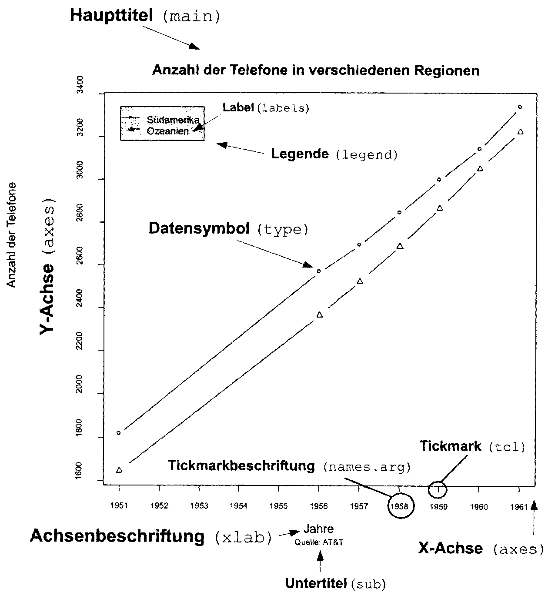
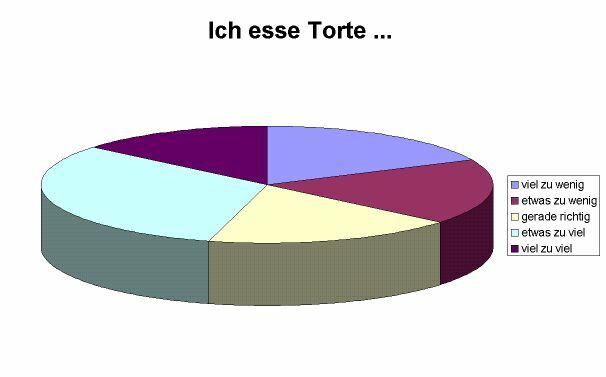

class: title-slide, center, middle

```{r setup, echo=F, error=FALSE, warning=F, message=F}
rm(list = ls())
```

```{r, echo = FALSE, results="asis"}
cat('# ', rmarkdown::metadata$title)
```

```{r, echo = FALSE, results="asis"}
cat('## ', rmarkdown::metadata$subtitle)
```

```{r, echo = FALSE, results="asis"}
cat('### ', rmarkdown::metadata$author)
```

```{r, echo = FALSE, results="asis"}
cat('#### ', rmarkdown::metadata$institute)
```

```{r, echo = FALSE, results="asis"}
cat(rmarkdown::metadata$date)
```

```{r, echo = FALSE, results="asis"}
cat(rmarkdown::metadata$date)
```

.footnote[
.right[
.tiny[
You can download a [pdf of this presentation](smada03.pdf).
]
]
]
---

## Loading data for the following steps

### download data
* [muensingen_fib.csv](muensingen_fib.csv)


### Read the Data on Muensingen Fibulae

```{r}
muensingen <- read.csv2("muensingen_fib.csv")
head(muensingen)
```

---

## Cross tables (contingency tables)

### For summary of data:

```{R}
my_table <- table(muensingen$fibula_scheme, muensingen$Grave) 
my_table

addmargins(my_table)
```

---

## Basics about charts

.pull-left[
### Principles for good charts according to E. Tufte:
(The Visual Display of Quantitative Information. Cheshire/
Connecticut: Graphics Press, 1983)

- „Graphical exellence is that which gives to the viewer the greatest number of ideas in the shortest time with the least ink in the smallest space.”
- Data-ink ratio = „proportion of a graphic’s ink devoted to the non-redundant display of data-information“ (kein chartjunk!)
- „Graphical excellence is often found in simplicity of design and complexity of data.“

\- after Müller-Scheeßel
]

.pull-right[

]

---

## Plot [1]

.pull-left[
Basic drawing function of R:
```{r eval=F}
plot(muensingen$Length)
```

options:
- p – points (default)
- l – solid line
- b – line with points for the values
- c – line with gaps for the values
- o – solid line with points for the values
- h – vertical lines up to the values
- s – stepped line from value to value
- n – empty coordinate system
]

.pull-right[
```{r echo=F}
plot(muensingen$Length)
```

]

---
## Plot [2]

.pull-left[
```{r}
plot(muensingen$Length,type="b")
```
]

.pull-right[
Intelligent system: automatic determination of variable type, drawing of
the appropriate chart
.tiny[
```{r}
plot(as.factor(muensingen$fibula_scheme))
```
]
]

---

## Plot [3]

Enhancing the plot with optional components & Text
.tiny[
```{r, fig.height=5}
plot(muensingen$Length, muensingen$FL,
     xlim=c(0, 140), # limits of the x axis
     ylim = c(0, 100), # limits of the y axis
     xlab = "Fibula Length", # label of the y axis
     ylab = "Foot Length", # label of the x axis
     main = "Fibula total length vs. Foot Length", # main title
     sub="example plot" # subtitle
     )
```
]

---

## Plot [4]

Plot do a lot for you:
- Opens a window for display
- Determines the optimal size of the frame of reference
- Draws the coordinate system
- Draws the values

Gives a „handle“ back for further additions to the plot, e.g.:
- lines – additional lines to an existing plot
- points – additional points to an existing plot
- abline – additional special lines to an existing plot
- text – additional text on choosen position to an existing plot

Additional possiblities for “decorations”: ? par

---

## Plot [5]

Add additional elements:
Drawing lines

```{r echo=3:5, fig.height=5}
plot(muensingen$Length, muensingen$FL, xlim = c(0, 140), ylim = c(0, 100), xlab = "Fibula Length", ylab = "Foot Length", main = "Fibula total length vs. Foot Length", sub="example plot")

abline(v = mean(muensingen$Length), col = "red")         # draw a red vertical line
abline(h = mean(muensingen$FL), col = "green")           # draw a green vertical line
abline(lm(FL~Length, data = muensingen), col = "blue")   # draw a blue diagonal line
```

---

## Export the graphics

With the GUI:

Export → Save as...

With the commando line:
As vector file

```{r eval=F}
dev.copy2eps(file="test.eps")
dev.copy2pdf(file="test.pdf")
```

```{r  eval=F}
savePlot(filename="test.tif", type="tiff")
```

Possible are “png”, “jpeg”, “tiff”, “bmp”
SavePlot can save sometimes also vector files (dependent on operation system and installation)

---

## Pie chart [1]

The classical one – but also with R not much better...

Used to display proportions, suitable for nominal data

$$
a_i = \frac{n_i} {N} * 360°
$$


Disadvantages:
- Color selection can influence the perception (red is seen larger then gray)
- Small differences are not easy visible

**totally No-Go: 3d-pies!!!**

---

## Pie chart [2]

I eat pie...



.caption[source: http://www.lrz-muenchen.de/~wlm]

*The pieces »viel zu wenig«, »etwas zu wenig« und »gerade richtig« have exactly the same size, the piece »viel zu viel« is a bit smaller.*

---

## Pie chart [3]
.tiny[
.pull-left[
Data are a vector of counts
```{r}
table(muensingen$fibula_scheme)
pie(table(muensingen$fibula_scheme))
```
]
.pull-right[
### Color palette:
The standard palette is pastel, if you prefer another:
```{r}
pie(table(muensingen$fibula_scheme),
    col=c("red","green","blue"))
```

]
]

---

## Bar plot [1]

Generally the better alternative...
Bar plots are suitable for display of proportions as well as for absolute data. They can be used for every level of measurement.

.small[
.pull-left[

```{r}
barplot(table(muensingen$fibula_scheme))
```
]

.pull-right[

```{r}
barplot(muensingen$Length)
```

]

]

---

## Bar plot [2]

With names:
```{r fig.height=4}
par(las=2)                          # turn labels 90°
barplot(muensingen$Length,          # plot fibulae length
        names.arg=muensingen$Grave) # with names of the graves
title("Fibulae length")             # add title
```

---

## Bar plot [3]
Horizontal:
```{r fig.height=5}
par(las=1)                          # turn labels back again
barplot(table(muensingen$fibula_scheme), # Plot counts fibulae scheme
        horiz=T,                         # horizontal
        cex.names=2)                     # make the labels bigger
```

---

## Bar plot [4]

Display of counts
.tiny[
.pull-left[
```{r}
my_new_table <- table(muensingen$fibula_scheme,
                      muensingen$Coils)
my_new_table
```

```{r fig.height=5}
barplot(my_new_table)
```
]
.pull-right[
```{r fig.height=5}
barplot(my_new_table, beside=T, legend.text=T)
```
]
]

---

## Bar Plot [5]

Display of proportions
.tiny[
.pull-left[
```{r, fig.height=5}
table.prop<-prop.table(my_new_table,2)
table.prop
barplot(table.prop)
```
]

.pull-right[
```{r, fig.height=5}
tmp<-barplot(table.prop,
             legend.text=T,  # add a legend
             col=rainbow(3)  # make it more colorful
             )

# add a title
title("ratio of fibulae schemes \n by number of coils",
      outer=TRUE,            # outside the plot area
      line=- 3)              # on line -3 above
```
]
]

---

## Bar Plot [6]

Problems with bar plots – and also with many other charts

.pull-left[
Percent vs. count: percents often distort the relations
.tiny[
```{r, fig.height=5}
par(mfrow=c(2,1))
barplot(my_new_table,beside=T)
barplot(table.prop,beside=T)
```
]
]

.pull-right[
Scales: the choosen limits of the axes can distort the relations
.tiny[
```{r, fig.height=5}
par(mfrow=c(1,2))
barplot(muensingen$Length[1:2],xpd=F,ylim=c(45,55))
barplot(muensingen$Length[1:2],xpd=F)
par(mfrow=c(1,1))

```
]
]

---

## Box-plot (Box-and-Whiskers-Plot)

One of the best (my precious)!
.pull-left[
Used to display the distribution of values in a data vector of metrical (interval, ratio) scale
<pre>
1 2 3 4 5 6 7 8 9
____|___|___|____
</pre>

- thick line: mean
- Box: the inner both quantiles
- Whisker: last value < than 1.5 times the distance of the inner quantile
]

.pull-right[
```{r}
boxplot(1:9)
```
]

---

## Box Plot [2]

.pull-left[
```{r}
boxplot(muensingen$Length)
```
]

.pull-right[
```{r}
boxplot(muensingen$Length ~
          muensingen$fibula_scheme)
```
]

---

## Box Plot [3]

More beautiful:
.pull-left[
```{r eval=F}
par(las=1)
boxplot(Length ~ fibula_scheme,
        data = muensingen,
        main = "Length by type",
        col="grey",
        xlab="fibulae scheme",
        ylab= "length"
        )
```
]
.pull-right[
```{r echo=F}
par(las=1)
boxplot(Length ~ fibula_scheme,
        data = muensingen,
        main = "Length by type",
        col="grey",
        xlab="fibulae scheme",
        ylab= "length"
        )
```
]

---

## Scatterplot [1]
.pull-left[

For 2 variables

Used to display a variable in relation to another one. Generally for all scales suitable, but for nominal and ordinal scale other charts are often better.

```{r eval=F}
plot(muensingen$Length, muensingen$FL)
abline(
  lm(muensingen$FL~muensingen$Length),
  col="red")
```
]

.pull-right[
```{r echo=F}
plot(muensingen$Length, muensingen$FL)
abline(
  lm(muensingen$FL~muensingen$Length),
  col="red")
```
]

---

## Scatterplot [2]

Call additional libraries:
.tiny[
.pull-left[
```{r, message=F, fig.height=5}
library(car) # library for regression analysis
scatterplot(FL ~ Length, data = muensingen)
```
]

.pull-right[
```{r, fig.height=5}
library(ggplot2) # advanced plots library
b<- ggplot(muensingen,aes(x=Length,y=FL))
graph<-b + geom_point()
show(graph)
```
]
]

---

## Histogramm [1]
Used for classified display of distributions
Data reduction vs. precision: Display of count values of classes of values

.pull-left[
```{r, fig.height=5}
hist(muensingen$Length)
```

]

.pull-right[
```{r, fig.height=5}
hist(muensingen$Length, labels = T)
```

]

---

## Histogramm [2]

Custom breaks of classes

.pull-left[
```{r, fig.height=5}
hist(muensingen$Length,
     labels = T)
```

]

.pull-right[
```{r, fig.height=5}
hist(muensingen$Length,
     labels = T,
     breaks = 10)
```

]

---

## Histogramm [3]

.pull-left[
More beautiful
```{r eval=F}
hist(muensingen$Length,breaks=10,
     labels=T,
     col="red",
     xlab="Length",
     main="Histogram Fibulae Length")
```
]

.pull-right[
```{r echo=F, fig.height=4}
hist(muensingen$Length,breaks=10,
     labels=T,
     col="red",
     xlab="Length",
     main="Histogram Fibulae Length")
```
]

Disadvantages:
- Data reduction vs. precision → loss of information
- Actual display depends strongly on the choosen class width

---

## steam-and-leaf chart

An attempt to overcome the disadvantages of a histogram

Is not very often used. Scales like histograms.
```{r}
stem(muensingen$Length)
```


Advantage:
- Information about the distribution inside the classes and the absolute values are (partly) visible.

---

## kernel smoothing (kernel density estimation)

Another attempt to overcome the disadvantages of a histogram

The distribution of the values is considered and a distribution curve is
calculated. Continuous distributions are better displayed, without artificial
breaks. Scales like histograms.

.pull-left[
```{r, fig.height=5}
plot(density(muensingen$Length))
```
]

.pull-right[
Histogram and kernel-density-plot together

```{r, fig.height=5}
hist(muensingen$Length, prob=T)
lines(density(muensingen$Length))
```
]

---

## Style of charts

### Stay honest!

* [dax.csv](dax.csv)

Choice of display has a strong influence on the statement.

```{r echo=F, fig.height=6}
par(mfrow=c(2,2))
dax <- read.csv("dax.csv", stringsAsFactors = F)
dax.ts <- ts(dax$Close, frequency = 12, start = c(1987,11))
plot(window(dax.ts, start=2008, end=2010),type = "l", ylab="Dax")
plot(window(dax.ts, start=2008, end=2010),type = "l", ylab="Dax", ylim=c(0,8000))
plot(window(dax.ts, start=2000, end=2010),type = "l", ylab="Dax", ylim=c(0,8000))
plot(window(dax.ts, end=2010),type = "l", ylab="Dax", ylim=c(0,8000))
par(mfrow=c(1,1))
```

---

## Style of charts

### Stay honest!
Choice of display has a strong influence on the statement.

### Clear layout!
Minimise Ratio of ink per shown information!

### Use the suitable chart for the data!
Consider nominal-ordinal-interval-ratio scale

---

## Suggestions for charts

| What to display | suitable | not suitable|
| - | - | - |
| Parts of a whole: few | Pie chart, stacked bar plot | |
| Parts of a whole: few | Stacked bar plot | |
| Multiple answers (ties) | Horizontal bar plot | Pie chart, stacked bar plot |
| Comparison of different values of different variables | Grouped bar plot | |
| Comparison of parts of a whole | Stacked bar plot | |
| Comparison of developments | Line chart | |
| Frequency distribution | Histogram, kernel density plot | |
| Correlation of two variables | scatterplot | | |

