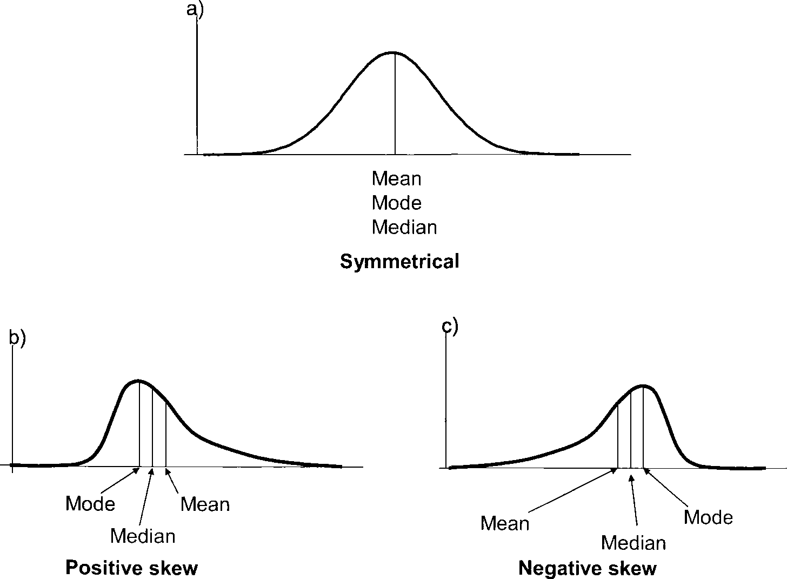

```{r include=FALSE}
knitr::opts_knit$set(root.dir = '04_session/')
xfun::pkg_load2(c("htmltools", "mime"))
remove(list = ls())
```

# Descriptive Statistics

The field of descriptive statistics serves as a mean to summarise and make accessible more complicated data. The main difference to the field of hypothesis testing, That's also called inferential statistics, is, that with descriptive statistics we are describing the sample, and do not make any inferences about the underlying population.

What specifically belongs to descriptive statistics, is not perfectly fixed. In some way, also contingency tables or graphical representation of data, like charts, can also be understand as descriptive statistics. In its more narrow sense, determines the calculation of certain parameters, this describes features of the sample, or more precisely, its distribution. Most widely used are two aspects: the central tendency and dispersion. We will learn about those aspects more in the next section.

The videos for this chapter can be found [here](http://vitutr.archaeological.science/categories/Statistical+methods+for+archaeological+data+analysis+I+2019/index.html), relevant are number 17, 18 and 19.

## Introduction

A distribution is the collection of all the outcomes in the sample. More precisely, you can imagine it as a way to describe the frequency of certain outcomes. Let's imagine the following example:

After their final exam, the students of a mathematical class go to the football field, and line them self up according to their scores in the exam. Starting from the 0 yard line, they move so many yards as they have scored points in the test. Now, if we count the number of students in certain areas of the football field, we get their frequency distribution among the values. So, with a distribution, we are not talking about the individual value, but about their general distribution. From this it is clear, that it only makes sense to talk about distributions if we have more than one value (although technically also individual value is a distribution).


But not only students can form distributions, also other data sets can. You will see, that depending on the data type, different manifestations of distributions are possible. Nevertheless, all these versions are data distributions. The characteristics of the different distribution can be described using certain parameters.

### Parameters of distributions

#### Central tendency

The central tendency can be understand as a description of those values, that are central or "typical" for a certain distribution. This also can be called centre or location of that distribution. There are multiple specific values, that can be used, to describe this specific centre, depending on the scientific question and the data. For example, certain data quality can be described only with certain central tendency parameters. The most commonly used central tendency parameters are the *mean*, *median*, and the *mode*.

#### Dispersion

While the central tendency describes the most centres or most typical value, the dispersion describes how much the values in the whole sample vary around this central value. It is therefore also a measure of how much variety is in the sample. The most intuitive measure of dispersion is the *range.* We will see, that it's not a perfect measure for the whole dataset. Instead, in statistics often the *variance* or the *standard deviation* is used. We will also learn about the *coefficient of variation* as a means to compare the dispersion of different distributions.

#### Shape

Also not so often used explicitly in quantified descriptive statistics, of course the shape of the distribution also is very important for its interpretation. For example, the question if distribution is similar shaped on both sides of the central value, might give us quite an insight into this processes leading to this distribution. There are two other parameters that can be used to describe the shape of distribution in a quantitative way: *skewness* and *curtosis*. We will see, how we can calculate these values, and what their meaning is.

### Loading data for the following steps

Also in this example, I would like to use the Münsingen data to demonstrate some concepts. Please download the data and then load this data into your R environment:

#### download data
* `r xfun::embed_file('muensingen_fib.csv', text = "muensingen_fib.csv")`

#### Read the Data on Muensingen Fibulae

```{r}
muensingen <- read.csv2("muensingen_fib.csv")
head(muensingen)
```

## Central tendency

Let's start with those parameters to describe the location of the distribution. This means, with these parameters we can describe where the whole distribution is centred in the range of possible values of that variable. Some of those parameters you will probably know already very well, some might be not so familiar to you.

### Mean

The arithmetic mean is one of the most widespread used parameter to describe the central tendency of a dataset, also in everyday life. But that doesn't mean, but it's the best value for describing this feature of distribution in every individual case. It is only suitable for metric data (interval or ratio). Why this is the case, becomes apparent if you look to the formula how to calculate it.

$$ \bar{x} = \frac {\sum_{i=1}^{n} x_i} {n} $$
In this formula, we at first sum all the *n* values up, starting from the first (index 1) and ending with the last (index *n*). After this, we divide by the number of values. As we have seen already, in R we can recreate this formula, using some of all the values and divided by the length. But of course, since it's such an important descriptive parameter, there is a specific function for calculating the `mean()`:

```{r}
sum(muensingen$Length) / length(muensingen$Length)

mean(muensingen$Length)
```

Dividing all the values by their number means, that we compare the differences of these values. This can only meaningful be done in situations, where the distances between values have a defined metric. For this reason, we cannot use the arithmetic mean to analyse the central tendency ordinal or nominal data. Also, since with the sum every individual value is included in the way in the calculation of the mean, it describes the whole distribution and not certain values within.

Although the arithmetic mean is the most commonly used central tendency value, it has certain features that are not optimal for describing the whole dataset. Especially, it is very sensitive to outliers, as we will see below. Alternative is the median, which is not used so often, but whose philosophy is also quite easy to be understood.


### Median

Different from the arithmetic mean, the median is a parameter that can be calculated for metric, but also for ordinal variables. And this calculation is rather trivial: if we have an uneven number of values, to get the median result all the values and then selecting the middle value. That means, literally the value that is in the middle of the sorted vector.

In our example, we have the values from 1 to 7. If we sort them and determine the middle value, it will be 4. So 4 is the median for this distribution.

```
1 2 3 4 5 6 7
      |
```

In R, the calculation of the median is not more complicated than the calculation of the mean. Also, we don't have to sort the vector ourselves, R is doing that for us. The command is `median()`.

```{r}
median(c(3,2,1,7,5,4,6))
```

A bit different is the situation, when we have an even number of values. Here, there is no middle value as such. In that case, the median is calculated by taking the mean between the two middlemost values. Assume, we have to numbers from 1 to 8. The median will be the mean of the values four and five.

```
1 2 3 4 5 6 7 8
       |
```
Also in this case, the calculation of the median is not more complicated an R.

```{r}
median(c(3,2,8,1,7,5,4,6))
```

### Mode

The last of the parameters that I want to introduce here to you for central tendency is the mode. This is simply the most frequent value of a vector. So it fulfils our definition from above, that it is the most typical value. Also, since it relies only on counting, the mode can be determined for every data quality: nominal, ordinal and metric data.

Let's assume, that we have the animal bones from an excavation and we can determine the minimal number of individuals for goat, sheep, cattle and pig. In that case, goat will be the most frequent value, and by that the mode of that distribution.

goat sheep goat cattle cattle goat pig goat

mode: goat

In R, since for nominal values the mode is trivial, and for other data types it can be rather complicated, there is no specific function to calculate the mode. Instead, in the example of nominal values, we can calculate the frequency using the function `table()`, and then determine which of the frequencies is the biggest, using the function `which.max()`.

```{r}
which.max(
  table(
    c("goat", "sheep", "goat", "cattle","cattle", "goat", "pig", "goat")
    )
  )
```


### Comparing Central tendency parameters

As I've said already, for certain data types or levels of measurement only certain central tendency parameters are available. You can see a visualisation of this in the table below:

| nominal | ordinal | intervall+ |
|:-:|:-:|:-:|
| mode | mode | mode |
| - | median | median |
| - | - | mean |

But every ability for different data quality is not the only reason, why are you should consider having a look to other parameters for central tendency beside the mean. What other reason is, that the mean is strongly affected by outliers. This is not so much to keep the median, and the mood is hardly affected by any outliers at all. To demonstrate that in a practical matter, let's look at the following distribution. Here we have most of the time the value is between one and nine but only one time the value 120. This value does not very well represent any typical value of this distribution. So far a good value for central tendency it should not have so much of an influence.

```{r}
test<-c(1,2,2,3,3,3,4,4,5,5,6,7,8,8,8,9,120)
```

If we calculate the mean of this dataset, it will be above any other value then the one outlier. So in that case it's not really the central tendency of the whole dataset.
  
```{r}
mean(test)
```

On the other hand, the median is virtually unchanged by this extreme value. Because it's only one very high value, it also counts in the calculation of the median only as 1.

```{r}
median(test)
```

And the same is true for the mode: because this outlier is only one time present, it will also not affect the mode.

```{r}
which.max(table(test))
```

Although the mode is very insensitive to outliers, from a practical perspective in most of the cases it also represents very well essential value of the distribution, when it comes to metric or ordinal data. Only when a more or less symmetric distribution is present, the mode might be helpful, like in the example below.

```{r}
which.max(table(c(1,2,2,3,3,3,4,4,4,4,5,5,5,6,6,7)))
```

We haven't talked about symmetry so much, but also when it comes to distributions, this concept is quite intuitive. When we have a small amount of items with small values, a major amount of items with intermediate values, and again a small amount of items with small values, then we have something that can be considered as a symmetrical distribution. When we have more small values then intermediate or higher values, or more high values then intermediate in small values, then we have a skewed distribution, which is not symmetrical. You can see examples of this in the image below. Here, you can also see, what happens to the different parameters of central tendency in respect to each other, when we have a positive or negative skewed distribution.



In case of a positive skew, the median will be smaller than the mean, since the meeting is strongly influenced by outliers. So a small number of high values will 'drag' mean towards the higher values. Conversely, if we have more high values than low values, then the main will be smaller than the median, for the same, but inverted reasons. This means, just by comparing these two parameters of central tendency, we can already make a statement about the shape of the distribution, without even having to plot it.

:::{.exercise}
Analyse the measurements of the width of cups (in cm) from the burial
ground Walternienburg (Müller 2001, 534; selection):

* `r xfun::embed_file('tassen.csv', text = "tassen.csv")`

```{r}
tassen<-read.csv2("tassen.csv",row.names=1)
tassen$x
```

Identify the mode, median and mean and determine if the distribution is
symmetric, positive or negative skewed.

:::

<details><summary>Solution</summary>
```{r}
mean(tassen$x)
median(tassen$x)
which.max(table(tassen$x))
# The median is smaller than the mean. The distribution has a positive skew with more smaller than larger values.
```
</details>

## Dispersion

In the previous chapter, we have learnt different ways how to express to central tendency of the dataset. But with specifying the location, we have not sufficiently described our dataset yet. One of the more relevant characteristics of the dataset is, if the data are rather close together, or if they are distributed over a larger range of the values. Consider for example the distributions below:


The upper image shows two distributions with the same centre, but with different spreads. The figures below show the same situation, but this time with actual values. You can see, that both distributions are centred around the value zero, but the upper distribution ranges from -45 to 45, while the distribution below is much more centred.

To describe the differences, we have parameters of dispersion, that quantify, how wide the data are distributed over the range of values.

### Range
The simplest of this parameters is the range. The range gives the range from minimum to the maximum value of the dataset. Practically, usually the range is constituted of two values, the minimum and maximum. In R, the function to get the vector of the range of the dataset is `range()`.

```{r}
range(muensingen$Length)
range(tassen$x)
```

With the range, by definition we get the highest and the lowest value. This means on the one hand, that by constructing the range only two values are considered, just these two. All the other values in the dataset do not play any role in the calculation of the range. Therefore, the range does not describe the whole dataset very well. Also, by definition we consider the most extreme values of the dataset. This means, that the range is very sensitive for outliers.

A better measurement for the dispersion of the data should have the following characteristics:

* Less sensitive to outliers
* Broader representation of all the data in the dataset

### Towards a better parameter for dispersion

We have already seen, that the mean, although also sensitive to outliers, at least consider all the values in the dataset as constitutional elements for the parameter. A good description for the dispersion might be the mean distance of all values from the mean. The following plot shows us the values of the Münsingen dataset from a different perspective. Every line represents one fibula. We have substracted the mean of the length of the different fibulae from the individual values. Again, we can see our two unusual long fibulae as high values. The bars each represents how much smaller or bigger the fibulae are in respect to the mean.

```{r echo=FALSE, fig.height=4.5, out.width="100%"}
plot(data.frame(x=1:nrow(muensingen),length=muensingen$Length-mean(muensingen$Length)), type = "h")
```

Now, to get a value for the dispersion of the dataset to consider all individual items, we have to calculate the mean distance from the main. But we cannot simply substract the mean from each value and calculate the mean from it because this would result in zero. The reason for this is the very definition of the mean.

$$ 
\sum_{i=1}^{n} (x_i - \bar{x}) = 0
$$

In our calculation, we must ignore if the difference is negative or positive. We have to consider the absolute difference, not the relative one. To get rid of the sign, easiest way is to square the result.

$$ 
\sum_{i=1}^{n} (x_i - \bar{x})^2
$$
Now we get to some of the squared differences of each value to the mean. To get to mean after differences, we have to divided by the number of cases.

$$ 
\sigma^2 = \frac {\sum_{i=1}^{n} (x_i - \bar{x})^2} {n}
$$
With this, we have tools to calculate the mean differences from the mean. The formula above shows the calculation of the so-called variance for the population. It's notation is using the Greek letter sigma to the square. But because we are dealing here with a sample, and not the full population, the resulting estimation of this mean difference might be biased. For that reason, this bias must be corrected. For reasons, we cannot explain fully here, the easiest way for correcting against a bias that case is to substract one from the number of cases. This gives us our first parameter for dispersion: the empirical variance.

### (empirical) variance

As explained and introduced above, the empirical variance is a measure for the variability in the data that is more insensitive against outlier then the range. It is equal to the sum of the squares distances from the main divided by the number of observations -1. Formula notation is $s^2$.


$$ 
s^2 = \frac {\sum_{i=1}^{n} (x_i - \bar{x})^2} {n-1}
$$

Let's use this formula above, transform it into R code, and compare it to the results of the actual function `var()` from R.

```{r}
sum((tassen$x-mean(tassen$x))^2)/(length(tassen$x)-1)
var(tassen$x)
```

In this case, we have compared the diameter of the cups. The diameter themselves are measured in centimetres. Since in the formula above we square the measurement, the unit is square centimetre. Also the resulting unit of the variance is square centimetre. The values themselves are squared centimetres. Of course, it is much more convenient, to have a measurement of the mean distance from the mean that is in the units of the actual measurement. To get rid of this square in the units as well as in the values, of course we can just take the square root. If we are doing that, we end up with what is called standard deviation.

### (empirical) standard deviation

The formula for the standard deviation is essentially the same as for the variance. The only differences, like we have explained above, is that we take the square root.

$$ 
s = \sqrt{\frac {\sum_{i=1}^{n} (x_i - \bar{x})} {n-1}}
$$

Again, if we compare the results from the recorded formula to the actual functioning are, the function `sd()`, the results should be the same. Keep in mind, that we are talking about the empirical version of these calculations, suited for samples.

```{r}
sqrt(sum((tassen$x-mean(tassen$x))^2)/(length(tassen$x)-1))
sd(tassen$x)
```

With this, finally we have the mean differences from the mean for our dataset. This parameter of dispersion is one of the most widespread used for describing distributions. It has some specific features that make it very useful. Some of them we will learn about later in the course.

With what we just achieved, the measurement of the standard deviation is in the exact same units as the measurements themselves. Most of the time, this is desirable. Especially, if we would like to understand better what this mean distance mean fall our individual values. But sometimes, you might like to compare spreads of distributions, that have different central tendencies, or to put it in other words, different locations. For this case, it is more helpful, to have a measurement of dispersion that is unitless. This is the last parameter of the dispersion from this branch that we will learn about.

### Coefficient of variation

Let's assume, we wonder whether the length of the fibulae in our Münsingen case it's more variable then the foot length or the other way round. We cannot simply compare the standard deviations, because the feet of the fibulae are shorter than the whole fibula by definition. Consequently, also the variability will have smaller values for the foot than for the total length.

In such situations, we need a unitless measurements. We would like to make the value independent from the location of the distribution. To make something independent, most of the time you have to divide by it. So if we divide the standard deviation (measured in the unit of the measurement) by the mean (measured in the unit of the measurement), we get a parameter that is independent from the location (and also, since the units negate each other, has no unit). This coefficient of variation can be used to compare distributions that do not share the same location in the value range. We can compare apples with oranges.

In R, there is no specific come out for that. But it's easy to calculate it anyway. All we have to do, is to divide the standard deviation `sd()` by the mean `mean()`.

```{r}
sd(muensingen$Length)/mean(muensingen$Length)
sd(muensingen$FL)/mean(muensingen$FL)
```

The result is, that the variation coefficient for the length is smaller than the valuation coefficient from the foot length. It seems, that the feet of the fibulae differ more relatively then the total length.

### Quantile

The concept of the standard deviation and related measurements is very similar to the concept of the mean, that we have learnt as one of the parametres for location of the dataset. Another way to describe the dispersion of the dataset is the concept of quantiles, it is more related to the concept of the median that we also learnt about above. We already have introduce this concept, when we have talked about the box plot.

Quantile in general are arbitrary points in the range of a dataset where this can be divided into parts. Specific quantiles are the quartiles. Quartiles divide the data into four equal parts, that means, parts of equal number of items. So let's assume, we have 16 items. The first quartile consists of the first four of this sorted items and so on.

Let's assume, we have 13 values from 1 to 13. If we sort them and marked the beginning of each quarter of the items, We would end up dividing our dataset by one (the beginning of our dataset), 4 (beginning of the second quarter of a dataset), 7 (the median of our dataset), 10 (the beginning of the fourth quarter of our dataset), and finally 13 (the highest value at the end of our sorted the dataset). When we have an even number of items, the same rule applies like in the case of the median: we take to mean of the two centremost values.

<pre>
1 2 3 4 5 6 7 8 9 10 11 12 13
|_____|_____|_____| _______|
</pre>

If we now plot our data on an X axis with the actual values, we can mark the positions of the quantile stare. Such a plot could look like this:


In R, the command to calculate the quantiles is quantile. To make the confusion total, the default setting of the quantiles is to calculate the quartiles.

```{r}
quantile(tassen$x)
```

But we also can parameterised it differently. For example, we can calculate the so-called percentiles. And example below, we calculated the position of the cut points in that way, that we get the 10% intervals of the data.

```{r}
quantile(tassen$x, probs=seq(0,1,0.1))
```

The position of the quantiles (or the quartiles) depends on the spread of the data. In case of the quintiles, the first and the last value that is calculated here represents the minimum of the maximum value. So it is clear, that their position is strongly related to the spread of the data. But also the position of the beginning of the second and the third quartile is dependent on how strong the dispersion is. If it's higher, it's distance will be bigger. That is the reason why the distance between the beginning of the second and beginning of the fourth quartile is a measurement of the spread. Its relationship to the standard deviation is the same like the relationship between the mean and median in respect to the location of the dataset. This measurement is also called the Interquartile Range or `IQR()`.

```{r}
IQR(tassen$x)
```

Like the median is more insensitive to outlast in the main, the Interquartile Range is less sensitive to all clients that the standard deviation. But since we only consider the centre at half of the data for the calculation of this measure, we lose some information about the so-called tails of the distribution, that is (in this case) the lowest and highest quarter.

:::{.exercise}

Analyse the sizes of areas visible from different megalithic graves of the Altmark (Demnick 2009):

* `r xfun::embed_file('altmark_denis2.csv', text = "altmark_denis2.csv")`

```{r}
altmark<-read.csv2("altmark_denis2.csv",row.names=1)
head(altmark)
```

Evaluate in which region the visible area is more equal (less disperse).
:::

<details><summary>Solution</summary>
```{r}
# There are 3 regions in the dataset:
table(altmark$region)

# lets use the region as separator and
# calculate the coefficient of variation
# (because each region might have different terrain):

va_east <- altmark$sichtflaeche[altmark$region == "Ost"]
va_west <- altmark$sichtflaeche[altmark$region == "West"]
va_mid <- altmark$sichtflaeche[altmark$region == "Mitte"]

sd(va_east)/mean(va_east)
sd(va_west)/mean(va_west)
sd(va_mid)/mean(va_mid)

# it seems, that the visible areas differ
# the most in the center of the working area
```
</details>

## Shape of the distribution

As interesting as it might be, as difficult it is to describe the shape of a distribution in a single quantitative way. There are multiple ways how distributions can differ from each other: might it be related to the skewness, to dispersion of the data, to the symmetry or to the number of peaks.

Below, there is an image from Bortz 2006 dead visualise some of these possible parameters.


As already announced, we will discuss here to shape parameters that can be calculated: First, the skewness, of which we have already seen that it can be positive or negative. But there is also a way to calculate the value of the positivity or negativity. The second parameter is called Curtosis (curvature). This parameter indicates if the distribution is a letter or a steeper, compared to the so-called standard normal distribution.

In both cases, it might make sense to plot data and then calculate the values to get a feeling what they do mean. On the other hand, these values are rarely used in practise, so we will use this opportunity to introduce a new concept in our: how to make your own functions.

### Skewness


It's already introduced, skewness is a measure of how skewed your dataset is. On the one hand, it can be distinguished between positive and negative skew. This can be estimated by comparing the mean and median of the dataset. Also, you can try to describe how intense the skewing of the dataset is. For this, probably the easiest option is to look at the plot and describe it. But there is also a way to calculate that, given by the formula below:

$$
\hat{S} = \frac {\sum_{i=1}^n (x_i - \bar{x})^3} {n * s^3}
$$

Here we will not take a part of this formula, but use it as a cooking recipe to produce our own function. For the interpretation, it should be said, that positive values of skewness indicates a positive skew, while negative values indicate a negative skew. The reason, why it's reasonable to create your own function here, is the fact, that there do not exist a ready-made function for this purpose in the base package of R. So lets build our own:

As I have already indicated, everything in R is a variable. This is also true for functions. There are specific function to feel a variable with a function. You will not be surprised that the name of the function is `function()`. Whatever is inside of the (this time currently) brackets off the function call will be evaluated every time the function is called. In the round bracket of the function `function()` there are the variables that might be evaluated inside of the function.

So in our case, the skewness is calculated by dividing the sum of the differences of the individual values to the power of three by the number of the values times the standard deviation, also to the power of three. This is what takes place inside of the function definition. Let's dissect that from bottom to top. The last line `skew` is the value that is returned after the function has been called. This variable `skew` has to be filled. This takes place in the line before that. The value m3 is divided by the denominator of the formula. Of course, this value M3 is filled with the numerator of the same formula. Also, you can see inside of this function body the variable `x`. This variable comes from the outside of the function and represents the actual dataset. That this function expects this variable `x` is indicated by the fact, that in the rounds brackets of the function call `function()` this `x` is mentioned.

```{r}
skewness <- function(x) {
  m3 <- sum((x-mean(x))^3) #numerator
  skew <- m3 / ((sd(x)^3)*length(x)) #denominator
  skew
  }
```

If now we have to find our function `skewness()`, we can use it as any other regular function in R.

```{r}
test<-c(1,1,1,1,1,1,1,1,1,1,2,3,4,5)
skewness(test)

test<-c(3,3,3,3,3,3,3,3,3,3,3,3,2,1)
skewness(test)
```

With this basic concept, you can structure and reuse parts of your code all over in your analyses. Also, the actual result of our function seems to be fitting. What we expect to be a positive skewed distribution results in a positive number and vice versa.

### Kurtosis

The second parameter that we may talk about in this context is to kurtosis. It describes the curvature of the distribution in relationship to the standard normal distribution.


Positive values of kurtosis means, that the distribution is steeper than a normal distribution, while negative values mean, that it is flatter than a standard normal distribution. Of course, you can read the curvature from a plot, but also there is a way to calculate this. If you look to the formula, it will be quite familiar to you, because it resembles very much the formula for skewness. The only difference is, that instead of to the power of three no we calculate to the power of four.

$$
K = \frac {\sum_{i=1}^n (x_i - \bar{x})^4} {n*s^4}
$$

So, of course, we also can write a function for this. It will be very similar to the function as we've just programmed: You only have to replace two numbers. Oh, and by the way probably also the name of one of the variables.

We write a function for that, too:
```{r}
kurtosis <- function (x) {
  m3 <- sum((x-mean(x))^4)
  k <- m3 / ((sd(x)^4)*length(x))-3
  k
  }
```

Let's test this out with one very steep and one very flat distribution.

```{r}
test<-c(1,2,3,4,4,5,6,7)
kurtosis(test)

test<-c(1,2,3,4,4,4,4,4,4,4,4,4,4,4,4,4,4,4,4,5,6,7)
kurtosis(test)

```

## Take Home

There are many other possibilities to describe data, values, and distribution. The most relevant and most widely applicable concepts are those of central tendency and here especially median and mean, and those of dispersion, here especially variance and standard deviation. If you have understood this computations and they are meeting, you are very well prepared for the weather, more elaborated analyses.