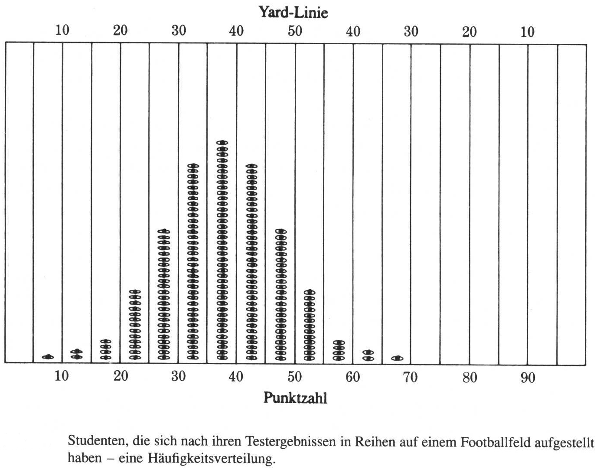
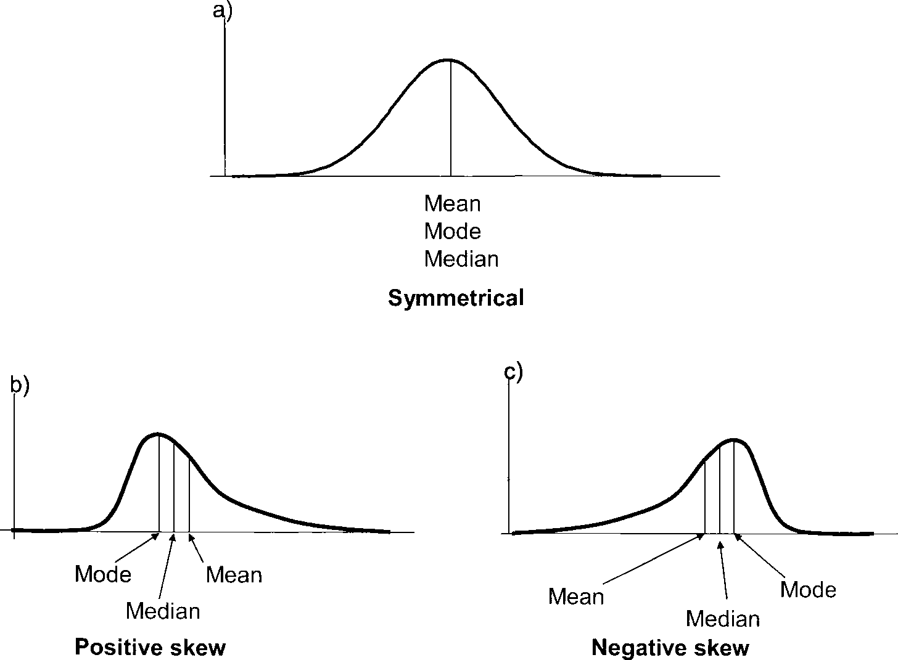
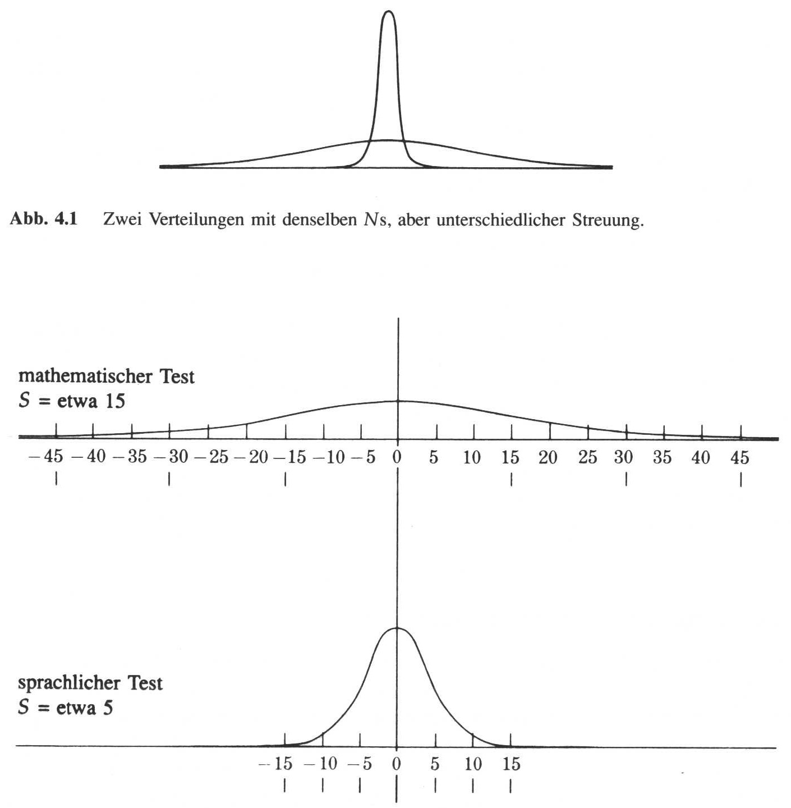
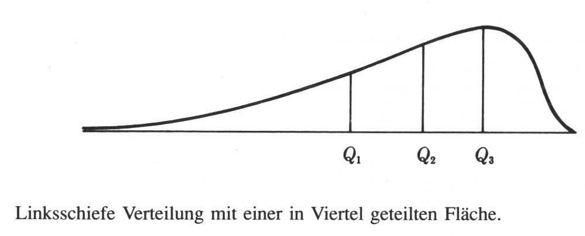
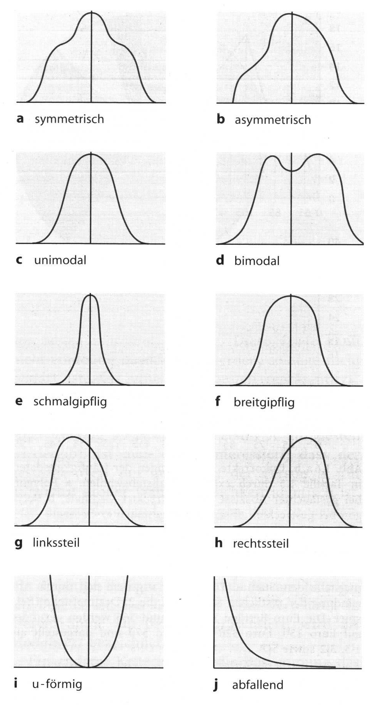
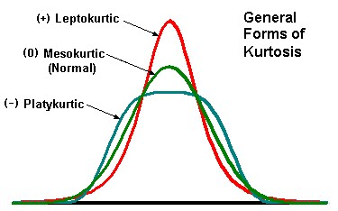

class: title-slide, center, middle

```{r setup, echo=F, error=FALSE, warning=F, message=F}
rm(list = ls())
```

```{r, echo = FALSE, results="asis"}
cat('# ', rmarkdown::metadata$title)
```

```{r, echo = FALSE, results="asis"}
cat('## ', rmarkdown::metadata$subtitle)
```

```{r, echo = FALSE, results="asis"}
cat('### ', rmarkdown::metadata$author)
```

```{r, echo = FALSE, results="asis"}
cat('#### ', rmarkdown::metadata$institute)
```

```{r, echo = FALSE, results="asis"}
cat(rmarkdown::metadata$date)
```


```{r, echo = FALSE, results="asis"}
cat(rmarkdown::metadata$date)
```

.footnote[
.right[
.tiny[
You can download a [pdf of this presentation](smada04.pdf).
]
]
]
---

## Loading data for the following steps

### download data
* `r xfun::embed_file('muensingen_fib.csv', text = "muensingen_fib.csv")`

### Read the Data on Muensingen Fibulae

```{r}
muensingen <- read.csv2("muensingen_fib.csv")
head(muensingen)
```

---

## Descriptive Statistics

### Summary of a amount of observed data
The distribution of the data in the sample is displayed.

### Ways of display

Table – contingency table

Graphical – charts

Numeric – with specific parameters of the distribution

Descriptive statistics do (effectivly) not making statements about the
population but describes the sample! (in difference to statistical inference)

---

## Parameters of distributions

### Central tendency
What is the typical individual

mean, median, mode

### Dispersion

How much variation is there

Range, variance, standard deviation, coefficient of variation

### Shape

Shape of the distribution curve

symmetric/asymmetric

Skewness and curtosis

---


.caption[source: Phillips 1997]
---

## Central tendency [1]

### mean

The classical. Suitable for metric data (interval or ratio)
Sum of values/number of values, or

$$ \bar{x} = \frac {\sum_{i=1}^{n} x_i} {n} $$

```{r}
sum(muensingen$Length) / length(muensingen$Length)

mean(muensingen$Length)
```

---

## Central tendency [2]
### Median

.small[
Suitable for metric and ordinal variables.

Uneven number: the central value of a sorted vector.

```
1 2 3 4 5 6 7
      |
```

R:
```{r}
median(c(1,2,3,4,5,6,7))
```

Even number: the mean of the two central values of a sorted vector.

```
1 2 3 4 5 6 7 8
       |
```
R:
```{r}
median(c(1,2,3,4,5,6,7,8))
```
]
---

## Central tendency [3]
### Mode

The most frequent value of a vector. Suitable for metric, ordinal and
nominal variables.

goat sheep goat cattle cattle goat pig goat

Modus: goat

In R:
```{r}
which.max(
  table(
    c("goat", "sheep", "goat", "cattle","cattle", "goat", "pig", "goat")
    )
  )
```

---

## Central tendency [4]

### Variable is

| nominal | ordinal | intervall+ |
|-|-|-|
| mode | mode | mode |
| - | median | median |
| - | - | mean |
.caption[after: Dolić 2004]

---

## Central tendency [5]
### Comparison of central values:

.small[
Strongly affected by outliers: the mean is very sensitive for outliers, the median less, the mode hardly

```{r}
test<-c(1,2,2,3,3,3,4,4,5,5,6,7,8,8,8,9,120)
mean(test)
median(test)
which.max(table(test))
```


The mode is of little value for describing metric or ordinal data, only when a more or less symmetric distribution is present

```{r}
which.max(table(c(1,2,2,3,3,3,4,4,4,4,5,5,5,6,6,7)))
```
]
---
class:center, middle


---
class:inverse

## Central tendency exercise
### Describe the central tendency

Analyse the measurements of the width of cups (in cm) from the burial
ground Walternienburg (Müller 2001, 534; selection):

* `r xfun::embed_file('tassen.csv', text = "tassen.csv")`

```{r}
tassen<-read.csv2("tassen.csv",row.names=1)
tassen$x
```

Identify the mode, median and mean and determine if the distribution is
symmetric, positive or negative skewed.

---
class:center, middle



.caption[source: Phillips 1997]

---

## Dispersion [1]
### Range
Simply the range of the values of a data vector.

```{r}
range(muensingen$Length)
range(tassen$x)
```

Because the measurement is related to the extreme values it is very
sensitive for outliers.

---
class: middle, center

### How far deviates the individual values from the mean in the mean?
```{r echo=FALSE, fig.height=4.5, out.width="100%"}

plot(data.frame(x=1:nrow(muensingen),length=muensingen$Length-mean(muensingen$Length)), type = "h")

```

---

## Dispersion [2]
### (empirical) variance

Measure for the variability of the data, more insensitive against outliers
Equals to the sum of the squared distances from the mean divided by the
number of observations

$$ 
s^2 = \frac {\sum_{i=1}^{n} (x_i - \bar{x})^2} {n-1}
$$

In R:
```{r}
sum((tassen$x-mean(tassen$x))^2)/(length(tassen$x)-1)
var(tassen$x)
```

.footnote[.tiny[
Attention: there is another variance σ2 (with n instead of n-1) which is only suitable for analysis of the population (which is not known most of the times), not for samples
]]

---

## Dispersion [3]
### (empirical) standard deviation
Variance has through the squaring squared units (mm → mm2)

For a parameter with the original units: square root → standard deviation

$$ 
s = \sqrt{\frac {\sum_{i=1}^{n} (x_i - \bar{x})^2} {n-1}}
$$

```{r}
sqrt(sum((tassen$x-mean(tassen$x))^2)/(length(tassen$x)-1))
sd(tassen$x)
```

Equals the mean distance from the mean

.footnote[.tiny[
Attention: there is another standard deviation σ (with n instead of n-1) which is only suitable for analysis of the population (which is not known most of the times), not for samples
]]

---

## Dispersion [4]
### coefficient of variation

Standard deviation has the unit of the original data (e.g. mm).

To compare two distributions with different units:
coefficient of variation = standard deviation/mean

Example: Vary foot length and total length equal?
```{r}
sd(muensingen$Length)/mean(muensingen$Length)
sd(muensingen$FL)/mean(muensingen$FL)
```

Foot length vary more than total length

---
## Dispersion [5]

### Quantile
.small[
Oh, we've done that one...

The 1., 2., 3. and 4. quarter of the data (sorted and counted) resp. there boundaries



.caption[Phillips 1997]

]

---

## Dispersion [5]
### Quantile
.small[
Oh, we've done that one...

The 1., 2., 3. and 4. quarter of the data (sorted and counted) resp. there boundaries
```{r}
quantile(tassen$x)
```

new: percentile (the same for percents)
```{r}
quantile(tassen$x, probs=seq(0,1,0.1))
```

Dispersion measure inner quartile range

```{r}
IQR(tassen$x)
```

More insensitive against outliers than the standard deviation, but information is lost
]

---
class: inverse

## Dispersion exercise
### Determine the dispersion of the data

Analyse the sizes of areas visible from different megalithic graves of the Altmark (Demnick 2009):

* `r xfun::embed_file('altmark_denis2.csv', text = "altmark_denis2.csv")`

```{r}
altmark<-read.csv2("altmark_denis2.csv",row.names=1)
head(altmark)
```

Evaluate in which region the visible area is more equal (less disperse).

---

## Shape of the distribution [1]
.pull-left[
### Important Parameters

Number of peaks of the distribution: unimodal, bimodal, multimodal

Skewness of the distribution: positive, negative

Curtosis (curvature) of the distribution: flat, medium, steep
]

.pull-right[


.caption[Shape of distributions (after Bortz 2006)]
]

---
class:center, middle


---

## Shape of the distribution [2]
### Skewness

Mean right or left of the median

Read from the chart ;-)

calculate:
$$
\hat{S} = \frac {\sum_{i=1}^n (x_i - \bar{x})^3} {n * s^3}
$$


Positive value indicates positive skew, negative resp.

---

## Shape of the distribution [2]
### Skewness

There is no function in R currently available to calculate this. So we build our own:

```{r}
skewness <- function(x) {
  m3 <- sum((x-mean(x))^3) #numerator
  skew <- m3 / ((sd(x)^3)*length(x)) #denominator
  skew
  }
```

Test:

```{r}
test<-c(1,1,1,1,1,1,1,1,1,1,2,3,4,5)
skewness(test)

test<-c(3,3,3,3,3,3,3,3,3,3,3,3,2,1)
skewness(test)
```


---

## Shape of the distribution [3]
### Kurtosis

.pull-left[
The curvature of the distribution
Read from the chart ;-)
n
calculate:

$$
K = \frac {\sum_{i=1}^n (x_i - \bar{x})^4} {n*s^4}
$$

Positive if steeper, negative if flatter curve than the normal distribution
]
.pull-right[

]
---

## Shape of the distribution [3]
### Kurtosis

We write a function for that, too:
```{r}
kurtosis <- function (x) {
  m3 <- sum((x-mean(x))^4)
  skew <- m3 / ((sd(x)^4)*length(x))-3
  skew
  }
```

Test:
```{r}
test<-c(1,2,3,4,4,5,6,7)
kurtosis(test)

test<-c(1,2,3,4,4,4,4,4,4,4,4,4,4,4,4,4,4,4,4,5,6,7)
kurtosis(test)

```
