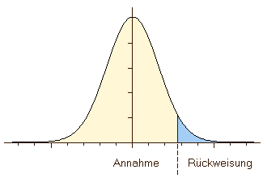
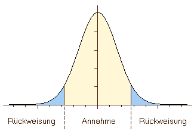
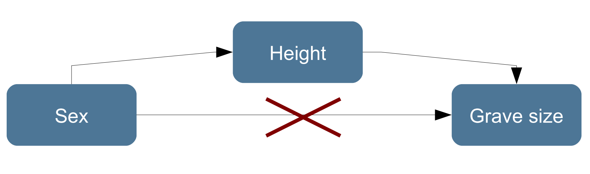

```{r include=FALSE}
knitr::opts_knit$set(root.dir = '05_session/')
xfun::pkg_load2(c("htmltools", "mime"))
remove(list = ls())
```

# Nonparametric Tests
## Inductive statistics or statistical inference

Until now, we have primarily described and presented the data of our sample using descriptive statistics and graphical visualisation. We also used graphical visualisations to explore our dataset in the sense of explorative statistics. In all of these techniques, we stayed on the page of the sample. We did not make any conclusions about the underlying population.

This is no different, when we come to the field of inductive statistics, or statistical inference. Here, we explicitly try to estimate characteristics of our population using our sample. Since in nearly all cases, our sample will be smaller (in archaeology actually very much smaller) then our population, we have only access to a small part of the information describing the full population. So necessarily, when we base our estimation only on a fraction of the population, our estimation will be wrong. But it doesn't need to be true, it just needs to be sufficiently correct. Nevertheless, it is essential to keep that in mind: whatever comes out of the statistical analyses, only is to with a certain probability. The knowledge gained is always statistical meaning, there is a certain chance that the world is like we assume it. We have to have a link from the sample that we have at hand, to the population. This link is provided to us by probability theory. We will explain that a bit more detailed, when it comes to parametric tests.

## Population and sample

### Repetition:

A small repetition of what we have learnt in the beginning: We call **population** the collection of all items that are relevant for our investigation. But in most cases, we cannot investigate the full population. Therefore we investigate only a fraction of it. This fraction, that we ideally select on certain criteria (represent activity), is called our **sample**. We always should keep in mind, that the dataset that we are analysing is only a random selection of the whole collection of items that we are really interested in. In so far, it is like our probe that we send out as spaceship Enterprise into the nebula of data that lie in front of us. This is especially true in archaeology, where neither the population nor the conditions under which our sample is created is under our control. We never will be able to access the population, and we never will be able to verify our interpretation with it.

### Parameter

Even if we have no way of precisely knowing them, our population always has certain values or distributions of values, there are fixed. For example, there is a specific value for the mean foot length of all the La Tène B fibulae ever produced (given, that we can agree on what a La Tène B fibula is). This value is there. It is an actual number. But we never will know it, and it's lost in the depth of time.

Such variables, that we can't be sure exists and have a certain value we call **parametres**. This parameters can only be estimated by us using the sample. So, they are not accessible for us, nevertheless that they really exist and really have a specific value.

Also, samples have parammeters. But these parameters are accessible: we can measure them. But we have to distinguish these parameters from the actual parameters of the population. Quite often, this is already visible in the notation that is used in the formula, which differentiate between sample and population. For example:

| Population | Sample
|:-:|:-:|
| $\mu:$ mean of the population | $\bar{x}$: mean of the sample |
| $\sigma$: standard deviation of the population | $s$: standard deviation of the sample |

Since we can only measure the parameters of the sample, we use them, and some knowledge about the general distribution of values in random processes, to estimate those values of the population. This is done in statistical tests, where it is estimated, if and how likely certain values of a sample, under certain conditions of a random process, result from the population with a certain parameter. The quality of the statement of a test therefore depends on the choice of the sample (representativity)! For this, we make a hypothesis about the value of the population, and then we test this hypothesis using statistical hypothesis testing.

## Statistical Hypothesis testing

### Validation of an assumption about the population

As I have just explained, does statistical hypothesis testing takes place before the background of the sample. We make a hypothesis about the value of the parameter of the population, and then we estimate, how likely the sample that we have at hand could have resulted from such a population. If it is very likely, then it is an indication that our hypothesis is not too bad. If it is very unlikely, that might be indication that there is something wrong with our hypothesis.

Before we start to talk about actual and individual values, most of the time hypothesis actually unfold them self more as general questions like the one below:

**How probable is it that two or more samples descend from the different/the same population?**

(eg. Is the custom of grave goods for man and women so different that two different social groups are visible?)

**How probable is it that a given sample descend from a population with certain parameters?**

(Is the amount of grave goods random or is a pattern visible?)

In the first place, when we have two samples and try to estimate if they originate from the same or from different populations, we have a test for independence. That means, we test, based on the samples, if the population of both values are independent from each other or not. In the second case, which is also called goodness of fit test, we test how good our data fits to a specific assumption, like I have explained above. But it is very difficult to prove something about the population, given that we have a sample. Maybe, we just have to wrong sample? Maybe, while our sample just doesn't fit to our assumption, the sample next to it would probably do. It is much easier to falsifier statement using a sample: only one black swan falsifies do you hypothesis, that all swans are white. Therefore, in statistical hypothesis testing, we use a detour over falsification to make our hypothesis more plausible. This detour is called null-hypothesis.

### Null hypothesis

In statistical tests most of the times not the statement is tested which one expects to be true, but one tries to disprove the statement which one expects to be wrong: the null hypothesis. This hypothesis states mostly, that a association do not exists or that there is no differences between the samples and the distribution of the observations is by chance. So, most of the time, it is the rather boring standard situation, that exciting scientific investigations try to disprove.

An example: Is the composition of grave goods different between male and female deceased?

This is the scientific question. Now, there are two possible answers to that, resulting into possible hypothesis:

$H_0$: The composition is the same

$H_1$: The composition is different

So instead of proving our hypothesis one, we try to disprove or falsify its opposite. When we have shown, that the assumption, that the composition is the same (or only different due to random chance), then we have shown at the same time, that the composition is different. We did not say anything about how it is different, or why it is different, we only state, that is different. As we have shown above, this has two reasons:

1. It is (logical) easier to prove, that a statement is wrong (falsify) then to prove that a statement is true (verify).
2. Most of the times it is easier to formulate a null hypothesis (How exactly is the composition different?). It doesn't make a assumption about how the character of a association/difference exactly is.

So the "workflow" of the statistical test is the following: At first, usually from our scientific question, we have our alternative hypothesis. At the moment, it is probably not with an alternative, because it is the only hypothesis that we have. Usually, we hope or expect to find something interesting in the data. For example in relation to gender differences in burial items:

**Construction of a alternative hypothesis:**

The composition of the grave goods is different between male and female deceased.

From this assumption, we build our no hypothesis in such a way that we are stating the opposite of what we might expect:

**Construction of the null hypothesis:**

The composition of the grave goods is the same in male and female burials.

[To be honest, this is a bit of cheating. If you get further into the discussion about the validity of statistical analyses, you will learn decides to discussion on the P value as such, that one should actually only compare real scientific hypothesis with each other, and not such a strawman like another hypothesis. Nevertheless, this is (quite successful) practice in frequentist statistical analyses since decades, and in most of the time it actually also works quite well. Only to let you know, that this is not the only way of how you can interpret this workflow.]

Now, that we have our normal hypothesis, we can test with our data from our sample how likely it is. How do you specifically is done, depends very much on the statistical test that we are using, and the data quality, that we are investigating. But the general logic is always the same: the next step is the

**Test of the null hypothesis**

From this, we have two possible results. Either:

**If the result of the test is significant:**

Then we have evidence, that our Null Hypothesis might not be true. And, depending on the level of security that we would like to have, this might be rather overwhelming evidence. In that case, we reject the null hypothesis. This also means, that we can choose the alternative hypothesis. In our example:

The composition of the grave goods is different between male and female deceased.

If the result of the test is not significant, This means, that we do not have enough evidence to securely falsify the null hypothesis. Or in other words:

**The null hypothesis could not be rejected.**

This now does not mean, get the null hypothesis is actually true. You see that quite often, that When statistical test is not significant, that interpretation is that there is no difference for example between two populations. But this is not correct because the null hypothesis can be kept Ivor, because it's true (or better not wrong), or, because there are not enough data. Statistical significance doesn't and cannot differentiate between these two possibilities.

### One-tailed/Two-tailed hypothesis

Sometimes, you see one-tailed or two-tailed as qualifier resulting from statistical tests. This comes from the fact that technically in most of the hypothesis testing we compare our value to a range of theoretical values. In such situations, our value can be bigger or smaller than this range. Now, it depends on the question asked and therefore on the hypothesis, in which case we can reject our null hypothesis. Probably can be best explained using example:

*Is the number of grave goods in female burials higher than in male?*

With this type of question, there is only one way in which our hypothesis (or it's null hypothesis) can be falsified. Only in the case, when the number of greatcoats in May burials are higher, then we have a falsification of our hypothesis. There is only one way, one tail of the values, on which it can be falsified. 

*Is the number of grave goods in female burials different from male?*

Here, the number of grave goods in female burials can differ into directions: There can be more or less burial items. So on both tails of our value range (smaller, bigger) there is falsification of the null hypothesis possible. Therefore, this is a two-tailed hypothesis.

Here, we have more chance for a random process to result in the pattern that we are observing. That's why in statistical tests the result is often two significances (onetailed, two-tailed).
.center[
 
]

### Stat. Significance

### How true is true?

Now, we quite often have used the term significant. Of course, in common language this means important. In the realm of statistical analyses, significance means a measure of how certain decision for one or the other hypothesis is. Or, to put it the other way round, it is a measure of uncertainty.

We have already introduced the null hypothesis, and there we have explained that statistical significance decides whether or not to accept the null hypothesis. More specifically, significance is exactly a measure of how probable an error is when we reject the null hypothesis. That is not directly the same as how likely the null hypothesis itself is, although quite often it will be mixed up with this meaning. One important factor in this difference is, that also sample size and with that certainty of evidence against the null hypothesis is factored in here. But from this perspective, it also makes quiet sense that based on this criterion the null hypothesis is rejected or not. This measure of course is a continuous variable, so there are no specific values per se that would define a threshold. Nevertheless, there are some arbitrary classical thresholds:

* 0.05: significant, with 95% probability the decision is right.
* 0.01: very significant, with 99% probability the decision is right.
* 0.001: highly significant, with 99,9% probability the decision is right.

In archaeology, where no life depends on our decision, usually the 0.05 level is perfectly fine for decision-making. In medical trial or situations, where you have a lot of experimental data, you probably would like to have stricter significance levels than that. But technically, no one can stop you to introduce your own significance level if you like.

This measure of significance is also often called p-value in the literature in the English literature, or alpha ($\alpha$) in other languages. If you look up these names, you probably will find that there is quite a discussion going on about the value of the p-value in scientific analyses. Since this year it's a beginners course, we will not go into this debate. For us the p-value is significant enough, and we will stick to this arbitrary 0.05 measure. This measure also means, that in 1 out of 20 cases the null hypothesis will be rejected even though it should not be rejected. When interpreting statistical results, one should always keep this in mind: even with seemingly objective statistical methods, there is quite a big margin of error possible. Actually, there are two possible arrows here: we can except the null hypothesis, even if it is not true. Or, we can reject the null hypothesis even if it is true. We will learn about these two versions in the next section.


## α- und β-error

As I have described above, we can go wrong in two ways with the rejection of a null hypothesis in statistical investigations:

**The null hypothesis is rejected although it is true** -> *Type I error, false positive, $\alpha$-error*

Such an error would be, for example, when the result of a pregnancy test shows a pregnancy although there is none.

**The null hypothesis is not rejected although it is wrong** -> *Type II error, false negative, $\beta$-error*

In this situation, the example would be the result of a pregnancy test if it shows no pregnancy although there is one.

So in general, there are two situations where we can decide correct: If we accept the null hypothesis, and it is the correct choice, or we reject the null hypothesis, and that is the correct choice. If we reject the null hypothesis, but there is in reality no difference between our samples, then we make this type one error. In that case, we would think that we gained some new knowledge, so we probably will build further interpretations on top of that. That makes type one errors more severe. Because, with a Type II error, when we keep the null hypothesis although there is a difference in our data justifying the alternative hypothesis, if we correctly interpret the statistical results we just miss an opportunity to find an interesting pattern. When another hypothesis cannot be rejected, we should not learn anything about the population.So, not so much damage should result from that.

| | True condition: H0 (There is no difference) | True condition: H1 (There is a difference) | 
|-|-|-|
| By the use of a statistical test the decision was made for: H0 | Correct decision | Type II error |
| By the use of a statistical test the decision was made for: H1 | Type I error  | Correct decision |

Nevertheless, both situations are annoying, so that is why statistical tests usually try to avoid both types of errors. But they can do so only in so far as they adapt their strictness. If they are too strict, they will not reject the null hypothesis to easily, leading to type 2 errors. If they are not strict enough, do you wanna risk type 1 errors. So it is always a balancing act between both error possibilities.
The **power** of the statistical test is its capability to avoid type two errors without risking type one error. This capability depends on the amount of information that can be put into the test itself. That means, if we have not very much information not very much evidence, then type two errors are more likely. In general, this also not very desirable, because more powerful tests enable us to differentiate more clearly between random effects and actual patterns in the data.

## Parametric vs. Nonparametric

The question, what nonparametric tests mean, and what distinguish them from parametric tests, is strongly connected to what we have described just above. If we have very little information, because from the data themselves or from general knowledge they can't be put so much into the equation, then we probably will have tested and not very powerful. On the other hand, this tests might be applicable in situations, we are more powerful tests are not valid, and cannot be used. On the other hand, if we can introduce more information into our test, we have more grounds to differentiate between random effects and actual patterns. This precisely is the difference between parametric and nonparametric tests.

**Parametric** tests, we make certain assumptions about the distributions of the values in the population. Quite often, we assume that the values follow the so-called normal distribution. But there are also other possibilities: for example we could have a independence test that require the variance of the data to be equal. We will learn about one of these tests later, and but alternatives we do have in this situation. Quite often, parametric tests also, resulting from their prerequisites, can applied only to metric variables.

**Nonparametric** tests on the other hand do not make any of these assumptions. They do not care, what distribution the data might have in the population. Also, most tests for nominal or even ordinal variables are nonparametric. Another benefit is that quite often they are applicable for rather a small sample sizes. But for this flexibility, of course, your pay a price: this tests are not as powerful as their parametric counterparts. Nevertheless, for the dirty and sparse data that archaeology usually has to deal with, we can declared that this kind of tests exist.


## $\chi^2$ test

The first statistical test, that we will cover here, is probably one of the most nonparametric tests there is. The Chi-Square test requires only two or more sets of nominal variables, and will try to test whether or not the court occurrence of values is related to each other or not.

This probably doesn't sound so universal, but in archaeological reality you can cover already quite wide range of possible questions with this. And also, you can base your interpretations much more secure, if you have the ability to differentiate between actual patterns and random results from sampling processes. Such questions might be:

**Do settlements tend to be situated on rather good soil or is the distribution random?**

If we can differentiate between situations, where to settlement behaviour is just independent from disorder quality, and such situations, where decide quality or a specific side quality makes a difference for the settlement behaviour, we can learn a lot about settlement behaviour in general and it economical dependencies specifically.

**Do older individuals have more shoe-last celt as grave goods than younger?**

If we assume, and archaeology did so, that shoe-last celt (Schuhleistenkeil) are a sign of social rank in neolithic Linear Band Ceramic groups, then their distribution among the individuals of different age classes can you give us an indication about the construction and reproduction of status and role in society. If, for example these items are evenly distributed among older and younger individuals, can we have an indication that it is not activities during lifetime that define the social rank of a person, but this rank can be inherited. Or the other way round, if these objects are concentrated in order age classes, we have an indication that only with a long life you get the allowance to have one of these objects as burial item. [One problem here: Of course, this is a vicious circle, because the fact that these objects occur in older age classes primarily make them suspicious for being a social marker of rank in the first place.]

All these questions and the related categories are probably not the first thing, and that comes to your mind, when you think about statistical tests. Here, we talk about nominal variables. And this is especially the value of the Chi-Squared test for archaeology: Most of our variables and of our interesting questions are nominal scaled. Let's have a look how we can perform this test.


### Facts sheet

#### $\chi^2$ Test for independence of two distributions

**Requirements**: at least 1 nominal scaled variable (one sample case) and
1 nominal scaled grouping variable (two sample case)

**Procedure with one sample**: observed values are compared with expected values given a certain distribution, no expected value should be < 5; n should be > 50

**Procedure with two samples**: observed values of both distributions are
compared with expected values if the samples would be even distributed,
no expected value should be < 5; n should be > 50

**If sample size is too small**: Fishers Exact Test

**Test statistics**: $\chi^2$

Significance depend on degree of freedom (df)

#### What do these facts mean

Most of this will explain itself when we come to the practical examples. The test itself requires one nominal scaled variable, that means the counts of objects within at least more than one category. So actually not the count number, but the categorisation is the original variable. The nominal scaled grouping variable describes simply the fact that we can differentiate to samples, if we would like to compare to samples. We have to be able to distinguish between apples and oranges.
In both cases, we compare the observed values of our dataset with some expected values, that will result from certain assumptions or expectations about how the distribution of the values should be. Also this will be more clearly understandable with the practical example. But in the one sample as well as in the two sample version of the test, there is a requirement of having no expected value (the number of objects of a certain category that you would expect given your assumptions) should be smaller than five, and the total number of cases should be at least 50. Please note, that if this pre-requisites cannot be fulfilled, you can use the so-called Fishers Exact Test instead. Its interpretation is very similar to the one for the Chi-Square test statistic. The test itself is called after the Chi-Square distribution that it uses as test statistic. In statistical tests, often certain theoretical distributions are used as shortcuts to approximates other, more complicated distributions to decide, whether or not the values might come from random processes.
The last thing we have to explain to the concept of degrees of freedom.

### Excursus degree of freedom

Very general, degree of freedom in statistics means a number of values in a calculation or equation that can vary freely. It is the amount of choices that you have before everything is determined. Let's assume the following numbers of burials, divided into different classes:

| | male | female | total |
|-|-|-|-|
| cremation |  | |  201 |
| inhumation | | | 197 |
| total | 216 | 182 | 398 |

We have the total sums in the margins, we have in total 216 male burials, and 182 female burials. Also, we know already that we have 201 cremation burials and 197 inhumations. But the distribution within the table is not yet determined. We don't know, how does different values are distributed among the classes. But if we have information about just one cell:

| | male | female | total |
|-|-|-|-|
| cremation | 123 | |  201 |
| inhumation | | | 197 |
| total | 216 | 182 | 398 |

Now everything is determined. We can calculate the number of male inhumations, we can also calculate the number of female creation cremations, And then also the number of female inhumations. With just one value set (and it doesn't matter which value it is actually) the whole table is determined.

| | male | female | total |
|-|-|-|-|
| cremation | 123 | 78 |  201 |
| inhumation | 93 | 104 | 197 |
| total | 216 | 182 | 398 |

This means, that this table structure has a degree of freedom of one.

**df=1**: if one value is chosen all other can be calculated with the help of
the margins

In general, there is a very simple formula to calculate the degrees of freedom of such tables:

(number of columns – 1)*(number of rows – 1)

So we have to substract from the number of column 1, and multiplied it by the number of rows -1. You can calculate the example above with this formula, or check the sample below with the same formula and have already an estimation about how many degrees of freedom this will have.

| | male | female | uncertain | total |
|-|-|-|-|-|
| cremation |  |  | |  201 |
| inhumation |  | | | 197 |
| total | 196 | 179 | 23 | 398 |

No we have three columns, and still two rows. According to our formula, we should have a degree of freedom of two. Let's try that out. If we introduce one value, there is still possibility to vary other values freely. For example, if we fixed a number of female cremations, we still don't know or can't calculate all the other values.

| | male | female | uncertain | total |
|-|-|-|-|-|
| cremation |  | 78 | |  201 |
| inhumation |  | | | 197 |
| total | 196 | 179 | 23 | 398 |

Only if we add another value, for example the number of male cremations, we can calculate all the other values.

| | male | female | uncertain | total |
|-|-|-|-|-|
| cremation | 113 | 78 | |  201 |
| inhumation |  | | | 197 |
| total | 196 | 179 | 23 | 398 |


| | male | female | uncertain | total |
|-|-|-|-|-|
| cremation | 113 | 78 | 10 |  201 |
| inhumation | 83 | 101 | 13 | 197 |
| total | 196 | 179 | 23 | 398 |

As expected from our formula, we have a degree of freedom of two. 

**df=2**: if two values are chosen all other can be calculated with the help of the margins

(number of columns – 1)*(number of rows – 1)

Using again the formula, I'll leave the last example for you to figure out yourself.

| | male | female | uncertain | total |
|-|-|-|-|-|
| cremation |  |  | |  201 |
| inhumation |  | | | 197 |
| other |  | | | 30 |
| total | 201 | 187 | 40 | 428 |

### $\chi^2$ Test for one sample (example after Shennan)

For demonstration using example from the Stephen Shennans book on quantifying archaeology: the number of Neolithic settlements on different soil types in eastern France

| Soil type | Number of settlements |
| - |-|
| Rendzina | 26 |
| Alluvial | 9 |
| Brown earth | 18 |
| total | 53 |

The question that should be answered here is whether or not there is a certain preference for specific soil types. From the data themselves it seems quite obvious, that Rendzina is very much preferred for settlements. So we will not need to statistical methods to check out, which of the sort of type is this preferred, but rather, if this high number of settlements could also result from just random effects. Or to be more concrete, how likely such a random configuration might be, and if it is likely to falsely exclude the possibility of random effects with more than our standard 5% probability for statistical significance.

This is actually a one sample test, because we have only one sample: the amount of settlements on the different soil types. It is probably easier to understand, that this is one variable, if you imagine it is a list of settlements, where we have the values "Rendzina", "Rendzina", "Brown earth", "Alluvial", and so on. With this it becomes clear that we have a variable that is nominal scaled.

We will calculate two versions of this test here: at first a naive version, in which we assume, that the soil types are evenly distributed over the landscape, with the same area ratio. In the second version, we will add  information about the actual distribution of the soil types in the landscape to our equation, and with that we will alter the values that we will expect for its distribution.

#### Version 1: even distributed

In this version, we assume that every soil type has the same proportion area in the landscape. If we now randomly distribute our settlements over the landscape, we would expect that each soil type has the same same probability of settlement. Consequently, we would expect that the number of settlements for each side type is the same. In total, we have 53 settlements. If we would evenly distribute these settlements over our three soil types, we would end up with the expection of 17.6667 settlements per soil type.

| Soil type | Number of settlements | Proportion of soil type | expected number of settlements |
| - |-| - | - |
| Rendzina | 26 | 1/3 | 17.6667 |
| Alluvial | 9 | 1/3 | 17.6667 |
| Brown earth | 18 | 1/3 | 17.6667 |
| total | 53 | 1 | 53 |

Now we can formulate a hypothesis: We are interested, if the settlements are not evenly distributed. Therefore, we need to disprove or make unlikely an even distribution. Soour hypothesis look like that:

$H_0$: The settlements are evenly distributed on all soil types.

$H_1$: The settlements are **not** evenly distributed on all soil types.

Of course, from the data we already see, that they are not distributed like our expectation. But of course, there is random chance that a certain soil type gets a higher number of settlements then another. This would also be true if we would use a dice to distribute the number of settlements. We are only interested in the situation, when this rolling a dice scenario is very unlikely, and a pattern behind this distribution cannot be ignored. For that, we have to measure how far the actual data are from our expectation (you could call that measure of surprise), and how likely such a distance from our expectation would be given the possible random nature of the distribution. For the later part, we will use pre-calculated tables, or the statistical program R. But the first part we can calculate ourselves.

Please don't be afraid: here come to formula! But we will gently introduce and explain this formula to you.

Formula for $\chi^2$:

$\chi^2=\sum_{i=1}^n \frac{(O_i - E_i)^2}{E_i}$

$O_i$: number of **observed** cases

$E_i$: number of **expected** cases

$\chi^2$: symbol for the test statistic chi-squared

The number of observed cases the present our actual data. This is the data that we observed. Consequently, the number of expected cases is represented by our column "expected number of settlements". In this formula, from our exact cases our expectations are substracted to calculate the difference. Because we don't care if I were observed cases are bigger or smaller than our expectations, because we are only interested in the difference, we square them to get rid of the sign. Then we have to take care, get our measure of surprise is independent from the number of cases. This is because the difference of 10 will probably surprise us, if the total number of cases is 20, but in the situation, where the total number is 5000, this difference of 10 probably is totally irrelevant. That is why we divide by the number of expected cases again, to normalise for the expected magnitude of our data. That must be repeated for every cell of the table. Once this is done, we can sum up all over individual measures of surprise to get the total surprise for the table, or more formally does Chi-Squared value for the table.

| Soil type | Number of observed cases | Number of expected cases | $O_i - E_i$ | $(O_i - E_i)^2$ | $\frac{(O_i - E_i)^2}{E_i}$ |
| - | - | - | - | - | - |
| Rendzina | 26 | 17.6667 | 8.3333 | 69,4444 | 3.9308 |
| Alluvial | 9 | 17.6667 | -8.6667 | 75,1117 | 4.2516 |
| Brown earth | 18 | 17.6667 | 0.3333 | 0.1111 | 0.0063 |
| total | 53 | 53 | | | **8.18868** |

In this specific case, and starting from our expectations, we are rather surprised about the value of Rendzina, Because it is much higher than our expectations and even more surprised about the value of Alluvial, but this time, because it's much lower than our expectation. We seem not to be surprised at all by the value of brown earth, because the difference to our expectation is below one. The total measure of surprise (or Chi-Square value) is 8.18868. Currently, we do not know how to interpret that, we have no framework for it. What approach could be now to calculate several random settings and see, how because the price can be given random distribution. This easily can be done today using a computer. Before a computer was available to everyone, this was very hard, and so a lot of precalculated tables were available. One of those food precalculated tables can be found in the book of Stephen Shennan. These tables are structured according to the level of significance (in our case 0.05) and the degrees of freedom (in our case 2, because we have one column for the observed and one column for the expected cases). With degree of freedom and level of significance we will find the threshold value. If our calculated threshold value is above this threshold, we have a significant result. This means, that there is a chance below 5% to go wrong to reject the null hypothesis, based on our data. In our case, the threshold is 5.99145. The value we have calculated is much higher, therefore we have a significant result. There's quite enough evidence to assume, that there is a preference for specific soil type visible in this settlement behaviour.

#### Version 2: even distributed with consideration of the proportion of the soil types on the total area

In the second version, we know how much area the difference or types take up in the landscape. This does not alter our data, but our expectations. If we know, how much percentage of the landscape is constituted off the individual soils, we also would exceed proportional amount of settlements to be situated on these soils. Now in this example, the distribution it's not so far away from the even distribution, but slightly.

| Soil type | Number of settlements | Proportion of soil type | expected number of settlements |
| - |-| - | - |
| Rendzina | 26 | 32% | 16.69 |
| Alluvial | 9 | 25% | 13.25 |
| Brown earth | 18 | 34% | 22.79 |
| total | 53 | 1 | 53 |

For example, Rendzina makes 32% of the size of the landscape, resulting in an expectation of 16.69 settlements on this soil (multiplying the total number of 53 settlements by this percentage). From here on the onward, everything is the same like in the example before. We have to compare our expectation with our data, measure our surprise, and compare that to the possible surprise from random effects.

$\chi^2=\sum_{i=1}^n \frac{(O_i - E_i)^2}{E_i}$

| Soil type | Number of observed cases | Number of expected cases | $O_i - E_i$ | $(O_i - E_i)^2$ | $\frac{(O_i - E_i)^2}{E_i}$ |
| - |-| - | - | - | - |
| Rendzina | 26 | 16.69 | 9.04 | 81.7216 | 4.8185 |
| Alluvial | 9 | 13.25 | -4.25 | 18.0625 | 1.1363 |
| Brown earth | 18 | 22.79 | -4.79 | 22.9441 | 1.007 |
| total | 53 | 53 | | | **7.1885** |

The resulting number is slightly lower, but still beyond the threshold of 5.99145. So even considering the different proportions of the soils in the landscape, the result is still significant, and we have to interpret the preference pattern for specific soils


#### $\chi^2$ test in R

Let's recreate the example in our. At first, we have to create a vector with our data.

```{r}
settlements <- c(26,9,18)
names(settlements) <- c("Rendzina","Alluvial","brown earth")
settlements
```

If we don't have any specific expectations about the distribution, we directly can input the vector into the commands. It will default to an even distribution, and will compare it to this.

```{r}
chisq.test(settlements)
```

Given our knowledge and our own endeavours, we can easily interpret the output of the command now. The `X-squared` is that Chi-Squared value that we also calculated. Because it's a one sample test, R also calculate the degrees of freedom correctly. The last return value is the p-value. Instead of just giving us significant or not significant, R calculates the error probability for rejecting the null hypothesis. Since this p-value is below 0.05, we can reject the null hypothesis and collet a significant result.

We can introduce our expected proportions using the parameter `p`. Here, we give the percentages of the sort of types on the landscape as fractions, so that they sum up to 1

```{r}
chisq.test(settlements,p=c(0.32,0.25,0.43))
```

You can read the result in the same way like the one above. You will realise that the Chi-Squared value is  lower, and that the p-value is higher, meaning there is a higher chance of making an error rejected the null hypothesis.

Now that you have seen, how are you can calculate to one sample version by hand, and using R, we will turn our attention to the two sample version of the Chi squared test.

### Two sample case (Test for independence)

In the examples before, we have compared one sample to a theoretical distribution, also enriched with some external knowledge. There, we have analysed how well our sample fits to some assumptions about the population. In the two sample case, we compare if the distribution of the values is independent between two populations. The data from this task may also come from the same data collection. Using a grouping variable, we divide this sample into two possible independent populations and test, if this independence is actually true.

As an example, I will use the distribution of amber in the sites of the Unetice culture. Here, we compare graves and settlements in relation to the presence of amber. We would like to find out, if the deposition conditions, and the causing traditions and behaviour is so different that we have to assume that different Processes must have been involved at the different site categories.

For this, we construct 2 x 2 table. Quite often, you will encounter situations, where this 2 x 2 set up might be applicable to your data. For example, every time you may like to find out if the presence of what artefact is connected to the presence of another artefact, this restructuring of the data might be useful.

*(example after Hinz, beautified)*

| Type of site | amber || total |
| - | - | - | - |
| | + | - | |
| settlement | 6 | 18 | 24 |
| grave | 132 | 44 | 176 |
| total | 138 | 62 | 200 |

So, our scientific question is if amber is primary a grave good in this society, or if it is distributed evenly across the different site categories. Like in most other situations, also here we aim for a certainty (level of significance) of 0.05. So, we will reject or not hypothesis only if we are 95% sure that it is wrong. Having 2 x 2 table, we have two rolls and two columns, which results in a degree of freedom of 1 (remember the formula to calculate degrees of freedom from above).

Our first task is to establish our expectation. We have to calculate the expected number of occurrence in the different side categories, given the assumption, that the distribution is independent from the site categories. In such a case, the number of sites with amber in settlements and in burials would only depend on The total number of sites with ember, and the ratio between sides of the type of settlement and sides of the type grave. Conversely, this is also true for the number of sites without amber.

So in total, we have 24 sites of the category settlement. If it would not matter, if it is a settlement or a burial, then the ratio between settlements with and without amber would be the same as the total ratio of sites with and without amber. The total ratio of amber present versus amber not present is 138 to 62. So we have more sites with amber in our sample then without. Of over 200 sites in total, 24 or settlements. That means, that 24÷200, or `r round(24/200 * 100)`% of the sites are settlements. Also, 138÷200, or `r round(138/200 * 100)`% of the sites have amber. That means, that of our `r round(24/200 * 100)`% settlement sites (that is 24), `r round(138/200 * 100)`% (that is `r 138/200 * 24`) should be settlement sites with amber, given that amber is distributed independently from site categories. 

This means, that we can use the margins of our table to calculate the expectation values. Using Cross-multiplication, we can multiply the margins and divide the result by the total number to get the number of sites that we would expect given independence. We need to repeat this procedure for every cell in our table, to get the expectation values for every individual possibility.

| Type of site | amber || total |
| - | - | - | - |
| | + | - | |
| settlement | 24/200*138 = 16.56 | 24/200*62=7.44 | 24 |
| grave | 138/200*176=121.44 | 62/200*176=54,56 | 176 |
| total | 138 | 62 | 200 |

From here onwards, the procedure is essentially the same like in the one sample case. For every cell, Using the Chi-Square formula, we calculate our measure of surprise, substracting the expectation from the observation, square result and divide by expectatio. Then we have to sum this up for the total table.

| Type of site | amber || total |
| - | - | - | - |
| | + | - | |
| settlement | O=6 vs. E=16.56 | O=18 vs. E=7.44 | 24 |
| grave | O=132 vs. E=121.44 | O=44 vs. E=54.56 | 176 |
| total | 138 | 62 | 200 |

$\chi^2=\sum_{i=1}^n \frac{(O_i - E_i)^2}{E_i}$

| Type of site | amber || total |
| - | - | - | - |
| | + | - | |
| settlement | (6-16.56)^2/16.56=6.73 | (18-7.44)^2/7.44=14.99 | 24 |
| grave | (132-121.44)^2/121.44=0.92 | (44-54.56)^2/54.56=2.04 | 176 |
| total | 138 | 62 | 200 |

The total $\chi^2$ is 24.68. Looking up in the table, we will find for a significant level of 0.05 and a degree of freedom of Df=1 the threshold of 3.84146. This means, we are much more surprised by the distribution of our data then our threshold value for possible random processes indicates. Therefore, the result is significant, and we can reject the null hypothesis and state, given our sample, that amber seem to be primarily a grave goods in the Unetice culture.


#### $\chi^2$ test for indipendence in R

To calculate the same table in R, at first we have to enter all our data. Since now we have a 2 x 2 table, we have to produce a matrix representing all data. The calculation of course only needs the numbers, but for convenience we name our matrix with row and column names. Please note that we are using the `matrix()` command. In this command, as first parameter we give our values at first for the first column, then for the second column and so on in a vector. Then, we specify that we want a matrix with two columns. With that, our values are distributed between these two columns, and the result is a table representing the data.

```{r}
amber<-matrix(c(6,132,18,44),ncol=2)
colnames(amber)<-c("with amber","without amber")
rownames(amber)<-c("settlement","grave")
amber
```

Now we can run our Chi-Squared test light before, entering the variable into the command for the test itself.

```{r}
chisq.test(amber)
```

If you have a closer look to the result, you will be able to see that R is given us the correct degree of freedom, and the P-value indicating a significant result, because it is below 0.05. But you also will see that the total Chi-Square value is only 22.402, and not 24.684, as we have calculated 'by hand'! Did we, or R, made a mistake here?

No, actually not. On an even closer inspection, you will see, that the headline of the test result states that it is 'Pearson's Chi-squared test with Yates' continuity correction'. By default, our is introducing a correction for small sample sizes, that is known as 'Yates' continuity correction'. Instead of directly squaring the observed minus the expectation values, it's abstracts 0.5 from the absolute difference of both. The formula for this is $(|O-E|-0,5)²/E$. Substracting the small number does make a difference in case of a small sample size, because in this situation also the results from substracting the expectation from the observed will result in a small number. But if the result is large, because the sample size is also a large, 0.5 will not change so much in the end. Of course, we can also calculate the raw Chi-Square result. In this case we have to specify that we do not want the correction to take place.

```{r}
chisq.test(amber,correct=F)
```

Now the result is exactly like we have calculated it on our own. In case of small sample sizes, the correction already helps a bit to make the result robust. But in such a situation, especially when the number of cases is very small, it might be a good idea to use the Fishers Exact test instead of the Chi-Squared test. If you're interested, you may find a description of this test procedure [here](https://en.wikipedia.org/wiki/Fisher%27s_exact_test), and its implementation R [here](https://statsandr.com/blog/fisher-s-exact-test-in-r-independence-test-for-a-small-sample/).

####  $\chi^2$ excercise

You can try out your skills in Chi-Square testing yourself using the following exercise:

:::{.exercise}
Given all the animal bones from the Neolithic side of welcome Wolkenwehe (Mischka et al. 2005). We have here to Neolithic layers, one from the middle and one from the late Neolithic. The minimum number of individuals of different animals are divided into wild and domestic animals. Please test, if the ratio between wild and domestic animals is independent from the layer, and with that independent from the period of use of the site.

| layer | Domestic animal | Wild animal |
| - | - | - |
| 202 (late neolithic) | 159 | 32 |
| 203 (middle neolithic) | 84 | 54 |
:::

<details><summary>Solution</summary>

At first, we have to construct our matrix for the data we have.

```{r}
ww<-matrix(c(159,84,32,54),ncol=2)
colnames(ww)<-c("domestic","wild")
rownames(ww)<-c("late_neo","mid_neo")
ww
```

Then, we performed a Chi-Squared test.

```{r}
chisq.test(ww)
chisq.test(ww, correct = F)
```

You can see, that now, since we have more cases, the yates correction does not change the results in the same intensity like another example. But in both situations, we have a significant result: the differences between the different layers are statistical significant.

</details>

## Kolmogorov–Smirnov test

Our second nonparametric test is the Kolmogorov–Smirnov test, or short KS test. This test can be used in situations, where are you having ordinal scales or better variable. Such a variable has more informational value, and therefore the test can also perform with a higher power. That means, that this test is more capable of avoiding type 2 errors. The downside is that it is only applicable if we have this kind of data present. Also, Kolmogorov–Smirnov test can be used as an goodness of fit test in the one sample case, and as a test for independence in the two sample case.

### Facts sheet KS-Test

**requirements**: at least one ordinal scaled Variable (one sample case) and 1 nominal scaled grouping variable (two sample case)

**Procedure one sample case**: the cumulative procentual frequency of the sample is compared with a standard distribution (often normal distribution)

**Procedure two sample case**: the cumulative procentual frequencies of the samples is compared

#### What do these facts mean

We test against a at least ordinal scaled variable. Please note, that the KS-Test is also very useful in situations where you have a metric data. When we have to distinguish between two samples, we need again a at least nominal scaled grouping variable.

In the test procedure, we order our values according to the ordinal scale variable, and then we calculate the procentual frequency for every cell in our table. Finally, we sum these frequencies up starting from the top to the bottom. This gives us the cumulative procentual frequency. Now we calculate again the difference to our expectation, either against a theoretical distribution, or against the other sample. Then we are looking forward to the maximum difference, and compare this to a threshold, that this time we calculate ourselves given the number of cases that we have in the different samples. If we are more surprised by the difference then a random situation could produce within 95% of the cases, we assume statistical significance. Please follow example to understand precisely what this means.

### Example (after Shennan)

Here, again we are using an example from the Stephen Shennan book. We are analysing female Bronze Age burials from a graveyard. The individuals buried our listed according to the different age classes. This age classes represent our ordinal variable.

```{r echo=FALSE}
graeberbrz <- read.csv2("graeberbrz.csv", row.names = 1)
library(magrittr)
library(kableExtra)
library(reshape2)

graeberbrz.table <- as.data.frame(table(graeberbrz))
graeberbrz.table$alter <- factor(graeberbrz.table$alter, labels =  c("infans I", "infans II", "juvenilus", "adultus", "maturus", "senilis"))
levels(graeberbrz.table$reichtum) <- c("rich", "poor")

knitr::kable(addmargins(acast(graeberbrz.table, alter ~ reichtum, value.var = "Freq"),1))  %>%
  kable_styling(bootstrap_options = c("striped", "hover"),
                latex_options = "striped",
                full_width = T)
```

Looking at the data, you will realise that there are more individuals in the poorer category that died in younger ages. But also in total, there are more individuals in the category poor. You can have the hypothesis, get people that were equipped more rich when buried also represents richer individuals during lifetime. And you can also have the assumption, that rich individuals had more access to resources, and probably also had the chance to get older. So here, the question might arise, it needs to be answered in a statistical way, if there is a significant difference between the mortality pattern in both categories.

From this data and our assumption, we build up our test configuration. Our hypothesis is that there is the difference between the two mortality patterns. Therefore, another hypothesis is that there is no difference. So we assume, that the distribution of age at death is independent from the number of burial items.

$H_0$: There is no difference between rich and poor graves according to age of death.

$H_1$: There is a difference between rich and poor graves according to age of death.

Since the difference can be that poor died earlier, or later, we have a two-tailed test here. As always, our level of significance is 0.05. We use the age classes as ordinal scaled test variable, and the wealth classes as at least nominal scaled grouping variable. Wealth proceed can be understood as an ordinal scale. But we can always scale down the variable, so we treated just as if it is an nominal scaled one. In the table, the levels are already sorted according to our ordinal scaled variable. If not, of course you can easily do it yourself.

**Level of significance**: 0.05

**variables**:

1. ordinal scaled age classes
2. (at least) nominale (ordinale) scaled wealth classes

At first, we will calculate the procentual frequency. That is the ratio of the individual classes in respect to the total number. Simply, we divide every cell by the total sum. If you would multiply that by 100, you would get the percentage. 

```{r echo=FALSE}
graeberbrz.table.cast <- data.frame(acast(graeberbrz.table, alter ~ reichtum, value.var = "Freq"))
graeberbrz.table.cast$poor_ratio <- graeberbrz.table.cast$poor/sum(graeberbrz.table.cast$poor)
graeberbrz.table.cast$rich_ratio <- graeberbrz.table.cast$rich/sum(graeberbrz.table.cast$rich)

graeberbrz.table.cast <- graeberbrz.table.cast[,c(1,4,2,3)]

knitr::kable(addmargins(as.matrix(graeberbrz.table.cast),1))  %>%
  kable_styling(bootstrap_options = c("striped", "hover"),
                latex_options = "striped",
                full_width = T)
```

You can see, that while the actual numbers sum up to the total number for each category, the ratios some up to 1. Is the next step, we have to calculate the cumulative frequency. That means, but with sum up the values from top to bottom for each row, including all the values of the categories that are smaller than the actual category. So in the first row, infans I, the cumulative frequency is actually the same value as the original frequency. In the second row, infans II, the cumulative frequency is the value of infans I plus the value of infans II. And so on.

```{r echo=FALSE}
graeberbrz.table.cast$poor_cumsum <- cumsum(graeberbrz.table.cast$poor_ratio)
graeberbrz.table.cast$rich_cumsum <- cumsum(graeberbrz.table.cast$rich_ratio)

graeberbrz.table.cast <- graeberbrz.table.cast[,c(1,2,6,3,4,5)]

knitr::kable(addmargins(as.matrix(graeberbrz.table.cast),1))  %>%
  kable_styling(bootstrap_options = c("striped", "hover"),
                latex_options = "striped",
                full_width = T)
```

Now you can see, that while the sum of the procentual frequency is 1, but after cumulative frequency is the number different from 1. At the same time the last real value in this column is 1 ('senilis'). And the other values are constantly rising going down our age classes. That means, for example in the role of 'adultus' the valley represents all the individuals that died in that age class or younger.

```{r echo=FALSE}
graeberbrz.table.cast$difference <- abs(graeberbrz.table.cast$poor_cumsum - graeberbrz.table.cast$rich_cumsum)

graeberbrz.table.cast <- graeberbrz.table.cast[,c(3,6,7)]

knitr::kable(graeberbrz.table.cast)  %>%
  kable_styling(bootstrap_options = c("striped", "hover"),
                latex_options = "striped",
                full_width = T) %>% row_spec(which.max(graeberbrz.table.cast$difference), background="lightsalmon")
```

Now we have to identify the situation, we are both distributions different the most. For this, we have to substract one cumulative frequency from the other, and make the values absolute removing to sign. Having done this, we can identify those at the age class 'juvenilus' the difference is the highest with a value of 0.178. This is our test statistic that we will compare to a calculated threshold.

By comparing the percentages, our degree of surprise within our data is already independent of the number of cases. Thus, we now need to find a threshold value that indicates how large the deviation could be within a sample that is only dependent on the random distribution. At the same time, however, this surprise also depends on the number of cases: if we have fewer cases, larger differences can also arise purely by chance. The law of large numbers applies here, which we will get to know in more detail later: The more cases we consider, the more purely random effects will cancel each other out. Therefore, we need more surprise for a smaller number of cases in order to be convinced that this could not have been caused by a random distribution. At the same time, the required degree of surprise also depends on the significance level that we want to achieve: the more certain we want to be, i.e. the greater our significance level must be, the greater the surprise must be in order to be considered significant.

In the following formula for calculating threshold, both aspects are considered.

$threshold = f * \sqrt{\frac{n_1 + n_2}{n_1 * n_2} }$

In the formula, you can see $n_1$ and $n_2$. These numbers represent the number of cases in the first and the second sample. In the numerator of the fraction, you can see that both sample sizes are added, while in the denominator they are multiplied. This means, that the resulting number will be higher, when the total sample size is smaller, and vice versa. The other factor is $f$, which is the constant that depends on the level of significance that we would like to achieve.

Factor f:

- Level of significance 0.05: 1.36
- Level of significance 0.01: 1.63
- Level of significance 0.001: 1.95

So all we have to do is to fill in the numbers from our samples and the value for the level of significance that we would like to achieve. In our case, these are the following numbers:

```{r echo=FALSE, results="asis"}
sum_rich <- sum(graeberbrz.table$Freq[graeberbrz.table$reichtum=="rich"])
sum_poor <- sum(graeberbrz.table$Freq[graeberbrz.table$reichtum=="poor"])
cat(paste("\n\nTotal number rich:", sum_rich, "= $n_1$"))
cat(paste("\n\nTotal number poor:", sum_poor, "= $n_2$"))
```

So the calculation for a threshold is unfolding like this:

$threshold = 1.36 * \sqrt{\frac{`r sum_rich` + `r sum_poor`}{`r sum_rich` * `r sum_poor`} } = `r 1.36 * sqrt((sum_rich + sum_poor)/(sum_rich * sum_poor))`$

No, we can compare that to the value that we have calculated from all sample:

```{r echo=FALSE, results="asis"}
cat(paste("\n\nDifference max (D_max):", round(max(graeberbrz.table.cast$difference),3)))
```

You can see, that `r 1.36 * sqrt((sum_rich + sum_poor)/(sum_rich * sum_poor))` > `r round(max(graeberbrz.table.cast$difference),3)`. This means, that the difference can not be considered to be significant.

But this does not mean, that the distribution is actually equal! Since we have made is dependent on the sample size, it is clear that there are two reasons why a significant result could not have been reached: Either, the resulting difference is really not big enough, so that it could result from a random process. Or I will sample size is just too small, so that we can really differentiate between random and patterned processes.

Here, with archaeological thinking, we can already spot a possible error in our assumption: quite big differences exist in the lowest category, that is 'infans I'. From our science we know, that burials of children are often not be equipped with very many of your items, independent from the circumstances in life. So here is a possible source of bias, that our calculation cannot reveal, but that we have to identify using our domain knowledge. But also in this situation, statistical tests can help to identify these divergence from our expectation, and make us think about possible reasons for this.

### KS-Test in R

Let's do the same test using R.  You probably like to download the data for your own experimentation.

* `r xfun::embed_file('graeberbrz.csv', text = "graeberbrz.csv")`

First, let's look at the data and inspect them:

```{r}
graeberbrz <- read.csv2("graeberbrz.csv",
                        row.names = 1)
head(graeberbrz)
```

You can see, that in our dataset the age classes are coded using numbers starting from one for 'infans I' to 6 for 'senilus'. Quite often it makes sense to recode ordinal variables in such a numerical way to make it accessible for calculations in R. With this recording, we achieved that the ordinal character preserved. We can use the table comand to display the full dataset with the frequency of burials in the different classes:

```{r}
table(graeberbrz)
```

For the `ks.test()`, which is the R command for conducting this test, it is convenient to take the data set apart into two vectors. The first vector will include the list of ages, the second vector will store the association with a specific wealth class.


```{r}
age <- graeberbrz$alter
head(age)
wealth <- graeberbrz$reichtum
head(wealth)
```

Using the wealth vector as access criterion, we will feed into the `ks.test()` command age classes of the rich and the poor graves separatly as two samples

```{r echo=F}
options(digits = 5)
```

```{r}
ks.test(age[wealth=="arm"],
        age[wealth=="reich"]
        )
```

You will see, that in the output the value D represents the maximum difference between the two samples that we also have calculated by hand. Additionally, you will see the P value that here is 0.09. So given the classical 0.05 significance level, we just have not reached enough certainty that we can speak about a patterned distribution with 95% security.

You also will see a warning, that there are ties. This means, that there are equal values in both samples present. In that case, exact P values cannot be calculated. This is only possible, if we have a metric variable instead of an ordinal ones, or a very large sample size (beyond 10000). For us, the approximated p-value is more than enough.

Lastly, you will see that the alternative hypothesis is two sided. This means, that by default the test assumes a two-tailed hypothesis. So in total, the test using R confirms our own calculation of the result: it is not significant.


#### KS-test excercise

You can try out what you have learned using this exercise:

:::{.exercise}
This dataset represents cups from 'relative closed' finds from late neolithic inventories (Müller 2001).

File: `r xfun::embed_file('mueller2001.csv', text = "mueller2001.csv")`

If you inspect the dataset, you will see that it contains the height of cups and a classification whether there profile is subdivided by a break or not. Please analyse with the Kolmogorov-Smirnov-Test if the heigths of cups with and without breaks differ significant on a 0.05-level.
:::

<details><summary>Solution</summary>

At first, we have to load our data and construct our two sample vectors. This time, we divide the data set in a slightly different way, to give you an alternative. But it would also work in the same manner like we divided the example of the burials. Note also, that this situation we have metric data, and not ordinal ones.

```{r}
cups <- read.csv2("mueller2001.csv")

cups.with_breaks <- cups$hoehe[cups$tassentyp == "zweigliedrig"]
cups.without_breaks <- cups$hoehe[cups$tassentyp == "eingliedrig"]
```

Then, we performed a KS test.

```{r}
ks.test(cups.with_breaks, cups.without_breaks)
```

Also here, there is no significant difference between the two types of cups in respect to the height.

</details>

## Interpretation of significance tests

### Pay attention also when the statistic seem to be clear

As with every version of statistical tests, the quality of the results strongly depends on:

* Having the right data
* Asking the right question

So even a significant result probably doesn't mean anything, if you have asked the wrong question. Here, science and domain knowledge is much more important then statistical knowledge!

**After the test as well as before the test: The interpretation determines the result!**

Also, what do you do with the significant results strongly depends on your interpretation. For example, if you analyse a dataset, you probably will find a lot of associations, especially if it is more complex. But not every dependence, not every association it's meaningful! Remember that by definition you will get a significant result in every 20th test even if all underlying data are just random. This means:

**Statistically significant ≠ archaeologically significant!**

You have to make sure, that the results that you can obtain really something that could also have relevance in the life of prehistoric people to become relevant.

All in all:

**Statistical results stay statistical: significance is always probability that the choice of a hypothesis is correct, but there is also a probability that it is by chance...**

### Statistical association not mean causal association!

The classic saying in statistics is that association does not mean causation. Even if there is really a pattern in the data, this could result from observed variables, all variables that you did not take into account when constructing your hypothesis.

One example according to the Stephen Shennan book is the association between grave size and sex of the buried individuals Although there might be a statistically significant association between grave size and sex, this could be caused by a third factor. Maybe mail individuals have just bigger body height, making it necessary to dig bigger burial pits so that they can fit in. A conclusion which says that grave size are causally determined by sex would be at least not correct.





Always, doing statistical analyses does not save you from making your own thoughs and trying to contact good science!