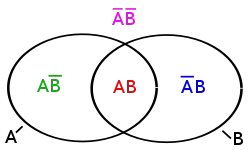

```{r include=FALSE}
knitr::opts_knit$set(root.dir = '06_session/')
xfun::pkg_load2(c("htmltools", "mime"))
remove(list = ls())
```

# Basic Probability Theory
## Repetition

We talked about it before, but to be sure, that we are on the same page, here are some repetitions of some of the concepts we have already introduced. We will meet them in the progress of this chapter.

### Population and sample

We already learnt the differentiation between the population and the sample. The **population** is the amount of all things that might be relevant for our analyses, or in other words, those objects in the real world about which we would like to make a statement with our statistical analyses. Quite often, the population cannot be analysed directly. From a practical point of you, this might be, because such an analyses would be too expensive. In archaeology, we do not have access to the full population of e.g. objects, because most of them have disintegrated over time.

In such a situation, instead of investigating the full population, we take a **sample** of the population. Under ideal circumstances, we select our sample according to some controlled criteria, most often represent activity (in archaeology, quite often we take everything that we can get access to). 

The difference between sample and population is important. Realistically, we can only make statements about the sample. So we never know, if in the population there might be one or more individuals, they are totally different from those that we have sampled. But given some credible assumptions about the selection process of our sample, we can guess (or better measure) the probability that our sample represents the population well. In the end of the chapter you will know, how do use can be done.

To make quantifiable statements about our population  (or our sample), most of the time we will talk about **parameter**. These parameters are numerical representation of features of objects, or collections of objects. In case of the sample, we can measure these parameters directly. In case of the population, we cannot do this. Nevertheless, also the population has a fixed value for each individual parameter that we could measure on our sample. Here, we have to believe that there is a reality independent from us (or any other observer). Sold the parameters of the population represents real, fixed numbers, although we do not know them, and even if it is impossible to know them at all.

In many statistical tests, we measure a parameter of sample, and then estimate our uncertainty, if the value measured would fall within a certain range of possible parameter values of the population. So essentially, we are building a bridge between our sample and the population. Our building material consists of probability theory. But from what has been said, it is clear, that the quality of our statement about the population (and its parameters) show me depends on the selection of the sample (and it's representativity).

### Null hypothesis

We also learnt the concept of the **null hypothesis**. Here, instead of proving our statement about the population, we are testing with the sample how likely it is, That's the contrary of our original assumption (this contrary is the **alternative hypothesis**) is wrong. For example, for a specific parameter in the sample (e.g. the mean), we estimate how likely it is, that the sample with the specific parameter (the meaning of the sample) would come from the population with totally different mean value. Or, in the case of the Chi-Square test, how likely it is that the distribution of our values within the sample could come from a population, where the categories are independent from each other, just by random chance.

If you are still uncertain, if you fully understand this concept, I would suggest that you have another look at the previous chapter.

## The concept of probability

The concept of probability has to be differentiated between the "common sense" version and the scientific concept. In everyday life, we constantly use probabilities to express our assumptions about the world. If it rains, before you started reading this chapter, probably it is still raining. And you are very likely aware, did you learning result will be probably not as good as it could be, if you don't do your homework. You will have a feeling about the likelihood of these probabilities, but this is subjective, and you will probably not be able to express that in numbers.

But most of the time, these probabilities are not very specific. To make probabilities useful in a scientific environment, we have to be able to quantify them. For this reason, the statistical concept of probability is based on mathematical probability laws. These laws come from thought experiments or analyses of random trials. Such random trials depends on the idea, that they are (in principle) eternally repeatable operations, and that their result is (in principle) not predictable in the individual case. In that sense, you could say, that the mathematical principles of statistics resemble gambling. And a lot of the basic theory was indeed developed in the context of gambling. It might be very beneficial, if you have the ability to estimate how likely you will win a game of cards choosing one strategy or the other.

Of course, if you roll a dice, or you draw a card from a mixed set of cards, the result is already determined: The laws of physics or the order of the cards in the deck determine, what number of the dice will show, or which card you will draw. But the actual result depends on so many independent influences, that it is nearly impossible (and with that impossible enough) to predict the individual case.

The same is true for parameters of a population of objects, or the values within the sample: of course, these values are fixed and existent in the real world independent from the observer. But since the actual manifestation depends on so many influences and effects, that for us the values seem to be random. That is why we can use the same logic to estimate the best gambling strategy and to estimate the mean rim diameter of Neolithic pottery from a specific site. In both situations, you try to predict an unknown value or quantity using known values within a certain framework of parameters, and try to estimate your certainty (or probability of error). Kolmogorov, we already know from the Kolmogorov-Smirnov test, has developed a definition which is the foundation of today's probability theory. Before we come to that, at first we have to understand some principles of set theory (Mengenlehre), related to probability theory, and some notations from that. For this, we use one of the classical examples: rolling the dice multiple times.

### Some Notations and Definitions

If you roll a dice (for pen and paper role players, we are talking about a W6), the result of an individual might be for example 5. This is called an *elementary event* (or also *atomic event*, although no nuclear fission is involved, or *sample point*). The name refers both to the process and its result. In german it would be called "Ereignis". This is the result of one actual trial, it is the realised result out of a range of possible results.

The possible results in the case of the dice (again, dear old players, we are still talking about the W6) are one, two, three, four, five, six. These possible results are called *event space*, or *sample space*. Quite often, you find the greek letter Omega ($\Omega$) as the symbol representing this sample space. In our case, you could also write that as follows:

$\Omega = \{1,2,3,4,5,6\}$

The notation above describes, the Omega consists of the set ("Menge") of the numbers from 1 to 6. Also, if we consider the results of different dice rolls in one go, they also can be understood as a set of values. Here, we are free to assign a symbol of our choice. E.g. like this:

$A = {2,4,1,3,5}$

There are some more symbols in set theory and the respective notation that might be of relevance here. In the table, I'll give you some examples, and I hope, with this practical representation you will be able to understand, what is going on here:

| | |
|-|-|
| Set A={1,2,3,4}; Set B={4,5,6}; Event space Ω={1,2,3,4,5,6} ||
| 1 is an element of set A | $1\in{A}$ |
| C is the union of A and B {1,2,3,4,4,5,6} | $C = A \cup B$ |
| D is the intersection of A and B {4} | $D = A \cap B$ |
| E is A minus B {1,2,3} | $E = A - B$ |
| Not A (=event space - A) | $\bar{A} = \Omega - A = {5,6}$ |
| The intersection of D {4} and E {1,2,3} is the empty set | $D \cap E = \emptyset$|

The symbol $\in{}$ describes membership. The union $\cup$ combines all elements from both involved sets. The intersection $\cap$ takes only those objects, that are represented in both sets. If you substract one set from the other, you remove all the elements from the first set that are present in the second set. The specific definition of a set is the qualifier "Not", most of the time expressed as a bar above the symbol. This refers to everything else in the event space except for those objects that are in the negated set. The last important set is the empty set $\emptyset$, that consists of zero elements.

With this notation, now we have everything at hand so that we can talk very precise (science!) about possible results of the dice roll, add about all other possible random variables. We will use this knowledge now to calculate probabilities.

### Classical Probability Definition by Laplace

The very basic and classical definition of probability comes from Pierre-Simon Laplace (1749--1827).It states that the probability for a specific set of events (positive events) is calculated by dividing the number of possible outcomes with these positive events by the total number of all possible events. Or expressed in formulas:

$p(A) = \frac{Number\ of\ positive\ results}{Number\ of\ possible\ results}$

The resulting number is also the relative frequency of this positive results. Let's explain that with our dice example.

To win the game, we have to throw a six. How likely is that?

$A=6 , Event\ space=\{1,2,3,4,5,6\}$

The number of possible results in our event space is 6. With a dice there's only one way to roll the number 6, the positive result in our example.

$p(6)=\frac{1}{6}=0.1667=16.67\%$

All other results do not represent our positive result. Given our knowledge about the notation from above, we can also express it like that:

$p(\bar{6})=p(\Omega) - p(6) = 1 - \frac{1}{6} = \frac{5}{6} = 0.8333 = 83.33\%$

So there is a probability of 16.67% to win the game, and the probability of 83.33% to not win the game. With this, we have already used intuitively most of the Kolmogorov axioms. Let's dissect that a bit, and then come to the formal definition.

In the random experiment, but also in the real world, if we have a result, all the time something must have happened. So the probability, that anything happened, irrespectable of the specific result, it's always 100%. Or, a bit more formula, the probability of the event space is always 1.

$p(\Omega) = 1$

This also can be called the *safe event*: it is safe to assume, that this will happen. The safe event is the event with 100% probability.

$p(A) = 1$

$p(this\ is\ a\ statistics\ course) = 1$

If it is impossible, that the specific event might occur, then it has zero (0%) probability:

$p(A) = 0$

$p(here\ you\ can\ learn\ something\ about\ knitting) = 0$

And event itself, and its negation represents *complimentary events*:

Without physical tricks a dice roll always has a number as result. No matter, what it actually is, with normal dice its probability is 1/6

$p(6)=\frac{1}{6}\rightarrow p(A)=\frac{1}{6}%$

Rolling not this specific result is the complimentary event of rolling exactly this result:

$p(1...5)=\frac{5}{6}\rightarrow p(\bar{A})=\frac{5}{6}%$

With a normal dice, you always will roll a number as a result. The likelihood of this number will be always 1/6, because there is only one way this result (out of six possible results) could be the outcome. Not getting a specific number as a result, in the case of the dies, as always the probability of 5/6. There are five ways to get a different result from this specific one. So the result and its complimentary result describe the whole event space, and its combined probability is therefore 1.

$p(A) + p(\bar{A}) = 1$

Since the probability of an event and its opposite is always 1, you can calculate one from the other.

Let's switch the example to test this out:

A card game has 4 colors (diamonds, hearts, spades, clubs).

The probability to draw a heart card is 1 out of 4: 0.25

The probability of not drawing a Heart card is 3 out of 4: 0.75,
or 1 - (1 out of 4): 1-0.25 = 0.75

### Kolmogorovs probability axioms

Now let's have a look to the formal representation of the Kolmogorov probability axioms:

#### 1. axiom

Each event from the event space is assigned a number p(A), which describes the probability of the event. This is between 0 and 1.

$0 \leq p(A) \leq 1$

This means, for every possible event we express its probability with numbers ranging from 0 to 1.

#### 2. axiom
The safe event has the value one.

$p(E) = 1$

This means, that if we know something must happen in this way, then its probability is 100% or 1.

#### 3. axiom
For pairwise disjunctive events, i.e. those that do not have an intersection
(e.g. {1,2} and {3,4}), the probability for their union is the sum of their individual probabilities.

$p(A_1 \cup A_2 ... \cup A_n) = \sum_{i=1}^n p(A_i)$

This means, that four sets to do not include the same members, the unified probability will be the sum of the individual probabilities. Not only in the case of the complimentary event, but in every situation where we talk about disjunctive events.

So, in the case of our dies, one probable set of outcomes A (one way to win) might be 1 & 2, the second B (another way to win) with 3 & 4.

e.g. $\Omega = \{1,2,3 ,4 ,5,6\} , A=\{1,2\}, B=\{3,4\}$

Given that, the total probability of winning the game in one way or the other can be calculated as the sum of the individual probabilities of one way of winning and the other.

$p(A) = \frac{2}{6}, P(B) = \frac{2}{6}, p(A \cup B) = p(A) + p(B) = \frac{2}{6} + \frac{2}{6} = \frac{4}{6} = 66,67\%$

All of this seems to be quite complicated ways to express quite common sense concepts. But you will see, as soon as we leave this very basic ground, that is very defined expression makes sense. This is especially true, when it comes to conditional probability and composite, repeated events. Here, quite often the commonsense understanding of probability has its limits.

### Conditional and independent events

In estimating total probabilities, it is very important to distinguish between situations, where the results are independent from each other, from those, where the result of the first changes the probabilities of the second result. For independent results, we can stick to our example with the dice. Rolling a dice once does not change the probabilities of individual results from the second dice roll. In case of individual independent results, the total probability of a set of results is calculated by multiplying the individual probabilities.

Therefore the probability is to roll first a 5 and then a 6 is calculated like so:

$p(A \cap B) = p(A) * p(B) = \frac{1}{6} * \frac{1}{6} = \frac{1}{36}$

You can also understand that in a way, that after we have drawn the 5 out of our bag of possible numbers in the first random trial, we have put it back into the bag of random numbers. But what if, when we have an event, this is not longer available for further trials?

Here is an experiment (after Dolić): A (non-transparent) bag with a chocolate biscuit, a sugar biscuit and an eco biscuit. How likely is it to get out the chocolate biscuit first and then the eco biscuit?

It is wrong to assume, that we can use the same strategy like above: $p(choco\ than\ eco) = p(choco) * p(eco) = \frac{1}{3} * \frac{1}{3} = \frac{1}{9}$

because after the chocolate biscuit's out, there's only two biscuits left
$p(eco\ if\ choco) = \frac{1}{2}$

That's why: $p(choco\ than\ eco) = p(choco) * p(eco\ if\ choco) = \frac{1}{3} * \frac{1}{2} = \frac{1}{6}$

First, it is necessary to calculate how likely it is to get out the chocolate biscuit. Here, we are still on safe ground: This first probability acts like in the case of the dice. But for the second trial, we have to calculate the probability of getting the eco biscuit, if we have already taken out the chocolate biscuit. Since now our event space consists only of two possibilities, it is 1 out of 2. Having figured this out, now we can multiply the probabilities.

A more general definition of this is the **axiom of (conditional) probability**, as also defined by Kolmogorov:

$p(A \cap B) = p(A) * p(B|A)$

This means, that we can calculate the total probability of A and B by multiplying the probability of A and the probability of B given A. Or, if we like to reformulated:

$p(B|A) = \frac{p(A \cap B)}{p(A)}$

The (conditional) probability of B given A is the total probability of A and B, divided by the probability of A. You might find this definition in some textbooks.

### Addition law of probability

This axiom of (conditional) probability helps us to make the third axiom more general. It gives us the tools to calculate probabilities in situations, where we don't have mutual exclusive events.

Let's introduce this using a set of cards. The set contains 32 cards of for colors [ace (Ass), king (König), queen (Dame), jack (Bube), 10, 9, 8 and 7 in all four suits (clubs ♣, spades ♠, hearts ♥ and diamonds ♦)].

First let's calculate how likely it is to draw hearts card using our knowledge:

32 cards, 1/4 is hearts (8)

$p(A) = \frac{8}{32}$

$p(A) = \frac{1}{4}$

Or similarly, how likely it is to draw a queen:

32 cards, 4 queen

$p(A) = \frac{4}{32}$

$p(A) = \frac{1}{8}$

That's easy isn't it? But now let's assume, that Queen and hearts are trump cards. How likely is it to draw a trump card? We cannot simply multiply nor add up the probabilities, because they are not mutually exclusive.




Imagine come out that in this image A represents all the hearts, and B represents all the Queens. The Queen of hearts is present in both sets. When calculating the probability of this combination, we have to consider this fact.

So, drawing cards, how likely is it to draw a trump card (queens and hearts are trump)?
32 cards, 4 queen, 8 heart, one queen of hearts

First, we have to calculate the probability of drawing hearts, then we have to calculate the probability of drawing Queens. Since the Queen of hearts is present in both sets, we have to remove one of occurences or better, its probability.

$p(A) = \frac{1}{4}$; $p(B) = \frac{1}{8}$; $p(A \cup B) = p(A) + p(B) - p(A \cap B)$

$p(A \cup B) = \frac{1}{4} + \frac{1}{8} - \frac{1}{32} = \frac{11}{32} = 0.34375$

This, we have developed the general addition law of probabilities:

For all possible combination of events:

$p(A \cup B) = p(A) + p(B) - p(A \cap B)$

With both, the conditional probability and the addition law of probability, it becomes clear that to calculate probabilities we have to find a way to count possible outcomes. This is the field that is called combinatorics. Luckily, there are only a few possibilities. Actually, there are only two factors that can change the set up of such random experiments: If the order is relevant, or, if we have independent trials 

## Combinatorics

To calculate how many possible outcomes an experiment has is rather easy for the individual trial. But if the total probability consists of multiple events, then it is of importance holders events are combined.

In essence, it boils down to the question, how many possibilities are there to select k elements from n elements? The following table gives you an overview of the possibilities and also shows, how the number of possibilities are calculated in this situations:

||Variation (with respect to order)|Combination (without respecting the order)|
|-|-|-|
|with 'putting back'; with replacement| $n^k$ | $\frac{(n+k-1)!}{k!*(n-1)!}$ |
|without 'putting back'; without replacement| $\frac{n!}{(n-k)!}$ | $\frac{n!}{k!*(n-k)!}=\binom{n}{k}$ |

Let's illustrate these possibilities with a few examples:

### How many possibilities are there to combine 2 dice results?

$\Omega = \{1,2,3,4,5,6\}; n(\Omega) = 6; number\ dices\ k = 2$

We have already figured out, that with the dice the probabilities do not change: We are dealing with a situation with replacement. Now we have to decide, if the order matters to us. This might be especially true, if we talk about a board game.

$B^{k=2}_n = \{(x_1,x_2) | x_i \in \Omega\}$

So, we have the situation with putting back and with respect to order ($x_1, x_2$). This situation, we calculate the number of possible outcomes by putting the number of possible events to the power of the number of trials.

$n(B) = n^k = n(x_1) * n(x_2) = n(\Omega) * n(\Omega) = 6*6 = 6^2= 36$

Therefore, the Probability for a 6 in the first roll and a 5 in the second is: $p(x_1=6, x_2=5) = \frac{1}{6^2} = \frac{1}{36} = 0,0278= 2,78\%$

### How many possible unique Lotto tickets (6 of 42) are there?

$\Omega = \{1,2,3...,42\}, n(\Omega)=42, number\ draws\ k = 6$

We have to numbers from 1 to 42, so the size of our event space is 42. There are six numbers drawn, it does not matter in which order. But the numbers are not being put back, so we deal with no replacement.

$B^{k=6}_n = \{(x_1, x_2,...,x_6)|| x_i \in \Omega | (x_1,...x_{i-1}) \}$


```{r echo=F}
options(scipen = 999)
```

This situation, we have to use the formula in the lower right cell of our table. You can see a lot of !'s in this formula. This exclamation mark means "[factorial](https://en.wikipedia.org/wiki/Factorial)". In mathematics, the factorial of a non-negative integer n, denoted by n!, is the product of all positive integers less than or equal to n:

$n!  = 1 \cdot 2 \cdot 3 \cdots (n-2) \cdot (n-1) \cdot n$

So, in the case of factorial 6, this translates to:

$6!  = 1 \cdot 2 \cdot 3 \cdot 4 \cdot 5 \cdot 6$

The whole expression has a specific name: it is the [binomial coefficient](https://en.wikipedia.org/wiki/Binomial_coefficient). To calculate the binomial for our situation, we just have to fill in our values.

$n(B) = \frac{n!}{k! * (n-k)!} = \frac{42!}{6! * (42-6)!} = `r choose(42,6)`$

It's a rather high number. It's a bit more than half of the population of Switzerland. That means, if everybody in Switzerland would play lotto with a different set of numbers, only 1 to 2 persons would get it right.

Therefore: Probability for 6 correct numbers: 

$p(6_{right})=\frac{1}{`r choose(42,6)`}=`r 1/choose(42,6)`=`r 1/choose(42,6) * 100` \%$

```{r echo=FALSE}
options(scipen = 0)
```

This now is a rather small number. It means, you as an individual have a rather low chance to win a jackpot. Probably it's better to continue learning statistics to get a job. Even an archaeology the chances are better to make a living from it.

## Law of large numbers

No we have all the tools to calculate probabilities of different settings. It probably will not help us to win the jackpot. Even with the best statistical tools that, it is impossible to predict an individual outcome from a random experiment. Hence it is a random experiment. Of course, with your first game of lotto you might win a jackpot against the odds.

Also, if we would like to predict the mean result of the dice roll, the actual result of the individual trial might be very different from our expectation. At least for the first one. Probably also, if we had to dices. But the more dices we have, the closer will be our theoretical mean of the dice rolls to the actual one. Here, we have our bridge from the sample to the population. In this case, the population is the mean of all dices ever thrown. Like with an archaeological population, this is theoretical value that actually could have been observed by an omnipotent observer (omniscience). But we as ordinary mortals have no way of knowing the real value. But it will likely be around 3.5. Our sample all those dices that we actually throw. And we can start estimating the value of the population from our sample. In this case, the larger our sample, the better our estimation. Or more general:

**The larger the sample, the more similar the distribution of sample and population**

Let's add a practical experiment to our thought experiment. Although we will not be able to throw very many dices, we have a computer that can do this for us. We will use at first 10 dices.

```{r}
n_dice <- 10
# the sample command is our random number generator, our dice
roll <- sample(1:6,n_dice, replace=T) 
hist(roll, breaks=0.5:6.5)
result <- mean(roll)
result
```

Since this is a random experiment, at the time of writing I do not know what the result will be. But using the magic of R, I can't implement a little script snippet here so that I can now state the result is `r result`. But still I do not know whether this number is close or far away from all theoretical value. What I know is that if we increase the number of dices, we will get closer. Let's try this out:

```{r}
n_dice <- 100
# the sample command is our random number generator, our dice
roll <- sample(1:6,n_dice, replace=T) 
hist(roll, breaks=0.5:6.5)
result <- mean(roll)
result
```

I am pretty optimistic that this time the value of `r result` is closer to the theoretical value then in the case above. But it does not need to be so. We increase the number of devices again, this time I am pretty sure that we will get close to 3.5.

```{r}
n_dice <- 10000
# the sample command is our random number generator, our dice
roll <- sample(1:6,n_dice, replace=T) 
hist(roll, breaks=0.5:6.5)
result <- mean(roll)
result
```

The more often one throws the dice experimentally, the more similar is the distribution of the sample to the population. There you have it: the value from 10,000 dices is`r result` therefore quite close to the theoretical value. Note also the histogram: the more often we throw the dice, the more regular the histogram will look like.

**The relative frequency of the random results converges against the probability of the random result**

We can visualise this using a slightly different simulation. This time we are not simulating a specific parameters of our distribution, but the relative frequency of an individual result. Theoretically, the probability of throwing a 6 is 1/6. No let's watch how the frequency changes over time if we throw one dice after the other.

```{r , fig.cap = "Simulated dice experiment, the proportion of the number of 6 eyes is plotted, the dotted line shows the probability for 6 eyes."}
n_dice <- 10000

# We roll all devices at the same time
roll<- as.numeric(sample(1:6,n_dice, replace=T))

# Therefore we have to make them iterative
# preparing some variables to gather our results 
list=0
ratio=0

# Now iteratively calculating the relative frequency
for (test in roll)
{
list<-append(list,test,length(list))
ratio<-append(ratio,sum(list==6)/length(list))
}

# And plot...
plot(ratio,type="l",ylim=c(0,1))
abline(h=1/6,lty=3)
```

Since again, this is a random experiment, I cannot guarantee but I am pretty optimistic that the solid line, representing our actual proportion of the number 6, will approach hour dashed line, the theoretical value. Note, that in the beginning we have some wiggles, but the longer of the experiment runs, the smoother and closer to the theoretical value it will get.

The law of the large number is the **bridge from the sample to the population**, it allows statements to be made about the population without knowing it.


## Random variables

### What is random at all?

Are use the term random already several times. As has been explained in the beginning, in a strict physical reality there is no such thing as randomness, except for probably quantum physics (We will not talk about quantum physics in this course!). Also, when you are using the random generator of your computer, still this random process is defined by the state in which the computer is at a given time. We should rather think of random processes as those processes that are either unknown or so complex that their outcome cannot be foreseen by us, but only estimated. A random variable is then the result of such a complex or unknown process. The values of such a random variable then represent the possible outcomes or results of this process. Whether we then really understand this as a random value is more of a philosophical question:

Coin toss: The result of a coin toss is *determined* by different physical laws (throwing force, density of air, gravity etc.)! Since we cannot control these, the result to be considered *random*!

An important step in order to statistically evaluate the results of a random variable is to convert them into the realm of real numbers (recode). In some detours, this is also possible for values that at first sight are difficult to convert into numbers. We will demonstrate this with the example of the coin toss.

### Example for recoding (after Dolić)

A coin is flipped three times. The number of "heads" (H) is noted as a random variable. Possible results:

|coin flip| $x_i$ | $p(x_i)$ |
|-|-|-|
|TTT|0| 1/8 |
|TTH|1| 1/8 |
|THT|1| 1/8 |
|HTT|1| 1/8 |
|THH|2| 1/8 |
|HTH|2| 1/8 |
|HHT|2| 1/8 |
|HHH|3| 1/8 |

In this example, the results of the individual coin tosses are heads or tails. Different sequences of heads or tails, even with the same total number, represent different possible events. The total sample space of our experiment is therefore a result with respect to the order with replacement at the same time. The calculation of the number of possible outcomes therefore follows from our combination table from above and corresponds to the size of the event space for the single experiment (n=2, head or tails) to the power of the number of trials (k=3). 

$n=2; k=3; 2^3=8$

Therefore, each event has a probability of 1/8. If we now look at the number of heads, it becomes clear that we can arrive at the same number of heads in different ways. There is only one possibility of not getting a head on three throws. Likewise, there is only one variation in which we get 3 heads. For one or two heads, on the other hand, there are 3 possibilities in each case.

If the number of heads represents our random variable, we arrive at the following distribution:

$$ f(x_i) =
\begin{cases}
p(x_i=0) = \frac{1}{8}\newline
p(x_i=1) = \frac{3}{8}\newline
p(x_i=2) = \frac{3}{8}\newline
p(x_i=3) = \frac{1}{8}
\end{cases} $$

This distribution is called the **probability density function (PDF)** of our random variable. If it is a discrete (nominal) variable, it is also called the probability mass function (PMF).

Typical properties of such a function are:

**Expected value**: The value that is most probable.

**Dispersion**: The variance of distribution

As with any other distribution function, one can of course calculate Skewness and Kurtosis.

```{r echo=FALSE}
x = c(0,1,1,1,2,2,2,3)
plot(prop.table(table(x)), type = "h", ylim = c(0,1), xlab = "number heads (x)", ylab= "probability f(x)")
```

In addition to this quite intuitively understandable distribution function, there is also the **cumulative distribution function (CDF)**, which is very relevant for many statistical applications. Especially in the area of statistical tests, we will make use of it below.

This function represents the cumulative sum of the probability density function. It answers the question of how likely it is to obtain a certain value of the random variable or a smaller one. In our example: "What is the probability of having up to two heads?"

One important of its properties:

$0 \leq F(x) \leq 1$

F(x) is monotonous not falling. This means that as the value of the variable increases, the probability can never become smaller.

$F(x_1 ) \leq F(x_2 )... \leq F(x_n )$

In the example of our coin toss, this function results as follows:

$$ f(x_i) =
\begin{cases}
p(x_i < 0) = 0\newline
p(x_i \leq 0) = \frac{1}{8}\newline
p(x_i \leq 1) = \frac{4}{8}\newline
p(x_i \leq 2) = \frac{7}{8}\newline
p(x_i \leq 3) = 1
\end{cases} $$

It is obvious that values smaller than zero are impossible. Values less than or equal to zero, on the other hand, have a probability of 0.125 or one eighth, as already in the PDF. Values less than or equal to one have a probability of four-eighths, which is the sum of the probabilities for zero and one head. And so on.

This is what the graphical representation looks like:

```{r echo=FALSE}
x = c(0,1,1,1,2,2,2,3)
plot(1:5,c(0,cumsum(prop.table(table(x)))), type = "S", ylim = c(0,1), xlab = "number heads (x)", ylab= "probability F(x)", xaxt="n")
axis(1, at=1:5,labels=c("≤0", "≤1", "≤2", "≤3", "≤4"), col.axis="red")
```

Now, of course, the question arises, what is the point of all this! How does this knowledge of probability theory help us to better understand statistical tests? We will continue with our example of the coin toss and now develop a statistical test to assess whether it is fair or marked coins that are being played with. Our example will include all the elements of a statistical test, and the procedure is basically transferable to other statistical tests. So we will take a look under the bonnet of a statistical test.

## Building a statistical test from scratch

In this section, I would like to use the knowledge, that we just gained, to build a statistical test from scratch. We will use our tools to estimate, if the coins with which we make our random experiment, are fair or marked. This will give us insight, how was statistical test actually works.

So, our scientific question is: **Is someone playing with biased coins?**

For this, we have to figure out, how one can significantly (error probability 5%) determine that the coins are biased and always show e.g. head?

At first, of course we have to construct our hypothesis and the respective null hypothesis. This could look like the following:

$H_0$: The coins are not biased, the distribution corresponds to the distribution of an unbiased coin toss

$H_1$: The coins are biased, the distribution differs significantly from the distribution of an unbiased coin toss

Let's also assume, that we do not have very much time for this test, so we limit our sample size or the number of throws to 20.

n=20 throws

No, we need a **Rejection range**: the number of heads that is high enough to be sure with a certain probability the coin is biased towards heads. We have to decide, I'll sure we need to be, before we reject the null hypothesis, that the coin is not biased. For this, we stick to the traditional 0.05 significance level. That means, using our axioms, there need to be a 95% chance that rejecting the null hypothesis is a good idea. If the probability of the random occurrence of a result is less than 5%, the occurrence of that event is not random with 95% probability.

Having figured out this, now we have to determine for how many heads results on 20 throws there is the probability 5% or lower, given unbiased coins. Basically, this question can be solved using the probability concept of Laplace:

$p(A) = \frac{Number\ of\ positive\ results}{Number\ of\ possible\ results}$

We have to count the relative frequency of an event (heads). For this, we need:

* the number of possibilities for the positive events (heads) 
* the total number of possible events (total number of possible results of throws of 20 coins)

### Number of possible events

Let's look at some examples, how such random experiment could result:

```{r echo=FALSE, results='asis'}

a <- 1:20
a <- sprintf("%02d", a)

b <- c(rep("T",20))

knitr::kable(data.frame(t(b)), "pipe", col.names=a)
```

There is only one possibility, that we do not have any head in our sample.

```{r echo=FALSE, results='asis'}

b <- c("H", rep("T",19))

knitr::kable(data.frame(t(b)), "pipe", col.names=a)
b <- c("T", "H", rep("T",18))

knitr::kable(data.frame(t(b)), "pipe", col.names=a)
```

If we have only one head, it matters, on which throw this head falls. So there are 20 possibilities for this.

```{r echo=FALSE, results='asis'}
b <- c("H", "H", rep("T",18))

knitr::kable(data.frame(t(b)), "pipe", col.names=a)

b <- c("H", "T", "H", rep("T",17))

knitr::kable(data.frame(t(b)), "pipe", col.names=a)

b <- c("H", "T", "T", "H", rep("T",16))

```

If we have two head, there is much more possibility for variation. Because also here, the order of the results matters, therefore we have to consider the position of the two heads in our sample. We cannot estimate the number of possibilities here by just looking (or at least I can't do that). So either, we have to count it, or we have to calculate it.

```{r echo=FALSE, results='asis'}
knitr::kable(data.frame(t(b)), "pipe", col.names=a)

b <- c("H", "H", "H", rep("T",17))

knitr::kable(data.frame(t(b)), "pipe", col.names=a)
```

With three heads, the possibilities should be even larger, because we have more heads that could take up certain positions in our sample. And this is just beginning: for figuring out, how many possibilities in total there are, we have to repeat this exercise for all possible numbers of head, and then sum them up. Counting them directly will take quite a while, so it is a practical way. Better try calculation!

To calculate the total possible number, we can use our combinatorics table from above. We have already decided that if we have a head, it makes a difference whether it falls first, or second, or so on. I.e. that the order matters to us.

[T,T,H] represents a different case that [H,T,T]

On the other hand, we have to decide whether the probability of the next throw is affected by the previous one. If a coin shows tails, does that change the probability of the next coin to show tails (without replacement) or does this probability remain unchanged (with replacement)?

The answer is: **No**. Chances does not change, so with replacement.

To make things easier, here is the table again:

||Variation (with respect to order)|Combination (without respecting the order)|
|-|-|-|
|with 'putting back'; with replacement| $n^k$ | $\frac{(n+k-1)!}{k!*(n-1)!}$ |
|without 'putting back'; without replacement| $\frac{n!}{(n-k)!}$ | $\frac{n!}{k!*(n-k)!}=\binom{n}{k}$ |

Our choice should be the upper left cell, that is variation with replacement.

$n^k$

We can also build that differently: For the first coin, there exists two possibilities, head or tail. For the second coin, there are also two possibilities, and so on. Each trial is independent from each other, so the probabilities will not change. With two coins, we have four possible results.

[H, H]

[T, H]

[H, T]

[T, T]

That means, for each additional coin we have to multiply the number of possible outcomes (head or tail = two). That means, in a two coin situation:

$2*2 = n^k = 2^2$

And in the three coin situation:

$2*2*2 = n^k = 2^3$

And finally in the 20 coin situation:

$2*2*2*2*2*2*2*2*2*2*2*2*2*2*2*2*2*2*2*2 = n^k = 2^{20}$

Now we can assign our values to the variables:

* 2 possible cases (Heads, Tails) : n
* 20 possible positions : k

**number of possible results: $n^k$ = $2^{20}$ = 1048576**

2 results can be distributed in 1048576 ways on 20 positions

### Number of positive events

Now comes the tricky part: We have to calculate the number of positive events for our set up. Let's start with the easy part: we know already, that there is only one possibility to distribute zero heads on our 20 positions. We also know, that there are 20 possibilities to distribute one head on the 20 positions.

Number of positive events: How many possibilities are there to distribute a fixed number of coins with head to 20 places?

What we have done intuitively in this situation is to change our perspective: the question is now how many possibilities there are to distribute one head to 20 possible positions. This means that there are now 20 possible outcomes (n), but our number of trials is only one (one head, k).

n=20 places, k= cases head

So let's continue off for experiment using these numbers. How many possibilities are there to distribute zero heads on 20 places:

**number of possible results: $n^k$ = $20^{0}$ = 1**

That looks fine. It is the number that we expected from our counting. With this promising result let's continue:

**number of possible results: $n^k$ = $20^{1}$ = 20**

That also looks fine. We expected 20, we got 20. But now, with more than one trial, it becomes difficult. If we have already put one coin on one position, now there are lesser positions available for the next head. With one position filled, there are only 19 other positions open. Also, when we have two coins, in the first place we have also to coins to distribute. For us in the end, both quotes are indistinguishable, but for the number of events the coins matter.

Let's demonstrate that with a more simple example having only three positions and two coins:

| 1 | 2 | 3 |
|:-|:-|:-|
|H1|H2|T|
|H1|T |H2|
|T |H1|H2|
|H2|H1|T|
|H2|T |H1|
|T |H2|H1|

For the first coin, there are three possible options for its position. For the second coin there are only two possibilities left. On the perspective of the final result, the first three lines are identical to the last three lines. But from the perspective of the event number, they represent different events. So in this case, the total number of events including the order could be calculated like that:

$3_{first\ coin}*2_{second\ coin} = 6$

If we want to ignore the order, we have to remove those possibilities that are equivalent to us. Remember the image from the set theory (although it is not perfectly equivalent):


Do union of the number of cases is the number of cases from A times the number of cases from B minus the number, where A and B both a present. Since in the case of the first trial, we have two equivalent coins, we have to divide the number by two. Consequently, we also have to go to divide the second number of cases by one, which in practice does not change the result.

$(3_{first\ coin}/2_{two\ coins})*(2_{second\ coin}/1_{one\ coin}) = 3$

No we can do the same for our 20 coin example:

```{r}
(20 / 1)
(20 / 2) * (19 / 1)
(20 / 3) * (19 / 2) * (18 / 1)
(20 / 4) * (19 / 3) * (18 / 2) * (17 / 1)
```

Actually, this is essentially the same like using the formula from the lower right cell of our combinatorics table:

$\frac{n!}{k!*(n-k)!}=\binom{n}{k}$

Let's try this out in R:

```{r}
n = 20; k = 3
factorial(n)/(factorial(k) * factorial(n-k))
```

We could have gotten here much faster, admittedly, if we would have blindly trust the table. But now you know, why is this binomial coefficient works. You can also sum up all the possible outcomes from k=0 to k=20, to check if our initial calculation of the total number of possible results was correct:

```{r}
n = 20
total = 0
for (k in 0:20) {
  total <- total + factorial(n)/(factorial(k) * factorial(n-k))
}

total
total == 2^20
```

### From counts to probabilities

If you are still with me, then now it is easy to calculate the possible number of events for the different numbers of head. All we have to do is to calculate its value using the normal coefficient.

n = 20 places, k = number heads

Number of positive events: calculated according to binomial coefficient, possibilities to arrange number of outputs in number of throws

No times head: n = 20, k=0: only one possibility

1 times head: n = 20, k = 1: `r choose(20, 1)` possibilities

2 times head: n = 20, k = 2: `r choose(20, 2)` possibilities

3 times head: n = 20, k = 3: `r choose(20, 3)` possibilities

4 times head: n = 20, k = 4: `r choose(20, 4)` possibilities

5 times head: n = 20, k = 5: `r as.integer(choose(20, 5))` possibilities

6 times head: n = 20, k = 6: `r as.integer(choose(20, 6))` possibilities

$\frac{n!}{k!*(n-k)!}=\binom{n}{k}$

One thing by the way: Of course there is an easy way to calculate this using R. The command is `choose()`. Are used it to calculate the numbers above, but we can also demonstrate it directly:

```{r}
n=20; k=3
choose(n,k)
```

```{r, echo=F}
prop_table <- data.frame(
  n = 0:6
)

prop_table$possib <- choose(20,prop_table$n)
prop_table$prob <- prop_table$possib / 2^20
prop_table$cum_prob <- cumsum(prop_table$prob)
```

Finally, we can calculate probabilities! We have the total number of possible results, and we can calculate our positive results. All that is left to do is to use the formula of Laplace:

$p(A) = \frac{Number\ of\ positive\ results}{Number\ of\ possible\ results}$

Number of possible events = $n^k = 2^{20} = 1048576$

```{r echo=FALSE, results='asis'}
knitr::kable(prop_table, format = 'pipe', col.names = c("number head","possibilities",'positive/possible',"cumulative"))
```

Note, that this table there is a column for cumulative. If you want to know, how many ads would indicate a biased coin, we are not interested in the probability of getting exactly the specific number, but the probability of getting this number or less. Therefore, we have to cumulatively sum up the probabilities. This is equivalent to the cumulative distribution function (CDF). Since the probability since the probabilities do not care whether we are looking for heads or tails, if there is only a 2% chance of getting five heads, there is also only a 2% chance of getting five tails. When ever in this situation we observe in our sample, that there are only five or less number of tails present, we can be rather sure that the coins are biased towards heads. There is less than 2% probability, that this situation could come from a random effect.

## The Binomial Distribution

With this example we have developed a statistical distribution on our own. What we have detected is the so-called binomial distribution. This theoretical distributions are shortcuts for the calculation of probabilities. They represent model cases, against which we can compare our sample distribution. For these models it is assumed that your data following certain characteristics and have certain parameters. In case of to be normal distribution, it is a situation where you have two possible outcomes with certain probabilities. To binomial distribution then calculate the probability for the number of outcomes.

The equation for the general binomial distribution is this:

$B_{n;k;p} = \binom{n}{k} * p^k * (1 - p)^{n-k}$

You can see, dead beside our well-known $n$ and $k$, there is also a $p$. This $p$ represents the probability of the positive event, for example the probability of getting heads with a coin flip. In case of a fair coin, $p$ is equal to 0.5. You would assume that there is an even chance for heads and tails. Since the safe event has a probability of 1, if the probability is distributed via between the two options, it should be 0.5 each.

Now, we can directly calculate the probability using this formula: For example 2 Heads, 18 Tails, k = 2, n = 20, p = 0.5

```{r echo=FALSE}
options(scipen = 999)
```

190/1048576 = `r 190/1048576` = $\binom{20}{2} * 0.5^2 * (1 - 0.5)^{20-2} = 190*0.25 * `r (1 - 0.5)^(20-2)`$

```{r echo=FALSE}
options(scipen = 0)
```

If you like, you can compare this number to our calculation by hand from the table above. They should be the same.

Again, in our there is a shortcut for calculating this probability, the command is `dbinom()`.

```{r}
dbinom(6,20,0.5)
```

And also for the cumulative distribution function, in that case it is `pbinom()`

```{r}
pbinom(6,20,0.5)
```

With these functions, now we have something to play with to explore the probabilities of the distribution and also of statistical tests in general. For example, we can plot the probability function, to get a graphical representation of our coin flips:

```{r}
k <- 0:20
probabilities <- dbinom(k,20,0.5)
plot(k,probabilities, type = "h")
```

You can see, that the highest probability is to get 10 heads and 10 tails. The distribution is symmetrical, the smaller the number of heads or tails get the more unlikely this situation will be.

Also, we can plot the cumulative density function:

```{r}
k <- 0:20
cumprob <- pbinom(k,20,0.5)
plot(k,cumprob, type = "h")
```

There is a `r round(cumprob[11]*100)` % probability to get 10 or less heads (or tails).

What you also can do is try out, how different probabilities of getting a head would result. This mean, you can build a model of how biased your coin is, and then try to fit this model to your data. You could also compare different models to evaluate which one is the best fitting. These are advanced statistical procedures, but nonetheless very often takes place in scientific investigations. Although the models might be more complicated than just changing a probability, the general workflow is the same. For now, we will only plot the probability density function for the situation, when a coin has a 70% chance of getting a head.

```{r}
k <- 0:20
probabilities <- dbinom(k,20,0.7)
plot(k,probabilities, type = "h")
```

This case, you can see that the most likely number of heads would be 14.

### The binom.test

Of course, there is also an inbuilt binomial test in R. The test takes the parameters of the number of successes, the number of trials and the probability of success. The result is whether or not the sample is significantly different from the binomial model with that probability. The command is `binom.test()`

```{r}
binom.test(5,20,0.5)
```

The resulting output contains a p-value. As with the other tests before, this p-value indicates statistical significance. In this case, it is statistical significance. Our sample is significantly different from a fair binomial trial. Beyond that, it also estimates the probability of success from the sample. In this case it is 25%. This is equivalent to our number of successes, divided by the number of trials. So with 20 trails, if only a quarter of the results are successes, then there is a significant divergence from the binomial distribution.

Therefore, our rejection range is Number Tails < 6: this results in 95% probability, that something is wrong with the coins. (25% of the tosses)

### Sample size

With our toy model we can also explore the effects of sample size. Let's tenfold the number of trials, and see, what the rejection range would then be:

N=200 throws

```{r}
binom.test(85,200,0.5)
```

In case of 200 trials, we get a significant result already with 85 successes. This represents 43% of the coin flips. This means, that we relatively need much lesser surprise to be sure that there is something wrong. Of course, this is related to the law of the large number: the more trials we have, the more likely the sample distribution is close to the theoretical distribution. There is less influence of random effects.

Here now, the rejection range is Number Tails < 85: this results in 95% probability, that something is wrong with the coins. (42% of the tosses)

To binomial distribution will be the only distribution, that we investigate in this detail. There are other distributions, that are interesting in situations where we have different variables, and deal with different underlying processes. To binomial distribution is helpful for analysing nominal variables and test their distribution according to specific probabilities. Other helpful distributions of examples the normal distribution, in case of metric data, who are influenced by a lot of independent effects. The Poisson distribution can be used for rare events, for example for analysing spatial or temporal distributions of events. There will be an in-depth level in which these distributions will be dealt with in more detail. However, this will not be an exam-relevant part of this exercise. Rather, those who are not directly interested can skip the next chapter and go directly to the parametric tests, in which we also deal intensively with the normal distribution, but for whose understanding the next chapter is not essential. If, however, you are interested in the concept of standard error and the question of the basis on which we can estimate mean values of populations on the basis of samples, what a confidence interval is, the next chapter is recommended, perhaps only in the second reading of this book.
