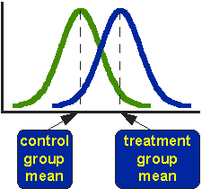

```{r include=FALSE}
knitr::opts_knit$set(root.dir = '07_session/')
xfun::pkg_load2(c("htmltools", "mime", "DiagrammeR"))
remove(list = ls())
```

# Parametric tests

## Introduction

As with nonparametric tests, also for parametric tests the aim is to check whether or not a specific sample can come from a population with specific parameters. But in the case of the parametric tests, most of the time this parameters are more obvious than in the case of the non-parametric ones. For example, if we compare the estimate of the mean of the population from two samples, which is the heart of the t-test, it is quite clear, that we treat this statistical test is a bridge from our sample to the population.

The building material of the speech is in the case of the parametric test more sophisticated. To write this metaphor even further, you could say that this building material is stronger due to technical sophistication, and therefore the resulting bridges are more stable. But only if the building material is solid itself. So there are higher pre-requisites for the selecting for example for the Golden Gate Bridge then for any trail bridge somewhere in the woods.

Also, because we make more assumptions about the population, it is more relevant if the sample is selected in the representative way to make the result of a parametric test valid. So in the interpretation of the results of a paramedic test, even more than in the case of the non-parametric versions, we have to keep in mind that we are using our sample, that is available to us, to estimate characteristics of the population, that is not available for us, especially in the case of archaeology. And also in archaeology especially, since most of the time we are working with a convenience sample, it is difficult to provide building material solid enough for parametric tests.

Nevertheless, because these tests are much more powerful in most cases then their non-parametric counterparts, there is a reason to use these tests. And that is also the reason, why in most natural scientific investigations paramedic tests play the most important role. While in the case of the nonparametric tests, no assumption about the distribution of the sample or the population is made, with parametric tests we make such assumptions and use this added information to come to more precise conclusions. Another possible disadvantage of parametric tests is in the case of archaeology is, that usually they require a higher sample size, then nonparametric tests. But especially, if it comes to metric variables and measured quantities, which we have in the field for example of morphometric's, parametric tests are a powerful tool if used in the right way.

## The parametric in parametric tests

So in the case of the nonparametric tests, we have already explained that these tests do not require parameters of the sample and the underlying population to follow certain distributions or have certain values. With this, you also have already the definition of parametric tests. Here, we assume certain values are distributions to be given in the sample that we are investigating, or actually in the population that is underlying to sample. This assumption is narrow down the possibilities of events, giving us a smaller event space. With this, we can decide more easily if something has a 95% probability or not. In the case of the One Sample tests, most of the time it is assumed that the population **follow certain distributions**. Most of the time, At least understand that realm of statistics that can be applied to archaeology, this might be the so-called normal distribution, that we have learnt already in the chapter about distributions. But for other applications, other distributions might be required. When example here can be the t-test, that we will learn about later on, that requires the data to be normally distributed (among other things).

Especially in the case of the two sample test, often **certain similarities between the two samples** are required, so that the test can be applied. In the case of the ANOVA, variance homogenity is assumed, and it is necessary to contact this analyses in the correct way.

At last, nearly all parametric tests required variables that are metric scaled, so interval or ratio scaled. The reason for this is that most parametric tests use actual calculated parametres from the data, and if these parameters cannot be calculated, because this is not possible with this data quality, of course they do not make any sense. When example here might be DF test, which is a test for variances. As the variance is defined as the deviation from the mean, it can only reasonably be expressed in situations where we can calculate the mean. As we have learnt earlier, the main can only be calculated with metric variables.

This means, that before we can apply an actual parametric test, often we have to determine whether our data quality is suitable for this test in the first place. And if this tests again have pre-requisites, this also might be necessarily checked with another test. From this, quite often cascades of tests emerge. Below, you can see a cascade for the application of the t-test.

```{r, echo=FALSE}
library(DiagrammeR)

grViz("digraph {
      # node definitions with substituted label text
      node [fontname = Helvetica, shape = rectangle]        
      tab1 [label = '@@1', shape='diamond']
      tab2 [label = '@@2', shape='diamond']
      tab3 [label = '@@3']
      tab4 [label = '@@4']
      tab5 [label = '@@5']

      # edge definitions with the node IDs
      tab1 -> tab2[label='yes'];
      tab2 -> tab3[label='yes'];
      tab2 -> tab4[label='no'];
      tab1 -> tab5[label='no'];
      }

      [1]: 'normal distributed?\\nks.test; shapiro.test'
      [2]: 'homogenous variances?\\nf.test'
      [3]: 't.test'
      [4]: 't.test with \\n welch correction'
      [5]: 'Non-Parametric Tests'
      ")

```

There are multiple versions of this kind of decision tree, and you find legions of them in the Internet or in the literature. We will start following the path from this decision tree, to end up with our t-test. At first, we will check for normality, then we will test our data, if the variances are homogeneous, and lastly we will apply the t-test to our data.

---

## Test for normal distribution

There are different ways to test for normality of data. One rather conventional option is the Kolmogorov-Smirnov test, that we have seen before as a 2-sample test for comparing different distributions. And we have learnt, that it is a non-parametric test. Of course, it also can be used to compare the sample distribution to a theoretical one, making it one simple goodness of fit test. But since it is very conservative, we will also use the Shapiro-Wilk test as well as optical representation of normality, namely the QQ plot.

### The good old KS-Test

We will start with the good old Kolmogorov Smirnov test. As an example, we will use a simulated dataset of the length of different silex blades. We are interested in differences of the length between two sites. If between these two sites a significant difference would exist, this could give us information about different production or use strategies that the occupants of the individual sites had in mind when preparing these blades.

We will start with a reduced selection from the actual dataset. Below, you can find the code that you can run to get this selection into the R environment without loading a dataset.

```{r}
blade_length<-c(14.9, 24.0, 8.7, 29.3, 25.5, 23.9, 22.4,
                12.7, 8.7, 25.1, 25.6, 14.7, 23.0, 23.2,
                26.5, 11.1, 15.2, 20.6, 20.1, 25.1)
```

No, we directly can run the Kolmogorov Smirnov test. In the two sample version we have seen that we have at first input the first sample, and as the second input the second sample. In the case of the one sample test, there is no second sample. Instead, here we can give the name of the distribution that you would like to test against. More precisely, here you name the density function of this distribution as you would do if you would like to compute it using R. So in case of the normal distribution, the string that is given a second parameter would be `"pnorm"`. Depending on the distribution, that is used in the goodness of fit test, further parameters might be necessary.  These parameters are the same as you would use to calculate the density function in our. If you are unsure, you can look this up in the respective help files (in our example the help file for pnorm). Normal distribution is defined by the mean and the standard deviation. Of course, we would like to compare our specific sample to a dataset that has the same mean and standard deviation of our dataset (but follows a normal distribution). For this reason, we give us the mean for the normal distribution the mean of our sample, and likewise as the standard deviation for normal distribution the standard deviation of our sample. The resultant command would be this:

```{r}
ks.test(blade_length,"pnorm",mean(blade_length),sd(blade_length))
```

In the resulting output, you can see different things: at first, it is written that is a "`One-sample Kolmogorov-Smirnov test`". Then our dataset is named, then the D value and the p-value are shown as in the two sample case. Here, the P value is 0.42, so the result is not significant. Our distribution does not differ significantly from a normal distribution. Additionally you will see a warning, stating that there should be no ties or "Bindungen" in the data for the KS-Test. This means, that different data should not have equal values. Of course this is true, but we can't do very much about this because these are the data that we have. Nevertheless the result should be okay for the Kolmogorov Smirnov test. This would mean, that we can proceed further and use this dataset for the following tests.

But, as you remember, there are two reasons, why a test might not be significant: Either, the reason is that the differences are really small compared to the null hypothesis, or, the sample size is too small. And in this case, it is quite likely that the sample size is actually rather small. Also, the KS test is known to be a rather conservative test. That means, that the no hypothesis is not easily rejected using this test.

### The Shapiro Wilk test

The KS test represents a general test that can be used in both the one sample and two sample case, and in the one sample case it is also a general goodness of fit test, meaning, that you can test against different other distributions. This makes this test very versatile for different applications. But for normal distribution, there are more specialised tests that can't do much more than testing against normality, but therefore they can do this very well. One of the examples here is the Shapiro Wilk test. Discussed generally has a higher power when it comes to normality check. But this is it's only application, it is not a general goodness of fit test. Normality is what we are interested here in, so let's see how we can apply this test.

#### Facts sheet Shapiro Wilk test

**requirements**: $x_1 ... x_n$ is a independend sample of a metric scaled variable

$H_0$ The population is normal distributed

$H_1$ the population is not normal distributed

Its specific benefits is, that it has good test power also in cases of small sample sizes below 50. Since it is doing only one thing and this thing well, there is not very much that can be customised with the `shapiro.test()`, as it is named in R. Actually, the command does not accept any other parameter beside the dataset that should be tested against its normality, and this dataset should be a numeric vector. So, let's run this test with our blade length selection.

```{r}
shapiro.test(blade_length)
```

You can see, that this test now results in a significant p-value. Well, to be honest, it is just significant. No, we have to decide, if we accept our dataset for further tests that require normality, or if we reject this dataset for parametric tests and apply to non-parametric variant. Here are some rules of thumb: There are problems with a very small and very large sample sizes. In case of very small sample sizes, the Shapiro test performs better. In case of very large sample sizes, Both tests will give you a significant result even if the difference from a normal distribution is very small. There is the other side of the law of the large numbers. If you have very many samples, then statistical test will see already very small differences as significant. This does not mean, that necessarily cannot use the t-test any longer: The t-test is known to be rather robust test against the violation of the normality assumption. Especially, if the sample size is larger than 50, we can ignore more or less significant result.

Our dataset here has a sample size of 20. The full dataset has a sample size of 45, so it will be very close to this 50 border. Also, the test statistic itself does not tell us very much about how the distribution of our sample is different from the normal distribution. For this reason, often it is very helpful to visualise the distribution of our data. We already learnt different methods for doing so. In this case, for example a histogram or a density plot might be helpful, or a box plot. But there is a very specific visualisation especially designed for checking against normality, which we will get known in the next section.

### visual: QQ-plot

The specific plot variant is called QQ plot, named so because it compares the quantiles of the actual to the normal distribution.  But at first, let's visualise the distribution of our values in a conventional way, so that we can better understand what the QQ plot is doing.

```{r}
plot(sort(blade_length))
```

If we plot our values sorted, we can see that there is a gap in the range of the values between 15 and 20. With a normal distribution, you would expect most values near the mean. This is not given here.

```{r}
hist(blade_length)
plot(density(blade_length))
```

This also can be visualised using the histogram or the density plot. In the histogram, the gap between 15 and 20 becomes obvious. Also, it becomes obvious, that there are more values in the higher range of the total value range then in the lower one. The density plot confirms this interpretation, it shows us a bimodal distribution.

```{r}
boxplot(blade_length)
```

The box plot looks fairly normal except for the fact, that the median is shifted towards the higher range of the spectrum, confirming what we already know.

No, let's make a QQ plot and compare it to the plot options that we already had. The command for the QQ plot is `qqnorm()`. There is also a command `qqplot()`, but this is designed to produce a plot for two samples. Also, most of the time you would like to enhance the QQ plot with a line that makes the theoretical position of a normal distribution more visual. For this you use the command `qqline()`.

```{r}
qqnorm(blade_length)
qqline(blade_length)
```

The blooded self has the quantiles of the sample on the Y axis, and the quantiles of a normal distribution with the same parameters like our dataset on the X axis. The line represents, where a true normal distribution would end in this chart. If you see strong deviations from your actual data points in respect to the line, then you have strong deviations from the pattern of normal distribution. In our case, we can see an under representation in the centre of our distribution (the gap) and then an overall presentation of higher values, like we have seen already in the other plots. The lower end of a sample looks rather normal, except for this one outlier. So with this deviation and the test results from the individual tests, this dataset would probably be not suitable for a test that requires a normal distribution. In the following, we will use the full dataset, that follows the same pattern, but has a higher sample size. In this case, the deviations from the normal distribution could probably be ignored.


```{r}
blade_length <- read.csv("blade_length.csv")
shapiro.test(blade_length$length)

qqnorm(blade_length$length)
qqline(blade_length$length)
```


:::{.exercise}
Length of the handles of amphora of type Dressel 10 (Ihm 1978).

The length of the handles of different amphora are given. Test with the appropriate methods if the variable is normal distributed

**file**: `r xfun::embed_file('henkel_amphoren.csv', text = "henkel_amphoren.csv")`

Test for normality
:::

<details><summary>Solution</summary>

At first, we load the data (You will hopefully realise by inspecting the file, that it is a continental CSV file, so that's why we have to load it using the command `read.csv2()`):

```{r}
dressel <- read.csv2("henkel_amphoren.csv")
```

Then, we performed a `shapiro.test()`.

```{r}
shapiro.test(dressel$henkellaenge)
```

Shapiro shows a significant deviation from normal distribution. Nevertheless, we should inspect the pattern visually:

```{r}
qqnorm(dressel$henkellaenge)
qqline(dressel$henkellaenge)
```

There are two outliers in the data. Either, we could switch to nonparametric tests, or, If we can change our scientific question to be answered without these outliers, we could remove them from our dataset. Every time, that we exclude a value in an analyses, we should document this in the paper or manuscript, that this analyses forms a part of.

```{r}
outliers <- c(which.max(dressel$henkellaenge),
              which.min(dressel$henkellaenge)
              )

shapiro.test(dressel$henkellaenge[-outliers])
qqnorm(dressel$henkellaenge[-outliers])
qqline(dressel$henkellaenge[-outliers])
```
</details>

## F-Test

No, that we have decided that our sample is reasonably normal distributed, we can proceed ensuring that other prerequisites are fulfilled. To decide, which kind of t-test we can't apply here, we have to test whether or not we have homogeneity of variance between the two samples. This can be done using the F test. To test for homogenity of variances, there are other alternatives, for example the  Levene's test or the Brown–Forsythe test. These tests perform better, if the normality assumption of the F test is violated. The benefits of the F test is that it's rather simple and easy to understand. So for our introduction here this test might be very suitable.

### Factsheet F Test

F Test for variance homogenity of two samples

**requirements**: two independent normal distributed sample of a metric scaled variable

$H_0$ Both samples have the same variance (dispersion)

$H_1$ Both samples have a different variance (dispersion)

**Basic idea**: if both variances are equal, their quotient should be 1

$$
s_1^2 = s_2^2;\ then\ \frac{s_1^2}{s_2^2} = 1
$$

#### What do these facts mean

The F test tests for homogeneity of variance of two samples. This means, that the checks whether or not the variances of both samples are more or less the same and could come from the same underlying population. Since we are talking about variances, of course we need a data quality of interval or ratio scaled variables. As the variance is defined as the squared mean deviations from the mean, we have to calculate the mean (actually twice). Since this can only be done with metrics scaled variables, it is clear, that this test can only be applied to this kind of data.

Since we are testing against difference in variance, our null hypothesis is that the variances are the same. And here, the test gets very simple, kind of. If the variances would be the same, their division would result in a 1. The value that is calculated by the division of the actual variances from the samples is compared to a threshold, that could be calculated from F distribution (like it's done an R) or could be looked up in precalculated tables (like in the olde days). This threshold depends on the degrees of freedom ( $df_1 = n_1 -1; df_2 = n_2 - 1$ ) and the desired significance level. If the calculated quotient > treshhold, than the $H_0$ will be rejected, otherwise not. This means, that if the test turns out to be **significant**, then we have significantly demonstrated **unequal variances**. If it's not significant, then we have not enough data to decide, if we have homogeneous variances. If the F test is used as a pre-test for the t-test, a result not significant means that we can proceed applying the standard t-test without Welch correction.

### Calculation by hand

We go on with using our example of the blade length of flint blades from two sites. Now, we are using our full dataset. This dataset consists of 45 measurements, while 20 measurements are taken from the blades of the first site, 25 represents the blades of the second site. Since we have to calculate the variance, which is the squared mean difference from the mean, it makes sense to calculate the mean in the first place. If we have done this, we can calculate the variance in the known way (if you do not remember, you might like to look up in the respective chapter descriptive statistics).

$n_1 = 20; \bar{x}_1 = 20.015$

$variance\ s_1^2 = \frac{\sum^n_{i=1}{x_i - \bar{x}^2}}{n-1}=\frac{\sum^{20}_{i=1}{x_i - 20.015}}{20-1}=40.20871$

$n_2 = 25; \bar{x}_2 = 20.492$

$variance\ s_2^2 = \frac{\sum^{25}_{i=1}{x_i - 20.492}}{25-1}=33.0641$

Now, this very simple formula that we have seen before can be applied to our variances. We just divide the variance from the first sample by the variance of the second sample. We take the result And compare it to a tabulated precalculated range of threshold values. Since the threshold depends on the degrees of freedom and our desired level of significance, we needed to decide on that. The degrees of freedom can be calculated by taking the number of cases for each sample substracted with one each. The level of significance is, as always (does it get boring?), 0.05.

$F = \frac{s_1^2}{s_2^2}=\frac{40.20871}{33.0641}=1.216$

$df_1$ = 20−1 = 19, $df_2$ = 25 − 1 = 24; Sign.level=0.05

So if our first sample has a degree of freedom of 19, and our second sample a degree of freedom of 24, and our significance level is the usual 0.05, then we can find the appropriate value in the table, for example in the 'Quantifying Archaeology' book.

threshold at $df_1$ = 19, $df_2$ = 24, $\alpha$=0.05: 2.114

This threshold is bigger than the value that we have calculated. This means, that the F test is not significant here. For us, this means that we can proceed with the standard t-test for our dataset. It also means that the variances in our samples do not significantly different from each other. Remember, that this does not mean that the sample variances are significantly the same.

### F-Test in R

You can now download the full blade length dataset using the following link:

`r xfun::embed_file('blade_length.csv', text = "blade_length.csv")`

The rest is rather simple and straightforward in R. All you have to do is to use the command for the F test, which is `var.test()`. Here, you have the option to specify the two samples as to input vectors. But you also can use the formula notation which is in many cases much more intuitive and handy, once you have got accustomed to it. So in this case, we want to test the variances of the `length` from our dataset `blade_length` in relationship to the variable `site`. Here you go.

```{r}
var.test(length~site,data=blade_length)
```

The output of the test has many elements that we already know from our calculation by hand. At first, it states that we are using the 'F test to compare two variances'. Then we see the F value that is the same as we have calculated it. Also the degree of freedom for the first and the second sample are computed. Here they are named as numerator and denominator, according to the position of the first and the second sample in the formula for calculating the F value. Then we can see calculation of a confidence interval for the ratio of the population variances. In the case of our blade length dataset, also the F test using R is not significant. No surprise here. This means, that the variances are not significantly different, and we can use the standard t-test.

:::{.exercise}
(logarithmic) sizes of ritual enclosures at the Society Islands
(Example by Shennan)

Given are the (logarithmic) sizes of ritual enclosures in two valleys at the Society Islands.

Please check whether the variances in both valleys are different!

**file**: `r xfun::embed_file('marae.csv', text = "marae.csv")`
:::

<details><summary>Solution</summary>

At first, we load the data (You will hopefully realise by inspecting the file, that this time it is a conventional CSV file, so that's why we have to load it using the command `read.csv()`. I will keep bothering you with moving the target here, so that you get used to check when you load your data):

```{r}
marae <- read.csv("marae.csv")
```

Next, we inspect the dataset.

```{r}
head(marae)
str(marae)
```

So it seems, that in the dataset there are two variables: `size` with the sizes of the enclosures, `valley` encoding to different valleys. Now, we performed the F test using `var.test()`. We will use the formula notation, because I like it. If you don't, you have to take the two samples apart on your own.

```{r}
var.test(size ~ valley, data = marae)
```

It turns out, that the result is not significant. Since we have only 22 cases here, I assume, that sample size place an important role here. Also in this case, it is helpful to visualise the distribution of the data.

```{r}
boxplot(size ~ valley, data = marae)
```

From this, it becomes clear that the core of the data are distributed similarly among our two samples. But valley one have more extreme data. Since the mean is always sensitive for outliers, the variance is too. So if we would have more samples, it can be assumed that the F test would produce a significant result.

</details>


## t-Test

After going through this cascade of tests, finally we arrived at the test that we originally wanted to contact: the test for differences in mean of two samples. In the following, I will demonstrate how the t-test itself works. Be aware: formulas ahead! But don't fear! We will tame them together.

### Facts sheet t-Test (homogenuous variances)

Test for the comparison of the means of two samples.

If the means do differ significantly, it is assumed that both samples come from different population (in the statistical sense).

**requirements**: two independend normal distributed sample of a metric scaled variable with homogenous variances

$H_0$ The populations of both samples have the same mean

$H_1$ The populations of both samples have a different mean

**Basic idea**:
If the means of both samples are within the standard error of the estimations of the mean of the according populations, than both populations could be potentially the same. Else not.

#### What do these facts mean

The t-test is a test for difference in mean between two samples. But it is more than that. We assume in the first place, that the distribution of the values from our population is normally distributed. A ideal normal distribution has the mean and the mode at the same value, or at least very near. That means, that the main is also the most likely value. Lower and higher values are less likely. The more extreme the values get, the more unlikely they become. Such a distribution occur, when many small individual influences are present and shape the distribution of the values from a process. The resulting distribution function from such a situation result in the well-known bell shaped curve of a Gaussian or normal distribution.

A normal distribution is defined by its mean and it's standard deviation, one can estimate with these values how likely value may result from such a distribution. And this comes handy, when one likes to compare two of these normal distributions in respect to their mean. The bigger the difference between the main values of two normal distributed population, the more unlikely it is that they can result from the same process. Or to put it simple: that they are the same.


.caption[source: I do not know any more...]

But there is a second aspect to be considered: how much the distributions vary. With the same distance between the means, a differently large variability of the distributions can lead to differently accurate and reliable differentiation. If we have a small variability, then a small distance between the mean values is sufficient to reliably separate the two distributions. Conversely, if we have a very high variability, then the two distributions overlap considerably more. In this case, the distance between the mean values must be much greater in order to achieve a clear separation. Therefore, a test for the difference in mean values must take three parameters into account: the number of cases, the variability, and only then the actual distance between the mean values of the two samples.


.caption[source: I can not remember, either...]

The number of cases and variability are covered by the standard error. If you have already read the advanced chapter on distributions, you know that the standard error is calculated by the standard deviation divided by the square root of the number of cases. This means that for the same variability, if the number of cases is large, the standard error becomes smaller. This is related to the law of large numbers. Mean values of populations, which is what we are concerned with, can be estimated with greater certainty by large samples. The standard error is expressed in the units of measurement. This is because the standard deviation is in the units of measurement, and is only divided by the unitless number of cases.

From these considerations emerges the formula for the t-test: we relate the difference between the means (our signal for a difference) to the standard error (our measure for the noise in the data). If the difference between the means is large, the resulting value will also be large. Conversely, if the variability of the data is large, the will also be small. 


.caption[source: Guess what...]

We can compare the resulting distribution with a theoretical distribution, the 'Student's t-distribution' (the name is only indirectly related to students, as the ' inventor' of this distribution has published it under the pseudonym ' Student'). Without a statistics programme, pre-calculated tables are used here, as we already know.

### Calculation 'by hand'

Let's try this out by calculating it by hand. Here we again use the data set of the flint blades, for which we found in the F test that the variances do not differ significantly from each other. We have already calculated the mean values for the F test. They are `r mean(blade_length$length[blade_length$site == 'site1'])` with a number of cases of `r length(blade_length$length[blade_length$site == 'site1'])` for the first site, and `r mean(blade_length$length[blade_length$site == 'site2'])` at a case number of `r length(blade_length$length[blade_length$site == 'site2'])` for the second. Also, we have already calculated the variance for both cases: `r round(var(blade_length$length[blade_length$site == 'site1']),5)` for site 1 and `r round(var(blade_length$length[blade_length$site == 'site2']),5)` for site 2.

$n_1 = 20; \bar{x_1} = 20.015 ; s^2_1 = 40.20871$

$n_2 = 25; \bar{x_2} = 20.492 ; s^2_2 = 33.0641$

We start from our considerations and the resulting formula:

$t = \frac{difference\ between\ group\ means}{variability\ of\ groups}$

$t = \frac{\bar{x_1} - \bar{x_2}}{SE_{(\bar{x_1}-\bar{x_2})}}$

We have already calculated the mean values whose difference we want to assess. We now have to divide their difference by the standard error. To make it easier for us mathematically, we change the formula for the standard error so that we can calculate it from the variance. Since the variance is nothing other than the square of the standard deviation, we can replace the standard deviation with the variance when we pull it under the square root.

$SE = \frac{s}{\sqrt{n}} = \sqrt{\frac{s^2}{n}}$

Since we can assume that the variances are equal, we can use an averaged pooled variance. We have to estimate two means, so there result two standard errors for us (Once for the first sample, once for the second sample). We calculate only one variance. That is, we divide this variance by the number of cases in each sample, and add up both resulting standard errors.

$SE_{(\bar{x_1}-\bar{x_2})} = \sqrt{\frac{S^2}{n_1} + \frac{S^2}{n_2}}$

We now calculate the pooled variance by adding up the individual variances. Here we carry out a weighting: according to the number of cases of the individual samples, their variances are to be weighted more or less strongly. To do this, we multiply the respective variances by the number of cases, add them up, and then divide by the total number of cases. In all cases -1, since we are dealing with empirical data, and we normalise to the degrees of freedom.

$S^2 = \frac{(n_1-1)*s_1^2 +  (n_2-1) * s_2^2}{n_1 + n_2 - 2}$

With this, we have our entire toolbox together: we started from a general consideration (the difference in means must be normalised with respect to the variability of the groups). From this we derived a formula, which we then further specified piece by piece. In the end, we have three formulas, where we can insert our values into the last one (the formula for the weighted pooled variance). We then put the result into the formula for the standard error, and with its result we then calculate our t-value.

Actually quite simple in each case, this procedure applies a rule that is very well known in computer science, and not completely foreign to archaeologists either: divide and conquer! When you have a complex problem, you try to divide it into simple problems, which you then solve individually. In the end, you put your puzzle pieces back together and get the complex overall result.

$S^2 = \frac{(20-1)*40.20871 + (25-1)*33.0641}{20+25-2} = 36.22102$

$SE_{(\bar{x_1}-\bar{x_2})} = \sqrt{\frac{36.22102}{20} + \frac{36.22102}{25}} = 1.805517$

$t = \frac{20.015−20.492}{1.805517} = −0,26419$

So, here we have our t-value. As already indicated above, this is to be compared with the 'Student's t-distribution' in order to determine significance. This is calculated via the number of degrees of freedom, and the distribution can then be used to read off the threshold value corresponding to a specific significance level. The number of our degrees of freedom is calculated by adding the number of cases, each -1.

$df = (n_1 − 1) + (n_2 − 1) = n_1 + n_2 − 2 = 20 + 25 − 2= 43$

If we use R, then this value is calculated in R from the distribution. If we do it by hand, we again use the tables in which these values are pre-calculated, for example from the Stephen Shennan book. With the corresponding parameters (df = 43; sig. level = 0.05) we find the threshold value of 2.021. This means that our result is not significant.

Note: for the comparison we use the absolute value of the difference, or the t-value. For the magnitude of the difference, it does not matter whether we subtract the larger from the smaller mean value or vice versa. Mathematically, swapping the samples makes no difference, except that the value becomes positive or negative. I have named the sample with the larger mean value as the second sample in order to make the result of our manual calculation equal to the value that is calculated in R.

There is no significant difference in the means of both samples, which could originate from the same population (statistically speaking). However, this does not mean (even if it is boring by now, but repetition is a drag) that we have proven that they come from exactly the same population. Since the test result also depends on the number of cases, this only means that the difference is not large enough that this could not have happened by chance (with less than five percent probability).

### t-test in R

As is often the case, after this rather long presentation of the background and the calculation by hand, the part showing how we perform this test in R will be quite short and unspectacular. Let's take another look at the core properties of the t-test:

**requirements**: two independent normal distributed sample of a metric scaled variable with homogenous variances

$H_0$ The populations of both samples have the same mean

$H_1$ The populations of both samples have a different mean

This is important in order to be able to interpret the bare number result of a statistical test correctly in R. Always make sure you are testing against the correct null hypothesis!

The actual command for the test is now `t.test()`. This test understands the formula notation, and so we use it. We test the mean values of the lengths of the flint blades (column `length`) depending on where they were found (column `site`). Since the t-test in R (similar to what we already know from the Chi-square test) assumes worst case by default, we must explicitly state that we consider the variances to be equal. This is done specifying the parameter `var.equal=T`.

```{r}
t.test(length ~ site, data=blade_length, var.equal=T)
```

In the result, we see that the p-value of 0.7929 is definitely not significant. In addition, we see many numbers again that we already know from our calculation by hand. On top of that, there is the 95 % confidence interval. This means that with a difference between -4.1 and +3.1 we could not determine a significant difference between the mean values (corresponding to our number of cases and the variance of the data).

:::{.exercise}
Again the (logarithmic) sizes of ritual enclosures at the Society Islands
(Example by Shennan)

Given are the (logarithmic) sizes of ritual enclosures in two valleys at the Society Islands.

Please check whether both valleys are different in respect to the mean sizes of the enclosures!

**file**: `r xfun::embed_file('marae.csv', text = "marae.csv")`
:::

<details><summary>Solution</summary>

If we no longer have the data present in R, we have to reload the data set:

```{r}
marae <- read.csv("marae.csv")
```

Now it is trivial: we execute the command for the t-test with the new data.

```{r}
t.test(size ~ valley, data = marae, var.equal = T)
```

As we have already seen from the box plot, these distributions are very similar. Consequently, the t-test cannot detect any significance differences with regard to the mean values.

I take this opportunity to introduce a useful little feature of the box plot: the notches. These can be used to visually test for differences in this time the **medians** of both distributions (after McGill et al 1978, p. 16).

```{r}
boxplot(size ~ valley, data = marae, notch=T)
```

So we found that the mean (and median) values are not significantly different from each other.

</details>


### Welch-Test (t-Test for inhomogenous variances with welch correction)

If the variances of the two distributions differ significantly from each other, then the normal t-test should not be used. Instead, one can use a variant known as the Welch test. In this case I will not go into the background, the mechanics are very similar to those of the normal test. In R, the differences are also marginal: we only have to omit the parameter for equality of variances.

For demonstration purposes, we use a modified data set of the flint blades data where the variances are significantly different:

`r xfun::embed_file('blade_length3.csv', text = "blade_length3.csv")`

```{r}
blade_length3 <- read.csv("blade_length3.csv")

var.test(length ~ site, data = blade_length3)
```

As a result, we do not obtain a significant result here either: also in the modified data set with unequal variances, no significant difference can be found between the mean values.

The Welch test is therefore more robust than the normal test, it makes fewer pre-assumptions. But this comes at a price (albeit a rather small one): the test strength is somewhat lower than with a t-test, which can assume equal variances. We can demonstrate this with a small simulation: We create two samples of the same size, both are randomly normally distributed. For the second sample we add 0.5 to the normally distributed random value. So we know that both samples should differ in terms of their mean values.


```{r}
A <- rnorm(20)
B <- rnorm(20) + 0.5
```

Jetzt führen wir beide Testvarianten durch:

```{r}
t.test(A,B, var.equal=T)
```

```{r}
t.test(A,B, data=sim_data)
```

In most of the cases (with small sample size), the Welch test will be slightly more unsure (the p-value will be slightly higher) to reject the null hypothesis. 

## Multiple Tests

### The Problem

What I will discuss below is relevant to any kind of statistical test, in fact to any kind of statistical investigation that estimates a probability and comes up with a P value. It can be explained well in the context of parametric tests, but is not limited to them.

Let us imagine that we do not want to compare two groups within a data set, but more. For example, three.  Given are the `r xfun::embed_file('settlements.csv', text = "hypothetical sizes of TRB sites in Schleswig-Holstein by region and wetness")`. One could hypothesise that the size of the settlement depends on environmental factors, for example the moisture of the subsoil. We know, for example, that in wet-soil conditions, at least in northern Germany, unlike in Switzerland, fewer normal settlements and rather, for example, hunting stations have been built. This hypothesis now needs to be tested with our data set (which, however, contains simulated data).

```{r}
settlements <- read.csv("settlements.csv")
{{settlements$wetness <- factor(settlements$wetness)}}
head(settlements)

table(settlements$wetness)
```

Please note the highlighted line. With a recent update of R, a basic setting has changed when loading data. Data representing letters were previously automatically converted to factor variables. Since the update, this is no longer the case. Therefore, this line differs from the code snippet that appears in the practice video. Immediately here, this has no impact, but further down, when we deal with ANOVA and the re-factoring of data, this line is now crucial. In it, we explicitly convert the variable wetness into a factor variable.

If we load and examine the data set, we will find that the category wetness has not two, but three classes (arid, humid, medium). How should we proceed if we want to determine whether the category has a significant influence on settlement size?

The answer that may first come to mind is the following (I'm just assuming): we test for significant differences between the individual classes with a t-test. That is, we test arid against humid, humid against medium, and medium against arid. (Side note: we can easily calculate the number of tests needed by applying the combinatorics rules: we have three possible outcomes, n, and two draws, k, first and second category. The order does not matter. I.e., we would have to calculate the binomial coefficient. The result will be three. Never let an opportunity for a repetition go to waste).

The problem, however, is that each of these tests (with a significance level of 0.05) has an error probability of 5%. That is, we have a 95% chance of correctly rejecting the null hypothesis. Since the individual tests are to be considered independent events, we MUST multiply the individual probabilities to arrive at the overall probability that we do not incorrectly reject the null hypothesis for any of the tests. I.e.: $0.95 * 0.95 * 0.95 = `r round(0.95 * 0.95 * 0.95, 2)`$! (By the way, I explained this somewhat incorrectly in the presentation). If we turn that around, we only have a probability of $1-0.95 * 0.95 * 0.95 = `r round(1 - 0.95 * 0.95 * 0.95, 2)`$ oder $1-0.95 * 0.95 * 0.95 = `r round(1 - 0.95 * 0.95 * 0.95, 2) * 100`$% that any of the tests indicate statistical significance, although the null hypothesis should not actually be rejected.

So what can we do to arrive at a correct result overall?

### p value correction

The simplest possibility is to correct the P values accordingly. There are various procedures for this, which are complex in different escalation levels. We limit ourselves here to the simplest variant, which is also the most conservative (i.e. we play it safe). In this variant, we set the overall probability of error for all tests on the same data set to 0.05, as we would also expect for the individual test. Now we relate this value to the number of tests we perform on this data set. This method is also called Bonferroni correction.

There are only two ways to approach it: either you want to stick to a figure for the significance level of 0.05 for the individual tests. Then one multiplies the P values of the individual tests by the total number of tests performed.

$p_i^* = p_i *n_{tests}$

So if previously the test showed a p-value of 0.02, and we did three tests, we get a new p-value of 0.06. If previously the test had a significant result, it no longer has one when the problem of multiple testing is taken into account.

However, instead of changing our P values, we could also adjust our significance level ($\alpha = 0.05$) according to the test configuration. Then we would not have to carry out three calculations for the individual P values, but only one, in which we calculate a new significance level, which now has to be undercut.

$p_i^* < \frac{\alpha}{n_{tests}}$

In both cases, the result is logically the same.

In R ist, neben anderen Methoden, die Bahn für Ronny Korrektur in der ersten Variante implementiert. D.h., wir können einen Befehl benutzen, in denen wir unsere bisherigen Signifikanzwerte einfügen, und diese werden dann entsprechend der Zahl der Tests korrigiert.

Solution 1, valid for all tests: we correct the p-values, eg. with the In R, among other methods, the Bonferroni correction is implemented in the first variant. That is, we can use a command in which we insert our previous significance values and these are then corrected according to the number of tests.

**Example:** We test 3 groups, therefore we need 3 tests:

* medium ↔ humid: p-value = $`r t.test(size~wetness, subset(settlements, wetness=="medium" | wetness=="humid"))$p.value `$

* humid ↔ arid: p-value = $`r t.test(size~wetness, subset(settlements, wetness=="arid" | wetness=="humid"))$p.value`$

* arid ↔ medium: p-value = $`r t.test(size~wetness, subset(settlements, wetness=="arid" | wetness=="medium"))$p.value`$

```{r}
p.adjust(c(0.2869584, 1.939408e-07, 3.436855e-05), method = "bonferroni")
```

After we corrected the p-values that actually result from the individual t-tests, the first result is not significant (admittedly, it was not before either). This means that we can find statistical significance in the difference between humid and arid conditions and between arid and medium dry conditions. However, no statistically significant difference can be found between medium and humid.

The whole thing can also be done within one run or one command, for which there is the so-called `pairwise.t.test()`. This command does nothing other than compare the individual groups with each other depending on the value of the factor variable, in our case wetness. In addition, you can directly specify a desired P value correction.

```{r}
pairwise.t.test(
   settlements$size,
   settlements$wetness,
   p.adjust="bonferroni")
```

Another possibility is to use a test that is specifically designed for more than two possible groups. We will get to know such a test in the next section.

## ANOVA

The idea of ANOVA (ANalysis Of VAriances) is very similar to that of the t-test. Here too, the variance within samples (groups) is compared with the variance between these groups. The variance between the groups is again determined by the mean value. An ANOVA can only be used if you have a metrically scaled target variable and a grouping variable with more than two values results in more than two samples.

### Facts sheet ANOVA

Analysis of the differences between the mean values of samples from different groups.

If the variance of the mean values of the groups is greater than the variance within the groups, then it can be assumed that the grouping has an influence on the mean values.

**requirements**: one metric scaled target variable (dependent) and one grouping variable (independent)

$H_0$ The populations of the samples have the same mean (within the group variance)

$H_1$ The populations of the samples have a different mean (within the group variance)

Basic idea: If the variance of the means of the samples is bigger than the variance within the sample to a certain degree, than the difference in mean is meaninful

#### What do these facts mean

From the basic description and the information on the key data of the test, it seems that it is very similar to the t-test. And that is no coincidence. The basic idea is definitely the same: the difference between the mean values of the individual samples in relation to the variability within the samples. The main distinction lies in the fact that we are not dealing directly with the difference between two mean values. This is mainly because with more than two values, a difference can no longer be meaningfully used as a measure of distinctness.

$t = \frac{difference\ between\ group\ means}{variability\ of\ groups}$

Instead, this test focuses very intensively on variance. This is where its name comes from. The summed variance within the groups is used as a measure of the variability of the groups themselves. However, the variance of the means of the individual groups in relation to the overall mean is used as the measure of distinctiveness.

$t = \frac{variability\ of\ the\ group\ means}{variability\ of\ groups}$

### Doing Anova by hand

We remember: the variance is calculated by summing the squares of the deviations from the mean. If we are talking about a population mean, then the formula is simple:

$S^2 = \frac{\sum_{i=1}^{n} (\bar x - x_i)^2}{N}$

The upper part in the denominator is also called the sum of the squares, the whole mean sum of the squares (MSS). We will now calculate the mean sum of squares for the individual means of the groups, and divide by the mean sum of squares for the groups. The resulting test statistic is called the F statistic, and it is compared against the F distribution, just as in the F test.

$F = \frac{MSS_{between}}{MSS_{within}}$

Let's approach this with our data set. First we need the mean values. These look like this:

```{r echo=FALSE}
humid <- subset(settlements, wetness=="humid")$size
arid <- subset(settlements, wetness=="arid")$size
medium <- subset(settlements, wetness=="medium")$size

m_h <- mean(humid)
m_a <- mean(arid)
m_m <- mean(medium)

m_t <- mean(c(m_h,m_a,m_m))

mssb <- ((m_t - m_h)^2*length(humid) + (m_t - m_a)^2*length(arid) + (m_t - m_m)^2*length(medium))/
   2

mssw <- sum((humid - m_h)^2 + (arid - m_a)^2 + (medium - m_m)^2)/
   (nrow(settlements)-3)
```

* Humid $\mu_h$: `r round(m_h,2)`
* Arid $\mu_a$: `r round(m_a,2)`
* medium $\mu_m$: `r round(m_m,2)`

Furthermore, we need the total mean value to be able to determine the variance of the group means:

* Total mean $\mu_t$: `r round(m_t,2)`

First, we calculate exactly this variance of the group means. To do this, we subtract the total mean value from each of our groups and square the result. Then we divide it by the sum of the degrees of freedom, since we are dealing with an empirical, estimated value and not with the value for the population.

$MSS_{between} = \frac{\sum_{i=1}^{n} (\mu_i-\mu_t)^2}{n-1}$

If we put in our values (df=2, because we have 3 mean values, less one), we get the following:

$MSS_{between} = \frac{(\mu_h-\mu_t)^2 + (\mu_a-\mu_t)^2 + (\mu_m-\mu_t)^2}{3-1} = \frac{(`r round(m_h,2)`-`r round(m_t,2)`)^2 + (`r round(m_a,2)`-`r round(m_t,2)`)^2 + (`r round(m_m,2)` - `r round(m_t,2)`)^2}{3-1} = `r mssb`$

Second, we need to calculate the mean sum of squares for the variability within the groups. Again for this we determine the mean of the individual variances, this time within the groups.

$MSS_{within} = \frac{\sum_{j=1}^{n}\sum_{i=1}^{n_j} (x_i - \bar{x})^2}{n-n_j}$

Wow, stop! Two sums of signs in a row! Don't panic, we'll quickly take that apart: we have three cases, and over these three cases we have to determine the variances in each case with respect to the means of each of these groups. This is done in the inner summation sign. In the outer sign, these variances are then added together. With three cases, the whole thing can also be written as follows without any problems:

$MSS_{within} = \frac{\sum_{i=1}^{n_h} (h_i - \bar{h})^2 + \sum_{i=1}^{n_a} (a_i - \bar{a})^2 + \sum_{i=1}^{n_h} (m_i - \bar{m})^2}{45-3} = `r mssw`$

Here h, a & m stand for our humid, arid and medium groups respectively. I will spare us all the trouble of writing out the individual measured values here. Practically, it just means that we subtract each individual value from the mean value for each group, square the result and add up the total for all entries. The degrees of freedom result from the total number of cases in our data set, minus the number 3, which stands for the three groups, or the mean values calculated from these groups.

Now we have the mean sum of squares for the mean values of the groups, as a measure of the difference between the groups, and the mean sum of squares for the groups themselves, as a measure of the dispersion of the data as a whole. Now you can relate the two values by dividing the difference between the groups by the difference within the groups.

$F = \frac{MSS_{between}}{MSS_{within}} = `r mssb/mssw`$

With this we have calculated our F value for the Anova. By the way, the whole thing could look like this in R:

```{r}
# Subdivide the data set
humid <- subset(settlements, wetness=="humid")$size
arid <- subset(settlements, wetness=="arid")$size
medium <- subset(settlements, wetness=="medium")$size

# Calculate the group means
m_h <- mean(humid)
m_a <- mean(arid)
m_m <- mean(medium)

# Calculate the overall mean
m_o <- mean(c(m_h,m_a,m_m))

# Numerator, the Mean Sum of Squares of the Group Means
mssb <- ((m_o - m_h)^2*length(humid) + (m_o - m_a)^2*length(arid) + (m_o - m_m)^2*length(medium))/
   2
# Denominator, the Mean Sum of Squares of the within the Groups
mssw <- sum((humid - m_h)^2 + (arid - m_a)^2 + (medium - m_m)^2)/
   (nrow(settlements)-3)

# Final Result
mssb/mssw
```

Well, of course it can also be much shorter in R:

```{r}
summary(aov(size~wetness, data=settlements))
```

As you can see, we find here the values that we calculated by hand. We have not written out the square sums themselves, but we have determined the mean sum of the squares as well as the F value. The decisive factor is of course, as always, the P value, which is listed here under 'Pr(>F)'. We also see three stars at the end, which indicates that we are dealing with highly significant results.

Although there is no table for the ANOVA in Steven Shennan's book, one can be found, for example, [under this link](https://web.ma.utexas.edu/users/davis/375/popecol/tables/f005.html). This shows that with a degree of freedom of 1 (group means) = 2 and a degree of freedom of 2 (within groups) = 42, the threshold value is about 4.08. Our F value is much higher, so even without the computer, it is statistically significant. Admittedly, it is easier with R...

### ANOVA in R, more advanced topics

#### More detailed output and changing the control group

So now we know that humidity is a significant factor in the size of settlements. Let's look at the distribution of the data using a box plot:

```{r, fig.height=5}
boxplot(size~wetness, data=settlements)
```

In fact, this should always be one of the first steps before starting the actual data analysis. It is important to look at the distribution of the data first. Es ist offensichtlich, dass arid hier den Ausreisser darstellt. Das hatte uns ja auch schon der korrigierte t-test gezeigt. Wie aber kommen wir jetzt zu einer Teststatistik, die uns auch das mit Hilfe der ANOVA vorweisen kann?

To do this, you have to fit a model to the values and use it to do an analysis of variances. What exactly happens in the process, not to mention how it could be done by hand, is far beyond our course. It doesn't matter, because we will simply look at the result. To do this, we put the result of the ANOVA into the command `summary.lm'.

```{r}
summary.lm(aov(size~wetness, data=settlements))
```

The first group (arid) is the so called control group. This means, that the others are compared to this group. Therefore, we only see humid and medium in the coefficients. And of the two, arid is obviously significantly different. If we are interested in the differences between medium and other soils, we have to change the control group to 'medium'. However, this is not a separate new test that would require a P value correction. We just run the same test again and change the perspective on the result.

To change the control group, we can reassign the levels for the factor variable. This is done with the command `relevel()`. In this case, however, I do not actually overwrite the original variable, but move the result into the new variable. You don't have to do this, but it is an additional possibility. In the command itself, I enter the factor value that I want to use as the new control group as a parameter. All analyses are then carried out with reference to this group and its properties.

```{r}
wetness.new<-relevel(settlements$wetness, ref ="medium")
summary.lm(aov(settlements$size~wetness.new))
```

There is a significant difference between the control (medium) and arid soils. However, there is no significant difference compared to the "Humid" group.

#### two-factorial ANOVA

The following can indeed only be a preview, intended to show you the direction in which one can go with ANOVA. Despite the basic simplicity of the procedure, it can be a very versatile tool. For example, one can also analyse the influence of two or more grouping variables, and in doing so, address mutual conditionalities of the variables.

If we are interested in the influence of two grouping variables, we simply begin by visualising. The data set also has a regional allocation of the individual sites. We can also display this by means of a box plot. Since there are quite a lot of regions, this is quite confusing.

```{r}
boxplot(size~regions, data=settlements)
```


Eine Hypothese könnte ja sein, dass sich Feuchtigkeit in unterschiedlichen Regionen unterschiedlich stark ausprägt. An der Küste könnte ein feuchter Untergrund zu anderen Siedlungsprozesse und führen als zum Beispiel im Binnenland. Um das Zusammenspiel von zwei nominalen variablen darzustellen, eignet sich ein so genannter `interaction.plot()`.

```{r}
interaction.plot(
   settlements$wetness,
   settlements$regions,
   settlements$size)
```

Here we have the mean values displayed in relation to the first category, and the second category is indicated, for example, by the line style. By looking at this plot, we can see, for example, whether the values are moving in the same direction in all regions, or whether there are regional differences. Again, admittedly, the amount of regional categories is too high to achieve a satisfactory representation. But one can draw conclusions from the basic arrangement: if the different categories had the same effect on settlement size everywhere, then the lines would all run more or less parallel.

A more detailed analysis allows the two-factor ANOVA. Instead of assuming the dependence of the size only for wetness, we now make the size dependent on wetness and region. Here we now start to think in terms of models. Let it be said that all modelling and are only more complex versions of this reasoning. Now we have to decide whether we assume that humidity and region influence each other or whether both factors are independent of each other. In our example it is clear that the humidity also depends on the region. Therefore, we connect both parameters with a timesign (*). If we assume that the variables are independent, then we only add up their influences and therefore they would be connected by a + in the formula.

```{r}
summary(aov(size ~ wetness * regions, data = settlements))
```

**Notation in the formula**

*: Interaction of the grouping variables are considered

+: grouping variables are considered as indipendent

The result of this analysis shows that size is dependent on wetness, but not on region. Also, the interaction of wetness and region has no significance in influence. This is pretty much the way I simulated this data.

But this is not all. There is a third variant of the ANOVA. In total, the following variants exist:

* **uni-factorial ANOVA**: one independent factor (grouping variable), one dependent variable (measurement). This is the variant that we calculated first and also by hand.

* **two-/multi-factorial ANOVA**: two/multiple independent factor (grouping variable), one dependent variable (measurement). This is the variant that I demonstrated just above.

* **multivariate ANOVA (MANOVA)**: two/multiple independent factor (grouping variable), multiple dependent variable (measurements). Here we can check the effect of several grouping variables on several measured variables at the same time and find significant relationships. This can also be called a shotgun approach, because it is a way of trying to detect large numbers of statistically significant differences as quickly as possible. However, it must be noted that statistical significance is not necessarily scientific significance. Here, too, a significance level of 0.05 remains. Every 20th significant result is therefore a random effect (on statistical average...).

## Summary

We have seen a lot in this chapter. Starting with simple pre-tests for the parametric conditions of more advanced tests, we have come across the t-test and ANOVA, which are statistical tests that can show us differences between groups very well. This is the reason why both tests are workhorses of scientific research disciplines. At the end, ANOVA gave us a little insight into the world of modelling. We will continue with that. In the next chapter we will look at regression analysis. This means that we want to find out how two variables are related to each other. We will deal with simple linear modelling. But this already opens the door to a new world of possible research and analysis methods.
