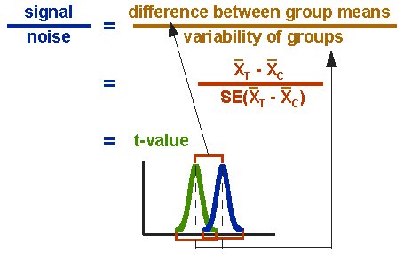

class: title-slide, center, middle

```{r setup, echo=F, error=FALSE, warning=F, message=F, results='hide'}
rm(list = ls())
#options(digits = 3)
Sys.setlocale("LC_MESSAGES", "en_US.utf8")
library(DiagrammeR)
```

```{r, echo = FALSE, results="asis"}
cat('# ', rmarkdown::metadata$title)
```

```{r, echo = FALSE, results="asis"}
cat('## ', rmarkdown::metadata$subtitle)
```

```{r, echo = FALSE, results="asis"}
cat('### ', rmarkdown::metadata$author)
```

```{r, echo = FALSE, results="asis"}
cat('#### ', rmarkdown::metadata$institute)
```

```{r, echo = FALSE, results="asis"}
cat(rmarkdown::metadata$date)
```

.footnote[
.right[
.tiny[
You can download a [pdf of this presentation](smada07.pdf).
]
]
]

---


## Repetition: Population and sample [1]

**Population**

Amount of all items of relevance for an analysis.

**Sample**

Selection of items on basis of certain criteria (e.g. representativity) which will be analysed instead of the population

The difference should always be kept in mind

In archaeology only sampling is possible! The population can never be investigated!

---

## Nonparametric tests

### Parametric vs. nonparametric

**Parametric**: The distribution of the values have to be in a certain form (e.g. normal distribution); assumptions about the distribution of the population are needed

**non-parametric**: no assumptions about the distribution of the sample and the population are needed

### Parametric tests, advantages and disadvantages:

**Advantage**: Tests have general a higher power.

**Disadvantages**: Are generally not appropriate if no statements about the distribution are possible or the distribution fits no for parametric tests.

Also require usually a bigger samples size.

---

## Possible requirements for parametric tests

### Certain distribution

The data must follow certain distributions, i.e. originate from phenomenon of specific kind.

**Example**: t-Test - Normal distribution 

### Certain similarities

The data to compare must be equivalent in respect to certain parameters.

**Example**: ANOVA - variance homogenity

### Certain scale level

Nearly in all cases at least one variable has to be interval scaled or higher

**Example**: F-Test - Test for variances, therefore at least interval scaled

(Deviation from the mean, which can only be calculated in case of interval or higher scaled data)

---
class: middle, center

## Possible test tree

```{r, echo=FALSE}

grViz("digraph {
      # node definitions with substituted label text
      node [fontname = Helvetica, shape = rectangle]        
      tab1 [label = '@@1', shape='diamond']
      tab2 [label = '@@2', shape='diamond']
      tab3 [label = '@@3']
      tab4 [label = '@@4']
      tab5 [label = '@@5']

      # edge definitions with the node IDs
      tab1 -> tab2[label='yes'];
      tab2 -> tab3[label='yes'];
      tab2 -> tab4[label='no'];
      tab1 -> tab5[label='no'];
      }

      [1]: 'normal distributed?\\nks.test; shapiro.test'
      [2]: 'homogenous variances?\\nf.test'
      [3]: 't.test'
      [4]: 't.test with \\n welch correction'
      [5]: 'Non-Parametric Tests'
      ")

```

---

## Test for normal distribution

### The good old KS-Test

eg. length of silex blades (simulated) - normal distributed?

.tiny[
```{r}
blade_length<-c(14.9, 24.0, 8.7, 29.3, 25.5, 23.9, 22.4,
                12.7, 8.7, 25.1, 25.6, 14.7, 23.0, 23.2,
                26.5, 11.1, 15.2, 20.6, 20.1, 25.1)

ks.test(blade_length,"pnorm",mean(blade_length),sd(blade_length))
```
]

Result is not significant, distribution does not deviate significant from normal distribution.

But: KS-test is rather conservative, Null hypothesis (normal distributed) will only be rejected if very strong deviation exists.

---

## Test for normal distribution

### The shapiro.test

The better test for normal distribution

**requirements**: $x_1 ... x_n$ is a independend sample of a metric scaled variable

$H_0$ The population is normal distributed

$H_1$ the population is not normal distributed

.tiny[
```{r}
shapiro.test(blade_length)
```
]

Test is just significant, so the distribution differs from normal distribution.

But: t-Test is rather robust (at least with sufficient sample sice), so we might proceed (but document the result!)

---

## Test for normal distribution

### visual: QQ-plot

Visual control of normal distribution

The quantile of the actual distribution is plotted against the quantile of a normal distribution.

.pull-left[
```{r, eval=FALSE}
qqnorm(blade_length)
qqline(blade_length)
```
]

.pull-right[
```{r, echo=FALSE, fig.height=6}
qqnorm(blade_length)
qqline(blade_length)
```
]

---
class: inverse

## Excercise test for normal distribution

Length of the handles of amphora of type Dressel 10 (Ihm 1978).

The length of the handles of different amphora are given. Test with the appropriate methods if the variable is normal distributed

* 

**file**: `r xfun::embed_file('henkel_amphoren.csv', text = "henkel_amphoren.csv")`

---
class: middle, center

## F-Test

---

## F-Test [1]

### test for variance homogenity of two samples

**requirements**: two independend normal distributed sample of a metric scaled variable

$H_0$ Both samples have the same variance (dispersion)

$H_1$ Both samples have a different variance (dispersion)

**Basic idea**: if both variances are equal, their quotient should be 1

$$
s_1^2 = s_2^2;\ then\ \frac{s_1^2}{s_2^2} = 1
$$

The quotient will be compared to a tabled threshold (eg. Shennan) according to degree of freedom ( $df_1 = n_1 -1; df_2 = n_2 - 1$ ) and the desired significance level.

If the calculated quotient > treshhold, than $H_0$ will be rejected, otherwise not.

Significant: unequal variances

not significant: we can assume homogenuous variances (for further tests)

---

## F-Test [2]

### example blade length

site 1; site 2

$n_1 = 20; \bar{x}_1 = 20.015$

$variance\ s_1^2 = \frac{\sum^n_{i=1}{x_i - \bar{x}^2}}{n-1}=\frac{\sum^{20}_{i=1}{x_i - 20.015}}{20-1}=40.20871$

$n_2 = 25; \bar{x}_2 = 20.492$

$variance\ s_2^2 = \frac{\sum^{25}_{i=1}{x_i - 20.492}}{25-1}=33.0641$

$F = \frac{s_1^2}{s_2^2}=\frac{40.20871}{33.0641}=1.216$

$df_1$ = 20−1 = 19, $df_2$ = 25 − 1 = 24; Sign.level=0.05

threshold at $df_1$ = 19, $df_2$ = 24, $\alpha$=0.05: 2.114

1.216 < 2.114; not significant, the variances do not differ significantly from each other

---

## F-Test [3]

###F-Test in R

`r xfun::embed_file('blade_length.csv', text = "blade_length.csv")`

```{r}
blade_length <- read.csv("blade_length.csv")
var.test(length~site,data=blade_length)
```

Result is **not** significant, the variances are not significantly different

---
class: inverse

## Excercise F-test

(logarithmic) sizes of ritual enclosures at the Society Islands
(Example by Shennan)

Given are the (logarithmic) sizes of ritual enclosures in two valleys at the Society Islands.

Please check whether the variances in both valleys are different!

**file**: `r xfun::embed_file('marae.csv', text = "marae.csv")`

---
class: middle, center

## t-Test

---

## t-Test, homogenuous variances [1]

Test for the comparison of the means of two samples.

If the means do differ significantly, it is assumed that both samples come from different population (in the statistical sense).

**requirements**: two independend normal distributed sample of a metric scaled variable with homogenous variances

$H_0$ The populations of both samples have the same mean

$H_1$ The populations of both samples have a different mean

**Basic idea**:
If the means of both samples are within the standard error of the estimations of the mean of the according populations, than both populations could be potentially the same. Else not.

---

.pull-left[

]

.pull-right[

]



---
## t-Test, homogenuous variances [2]

### Calculation 'by hand'

example blade length

site 1, site 2

.pull-left[
$n_1 = 20; \bar{x_1} = 20.015 ; s^2_1 = 40.20871$
$n_2 = 25; \bar{x_2} = 20.492 ; s^2_2 = 33.0641$

$t = \frac{difference\ between\ group\ means}{variability\ of\ groups}$

$t = \frac{\bar{x_1} - \bar{x_2}}{SE_{(\bar{x_1}-\bar{x_2})}}$
]

.pull-right[

$SE = \frac{s}{\sqrt{n}} = \sqrt{\frac{s^2}{n}}$

$SE_{(\bar{x_1}-\bar{x_2})} = \sqrt{\frac{S^2}{n_1} + \frac{S^2}{n_2}}$

$S^2 = \frac{(n_1-1)*s_1^2 +  (n_2-1) * s_2^2}{n_1 + n_2 - 2}$

$S^2 = \frac{(20-1)*40.20871 + (25-1)*33.0641}{20+25-2} = 36.22102$

$SE_{(\bar{x_1}-\bar{x_2})} = \sqrt{\frac{36.22102}{20} + \frac{36.22102}{25}} = 1.805517$

]

---
## t-Test, homogenuous variances [3]

### Calculation 'by hand'

$t = \frac{20.015−20.492}{1.805517} = −0,26419$

$df = (n_1 − 1) + (n_2 − 1) = n_1 + n_2 − 2 = 20 + 25 − 2= 43$

Looking up in table (eg. Shennan): df = 43; sig. level = 0.05

possible differences bigger - smaller, therefore two tailed question

threshold: 2.021

**not significant**, we can not reject the null hypothesis

There is no significant difference in the means of both samples, the could originate from the same population (statistically speaking).

---

## t-Test, homogenuous variances [4]

Test for the comparison of the means of two samples.

If the means do differ significantly, it is assumed that both samples come from different population (in the statistical sense).


**requirements**: two independend normal distributed sample of a metric scaled variable with homogenous variances

$H_0$ The populations of both samples have the same mean

$H_1$ The populations of both samples have a different mean

.tiny[
```{r}
t.test(length ~ site, data=blade_length, var.equal=T)
```

]

**not significant**, we can not reject the null hypothesis

---
class: inverse

## Excercise t-test

Again the (logarithmic) sizes of ritual enclosures at the Society Islands
(Example by Shennan)

Given are the (logarithmic) sizes of ritual enclosures in two valleys at the Society Islands.

Please check whether both valleys are different in respect to the mean sizes of the enclosures!

**file**: `r xfun::embed_file('marae.csv', text = "marae.csv")`

---

## Welch-Test (t-Test for inhomogenous variances with welch correction)

### If homogenity precondition is not fulfilled

approximation of the results by correction of degrees of freedom

`r xfun::embed_file('blade_length3.csv', text = "blade_length3.csv")`

.pull-left[
.tiny[
```{r}
blade_length3 <- read.csv("blade_length3.csv")

var.test(length ~ site, data = blade_length3)
```
]
]

.pull-right[
.tiny[
```{r}
t.test(length ~ site, data = blade_length3)
```
]
]
---

## Welch-Test (t-Test for inhomogenous variances with welch correction)

### Comparison of test power

Tests with lesser preconditions to the data often have lesser power

```{r}
A <- rnorm(20)
B <- rnorm(20) + 0.5
```


.pull-left[
.tiny[
```{r}
t.test(A,B, var.equal=T)
```
]
]

.pull-right[
.tiny[
```{r}
t.test(A,B, data=sim_data)
```
]
]

In most of the cases (with small sample size), the Welch test will be slightly more unsure to reject the null hypothesis.

---

## Multiple Tests [1]

**The following is important for all statistical tests!**

What, if one compares more than two groups?

Given are the `r xfun::embed_file('settlements.csv', text = "hypothetical sizes of TRB sites in Schleswig-Holstein by region and wetness")`.

```{r}
settlements <- read.csv("settlements.csv")
{{settlements$wetness <- factor(settlements$wetness)}}
head(settlements)
```

Question: Do the sizes of the settlements differ significantly in relation to the wetness?

How to proceed?

---

## Multiple Tests [2]

Intuitive, but problematic answer: We test all groups against each other if there is a significant difference.

*Problem:* The more often we test, the more likely is a significant result 'by chance'.

**Example:** We test 3 groups, therefore we need 3 tests:

medium ↔ humid, humid ↔ arid, arid ↔ medium

The probability, that the alternative hypothesis is wrong even with significant result, is with each test 0.05. With three tests, it becomes 0.15!

With 100 tests, the expectation value becomes 5.0 (meaning, we expect 5 tests to show a wrong positive significance)!

---

## Multiple Tests [3]

### Solution 1, valid for all tests: we correct the p-values, eg. with the Bonferroni correction

The whole sequence of tests is regarded as one test. Therefore, the total p-value should be 0.05. Therefore, we devide for the individual tests the 0.05 by number of tests, to get the p-value for the individual tests.

**Example:** We test 3 groups, therefore we need 3 tests:

medium ↔ humid: p-value = $`r t.test(size~wetness, subset(settlements, wetness=="medium" | wetness=="humid"))$p.value `$
humid ↔ arid: p-value = $`r t.test(size~wetness, subset(settlements, wetness=="arid" | wetness=="humid"))$p.value`$
arid ↔ medium: p-value = $`r t.test(size~wetness, subset(settlements, wetness=="arid" | wetness=="medium"))$p.value`$

```{r}
p.adjust(c(0.2869584, 1.939408e-07, 3.436855e-05), method = "bonferroni")
```

The first result is not significant (admittedly, it was not before either).

---
class: middle, center

## ANOVA

---

## Multiple Tests [4]

### ANOVA: Comparison of multiple groups

dependent variable: the variable to test (here size)

independent variable: the grouping variable (here wetness)

.pull-left[
.tiny[
```{r, fig.height=5}
boxplot(size~wetness, data=settlements)
```
]
]

.pull-right[
.tiny[
```{r}
summary(aov(size~wetness, data=settlements))
```
]

There are significant differences, but where?

]

---

## ANOVA [2]

More detailled result:

We analyse the result as linear model

.tiny[
```{r}
summary.lm(aov(size~wetness, data=settlements))
```
]

The first group (arid) is the control group. The others are compared to this. If we are interested in the differences between medium and other soils, we have to change the controll group to 'medium'.

---

## ANOVA [3]

changing the control group:

.tiny[
```{r}
wetness.new<-relevel(settlements$wetness, ref ="medium")
summary.lm(aov(settlements$size~wetness.new))
```
]

There is a significant difference between the control (medium) and arid soils.

---

## Site note: Overview with multiple t-tests (shortcut!)

```{r}
pairwise.t.test(settlements$size,settlements$wetness,
p.adjust="bonferroni")
```

---

## ANOVA [4]

### two-factorial ANOVA

.tiny[
If we are interested in the influence of two grouping variables

.pull-left[
```{r}
boxplot(size~regions, data=settlements)
```
]

.pull-right[
```{r}
interaction.plot(settlements$wetness, settlements$regions,
settlements$size)
```

]
]
---

## ANOVA [5]

```{r}
summary(aov(size~wetness*regions, data=settlements))
```

**Notation in the formula**

*: Interaction of the grouping variables are considered

+: grouping variables are considered as indipendent

---

## ANOVA [5]

All the flavours of ANOVA

### uni-factorial ANOVA
one independent factor (grouping variable), one dependent variable (measurement)

### two-/multi-factorial ANOVA
two/multiple independent factor (grouping variable), one dependent variable (measurement)

### multivariate ANOVA (MANOVA)
two/multiple independent factor (grouping variable), multiple dependent variable (measurements)

