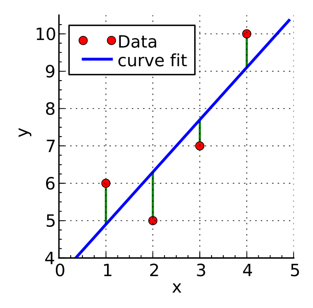

```{r include=FALSE}
knitr::opts_knit$set(root.dir = '08_session/')
xfun::pkg_load2(c("htmltools", "mime"))
remove(list = ls())
```

# Regression Analysis and Correlation

The endeavour to cover regression analysis and correlation within the framework of a lesson, or to put this in a chapter, is quite ambitious. Admittedly. Nevertheless, we will try to present the most important terms and techniques for analysing the relationship between two variables in reasonable brevity. Much of this will certainly have to remain superficial, but I think it is nevertheless very helpful to venture a first insight into this field of research. After all, many techniques and ideas that are used in a simple regression analysis play an important role in more advanced statistical methods, especially in the field of modelling. Here we can now try them out in a predictable and safe context. If this course has whetted your appetite to delve deeper into the topic of statistical analysis, you will already have a few basics to build on.

## What is a regression? Some Terms and Definitions

Regression or regression analysis is a toolbox that contains various statistical procedures and methods with which the relationships between two or more variables can be examined. The basic form is the question of what influence one of the two variables, also called the independent or explanatory variable, has on a second variable, called the dependent or explained variable. Let us try to illustrate this with a diagram:

```{r, echo=FALSE}
muensingen <- read.csv2("muensingen_fib.csv")
```

```{r echo=F}
plot(muensingen$Length, muensingen$FL)
abline(
  lm(muensingen$FL~muensingen$Length),
  col="red")
```

I have deliberately avoided beautifying the axis labels in this diagram so that we can see the variables directly. What is shown here are two measurements of Latène period fibulae found at the Münsingen Rain cemetery, not far from Bern. To be more precise, we see the total length of the fibulae plotted on the X axis, while on the Y axis we find the length of the foot of each fibula. The individual points represent the individual fibulae in relation to their total length and their foot length. We have known this form of representation as a scatter diagram for some chapters. No surprise up to this point.

What exactly do we see here? Firstly, we see two outliers. These are the two points quite far to the right at the top of the chart. Most of the other data points are in the lower left quadrant. Vacant, on the other hand, are the upper left quadrant, as well as the lower right. With a lot of good will, we can say that the data points are more or less grouped around a line running from the lower left to the upper right. To get our imagination going, I have drawn a corresponding line. It looks very suggestive.

The fact that the data points are higher the further to the right we move in the diagram is certainly easy for you to interpret: the greater the length of the fibulae, the greater the length of the fibula feet. Purely from archaeological knowledge, we can easily deduce a connection here: Fibulae follow a certain, predetermined shape. If the fibulae become larger, their feet must also become longer. And this is what we can observe from this diagram.

So we see in the diagram a relationship between two variables: The length of the feet of the fibulae in relation to the total length. In our representation, the total length is the variable that is probably the cause of the change in foot length. At least that is what I have just expressed in the paragraph above. This variable would be called an independent variable, possibly also an explanatory variable. Now what does this variable explain? Well, it explains the development of foot length, our second variable. In our interpretation, this second variable or its values depend on the development of the first variable. With the change in the first variable we can explain the change in the second variable, so it is the explained variable.

Besides the simple fact that there seems to be a relationship here between the two variables, we see more: for one thing, and we have already touched on this, we can see the direction of the relationship. When the length becomes longer, the foot length also becomes longer. So the variable length has a positive influence on the variable foot length. In this context we also speak of a positive regression. We will see other examples in a moment. We can also see that a line describes the relationship with the variable quite well. In addition, on the whole there is a uniform relationship. There is no area where the relationship is reversed. What we can also see is that the points are relatively close to the line. If we know the total length, we can determine with some certainty the range in which the foot length will fluctuate.

Basically, by looking at this diagram, we have already carried out a regression analysis. In the following we will get to know tools with which we can do this even more precisely and, above all, more quantitatively.

In the following, some variations of regression, i.e. possible relationships between two variables, are to be illustrated. I will briefly discuss the individual illustrations below.


The most common form is the so-called linear regression. This is when the data can best be described by a line. The two diagrams at the top each represent a linear regression. The lines, however, go in different directions: in the figure at the top left we see a positive regression, as we also have in the example of the fibulae. Shown here is the relationship between the height of vessels and their rim diameter. The larger the vessel, the larger the diameter of the rim. The figure on the top right represents a negative regression. Here we see the frequency of a certain type of pottery as a function of the distance from the production site of this ware. The further we move away from the production site, the lower the frequency of this type of pottery in excavations in the surrounding area. Generally speaking, one variable becomes smaller as the other becomes larger. Nevertheless, a line can also be found here that describes the relationship between the variables well.

The situation is different in the two examples below. The example on the left shows a clearly more realistic representation of the frequency of a certain type as a function of the distance to its place of origin. At the beginning, the frequency will still decrease very strongly as a function of the distance. After a certain point, however, this decrease will slow down considerably. Although we can also draw a line in here, it is clear that this line would not describe the data very well. Here we would have to draw a curve in the data cloud, which itself also describes a curve, to express the relationship. Nevertheless, we see a dependency here in only one direction: nowhere in the data set can we see the case, at least not in general, that an increase in distance would again lead to an increase in frequency. We are dealing with a monotonic relationship. Finally, it is exactly one value, namely the distance, which has the greatest decisive influence on the frequency.

The example on the right shows the size of a tooth as a function of the age of an animal. If we consider it carefully, we have two processes working against each other: first the tooth grows, accordingly it will also become bigger with age. At the same time, however, the teeth begin to wear down. In the beginning, growth still predominates, but as this slows down over time and eventually comes to a complete stop, wear becomes an ever stronger influencing factor. And once the protective enamel layer is attacked, the wear of the teeth may even accelerate. So here we have two factors working against each other, and the two can be described by the age of the animal, but age itself is not the actual influencing factor. In this case we have a nonlinear non-monotonic regression, the change in one variable depending on the other is composed of several opposing processes that change in strength over time.

A small side note on a certain confusion in the terms may be allowed: although we are talking about non-linear regression at this point, these non-linear regressions can be described and analysed by so-called linear models. This often leads to confusion regarding the notion of linearity. And at this stage, it certainly does not help to bring clarity to you. But fear not, we will clear this up as we go along. It should be said, however, that even such relationships that describe curves that are reproduced in the calculation as a quadratic or cubic function can be investigated with a linear model. The situation is different if we see clear jumps in the development of the values. Then we may be dealing with a context in which certain threshold values cause very strong changes. In this case, non-linear models must be used.

So we have now got to know the concept of regression, and hopefully you have a basic idea of what it means. However, another important term in this context is that of correlation, which you have certainly already heard in various contexts. A correlation indicates that two variables behave similarly. A high correlation means a high similarity. In the two diagrams below we can see examples of a strong and a weak correlation. In the left diagram we have a strong correlation: the individual data points are all very close to each other or very close to an imaginary line. Unfortunately, there is not such a nice suggestive line as in our primer example. To the right we see a much more diffuse, rounder cloud of points. This is a weak correlation. While in the first example a change in weight generally results in a change in the dependent variable, this is not so clear in the right-hand example. One could say that in the left example the weight has a significantly stronger influence on the number of flake scars. In the right-hand example, the influence does not seem to be so dominant, not so determinant. However, one can also take a different perspective: if we know the weight in the left-hand example, we can predict the number of flake scars quite well. The information about the independent variable A gives us a good possibility of predicting the dependent variable B. In the right-hand example, this is not the case. Here we learn relatively little about the number of flake scars for the individual artefacts with the weight. If we know the weight, the value of the dependent variable can move more or less within the entire distribution range of this variable. So we can't make a very accurate prediction.

In the following we will stay with linear regression, be it positive or negative. First we will get to know a tool with which we can describe this relationship ourselves and with which we can calculate such a trend or regression line on our own. Then we will get to know measures and tests with which we can answer the question of how compelling a correlation between two variables is, i.e. correlation. Let's start with something I'm pretty sure you remember from your school days: the linear equation.

## Calculating the regression
### Linear Equation

You should still be familiar with the linear equation from school lessons. We can describe any straight line in a coordinate system by specifying a fixed point and the slope of the line with respect to that point. The easiest way to describe the point is in relation to the Y axis, by simply specifying the value of the Y coordinate of the point exactly where the X value is zero. This gives two parameters: the slope (b) and the value for y where the straight line crosses the y-axis, the intercept (a).

$y=a + bx$

If we only have two data points, then the matter is clear. You can construct exactly one straight line from two points. Therefore, exactly two data points is an excellent way to achieve an unambiguous statistical analysis. But don't think that you can impress your colleagues with this.

However, we will first discuss the unambiguous case in order to proceed from there to the somewhat more complicated variant when we have more than 2 data points. We can calculate the slope in this unambiguous case very simply by relating the difference between the two points in terms of their X and Y coordinates.

$b = \frac{(y_2-y_1)}{(x_2 - x_1)}$

It is clear here that if the upper part of the equation becomes positive, and the lower part just so, that we then have a positive regression. The straight line will increase to the upper left. The upper part becomes positive if the Y value of the second point is greater than that of the first point. In this case, however, the X value of the second point must also be greater than that of the first point. If both the denominator and the numerator of the equation are negative, then the division will be positive, and also then we have a positive regression. However, if one is negative but the other is positive, we will have a negative slope. In any case, we will get a distinct result because only one specific number can ever come out of this equation, no matter where the points are located.

Once we have calculated the slope, we can choose any of the two points to calculate the point of intersection with the Y-axis. To do this, we only have to calculate with the slope how much the Y value has increased in relation to the X value of this point and subtract this additional slope from our Y value of the point. What remains is the Y value that must have existed at X = 0.

$a = y_1 - b * x_1$

If we have only two points, we have thereby calculated the trend line. If we have more than two points and they lie on a straight line, then we can freely select two of the points and perform the calculation with them. Let's do this with an example:

Example: {1,3}, {2,5}, {3,7} ...

We have three or more points here that all lie on one line. We choose the first two to do our calculation. However, we could also use any other pairing for this. Provided that all points lie on one line:

$b = \frac{(5-3)}{(2 - 1)} = 2$

For the first two points we have thus calculated that for each increase of X = 1 Y must increase by 2 units. With this slope we can now calculate the intercept:

$a = 3 - 2 * 1 = 1$

Our line, which is described by the points, meets the Y axis at Y = 1. Thus we have the entire equation of the straight line together.

$y = 1 + 2*x$

As already emphasised several times, this simple way is only viable if all points lie on one line. In reality, however, at least with regard to real measured values, this will hardly be the case. On the one hand, most processes are not in themselves so determinant that a perfect relationship will exist. Mostly, various disturbing influences have to be taken into account. In addition, even with an almost perfect relationship, we will have measurement inaccuracies, so that in reality we cannot simply pick out two points. Rather, we have to take all points into account in order to find a straight line that describes all points at the same time in the best possible way in the relationship of the two variables to each other. There are various ways and possibilities to achieve this. The simplest and certainly the most frequently used (apart from eyeballing and the arbitrary application of a ruler to the point cloud) is the method of least squares.

### Least-squares method (Methode der kleinsten Quadrate)
#### Derivation

If we do not know the exact relationship of the two variables, we have to estimate it from our data points. Surely you have already read the term least squares method in various contexts. In the following we will illustrate how this method works.


.caption[.tiny[https://commons.wikimedia.org/wiki/File:Linear_least_squares_example2.svg]]

The above example shows a possible situation where we have four data points that do not lie on a line. Our goal is to find a line that fits all these data points as best as possible. In other words, this line should pass as close as possible to all data points. This means that the distances between the data points and the line should be as small as possible. For a given X value, the predicted Y value from our linear model should be as close as possible to the Y value of the data point, and this should be the case for all points at the same time. We are not interested in whether the deviation is positive or negative, i.e. whether the line runs above or below the point. What we want to minimise is the absolute distance. We could express this with a formula as follows:

$min\sum_{i=1}^n (y_i - \hat{y})^2$

As in many other situations, disregarding the sign of the distance is achieved by squaring the value. And we are looking for the exact line where the sum of the squared distances of the real Y values from our predicted ones is as small as possible.

Basically, we can use much of the tool that we have already used for the simple two data points case. We first need to calculate the slope, and with this slope we can then determine the intercept. For the slope we have to determine how the Y values change in relation to the X values, i.e. determine the average of the change in the Y values that can be explained by the X values. That is, we must first determine the sum of the changes in the Y values associated with the X values and their change. We then have to divide this sum by the sum of the change in the X values themselves in order to determine the average change in the Y value per change in the X value.

```{r echo=F}
muen_sample <- head(muensingen)[,c("Length", "FL")]
plot(muen_sample)
abline(h=mean(muen_sample$FL), col="green")
abline(v=mean(muen_sample$Length), col="green")
```

But how can we now determine how much the Y values change overall in relation to the change in the X values? In fact, it is not easy to intuitively derive this calculation. It can be worked out mathematically by derivation, but that is an approach we will not take this course. Instead, I can only give you a semi-satisfactory solution below. Through the intuition, hopefully it will still become clear how it works.

First of all, we need a measure that can be positive and negative, because we have positive and negative regression. A negative regression should occur when the values are distributed primarily in the upper left and lower right of our coordinate system, in relation to their mean value. The value should be positive if the points are mainly at the bottom left and top right of the coordinate system.

```{r echo=F}
m_fl <- mean(muen_sample$FL)
m_l <- mean(muen_sample$Length)
muen_sample <- head(muensingen)[,c("Length", "FL")]
plot(muen_sample)
abline(h=m_fl, col="green")
abline(v=m_l, col="green")
text(50,30, "+", cex=5)
text(100,60, "+", cex=5)
text(100,30, "-", cex=5)
text(50,60, "-", cex=5)
```

To demonstrate the effect, however, we now have to resort to a randomly generated data set for the short term. Our real data set is too clearly positive. Therefore, here again is a comparable representation of the randomly generated data set:

```{r echo=F}
ran_sample <- data.frame(Length = runif(6,30,120),
                         FL = runif(6,25,90))
plot(ran_sample)
r_fl <- mean(ran_sample$FL)
r_l <- mean(ran_sample$Length)
rec_col <-(ran_sample$Length - r_l) * (ran_sample$FL - r_fl) > 0
abline(h=r_fl, col="green")
abline(v=r_l, col="green")
```

Now we look at the deviations from the mean for each variable. This time, however, without squaring. That is, we keep the sign. If our point on the 1st variable is smaller than the mean, then a negative value will occur here. Of course, the same happens for the 2nd variable. Conversely, if the value is greater than the mean, then there will be a positive value.

$(x_i - \bar{x})*(y_i - \bar{y})$

And we multiply the corresponding deviations. Now it depends on how the values behave with respect to both variables at a single point. If both are smaller than the respective mean value, we have two negative values. Their multiplication will therefore give a positive value. If both are greater than the mean, both values will be positive and their product will also have a positive value. However, if one of the values is smaller than the mean, but the other is larger, then the product will have a negative value. We can then look at the values for the points accordingly:

```{r echo=F}
plot(ran_sample)
rec_col <-(ran_sample$Length - r_l) * (ran_sample$FL - r_fl) > 0
abline(h=r_fl, col="green")
abline(v=r_l, col="green")

r_cov <- (ran_sample$Length - r_l) * (ran_sample$FL - r_fl)
rec_col <- r_cov > 0

text(ran_sample$Length, ran_sample$FL, round(r_cov), col=rgb(rec_col,0,0,1), adj = c(-0.1,-0.1))
```

Positive values are coloured in red, negative values in black. The product of the two coordinates can also be understood as area content and represented accordingly. In the following diagram, negative area contents are in grey, positive ones are coloured red.

```{r echo=F}
plot(ran_sample)

abline(h=r_fl, col="green")
abline(v=r_l, col="green")
rect(r_l,r_fl,ran_sample$Length,ran_sample$FL, col=rgb(rec_col,0,0,.25))
```

If we now sum up these areas, we get a value for the total deviation of the individual values from the mean. And this is in relation to both variables. This is called **covariance**. It indicates how both variables vary with each other. Often the covariance is normalised to the number of cases-1 to get an average covariance measure. We do not do that here! Rather, we normalise to the variance of X. 

To explain and illustrate this, we use a slightly different representation: we can take out the individual boxes and put them next to each other. And we can juxtapose them with squares that consist solely of the deviation with respect to the first variable. 

```{r echo=F}

diff_x <- (ran_sample$Length - r_l)
diff_y <- (ran_sample$FL - r_fl)

max_diff_x <- max(abs(diff_x))
max_diff_y <- max(abs(diff_y))

each_space <- max_diff_x * 1.2

x_space <- c(0, cumsum(rep(each_space,nrow(ran_sample))))

extend <- x_space[nrow(ran_sample)+1]

x_start <- x_space[-(nrow(ran_sample)+1)]

dummy <- data.frame(x = c(0,extend),
                    y = c(max_diff_y*-1,max_diff_y))

plot(dummy, type="n", axes=F, xlab="", ylab="", asp=1)

rect(x_start, 0, abs(diff_x) + x_start, abs(diff_y), col=rgb(rec_col,0,0,.25))

rect(x_start, 0, abs(diff_x) + x_start, -1 * abs(diff_x), col=rgb(rec_col,0,0,.25), lty=2, density = 10)

text(x_start[-1]-2, 10,"+")

text(x_start + abs(diff_x)/2, 10, round(diff_x * diff_y))

text(x_start[-1]-2, -10,"+")

text(x_start + abs(diff_x)/2, -10, round(diff_x * diff_x))
```

What we can see is this: if the upper box, i.e. the joint variability, is larger than the square of the deviations of X alone and thus of the lower box, then Y has a stronger deviation than X. A regression line would have to be inclined more than 45°, which would result from a ratio of 1/1. On the other hand, if the upper box is smaller, Y has a smaller deviation and the regression line would have to be flatter than 45°. The sum of the boxes in turn tells us whether we have to derive a positive or negative regression overall for all data points.

Overall, this results in the following formula:

$min\sum_{i=1}^n (y_i - \hat{y})^2 = b_{min} = \frac{\sum_{i=1}^n(x_i - \bar{x})*(y_i - \bar{y})}{\sum_{i=1}^n(x_i - \bar{x})^2}$

In the upper part we see the **covariance**: $\sum_{i=1}^n(x_i - \bar{x})*(y_i - \bar{y})$. This value increases when x and y vary in the same direction.

In the denominator of the equation we see the **variance of X**: $\sum_{i=1}^n(x_i - \bar{x})^2$. We divide the sums of the individual deviations from the mean in each case, and thus normalise the joint variance of X and Y with the variance of X. Depending on the ratio of the variability of X to the variability of Y, we get a different slope for our linear equation. The whole thing yields the answer to the question of how much Y varies in relation to X on average.

With this we have now calculated our slope, but the second thing we need is the intercept. For this we need a point from which we can deduct the slope, according to the calculation we made at the beginning with the simple two-point case. And for this we cannot take any of the points arbitrarily. Here we need another property of the trend line we are looking for: a line that minimises the average distances of the data points must necessarily pass through the point that is determined by the mean value of both the X and Y values. Or to put it another way, the line that best describes all points on average must also contain precisely this average value. This means that we can already assume that our line must go through a point with the coordinates of the mean values of both variables.

This is also because the mean value is defined in such a way that it is the point that is the least far away from all points in the sum of the distances. So if we want to obtain a straight line that also minimises precisely these distances, the mean value is inevitably included.

$a_{min} = \bar{y} - b_{min} * \bar{x}$

So now we can also calculate the point of intersection with the Y axis in addition to the slope. The second part was much easier than the first, wasn't it? But the effort was worth it! Now you can calculate a straight line for each point cloud that describes it as best as possible. You can set up a linear model. And you can do that with a piece of paper, a pencil, and a calculator. Perhaps it is fair to tell you now that R can do this much easier and faster, of course. But before I show you how, let's run through the whole thing again with a practical example, namely our Münsingen data set.

#### Practical example

First we load the Münsingen dataset into our working environment. As usual, please save the dataset in your working directory and then load it.

`r xfun::embed_file('muensingen_fib.csv', text = "muensingen_fib.csv")`

```{r}
muensingen <- read.csv2("muensingen_fib.csv")
```

Now we look at our two variables foot length and total length. For the sake of clarity, we will limit ourselves to the first six data points. We can also determine the mean values of the two variables right away.

```{r}
head(muensingen[,c("FL","Length")])
colMeans(head(muensingen[,c("FL","Length")]))
```

Next, we determine the slope of our regression line. To do this, we use the formula we have just worked out.

$b_{min} = \frac{\sum_{i=1}^n(x_i - \bar{x})*(y_i - \bar{y})}{\sum_{i=1}^n(x_i - \bar{x})^2}$

So we need the covariance and the variance of X, or rather the sum of these values. I show both step by step in the table below for the individual data items (fibulae).

```{r, echo=FALSE}
hmuens <- head(muensingen[,c("FL", "Length")])
hmuens$'FL - mean(FL)' <- hmuens$FL - mean(hmuens$FL)
hmuens$'Length - mean(Length)' <- hmuens$Length - mean(hmuens$Length)
hmuens$'covariance' <- hmuens$'FL - mean(FL)' * hmuens$'Length - mean(Length)'
hmuens$'var(L)' <- (hmuens$Length - mean(hmuens$Length))^2
sum_hmuens <- colSums(hmuens)
sum_hmuens <- c("sum","","","", sum_hmuens[c(5,6)])
knitr::kable(rbind(hmuens, sum_hmuens), format = "pipe")
```

The total covariance is therefore `r sum_hmuens[5]`, while the variance of X (the length) is `r sum_hmuens[6]`. According to the formula, we now have to calculate the ratio between the two.

$b_{min} = \frac{`r sum_hmuens[5]`}{`r sum_hmuens[6]`}$

After all the complicated procedures, this division should not overwhelm us now:

$b_{min} = `r (as.numeric(sum_hmuens[5]) / as.numeric(sum_hmuens[6]))`$

Thus we have calculated the slope of the regression line. We now insert this into the linear equation and use our reference point, the point at which both mean values intersect, i.e. the centre of our point cloud. We have already calculated the mean values above.

$a_{min} = \bar{y} - b_{min} * \bar{x}$

$a_{min} = 44 - `r (as.numeric(sum_hmuens[5]) / as.numeric(sum_hmuens[6]))` * 71$

Thus, the intercept results in the following value:

$a_{min} = `r 44 - (as.numeric(sum_hmuens[5]) / as.numeric(sum_hmuens[6])) * 71`$

Our total linear equation for the regression line is therefore as follows:

$y = `r 71 - (as.numeric(sum_hmuens[5]) / as.numeric(sum_hmuens[6])) * 44` + `r (as.numeric(sum_hmuens[5]) / as.numeric(sum_hmuens[6]))` * x$

A theoretical fibula of zero length would have a foot length of -11.6 mm. For each further increase of the length of the fibula by 1 mm we have to add about 0.78 mm.

```{r echo=F}
plot(FL~Length, data=data.frame(head(muensingen)), ylim = c(0,90), asp=1, xlim=c(0,130))
abline(
  lm(FL~Length, data=data.frame(head(muensingen))),
  col="red")
```

Of course, we do not have to do this step by step in R, but we can insert the columns of our data set into the formula so that the entire values are calculated at once:

```{r}
mm <- data.frame(head(muensingen))
b.min <- sum(
  (mm$FL - mean(mm$FL)) * (mm$Length - mean(mm$Length))
  ) / 
  sum((mm$Length - mean(mm$Length))^2)
b.min
a.min <- mean(mm$FL) - b.min * mean(mm$Length)
a.min
```

And, of course, it also works even shorter. We have used this command before when we produced a corresponding trend line in the graphical representation part and. The command is `lm()`.

```{r}
lm(FL ~ Length, data=mm)
```

Basically, what we are saying here is: Model the foot length as a function of the length in the data set mm. The result is the regression model that we can also use for more advanced investigations. In fact, if you look further into R and modelling, you will find that this command will also play a role in more advanced investigations. You have now had a glimpse into the realm of modelling. Many beautiful flowers bloom in this realm, and there are many exciting things to discover. But we will leave that for another time. In the following, we will deal with the field of correlation. But before that, you are welcome to try out your skills in a practical exercise.

:::{.exercise}
Regression between number of millstones and number of cereal grains (Shennan example)

The number of cereal grains and millstones is given in different Neolithic settlements. Plot the relationship and specify the described regression equation.

File: `r xfun::embed_file('cereal_processing.csv', text = "cereal_processing.csv")`
:::

<details><summary>Solution</summary>
First, of course, we once again load the data set into the working environment. You will certainly quickly notice that it is a ";"-separated data set and that the first column already contains the row numbers.

```{r}
cereal <- read.csv2("cereal_processing.csv", row.names = 1)
```

Next we are supposed to plot the relationship, and I will draw the linear model as a regression line in it right away.

```{r}
plot(cereal$groundstones, cereal$cereals)
abline(lm(cereal$cereals ~ cereal$groundstones))
```

As you can see, I see the grinding stones as an independent variable, and the number of grain residues as a dependent variable. Of course, this is already interpretation: one could say that where there are many millstones, there is also a lot of flour milling. Or one could say that where there is a lot of grain, there is also a great need for millstones. The question of what is the dependent variable and what is the independent variable depends on the research question and the preliminary interpretation.

In any case, let's quickly go over the values for the regression line again.

```{r}
lm(cereal$cereals ~ cereal$groundstones)
```

These values indicate that there would be 123 grain residues even without grinding stones. For each additional millstone, about 40 more grain residues are added.

</details>

Before turning to correlation, perhaps you would like to model the complete Münsingen data set as a linear model? So far we have only tried the first six data points.

## Correlation
### Correlation coefficient in Theory

With the knowledge we have just gained, we are now able to estimate the relationship between two variables from the data. We can determine whether there is a positive and a negative regression. And we can even determine them much more precisely. This regression represents an optimal fit of our model to the data. So far, we can only fit linear regression to the data, and that will remain the case for this course. But given this framework, and thus the maximum complexity of our model, the regression line is nevertheless an optimally fitted version of this model to the data.

In the real world, data points will always deviate from the regression line. If they do not, you should become very sceptical! But apart from a visual inspection, in the following we can get to know a numerical reproduction of the strength and conditionality of the relationship between two variables.

For illustration purposes, the representation of the entire Münsingen data set is shown once again.

```{r}
plot(muensingen$Length, muensingen$FL)
abline(lm(muensingen$FL ~ muensingen$Length))
```

What we don't know yet is how well our model actually describes our data. An important aspect is how close the data points actually are to our regression line. To determine this, we use the **correlation coefficient**, which indicates how strong or better how binding the correlation between two variables is. If this correlation is very strong, then a model that bases its prediction only on the independent variable will also deliver a good result. If the correlation is weak, however, and the points scatter widely around an imaginary line, then the model that we calculate from the data points is also not particularly strong in terms of prediction.

I'll immediately provide you with the formula for the calculation, which is as follows:

$r = \frac{\sum_{i=1}^n(x_i - \bar{x})*(y_i - \bar{y})}{\sqrt{\sum_{i=1}^n(x_i - \bar{x})^2* \sum_{i=1}^n(y_i - \bar{y})^2}}$

You will notice that the calculation of the correlation is similar in many areas to the estimation of the regression line. The upper part of the calculation rule is exactly the same as we have just used. It is again the **covariance**. 

The lower part, which normalises the covariance, is not the variance of X, but the product of the variances of the individual variables. This is under a square root, since the variance is calculated for X and for Y, i.e. the values are squared. And when these two are then multiplied, we have the squared variance. So to bring the numerator and denominator back to the same measure, we have to put the lower term under the root.

What happens is that the joint variance of X and Y is put in relation to the total variance in relation to X and Y individually. This can be interpreted as follows: if the covariance, i.e. the proportion where X and Y vary in the same direction, is as large as the summed individual variance in the variable, then all the variability we see in the data set is joint variability. That is, whenever X becomes larger, Y becomes larger or smaller by a fixed amount. Or in other words, all the points lie on one line. Whether this is an increasing (positive) or decreasing (negative) line is determined by the covariance. This can become positive and negative. The individual variances can only become positive, therefore also their product or the square root of it. This means that the denominator of our equation will always be positive. Consequently, the value of the correlation coefficient can range between -1 and 1.

However, if not all points are on the same line, the individual variance of the two variables calculated together will be greater than the covariance. This makes the absolute value of the correlation coefficient smaller. If this is 0, then there is no correlation at all, not even a mathematical one, between the two variables.

So the correlation coefficient can take any value between -1 and 1. -1 would be a perfect negative correlation, +1 a perfect positive correlation. The points would lie on a line. Any value in between indicates a weaker correlation than a perfect correlation. The points scatter more or less strongly around an imaginary regression line. 

```{r echo=F}
op <-par(no.readonly = TRUE)
par(mfrow = c(1,3))
test <- data.frame(a = 1:10, b= 1:10)
plot(test)
abline(lm(a~b, data = test))
text(8,2,labels = paste0("r = ", cor(test$a, test$b)))
test$b <- rev(test$b)
plot(test)
abline(lm(a~b, data = test))
text(2,2,labels = paste0("r = ", cor(test$a, test$b)))
plot(muensingen$FL ~ muensingen$Length)
abline(lm(muensingen$FL ~ muensingen$Length))
text(60,80,labels = paste0("r = ", cor(muensingen$FL, muensingen$Length)))
par(op)
```

The plots above should make this clear once again. On the left we see a perfect positive correlation, on the right a perfect negative correlation. Our example from the real world, the Münsingen data, show a strong correlation, but not a perfect one. The points scatter around the imaginary line.

#### Correlation coefficient in R

Even if the part on correlation is not as long as the part on regression, the part on implementation in R will be much shorter. Again, we can reproduce the whole exercise in R in two ways: Either we rebuild the formula, or we use the built-in function. As always, we will do one first, and then the other.

Here is the formula again:

$r = \frac{\sum_{i=1}^n(x_i - \bar{x})*(y_i - \bar{y})}{\sqrt{\sum_{i=1}^n(x_i - \bar{x})^2* \sum_{i=1}^n(y_i - \bar{y})^2}}$

* upper part of the formula: $\sum_{i=1}^n(x_i - \bar{x})*(y_i - \bar{y})$ covariance
* lower part of the formula: $\sqrt{\sum_{i=1}^n(x_i - \bar{x})^2* \sum_{i=1}^n(y_i - \bar{y})^2}$ standardizes the covariance to both variances

And here is the direct implementation in R:

```{r}
cov(muensingen$FL, muensingen$Length) /
  sqrt(var(muensingen$FL) * var(muensingen$Length))
```

So literally we have here the covariance of foot length and total length, and this we divide by the square root of the multiplication of the variants of the individual variables.

Or we use simply the command `cor()`.

```{r}
cor(muensingen$FL, muensingen$Length)
```


#### Coefficient of determination R²

The correlation coefficient itself is already a very practical tool. It gives us an indication of the strength and direction of a correlation. However, it is difficult to interpret. It is unitless, and a doubling of the correlation coefficient does not mean that the correlation has become twice as strong. That is because of the way it is calculated.

A simpler parameter to interpret would be one that would relate the total variability of the data to the variability that the model can explain. One such parameter is the coefficient of determination, or R². The formula for this parameter is:

$R^2 = \frac{Variance\ of\ the\ predicted\ values}{Variance\ of\ the\ measured\ values} = \frac{Explained\ sum\ of\ squares}{Total\ sum\ of\ squares} = \frac{\displaystyle\sum\nolimits \left(\hat{y}_i- \overline{y}\right)^2}{\displaystyle\sum\nolimits \left(y_i - \overline{y}\right)^2}$

I have given you three variants. The first part shows that you divide the variance of the values derived from our linear model by the variance of the real values. What is intuitive is that the model can explain a certain part of the variance (the explained sum of squares), and this is put in proportion to the total variance (total sum of squares). That is, this value indicates how much of the up and down that of the dependent variable can be explained by modelling with the independent variable. Or even shorter, how much of the structure of the data is reflected by the structure of the model. Therefore, this measure is also called the **coefficient of determination**.

The most beautiful thing about this formula, apart from the fact that one can understand it intuitively quite well, is that one can also forget it again immediately in practice. Because R² is not called that for nothing. As you may have seen, it is the sign for the correlation coefficient R. And thanks to a non-accidental but very practical peculiarity in the calculation, R is also nothing other than the root of R², or vice versa, the coefficient of determination is nothing other than the square of the correlation coefficient.

And since it represents the ratio of explained variance to total variance, it can also be interpreted very easily. In fact, you can use the value as a percentage of explained variability. For example, what percentage of the variability in foot length can be explained with knowledge of the total length. Or, in other words, what percentage of the foot length depends on the total length of the fibula. It should be noted that, of course, the sign is lost again when squaring. This may seem like a disadvantage, but it can also be seen as an advantage: in this context, it doesn't matter whether we have a positive or negative correlation. The coefficient will provide information about the strength in both cases. 

For these reasons, R² is a very popular and widely used value that you will always encounter when estimating the quality of a model. Its calculation in practice is also simple because of the connection with the correlation coefficient: often one simply takes the calculated correlation coefficient and squares it. This is also the case in R:

In our example: r = `r cor(muensingen$FL, muensingen$Length)`, therefore R² = `r cor(muensingen$FL, muensingen$Length)^2`.

We can interpret this as follows: `r cor(muensingen$FL, muensingen$Length)^2 * 100`% of the variation in foot length is explained by the length of the fibula! But be careful: "explained" does not necessarily mean causal connection! Questions of causality can actually only be answered outside of statistics. Most statistical methods do not care what is dependent and what is independent variable, or whether there is a hidden variable in the background that influences both variables and their interaction. We will briefly go into this again at the end of the chapter.

## Correlation test

Now that we can not only set up a model but also check its quality, we may also want to know whether our statement regarding the correlation and thus the quality of the model is significant. Here it is above all the sample size that has an influence on how certain we can be that two variables are actually strongly related to each other. We only ever have a sample, and we actually want to make a statement about the population.

Here too, as is often the case, there is a parametric and a non-parametric variant. Unlike usual, we will start with the parametric one. And we will not explain it in depth this time either. This is partly because the basic idea is actually very simple. Depending on the sample size (degrees of freedom), limits are set that apply to a normal distribution. If our correlation coefficient is higher than this limit in absolute numbers, then it is considered significant.

Since it refers above all to normally distributed samples, a basic normal distribution of the samples is also one of the prerequisites for applying a correlation test according to Pearson (Pearson, by the way, is also the one who "invented" correlation coefficients as we have used it).

So let's get straight into practice: first we test our samples for normal distribution in the old familiar way (Shapiro or KS, but rather Shapiro...).

```{r}
shapiro.test(muensingen$FL)
shapiro.test(muensingen$Length)
```

As has often been the case, the Shapiro test is sceptical. It does not believe that our data is normally distributed. If they were, we could move on to the next step, the actual test. This is very simple to call using the command `cor.test()`.

```{r}
cor.test(muensingen$FL,muensingen$Length)
```

In the result, we see the correlation coefficient as the last figure, just as we had already calculated it anyway. A confidence interval is given above this. This is an estimate of the uncertainty with which the correlation can be calculated. With a larger sample, this uncertainty would become smaller, we could estimate the correlation of the populations more reliably. Above this we see the value of the test statistic t, as well as the degrees of freedom. What is decisive for us, however, is the p-value. This is smaller than 0.05, i.e. if our samples were normally distributed, we could now assume that the correlation is also significant, i.e. that it actually exists (with 95 percent probability).

You can try this out for yourself in practice right away with the data set for the millstones.

:::{.exercise}
Correlation between number of millstones and number of cereal grains (Shennan example)

The number of cereal grains and millstones is given in different Neolithic settlements. Indicate how strongly the variables correlate with each other, how much of the variation of the millstones is explained by the cereal grains and whether the correlation is significant!

File: `r xfun::embed_file('cereal_processing.csv', text = "cereal_processing.csv")`
:::

<details><summary>Solution</summary>
If the dataset is no longer in our R environment, we reload it.

```{r}
cereal <- read.csv2("cereal_processing.csv", row.names = 1)
```

Next, we are to calculate the correlation coefficient and the coefficient of determination. Actually the same calculation, but in the second exercise we simply square the result.

```{r}
cor(cereal$groundstones, cereal$cereals)
cor(cereal$groundstones, cereal$cereals)^2
```

As we have already seen, there is a positive relationship between the number of grinding stones and the number of cereal remains. And the correlation coefficient is consequently also positive 0.79, The coefficient of determination is still quite high at 63%. In fact, an R^2 of 30% is already a pretty good correlation for many phenomena from the humanities.

Finally, we are to test for significance. So test the normal distribution twice, and then the test for correlation.

```{r}
shapiro.test(cereal$groundstones)
shapiro.test(cereal$cereals)
cor.test(cereal$groundstones, cereal$cereals)
```

There you go! Shapiro cannot find significance in differences, so we treat the data sets as normally distributed. According to the test, the correlation is statistically significant. However, it is worth taking a look at the prediction errors in any case:

```{r}
plot(lm(cereals ~ groundstones, data=cereal), which=1)
```

This plot shows the distribution of the deviations of the values from those predicted by the model over the range of the values themselves. Without going into details here, it is good if the values do not show a clear pattern, but are distributed rather randomly over the entire range of values (so-called normally distributed residuals). If there is a clear pattern, the model will fit better in certain value ranges than in others, and this can make it much more difficult to assess the correlation. You can chalk this up to a pro tip. On the other hand, it may well happen that a reviewer blows one of your statistics out of the water on the basis of the residuals...
</details>

## Correlation of ordinally scaled variables

As we have just seen in the example, it is often the case, especially in archaeological data sets, that we do not necessarily have to expect values that do meet the requirements for a correlation test. Moreover, we often have non-metric data, and here too it is certainly interesting to establish whether there is a relationship between these data. For the question of relationships, we have already learned about the Chi-square test. But if we can use ordinally scaled variables, then such a test can also act with higher discriminatory power.

For both cases, there is the possibility to switch to a non-parametric version of the correlation and the correlation test. In this case, we speak of rank correlation, i.e. we assess whether as one variable increases, the other variable also increases (or decreases), and whether this is a pattern that runs through the entire data set. There are two versions of this:

* Kendall's $\tau$ (tau)
* Spearmans $\rho$ (rho)

There are arguments for both tests. In practice, however, their results are usually very similar. We restrict ourselves here to Kendall's $\tau$ because it can be presented very nicely. As an example, we use a data set from the Stephen Shennan book: The size of settlements as a function of soil quality. This data is ordinally scaled: The size is grouped into classes, the quality of the soil into good, medium and poor.

```{r echo=F}
soil <- read.csv2("soilsites.csv", row.names = 1)
soil$soil_quality <- factor(soil$soil_quality, labels = c("poor", "medium", "good"))
soil$size <- factor(soil$size, labels = c("small", "medium", "big"))
soil_table <- addmargins(table(soil$size,soil$soil_quality)) 
knitr::kable(soil_table, format = "pipe")
```


### Kendall's $\tau$ (tau) Fact Sheet

Calculation of the correlation via the concordance of the rankings

**Prerequisites**: Two at least ordinally scaled variables of a random sample

**Idea**: With a perfect correlation, all large settlements are located on the good soils, all medium ones on the medium and all small ones on the bad.

The calculation is based on possible pairings of values whose ranks are compared to each other. If both x and y values are smaller for a pairing than is the case at the comparison pair, the result is a concurrent pairing (with both have the same ranking). If the x value is greater for a pairing, but the y value is smaller, then it's a discordant pair. How this is to be understood is best demonstrated by a practical example.

### Kendall's $\tau$ (tau) in pratice

First, we determine the number of concordant ranks. The ranks of both variables for two data items concur if they are both higher than those of the comparison item. We start once with the settlements that are located on the poorest soil and that are the smallest. For these we now count how many others we can compare them with, so that both the soil and the settlement size have a lower rank. These are all other settlements that have at least a better soil and at the same time a larger settlement size. In this case, the ranks of the two variables concur in the comparison.

```{r echo=F, message=F}
library(kableExtra)
soil_table_out <- addmargins(table(soil$size,soil$soil_quality)) 
soil_table_out[1:3,1:3] <- paste0(soil_table_out[1:3,1:3], " (", letters[1:9], ")")
soil_table_out[1,1] <- cell_spec(soil_table_out[1, 1], "html", color = "red")
soil_table_out[2:3,2:3] <- cell_spec(soil_table_out[2:3, 2:3], "html", color = "green")
knitr::kable(soil_table_out, format = "html", escape = F)
```

Now we count how many possible pairings can be found where this is the case. To do this, we multiply the number of small settlements on poor soil by the number of those that are larger and have better soil. Practically this means: All settlements in cell (a) can be combined with all settlements in e,f,h,i so that both soil quality and settlement size are greater in a than in e,f,h,i.

Thus, we can add the values in E, F, H, and I, and multiply them by the number of settlements in A.

Pairings: a \* (e+f+h+i)= 15 \* (11+7+4+8)=450

So we can find 450 pairings where the ranks of the variables concur. We now do the same for the next cell, e.g. the medium-sized settlements on poor soil.

```{r echo=F, message=F}
soil_table_out <- addmargins(table(soil$size,soil$soil_quality)) 
soil_table_out[1:3,1:3] <- paste0(soil_table_out[1:3,1:3], " (", letters[1:9], ")")
soil_table_out[2,1] <- cell_spec(soil_table_out[2, 1], "html", color = "red")
soil_table_out[3,2:3] <- cell_spec(soil_table_out[3, 2:3], "html", color = "green")
knitr::kable(soil_table_out, format = "html", escape = F)
```

Concordantly higher ranks can now only have those settlements that are large in size. Since our medium-sized settlements are on poor soils, the large settlements on medium and good soils are now decisive. We add up their number and multiply it again by the number of medium-sized settlements on poor soils. Specifically: All settlements in cell b can be combined with all settlements in f,i, so that both soil quality and settlement size in a are greater than in f,i.

Pairings: b\*(f+i)= 6\*(7+8)=90

The same continues for small settlements on medium-quality soils:

```{r echo=F, message=F}
soil_table_out <- addmargins(table(soil$size,soil$soil_quality)) 
soil_table_out[1:3,1:3] <- paste0(soil_table_out[1:3,1:3], " (", letters[1:9], ")")
soil_table_out[1,2] <- cell_spec(soil_table_out[1,2], "html", color = "red")
soil_table_out[2:3,3] <- cell_spec(soil_table_out[2:3,3], "html", color = "green")
knitr::kable(soil_table_out, format = "html", escape = F)
```

All settlements in cell d can be combined with all settlements in h,i, so that both soil quality and settlement size in a are greater than in h,i.

Pairings: d\*(h+i)= 7\*(4+8)=84

And finally for the medium-sized settlements on medium-quality soils.

```{r echo=F, message=F}
soil_table_out <- addmargins(table(soil$size,soil$soil_quality)) 
soil_table_out[1:3,1:3] <- paste0(soil_table_out[1:3,1:3], " (", letters[1:9], ")")
soil_table_out[2,2] <- cell_spec(soil_table_out[2,2], "html", color = "red")
soil_table_out[3,3] <- cell_spec(soil_table_out[3,3], "html", color = "green")
knitr::kable(soil_table_out, format = "html", escape = F)
```

All settlements in cell e can be combined with all settlements in i, so that both soil quality and settlement size in a are greater than in i.

pairings: e\*i= 11\*8=88

With our variable specifications, no further examples of concordant ranks can now be found. There are no more values greater than big and good, so no more matches can be found here in the comparison where both are greater. Therefore, we are now finished with the concordant ranks and can count the number together.

Pairs: C=450+90+84+88=712

In the data set, therefore, 712 pairings can be formed in which, between the individual settlements, both one and the other variable are simultaneously greater for one of the two.

Now we do the same with the discordant ranks. Here we start in the upper right corner of our table. For small settlements on good soils, we can now use all the settlements that can be found at the same time on worse soils, but are larger. Thus the procedure is mirror symmetrical for what we have applied for the concordant ranks.

```{r echo=F, message=F}
soil_table_out <- addmargins(table(soil$size,soil$soil_quality)) 
soil_table_out[1:3,1:3] <- paste0(soil_table_out[1:3,1:3], " (", letters[1:9], ")")
soil_table_out[1,3] <- cell_spec(soil_table_out[1,3], "html", color = "red")
soil_table_out[2:3,1:2] <- cell_spec(soil_table_out[2:3,1:2], "html", color = "green")
knitr::kable(soil_table_out, format = "html", escape = F)
```

All settlements in cell g can be combined with all settlements in b,c,e,f, so that soil quality is worse, but settlement size is larger than in b,c,e,f.

Pairings: g\*(b+c+e+f)=2\*(6+11+7+7)=62

Continue with the medium-sized settlements on good soils:

```{r echo=F, message=F}
soil_table_out <- addmargins(table(soil$size,soil$soil_quality)) 
soil_table_out[1:3,1:3] <- paste0(soil_table_out[1:3,1:3], " (", letters[1:9], ")")
soil_table_out[2,3] <- cell_spec(soil_table_out[2,3], "html", color = "red")
soil_table_out[3,1:2] <- cell_spec(soil_table_out[3,1:2], "html", color = "green")
knitr::kable(soil_table_out, format = "html", escape = F)
```

All settlements in cell h can be combined with all settlements in c,f, so that soil quality is worse, but settlement size larger than in c,f.

pairings: h\*(c+f)=4\*(7+7)=56

Now with the small settlements on medium quality soils:

```{r echo=F, message=F}
soil_table_out <- addmargins(table(soil$size,soil$soil_quality)) 
soil_table_out[1:3,1:3] <- paste0(soil_table_out[1:3,1:3], " (", letters[1:9], ")")
soil_table_out[1,2] <- cell_spec(soil_table_out[1,2], "html", color = "red")
soil_table_out[2:3,1] <- cell_spec(soil_table_out[2:3,1], "html", color = "green")
knitr::kable(soil_table_out, format = "html", escape = F)
```

All settlements in cell d can be combined with all settlements in b,c, so that soil quality is worse, but settlement size larger than in b,c.

pairings: d\*(b+c)=7\*(6+7)=91

And finally, with the medium-sized settlements on medium-quality soils:

```{r echo=F, message=F}
soil_table_out <- addmargins(table(soil$size,soil$soil_quality)) 
soil_table_out[1:3,1:3] <- paste0(soil_table_out[1:3,1:3], " (", letters[1:9], ")")
soil_table_out[2,2] <- cell_spec(soil_table_out[2,2], "html", color = "red")
soil_table_out[3,1] <- cell_spec(soil_table_out[3,1], "html", color = "green")
knitr::kable(soil_table_out, format = "html", escape = F)
```

All settlements in cell e can be combined with all settlements in c, so that soil quality is poorer, but settlement size is larger than in c.

pairings: e\*c=11\*7=77

With that, we are done here as well, and can count the pairings together. The number of pairings with discordant ranks is therefore the sum of the individual possible pairings.

Pairs: D=62+56+91+77=286

Now we have all the values together to determine in which direction and how strong a correlation exists here. We need the number of pairs with matching ranks (C=712), the number of pairs with non-matching ranks (D=286), plus the total number of cases in the data set (67) and the minimum number of rows or columns (in this case, both are equal, i.e. we can choose a 3) to be able to determine the degrees of freedom, which also play a role here. 

The formula for calculating $\tau$ now looks like this:

$\tau_c = \frac{C-D}{\frac12 * n^2 * \frac{m-1}{m}}\ with\ m=min(n_{row}, n_{col})$

Let's put in our values and do the maths:

$n = 67; C=712; D = 286; m=3$

$\tau_c = \frac{712-286}{\frac12 * 67^2 * \frac{3-1}{3}}$

$\tau_c = \frac{426}{1496.3}$

$\tau_c = 0.285$

This tau value indicates a weak positive correlation. In R, a slightly different variant is implemented: instead of Kendall's $\tau$ C, Kendall's $\tau$ B is calculated here. Consequently, the tau value calculated there is also somewhat different.

```{r}
soil <- read.csv2("soilsites.csv", row.names = 1)
cor.test(soil$size, soil$soil_quality, method = "kendall")
```

As you can see, the `cor.test()` function is used here straight away. As a result, the slight correlation we can infer is also statistically significant. Let us compare Spearman's $\rho$:

```{r}
soil <- read.csv2("soilsites.csv", row.names = 1)
cor.test(soil$size, soil$soil_quality, method = "spearman")
```

In general, Spearman's $\rho$ values are usually somewhat higher than Kendall's $\tau$. Nevertheless, this value is also significant. In practice, it is often a good idea to simply report both values.

Thus, we can now also calculate variable correlations for non-normally distributed and even ordinally scaled variables and check whether they are statistically significant.

## Correlation does not imply causation

This is a standing expression not only within statistics itself. If we discover a relationship between two variables, this does not necessarily mean that one actually conditions and directly influences the other. On the one hand, we are always left with the probability of error, which in the vast majority of cases is 0.05 or 5 %. On the other hand, however, there are often unobserved influencing factors, such as, for example, both variables being conditional at the same time. Although these two correlate with each other, the reason for this is that both are influenced by a third variable.

One example that you find frequently used is the correlation between the number of storks and the number of births. The fact that there is a correlation is not proof that the stork actually has anything to do with the births. Often it is hidden complex third variables that influence two correlating variables, e.g. the changes in modern society, which influence both the decline of storks and births.

There is a website that has made it its business to compile and present such and similar illusory correlations: http://www.tylervigen.com/spurious-correlations. Have fun studying it!


.caption[.tiny[https://commons.wikimedia.org/wiki/File:Storch_bringt_Baby.JPG]]