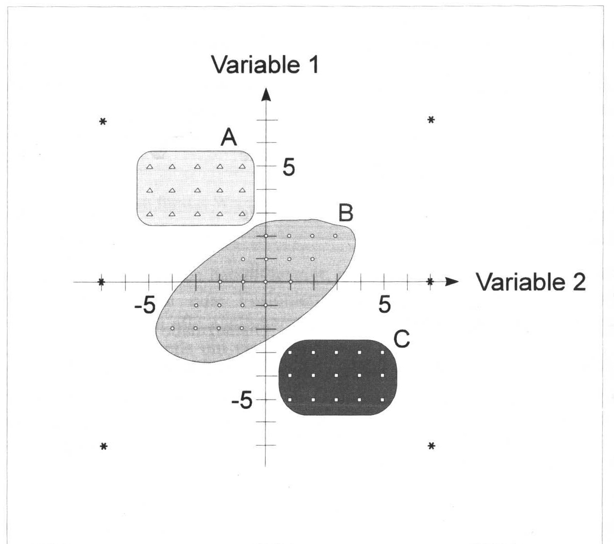
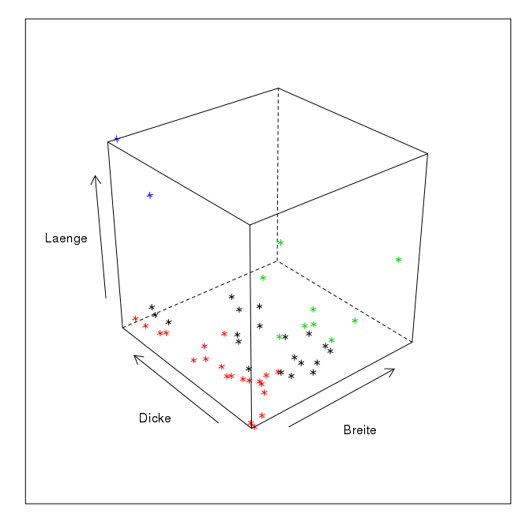
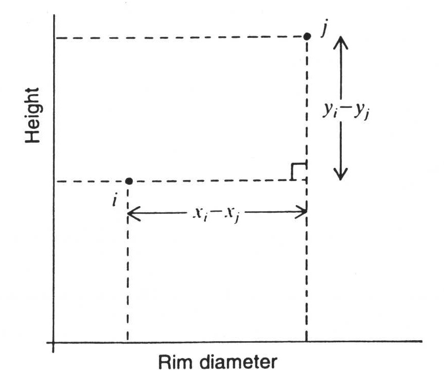
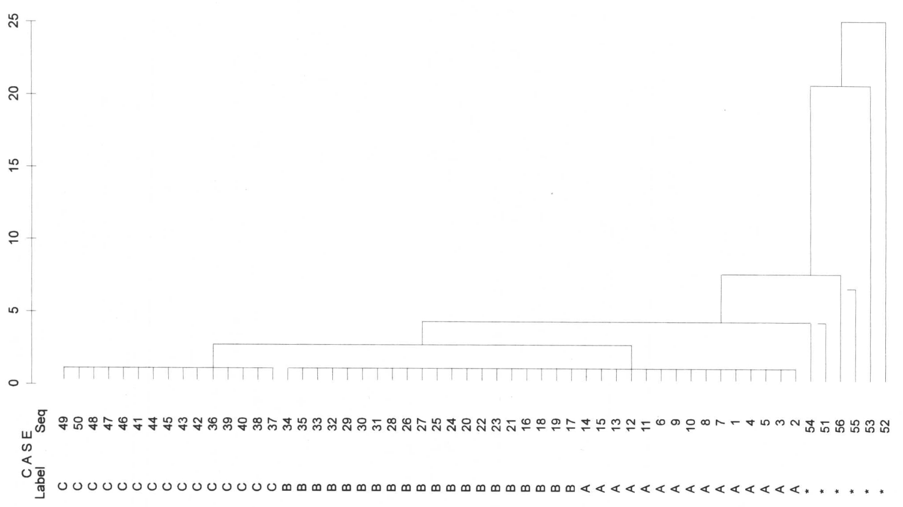

```{r include=FALSE}
knitr::opts_knit$set(root.dir = '09_session/')
xfun::pkg_load2(c("htmltools", "mime", "DiagrammeR"))
remove(list = ls())
```

# Cluster Analysis

## Idea and Basics

Archaeology is the great divider. One of the most important methods in our discipline is classification. It is so common and so obvious to us that we rarely give it a second thought. Nevertheless, the classification of the total mass of artefacts according to certain criteria, and the then often subsequent comparison of the individual groups with each other, is basically the core of our subject. Often these groups are divided spatially and temporally. The whole concept of cultures, which continue to be important in the European Neolithic, is based on the subdivision of material remains on the basis of similarities and differences. 

Intuitively, archaeologists have thus established classes and groupings since the very beginnings of the discipline. As with many other things, the new archaeology in the 1960s was not entirely happy with this intuitive approach. This period saw the advent of various quantitative and scientific methods in archaeological research. On the one hand, there were calls to replace subjective decisions in the field of classification, but also in general, with objective or at least reproducible systems. On the other hand, there was a significantly larger amount of data that played an important role in the overarching analyses now taking place for the new questions of new archaeology. And for these objects, a large number of different characteristics were also recorded in order to be able to carry out an investigation that was as data-based as possible. They measured what they could measure and tried to create objective recording systems. This led to the formation of very complex data sets that were hardly intuitively comprehensible. Statistical methods were now used to master these records. In addition to simple univariate and bivariate statistics, multivariate statistics were considered particularly advanced and helpful.

Particularly with regard to the establishment of groups, the procedures of cluster analysis deserve special attention. The basic idea of cluster analysis, which you will see in all the following procedures, but also in those that you will not find here, is essentially the same:

1. We measure some distance between the individual items in our study. This distance is in most cases a measure of similarity, for example, how metric variables will match up, or how many nominal variables will correspond to each other.
2. We then use these measurements to group the data so that similar objects end up in the same groups, so that the objects within the groups are more similar than the groups are to each other.

This is basically also the fundamental idea of classification as we have already described it above, and as it is also intuitively applied by us. Even if we usually express it in a less complex way.

If we want to imagine the whole process geometrically, it is easiest to stick to a two-dimensional example. Or at least to start from here.



In the figure above we can see different points in a diagram. Their perception is already influenced by the very suggestive outlines, colouring, and different symbols of the points. However, if you focus on the dots themselves, you will certainly, or most likely, agree with the grouping. In the upper left we have a group of regularly arranged triangles, below and further to the right a more irregular group of dots, and below that still further to the right a group of dots, again regularly arranged. All around are a few stars, which intuitively we would not necessarily assign to one of the groups.

In a moment we will get to know procedures with which we can reproduce this order (more or less well) by means of mathematical procedures. And it is no problem for mathematical methods to think in more than two dimensions. Basically, this increase in dimensionality is mostly trivial for mathematical algorithms.


Here is the rendering of a data structure in three-dimensional space as it may result from three measurements. The representation makes it a little difficult for us to perceive the groups in space, as I suspect that, like me, you only have a two-dimensional monitor. However, if this representation were floating in front of us as a hologram, we would have no problems identifying groups here. The next step, however, becomes difficult: we simply lack the sensory organs as well as the mental abilities to be able to perceive more than three dimensions. This means that both in the representation and in the analysis of data structures that have more than three variables, we are necessarily dependent on simplifications. Or exactly procedures that can sort out groups for us without being subject to our limitations.

Since this is a fundamental challenge that affects not only archaeology, but many different sciences (after all, the method of grouping is one that is needed by all scientific disciplines in one form or another), there are a large number of different methods to do this, adapted to different conditions or data qualities. We will start with a short introduction to classification methods. Further on, we will deal with a flavour of this cluster analysis that is probably most similar to the way a human mind would approach it, and which will therefore be the easiest for us to understand. In the practical part, I will only refer to one other variant, the rest is left to everyone's own study. However, in the near future a specific self-study course on cluster analysis will be published by a group of which I am a member. At times, I will therefore refer to exactly this further presentation at this point.

## Methods

In the field of cluster analysis, as already indicated, there is a whole zoo of different approaches and methods to group things according to their similarity. A basic parameter for the classification of analysis methods is whether we already know from the outset how many groups we want to achieve in the end, or whether we want to explore the whole possibility of group aggregations.

### Hierarchical approach

The latter case can basically be called hierarchical. Hierarchical in the sense that we start at one end of the spectrum (either all objects are seen as one group, or we see each object as a group on its own), and then we divide or add together more and more objects until we finally reach the other end of the spectrum. In the intermediate steps we then have a large number of possible other subdivisions.

How this is to be understood will certainly become clearer if we look at the individual basic ideas separately. Let's start with the so-called agglomerative clustering. Here we start with groupings that consist of the smallest possible units: the individual objects. So we start in a subdivision where each object is seen as a group on its own. Or in other words, we have as many groups as we have objects. Now we connect the two most similar objects so that they form a new group. This new group is our first cluster. This leaves us with a group number of only n-1. Since we have combined two objects, we now have one group less than we have individual objects. We now continue this process. In the next step, we again group together the two most similar objects. These can actually be individual objects or groups consisting of several objects. The process ends when we have combined all the objects into one large group, an overall cluster. In all the intermediate steps we have now represented the links between the most similar objects.

However, we can also start the other way round: we start with a single large group where all objects together form the first cluster. Now we work according to the principle of dissimilarity: we divide our large total number of objects into two groups in such a way that they are as dissimilar as possible. Then we look at our two groups separately, and subdivide them again in such a way that two groups are as similar as possible. This is continued until finally every single object is divided into its own group. Again, we have all the intermediate steps, which gives us every possible number of clusters.

An example of such a hierarchical approach is the actual hierarchical clustering that is agglomerative in its methodology. The following is an illustration of the process as we have just discussed it, specific to the case of hierarchical clustering. Some intermediate steps are relatively clear and obvious, for others we are still missing some specifications. Above all, we do not currently know on what basis we will determine similarity or dissimilarity, which is nonchalantly named the distance matrix here. We will come back to this point later.

```{r, echo = FALSE, results="asis"}
library(DiagrammeR)
grViz("digraph flowchart {
      # node definitions with substituted label text
      node [fontname = Helvetica, shape = rectangle]        
      tab1 [label = '@@1']
      tab2 [label = '@@2']
      tab3 [label = '@@3']
      tab4 [label = '@@4']
      tab5 [label = '@@5']
      tab6 [label = '@@6', shape=diamond]
      tab7 [label = '@@7']

      # edge definitions with the node IDs
      tab1 -> tab2 -> tab3 -> tab4 -> tab5 -> tab6;
      tab6 -> tab7 [label='yes'];
      tab6 -> tab3 [label='no'];
      }

      [1]: 'Start with\\nfinest partition'
      [2]: 'Calculate initial\\ndistance matrix'
      [3]: 'Search for the two\\nObjects/Clusters with the\\nleast distance'
      [4]: 'Combine the most similar\\nObjects/Clusters\\ninto one Cluster'
      [5]: 'Calculate new\\ndistance matrix'
      [6]: 'Are all objects\\njoint in one group?'
      [7]: 'Finished'
      ")
```

### Partitioning approach

As already mentioned, another possibility is that we want to achieve a fixed number of groups, or consider them as given. This is called partitioning the cluster. Basically, we have to answer the question of what is the best way to divide a certain data set into a certain number of groups. Basically, such an approach could look like this:

1. select n cluster centers randomly.
2. combine data most similar to these cluster centers
3. recalculate the cluster centers if necessary
4. Does anything change?

If the recalculated midpoints of our individual groups have still changed, i.e. if there has still been an exchange of members between the individual groupings, then we start again at step two. If, however, nothing else has changed in this run, and a recalculation of the cluster centres has again led to the same location, then we have hopefully reached the optimal subdivision, we are done.

A practical method that is used in partitioning, and which is also widely used in science, is the so-called Kmeans clustering. We will get to know this procedure in more detail at the end of the session. In the following illustration, you can try to understand the algorithm with a graphical example.

.center[

]

### Hierarchical and partitioning: advantages and disadvantages

#### Hierarchical
*Advantage*: One of the main advantages of the hierarchical cluster is that we do not have to specify how many clusters we expect in the end. We can deduce this directly from the data, or from the quality of the grouping, or with other tools. Often, the divisions found, or their sequence in hierarchical order, are reflected in a so-called dendrogram. In this we can trace the relationship and sequence of all the groupings of the individual data. You will get to know such dendrogrammes in a moment.

*Disadvantage*: What we have just sold as an advantage can of course also be seen as a disadvantage: we get a large number of classifications and have to choose the best possible one. But what is a much more serious disadvantage is the fact that, due to this procedure, once a classification has been made, it cannot be undone, even if, with a finer subdivision, another cluster would perhaps be much better suited for a specific object. Due to its hierarchical nature, such an object cannot be subsequently reassigned to another cluster.

#### Partitioning

*Advantage*: What we have just described as a disadvantage of the hierarchical version can therefore also be seen as an advantage of the partitioning one: the individual groupings are still flexible, since with each change in membership of a grouping, the cluster centres are redefined and a new assignment of the individual elements to the clusters is subsequently carried out. The reassignment of cluster membership is in fact one of the basic principles of this method. The fact that a better solution can be found after each round of clustering can lead to the overall result fitting the data better than would be the case with hierarchical clustering.

*Disadvantage*: But this is also connected to the main disadvantage of this method: we have to know in advance how many groups we expect. We have to read this out of the data in a different way. One possibility, which we will discuss briefly at the end, is to first determine an optimal number of clusters with hierarchical clustering, and then to use a partitioning procedure.

However, both methods have another disadvantage: each individual object is inevitably assigned to a cluster. The methods presented here cannot distinguish between objects that can actually be assigned to a group of typical properties and objects that cannot actually be assigned to any group at all. Think of the individual stars in the illustration above: the items marked with * are not actually members of any of the groups. At best, they are group members of the group Outliers. However, normal hierarchical and partitioning procedures will assign each individual object to a group. There are other methods, such as HDBSCAN, where this is not necessarily the case, but for which I would like to refer to an upcoming tutorial on cluster analysis.

## Distance calculations

Now that we have learned some fundamental logic and quite abstract algorithms for group subdivision, let's move on to something more specific that is related to practice. One of the questions that has already emerged above with the general algorithms is how we can actually determine similarity and dissimilarity with our data. For this we need some kind of measure with which we can determine how close together our objects are, taking as a metaphor the coordinate system with the groups A, B and C that we had above. We will start from this familiar structure, where we begin with a coordinate system made up of variables, and use it to determine proximity and distance, similarity and dissimilarity. In the following, we will also get to know procedures that we can use to determine or measure similarity and dissimilarity between objects that are only described by nominal variables.

### How the crow flies (Euclidean distance (metric variables))

In relation to normal space, be it two-dimensional as in a coordinate system, or three-dimensional, we can easily determine which objects represent a group and which are distant from them. We have already done this by eye, in the example above.

We can also easily determine the distances mathematically if we just remember back a little to school lessons. The values on the individual variables, which here are to be equated with the axes of the coordinate system, can also be understood as rectangular lines. And the actual distance of two points to each other then results from the Pythagorean theorem:

Theorem of Pythagoras...

$a^2=b^2+c^2$

If we resolve the whole thing according to the individual coordinates, and take the root, then we get the following formula for two data points I and J, with respect to two variables X and Y:

$d_{ij} = \sqrt{(x_i - x_j)^2 + (y_i - y_j)^2}$

And in addition, the graphical representation of this relationship with respect to actually measured variables, in this case height and rim diameter.


This is what we commonly understand by distance: the Euclidean distance. To be able to apply this, we have to be in the range of real measured values. And these measured values must actually be completely independent of each other. Moreover, the measure (the metric) must also be one that corresponds to our common notion of Euclidean space. That is, twice the value also corresponds to twice the distance. We therefore have ratio-scaled measurement values in relation to differences.

### How the taxy drives (Manhattan distance)

But why bother with complicated squaring when you can simply take the two measured values directly:



What we see in this figure is also a measure of the distance between two points. However, we are not using Euclidean distance here. Rather, this is the distance that a taxi driver in New York would have to cover in order to drive a passenger around the various blocks from one address to the other. Therefore, this distance or distance measure is also called Manhattan Metric or City Block Distance. 

If we imagine that two variables are not independent of each other, that they correlate with each other, then the coordinate system formed by them will not function like a Euclidean space in terms of dissimilarity. The coordinate system itself will be warped or skewed. If we apply a Euclidean metric in such a situation, such as the Euclidean distance, then we would over- or underestimate the distances due to these distortions. One possible solution to this problem is the City Block distance. And it is also very easy to calculate:

$d_{ij} = |x_i - x_j| + |y_i -y_j|$

I am not sure how soon or urgently you will use this kind of distance metric in your research. But it should serve as an indicator that what we normally know as distance is not the only way to express distance. A large number of other distance metrics could certainly be added, but I will leave it to you at this point to find out more if you have the need.

### When distances can no longer be calculated (non-metric variables, presence/absence matrices)

That we must abandon our familiar concept of distances when it comes to variables where there are no real measured values, but only specifications of state, is obvious. What is not obvious in the same way is how to approach this problem. But intuitively one can quite easily come up with a starting point for solving this problem.

What actually matters to us, at least in the context of groupings of similar objects, is similarity. That or, its inverse, dissimilarity. We can think of dissimilarity as distance, while similarity in terms of group membership can mean proximity.

However, it is clear that if we have nominal or ordinal variables, we do not have defined distances between the individual values (I hope you can still remember this). Therefore, these distances cannot be calculated in a Euclidean space. The possible solution, as just indicated, is that we calculate via similarities, via similarity matrices, as we can compute them from contingency tables.

(I have taken the part on calculating contingent values out of this year's series of lectures. Therefore, you will not be familiar with this concept. But that is not a big problem, we will introduce the idea again at this point).

As you may recall (?), we can visualise the mutual relationships of two variable expressions, or their presence or absence, in a four-field table (think of the Chi Square test):

Example burial inventories: We have two burials that contain certain artefacts. We can now consider the relationship in which the individual artefacts do or do not occur in each of the graves.

| Burial 1 | Burial 2 ||
| - | - | - |
|  | \+ | \- |
| \+ | a | b |
| \- | c | d |

Instead of the real values, I have entered A, B, C & D here. The cell A marks the number of artefacts that occur in both burial 1 and burial 2. B marks the number of objects that occur in mode 1, but not in mode 2. C is the number of artefacts that occur in mode two, but not in mode one. Finally, d is the number of objects that do not occur in either burial 1 or burial 2. 

Thus we now have characteristics with which we can determine which of these burials is more similar to the other. It stands to reason that if the two burials have many features in common, they will be more similar. We shall therefore extend this theoretical consideration with a practical example and use a number of types in our two burials:

| Types    | 1 | 2 | 3 | 4 | 5 | 6 | 7 | 8 | 9 |
| -        | - | - | - | - | - | - | - | - | - |
| Burial 1 | 1 | 1 | 0 | 1 | 0 | 0 | 1 | 1 | 1 |
| Burial 2 | 1 | 0 | 0 | 0 | 0 | 0 | 1 | 0 | 1 |

Using the example above, we can now count how many similarities and how many differences we have with regard to the categories in our four-field representation. With regard to type 1, type 7 and type 9, we can see that they occur in both burials. For our calculation of the difference, it does not matter for the time being for which of the types we have determined this (we do not want to weight the similarities at this point). Therefore, we simply enter the total number, i.e. 3, in our upper left column for common occurrence. And just in this way we can determine that type 3, 5, and type 6 do not appear in any of the two burials. We can also mark this number in the corresponding column row, the lower right. Finally, we note that Type 2, 4, and 8 appear in burial one, but not in burial two. Therefore, we also note this in the corresponding upper right cell. Conversely, there is no situation in which a type only occurs in burial two. The bottom left line therefore receives the value zero.

| Burial 1 | Burial 2 ||
| - | - | - |
|  | \+ | \- |
| \+ | 3 (a) | 3 (b) |
| \- | 0 (c) | 3 (d)|

It is now quite obvious here that there are 2 diagonals in this table, which raise different interpretations. Our two cases become more similar when the upper left cell or the lower right cell becomes larger. They become more dissimilar when the upper right cell and the lower left cell become larger. The diagonal from top left to bottom right picks up the similarities, the diagonal from top right to bottom left the differences. There are different views on how to evaluate these individual cells, specifically for different situations and research questions. And from this, one can calculate different similarity (or dissimilarity) measures:

**Simple Matching**

$d = \frac{a+d}{a+b+c+d}$

Perhaps the simplest and most straightforward measure of similarity or dissimilarity is also called Simple Matching. It is, as the name suggests, simply about matching. And to calculate this, we add up the values in cells A & D, and divide by the total number of all cases. So we normalise the matches with respect to the total number of cases (artefacts in our case). This means that the more common types are present, the greater the value will be, but also the more types are common not to be present. For me, this largely corresponds to my first reaction to the question of how to judge the similarity of two objects. They must be as similar as possible in their characteristics, both in terms of the presence and absence of characteristics. This coefficient can be between zero and one. It becomes one when all cases are on the diagonal from top left to bottom right, i.e. when all characteristics match. It becomes zero when none of the properties match. In other words, a large value indicates high similarity, a small value indicates low similarity. Thus we have a similarity coefficient. To make it a distance measure, we can subtract it from one, for example. Then we have exactly the opposite case: large values indicate large dissimilarity, small values small dissimilarity.

For our example, the Simple Matching Coefficient is:

$c_{SM} = \frac{3+3}{3+3+0+3}=\frac{6}{9}=\frac{2}{3}$

$d_{SM} = 1 - c_{SM} = \frac{1}{3}$

**Russel & Rao (RR)**

$d = \frac{a}{a+b+c+d}$

If we have already developed such an intuitively suitable coefficient for similarity, and derived a distance measure from it, why should we look any further at this point? We can consider the significance of the common absence of a certain artefact for the similarity of our burials. Which of these parameters we choose to use is, after all, a bit of an arbitrary matter. For example, if I examine our burials in terms of the absence of a DeLorean (who knows if Marty MacFly ever passed by here), then the addition of this category makes our two graves more similar. So we have to ask ourselves whether the common absence of an artefact category actually increases similarity in our case. If we come to the decision that this is not the case, then we can simply omit it from the calculation of similarity.

With this, we have worked out another similarity coefficient, which has also been proposed before by Russel & Rao. Here, the common dissimilarity is missing from the upper part of the formula, so we normalise only the common occurrence by the total number of objects.

In our example, this would result in the following values:

$c_{RR} = \frac{3}{3+3+0+3}=\frac{3}{9}=\frac{1}{3}$

$d_{RR} = 1 - c_{RR} = \frac{2}{3}$

**Jaccard**

$d = \frac{a}{a+b+c}$

The problem with the Russel & Rao coefficient is that somehow we still have the DeLorean in there. Although it no longer appears as a possibility to make the similarity stronger (i.e. in the upper part of the formula), it is still present in the lower part. That means, for all burials that don't have a DeLorean (don't worry, my references to "back to the future" will stop soon), the similarity values will be reduced by adding this category. This may also not make too much of a meaningful contribution to the comparison of two individual cases, or in this case, burials.

Depending on how you understand it, the Jaccard index here either goes one step further, or maybe not. What it does is that it also removes the common non-existence from the lower part of the formula. It is therefore no longer weighted at all to what extent any objects do not occur in the individual cases. The only thing that is of interest is how many similarities and how many differences we have in relation to the objects that actually occur in both cases. Or, more generally, the properties that are common to both objects compared to the properties that are actually present in both objects.

Mathematically, the Jaccard coefficient will generally lie somewhere between Simple Matching and Russel & Rao. In our example, the result is as follows:

$c_{J} = \frac{3}{3+3+0}=\frac{3}{6}=\frac{1}{2}$

$d_{RR} = 1 - c_{RR} = \frac{1}{2}$

#### Which similarity value should one choose?

Besides the ones mentioned here, there is a large zoo of other possible similarity measures. For example, Simpson, Sneath, Tanimoto, Dice,... How should one find one's way around here, or rather, which one should one choose? Certainly, it is useful here to start from basic considerations of the similarity sought. If a variable is symmetrical, i.e. both positive and negative values have the same weighting (e.g. gender), then we can use the Simple Matching Index. In the case of non-equality of variable values, or the fact that, for example, a negative value has less information content (I have tried to illustrate this a bit), then one should choose an asymmetric similarity measure, such as Jaccard. For most questions of similarity of archaeological objects it should apply. Nevertheless, it is always worthwhile to keep an eye out for a better similarity measure for the specific question one has.

## Distance calculation in R

We have now learned two measures of difference for metric variables, as well as three measures of similarity and dissimilarity in relation to nominal categories. So far, this has only been in theory, and you can only get a feeling for it if you try it out in practice. That's why we'll do it now in the following. We start with the two distance measures for metric values. Basically, R has the command `dist()`. At least for most standard distance measures this is sufficient. It understands Euclidean distance (which is of course the default setting) as well as Manhattan distance.

For this we use a data set that we have already seen above in the three-dimensional representation. These are various leather objects from a medieval excavation. Among other information, we also find the length, width and thickness of the leather pieces. This is data that can tell us about the possible original use of the objects, but above all about their subsequent fragmentation. And they are directly measured values, they actually represent physical measured distances of distances. This means that a Euclidean distance is absolutely the obvious choice here.

File: `r xfun::embed_file('leather.csv', text = "leather.csv")`

```{r}
leather <- read.csv("leather.csv")
dist(leather[1:6,c("length","width","thickness")],method="euclid")
```

In the example above, I now only display the distance matrix for the first six entries in our leather data set. What we can see is that on the one hand this distance matrix has the shape of a triangle, and on the other hand the rows start with the number 1, but the columns with the number 2. The reason for this is quickly resolved: the distance from object one to object two is the same as the distance from object two to one. This property is called isotropy. Therefore, we only have to record the distances once in each case, which results in this diagonal structure. Let us now look at the values for the Manhattan distance:

```{r}
dist(leather[1:6,c("length","width","thickness")],method="manhattan")
```

The first thing you notice is that the Manhattan distance has fewer decimal places. This is simply due to the fact that we are only adding two values together here, and that the original measured values did not have any greater accuracy than the second digit after the decimal point. Furthermore, all distance values are clearly larger. This is of course due to the fact that our taxi had to drive around the corner. And the ranking can also be different: Please look at the distance from 1 to 3 in Euclidean distance, and in Manhattan distance, and compare the distance with that between 1 and 4. You will see that here in Euclidean distance 3 is closer to 1 than 4, whereas in Manhattan distance 3 is further away from 1 than 4. So it definitely makes a difference which distance metrics you use. However, from my practice, in a case like this, I would simply choose the Euclidean distance.

Let us now look at the different possible similarity measures and the distance measures based on them. To do this, we load a data set that represents the (simulated) presence and absence of different types in some graves of a cemetery.

File: `r xfun::embed_file('burial_pa.csv', text = "burial_pa.csv")`

```{r}
burials <- read.csv("burial_pa.csv", row.names = 1)
burials[1:2,]
```

You will probably recognise this first case: it is the one we calculated by hand above. However, we have five more burials in our small data set.

In order to have a larger selection of similarity measures, I will load an external library at this point. This is the library `vegan`, which only indirectly has something to do with vegan nutrition. It is much more a library that originates from ecologoIy research, whose questions are similar in many ways to the questions of archaeology. Therefore, this package is often very practical for working on archaeological problems. Here we will remain only very coarsely on the surface, and make use of the distance measures. However, you will come across the package again in the next session.

To load a package that offers additional functionality, use the command `library()`. (maybe this is repetition for you).

```{r message=FALSE, warning=FALSE}
library(vegan)
```

Now we can use commands from this package. One of these commands is the command `designdist()`, which offers us a wider range of possible similarity measures. Here we can now use our desired formula for calculating the distance in various ways. Using the form I have given to you, we need to add the parameter `abcd = TRUE`.

Let's start with the simple matching index.

```{r}
designdist(burials, "1 - (a+c)/(a+b+c+d)", abcd = TRUE)
```

Please note that we introduce -1 there, because otherwise we would calculate the similarity. But we want to calculate the dissimilarity (= distance). Therefore, we have to subtract the number of similarity from one. In the same way we can now work for other distance measures.

```{r}
# Russel & Rao
designdist(burials, "1 - (a)/(a+b+c+d)", abcd = TRUE)
```

And finally for the Jaccard index. This is also implemented directly in vegan in a function called `vegdist()`. I will run this here too for comparison:

```{r}
designdist(burials, "1 - (a)/(a+b+c)", abcd = TRUE)
vegdist(burials,method="jaccard")
```

:::{.exercise}
The inventories of different (hypothetical) settlements are given.

Calculate the appropriate distance matrix.

File: `r xfun::embed_file('inv_settlement.csv', text = "inv_settlement.csv")`

:::

<details><summary>Solution</summary>

First, let's take a look at this data set:

```{r}
settlements <- read.csv2("inv_settlement.csv", row.names = 1)
head(settlements)
```

It appears to be an presence absence dataset.Actually, one would have to definitively reassure this observation again, i.e. not just look at the header of the date record, but I can assure you that this is correct in this case.

As already indicated, a Jaccard metric is certainly the best choice in such a case. We now have the option to call this directly with `vegdist()` or to use our function `designdist()`. In practice, `vegdist()` is a bit shorter to write, so we use that function here.

```{r}
vegdist(settlements, method = "ja")
```
</details>

## Hierarchical clustering

### Cluster analysis by hand

Now that we have calculated the distances (a not insignificant step that also definitely strongly influences the overall result), we can proceed to perform the actual cluster analysis. As with the calculation of the distance matrix, many of the steps for performing the actual cluster analysis are very similar, at least for hierarchical clustering. The main differences are again how distances are calculated, in terms of the new distances that result from combining multiple objects into a cluster.

But let's leave that aside for a moment, we will come back to the differences in a moment. First, let's go through the general process. To do this, we will use the 'single linkage' method. At this point, just enjoy the beauty of a statistical term for now. What s'single linkage' means is best explained in contrast with other procedures, which we will come to in a moment.

Here we use the example of different types of margarine that I have taken from the book "Multivariate Statistik" by Backhaus et al.

First of all, it is important which distance matrix you have. In the end, it will not be that important, because in the actual process we will only evaluate which objects are closest to each other. But in the given case, the distance matrix consists of a quasi Euclidean dissimilarity matrix based on user surveys. We simply use it here like a Euclidean distance matrix. Here, too, the structure is such that we omit the upper diagonal (which contains the same values as the lower part), and that the individual margarine varieties are slightly offset in the rows and columns. In the rows the first type is missing, in the columns the last. This is comparable to the representation that R gives us.

|                  | Rama | Homa | Flora | SB | 
|------------------| ---- | ---- | ----- | -- | 
| Homa             | 6    |      |       |    |
| Flora            | 4    | 6    |       |    |
| SB               | 56   | 26   | 44    |    |
| Weihnachtsbutter | 75   | 41   | 59    | 11 |

We will now carry out a hierarchical clustering here. This means, if you remember above, that in the first stage we assume that each individual object has its own group. And as you may also remember, the first step is now that we determine which of the individual objects are most similar to each other in order to combine them into a cluster. Since we have a distance matrix here, we are looking for the shortest distance. As your eagle eye will have discovered, the shortest distance is between Flora and Rama. We combine these two into a new group, our first cluster. We also note the distance between these two objects (i.e. 4) at which we have made the grouping here. This will become important again later.

clustering: {4}

Now we come to the question of how we recalculate the distance between the data in relation to our new grouping. I have already named the process single linkage. In this variant, we are looking for the smallest distance that any member of our cluster has to all other objects (currently all other margarine varieties) as the distance for the entire group (in this case composed of two margarine varieties) to all other objects.

So we look at our table, and especially at the columns where our two new cluster members appear. The distance from Rama and Flora to Homa is 6 in both cases, in which case we don't have to think at all about which new distance to take. We can ignore the distances between Rama and Flora, because we combine the two. What is relevant now is the distance of our new cluster to the SB variety. To this, Rama has a distance of 56, while Flora has a distance of 44. Whatever these units of measurement would mean.

So now we look for the smallest distance of all our class members to this variety, as the new total distance of our cluster. So we look at the nearest neighbour in each case. In this case, it is Flora with a distance of 44. Thus, the new cluster to be created, consisting of our two margarine varieties, has a total distance to SB of 44. Do the same with the last margarine variety and we have all our new distances together and can create a new distance matrix.

|                  | Rama | Homa | Flora | SB | 
|------------------| ---- | ---- | ----- | -- | 
| Homa             | **6**|      |         |    |
| Flora            | **4**| 6    |         |    |
| SB               | **56**| 26   | **44**|    |
| Weihnachtsbutter | **75**| 41   | **59**| 11 |

|                  | Rama, Flora     | Homa | SB | 
|------------------| --------------- | ---- | -- | 
| Homa             | **6**           |      |    |
| SB               | 44          | 26   |    |
| Weihnachtsbutter | 59          | 41   | 11 |

It is easy to see that in this new distance matrix, the smallest distance is between our cluster (Rama, Flora) and the Homa variety. So we now combine them into our new cluster, and note the cluster distance of six.

clustering: {4, 6}

And now again, as before, we create a new distance matrix. In the case of the single linkage method, by selecting the smallest distances in each case.

|                  | Rama, Flora, Homa | SB | 
|------------------| --------------- | -- | 
| SB               | 26          |    |
| Weihnachtsbutter | 41          | **11** |

Finally, in the now very shrunken distance matrix, the smallest distance in the next step is the one between the SB variety and the Weihnachtsbutter variety. So we combine these two into a new cluster, and note the distance at which we did that.

clustering: {4, 6, 11}

The smallest distance between our cluster (SB, Weihnachtsbutter) and the cluster (Rama, Flora, Homa) is now 26. And basically we are done with that now.

|                  | Rama, Flora, Homa |
|--------------------------------- |-|
| SB, Weihnachtsbutter               | **26**          |

The final step is to combine these two clusters, which we do at the distance of 26. Finally, we also note this distance for our entire cluster solution.

clustering: {4, 6, 11, 26}

### Dendrogram

Now that we have carried out the cluster analysis (wasn't that difficult, was it), we need a suitable way to present the result. For this purpose, the dendrogram has proved to be a good way of presenting the results. It is no coincidence that this term comes from the Latin word for tree. A dendrogram serves to visualise the processes of a cluster analysis, or the hierarchy in which these clusters are located.

```{r echo=F, fig.height=5}
test <- matrix(c(
  0, NA, NA, NA, NA,
  6, 0, NA, NA, NA,
  4, 6, 0, NA,NA,
  56,26,44,0, NA,
  75,41,59,11, 0
), nrow=5, byrow = T)
rownames(test) <- colnames(test) <- c("Rama", "Homa", "Flora", "SB", "Weihnachtsbutter")
test <- as.dist(test)

plot(hclust(test, method = "single"))
```

So we see here, so to speak, a sequence of what we have just done. You can read the whole thing from the bottom up if you want to follow this sequence. First we united Rama and Flora into one group. Then Homa was added. Then SB and Weihnachtsbutter were joined together, and finally all the individual objects united into one big cluster. The heights at which these combinations are entered correspond to the distances at which we made this combination.

clustering: {4, 6, 11, 26}

If we now look at the whole thing from top to bottom, we can see that our entire data set primarily breaks down into two groups: on the right-hand side we have SB and Weihnachtsbutter, which are obviously more similar to each other than to any other of the margarine varieties. On the left side we have these (Homa, Rama, Flora). The differences in the distances of the groups between the individual margarine varieties are not very different. The only big step we can see here is the one at the end. That is, the cluster on the left is very clearly different from the cluster on the right. At this point, due to the data situation, but also due to the very suitable representation, one would probably divide the data into two groups that correspond to our two initial clusters. So we have now carried out a cluster analysis completely from front to back. And with that, you have all the things together that you need to understand cluster analyses, as well as to implement them yourself. Except for the command in R. But before I give you that, you need to take a brief look at a few other cluster methods.

### Other methods

There is a very wide range of possible ways in which hierarchical clustering is carried out specifically. They all differ primarily in how the distances are calculated that result when two data are combined in a cluster. Here is just a small selection:

**Complete linkage process:**

This is basically the reverse of the single linkage method. Not the closest neighbour to a patch, but the furthest neighbour to a cluster is noted as the new distance for the entire cluster when data is merged. 

**Average Linkage Procedure**

In this case, neither the nearest nor the furthest neighbour is evaluated, but the average distance of all data is taken into account as the new distance.

**Ward method**

This method is a little different from the ones just described. It is also based on a distance matrix, but in this case the selection process is the decisive one. The objects are grouped together for which this grouping would result in the lowest variance of the newly created cluster. Accordingly, no new distances are actually calculated here. This sounds a bit more complicated than what we just went through. Admittedly. However, this method is also very popular, and not without reason: it produces the groupings that come closest to what one would select by eye. In this context, one speaks of natural groups.

To visualise the differences, let's use the groupings we have seen before:


Now we go through these groups step by step for different cluster algorithms and look at what kind of groups they would produce for this arrangement of data.

**Single Linkage**



In the case of single linkage, first the 6 outliers are separated from all other values. Next we see a separation of C to A and B. However, the procedure does not succeed in separating A & B in a meaningful way because they are very close to each other. It is also said that single linkage tends to chain formation. This means that the nearest neighbour is always chosen, i.e., from the left uppermost B the procedure jumps over to the right lowermost member of A without any problems. What still worked very well with our margarines has to be taken with greater caution in more difficult applications with more data.

**Average linkage**

The average linkage method is more successful. Here, A, B and C are finally separated. However, with this method B is also divided into two groups, even before B & A separate. Here we do not have such a clear chain formation (no such clear stairs in the dendrogram), but the result is also unsatisfactory, and in this case the outliers also separate quite late from the actual groups.


**Ward**

The best way (or the way we would do it, too) to cluster is with the Ward method. Here, groups A, B and C are the first to separate. And also with a clear distance to all other separations. However, this method is forced to assign the outliers to a group, which is then also carried out (perhaps reluctantly, it is so difficult to look into an algorithm).


Which method we may use to fuse the individual clusters also depends on what kind of distance matrix we have. If we are working with similarity measures, the Ward method (as well as the centroid and median methods) cannot be used meaningfully. In this case, the average linkage method can be used.

### Praktische Durchführung in R

### With metric data (Distance matrix)

If we have metric data and can therefore use a real distance matrix as a basis, then basically (unless you have really good reasons) there is no way around the Ward method if you want to stay with hierarchical clustering.

**Advantage**: usually finds "natural" groups of approximately same size best

**Disadvantage**: is only applicable for metrically scaled variables

What I have sold above as an advantage can also be seen as a disadvantage: ward is bad at identifying very small groups, but tends to lump them together with larger groups.

Let's do the whole thing once directly in R, using our leather data as an example. If you have not yet done so, please leave this data in:

```{r}
leather <- read.csv("leather.csv")
```

Next, we calculate the distance matrix. At this point, however, we only consider the length, width and thickness. There are other data in the data set that are not important for our grouping at this point.

```{r}
leather.dist <- dist(leather[,c("length",
                                "width",
                                "thickness")],
                     method="euclid")
```

Finally, we feed our distance matrix into the cluster analysis method: `hclust()`. For this we need to explicitly state that we want to use Ward's method.

```{r}
leather.hclust <- hclust(leather.dist, method = "ward")
```

And with that, the cluster analysis has already been carried out. All that remains is to present the result. For now, we will limit ourselves to a denrogramme.

```{r}
plot(leather.hclust)
```

We can see that first two objects (27 and 49) are separated. Then two large groups result, in which the rightmost one is subdivided again a little further down. Whether we finally consider the subdivision of the rightmost group into two subgroups and further subdivisions to be relevant for us depends on various factors. On the one hand, we can look at the data at this point, and from information that we have not then used for classification, try to make an interpretation of the groups found in the cluster here. In all cases, this will certainly provide the best justification for selecting a particular cluster number. Science always beats pure statistics. Another way to be able to identify a good number of clusters we will get to know in a moment. But first, let's look at the same approach in the realm of nominal data and similarity (or dissimilarity) matrices.

(What you may also see is the little warning message that says that the ward method has now been renamed ward.D. The method listed here as Ward is not the one originally proposed in the publication by Ward (1963). If you want to use exactly this one, then you have to explicitly specify Ward.D2. It does make sense to take this into account, as the results can differ significantly. Feel free to try out what happens when you cluster the leather objects with Ward.D2.)

### with nominal data (Dissimilarity matrix)

If we start from nominal data and therefore cannot calculate a real distance matrix, but only a dissimilarity matrix, then a good choice is certainly the average linkage variant of the cluster analysis. In this case, the new distance is formed by the average of all pairwise compared members of two clusters (or single objects). In contrast to single or complete linkage, not only individual neighbours but all members of a cluster are included in the assessment of the new distances to all other objects.

Advantage: can also be used with nominally scaled variables, takes into account all elements of a cluster when redetermining the distances

Disadvantage: Not as well suited as Ward to create "natural" groups

For demonstration purposes, we use the presence-absence matrix for the burials that we already used in the introductory example. Basically, the procedure here is no different from the case where we can use metric variables. Again, the first thing we have to do is to determine a distance matrix (in this case a dissimilarity matrix) between all objects. For this we use the `vegdist()` function of vegan, with the Jaccard method. We then pass this matrix to the `hclust()` function. And again we specify the method explicitly, we use `average`.

```{r}
burials <- read.csv("burial_pa.csv", row.names = 1)

burials.dist <- vegdist(burials,
                     method="jacc")

burials.hclust<-hclust(burials.dist,method="average")
```

Finally, we can also plot the dendrogram in this case simply by using the `plot()` command.

```{r}
plot(burials.hclust)
```

Our small test data set does not show too much variability, so cluster analysis is not particularly exciting at this point. However, the data set is clear, so we can simply look at it in connection with the cluster analysis.

```{r}
burials.hclust
```

In the Analysis class, the group of burial three and burial seven are separated from all other objects. These differ from the other data sets primarily in variable one and two. Next, object five and six separate themselves, which have three concordances, and then a chain of 2, 1, and 4 is actually formed, which is certainly mainly due to the last 3 variables ("V7", "V8", and "V9") of our simulated data set.

Now that we have learned about the possibility in R (finally I have lifted the veil) with which we can calculate cluster analysis here, two questions remain open: how do I determine the proper number of clusters, and how do I use the results of my cluster analysis (beyond the pure dendrogram) for further analyses and representations.

Let us first (very cursorily) address the question of the number of clusters.

## Number of Clusters

So the question is how many groups we actually want to have at the end of our clustering. Sometimes this question can be answered directly from the scientific background, and these are also the situations where cluster analysis can be most successful. If we already know that a certain number of groups should emerge, then it is usually also the case that it is much easier to identify these groups.

But even if we do not know in advance how many groups we can expect, it still makes sense to approach the resulting groupings with contextual knowledge, to interpret them, so as not to be dependent solely on number games. Finally, one can also try to read the dendrogramme and derive a meaningful number of groups from it. The criterion that I would like to present here does basically nothing else, but makes it a little easier for the user. It is called: elbow criterion.

In dendrograms, we can observe that some clusterings occur at significantly larger distances from each other than others. If such a large jump in distance is followed by significantly smaller distances, this means that these cluster distances represent rather small subdivisions. Often this takes the form of a staircase, as we can see from the single linkage. These links (or subdivisions, depending on which direction of the dendrogram one is coming from) are certainly less significant than those that happen after a large jump. To visualise this better, one can visualise the distances at which the clustering occurs.

The variable that holds the result of a cluster analysis has several other bits of information stored. For example, the height at which the cluster groupings took place.

```{r fig.height=5}
leather.hclust$height
```

The whole sequence is in the order in which the clusters were put together. I.e., the smallest distances (and thus the clusters that were merged first) are found at the beginning, the latest ( nearer to the root of the dendrogram) are found at the end. At this end are also those subdivisions that coincide with the smallest number of groups (and the largest group size). If we now plot these higher ones in reverse order as a line diagram, we can observe points at which we can detect a clear kink in the sequence of cluster heights. This kink, which represents the situation when we come from a large step to a small step in the cluster development, is also called an elbow. And these need to be identified. Let's take a look at this for our leather data set:

```{r fig.height=5}
plot(rev(leather.hclust$height)[1:10],type="l")
```

For the sake of clarity, I will only show the first ten clusters. If you look closely, you can see several elbows here. This makes it clear that this elbow criterion is not only not informed by domain knowledge, but is also shaped by subjective decisions. Nevertheless, it can be a good indication for making a decision. In this case, the earliest clear elbow might be the one at a cluster count of 5. However, I would have little quarrel with it if you preferred the four. But if we take the five, we would now determine that we would expect five clusters for our analysis.

### Tree care and visualisation

If we have now decided on a certain number of clusters, we might want to pick out the membership of the individual objects to these clusters, for example, to display them in scatter plots with their group membership. We will come to this in this section.

The function to determine the assignment of objects to certain clusters at a certain cluster height is called `cuttree()`. As the first parameter, this function expects the result of a cluster analysis. Furthermore, you can either specify the number of desired groups or the height at which these groups should be cut (the same as you just visualised for the elbow criterion). It is usually easiest to enter the number of groups at this point. The result is then a vector that reflects the membership of the clusters that are present at this height of the tree, or according to the number of clusters that you want to identify.

```{r}
cutree(leather.hclust,5)
```

This sequence of numbers comes in the same order as the data originally used to perform the cluster analysis. It can therefore be very handy to append the result to the original data set, in a new column, to keep track of the cluster membership just calculated. Let's do this with our leather dataset:

```{r}
leather$clusters <- cutree(leather.hclust,4)
```

Now, in addition to the actual measurements, which we have already used to determine the clustering, we also have the cluster membership stored in the data set. And we can use this to enhance the representation of the variables with a representation of cluster membership, either indicated by colours, or by symbols. I'm going to go for the colours here. And I will produce what is called a pair plot, that is, I will plot the relationships of several variables against each other. All that is needed is an input for the command `plot()` that has more than two columns:

```{r}
plot(leather[,c("length", "width", "thickness")],
     col=rainbow(4)[leather$clusters])
```

For the actual colour representation I use a colour palette that I create with the help of the command `rainbow()`. Here I enter the number of colours I want the rainbow spectrum to be divided into (perhaps you remember, we already went through this at the very beginning in Graphic Representation). From this colour spectrum I then select one of the colours according to my class order, in our example 1-5 (because we have a maximum of five clusters).

:::{.exercise}
Ceramics with various decorative elements

Given are ceramic artefacts with different properties.

Determine which distance measure is appropriate, calculate the distance matrix and carry out a cluster analysis using a suitable method.

Determine a good cluster solution and display the dendrogram.

File: `r xfun::embed_file('ceramics.csv', text = "ceramics.csv")`
:::

<details><summary>Solution</summary>

First, let's again take a look at this data set:

```{r}
ceramics <- read.csv2("ceramics.csv", row.names = 1)
head(ceramics)
```

Again, we are dealing with a presence absence data set. As already explained, in this case it is best to use the Jaccard metric.

```{r}
library(vegan)
ceramics.dist <- vegdist(ceramics, method = "ja")
```

With the distance matrix we can now perform the actual cluster analysis. Since we are dealing with a non-metric data set, we play it safe and use 'average linkage' as the cluster algorithm.

```{r}
ceramics.clust <- hclust(ceramics.dist)
```

Let's take a look at the dendrogram:

```{r}
plot(ceramics.clust)
```

The data set does not seem to have any really unique cluster solutions. This is perhaps not least due to the fact that I have simulated the data randomly. Nevertheless, we proceed canonically and try to identify the best possible cluster separation with the help of the elbow criterion.

```{r}
plot(rev(ceramics.clust$height), type="l")
```

Even this representation does not provide a really clear picture, which does not surprise us very much, since it directly follows the dendrogram.

Here is a pro tip on how to identify the right number of clusters. For this we do not start from the hierarchical dendrogram as before, but ask for individual cluster solutions how well the individual objects fit to the cluster assigned to them. This is done on the so-called silhouette criterion, which we will not go into here in particular, but for which I refer to the general tutorial on clustering in archaeology that will be coming out soon. Until then, we simply apply this cluster criterion. For this we need to load another package that deals specifically with cluster analysis. Appropriately, this package is called `cluster`. I will comment on the individual steps in the code itself.

```{r}
library(cluster) # Load package

max_cluster <- 20 # We look at (the last) 20 cluster solutions

goodness_of_fit <- vector(length = max_cluster)

for(i in 2:max_cluster) { # perform the following for each cluster solution
  this_solution <- cutree(ceramics.clust, i)  # cut the tree at the given number of clusters
  this_silhouette <- silhouette(this_solution, ceramics.dist) # Calculate the silhouette
  goodness_of_fit[i] <- mean(this_silhouette[,3]) # calculate the average silhouette value
}
goodness_of_fit
```

The result is a value that reflects the average fit of each individual to their assigned cluster. The numerical values alone may be difficult to comprehend, so we will show the entire result again as a bar chart:

```{r}
barplot(goodness_of_fit, names.arg = 1:max_cluster)
```

From this analysis, it appears that either two or eleven groups are probably the most useful cluster solution. With all possible intermediate levels. We opt here for a cluster solution based on two groups.

For the visualisation of the complex data, we can use a method that we will only go into more intensively in the next session: correspondence analysis. At this point, just enjoy the beautiful point cloud for now.

```{r}
plot(cca(ceramics), type="n")
points(cca(ceramics), col = cutree(ceramics.clust,2))
```

When dividing our data into two groups, they can be well separated from each other in the correspondence analysis graph.

</details>

## Non-hierarchical clustering

If we can already start with a given number of desired clusters, then we can also use non-hierarchical clustering methods. Or, we can first use a hierarchical clustering method and then use the resulting optimal number of clusters to perform a non-hierarchical clustering method.

Here we use the so-called Kmeans clustering. In each step, the clusters are reassembled and new distances are calculated. If the solution is as optimal as possible, the procedure stops (see above).

As the name Kmeans already implies, a mean value is determined here at a certain point. Such a mean value only really makes sense for metric variables. Therefore, this procedure is also limited to situations in which we can specify such a metric.

File: `r xfun::embed_file('andean_sites.csv', text = "andean_sites.csv")`

First of all, in the well-known way, hierarchical clustering. We have counts, so we can use the Ward method.

```{r fig.height=5}
andean <- read.csv2("andean_sites.csv", row.names = 1)
andean.hclust<-hclust(dist(andean),method="ward")
plot(rev(andean.hclust$height),type="l")
```

From the representation, an optimal cluster number of, for example, three can be deduced. We use this as a default for the non-hierarchical clustering method Kmeans. The command for this is `kmeans()`. The first parameter is the data matrix, the second is the desired number of clusters.

```{r}
andean.kmeans<-kmeans(andean,3)
plot(andean,col=andean.kmeans$cluster)
```

The last command is a visualisation in which all variables are displayed against all others, as we have already seen in other contexts (pairwise plot). At this point, I pass on the cluster solution as colours so that the points are displayed differently. What we can see is that our cluster solution can be distinguished well, especially with regard to the amount of maize. At this point we have to do without in dendrograms for representation, since we do not have a hierarchical order that could be represented here.

## Schluss und Überleitung

As has become clear in the last example, but above all in the exercise example, it is often difficult to represent data sets in a few (2) dimensions, showing structures that depend on many variables and their relationships to each other. We often have such problems in relation to archaeological situations where, for example, we can identify how particular burials differ in terms of their features and classify them into groups. The grouping can be done with the help of cluster analysis. Visualisation, on the other hand, is a different field. This is the field we will tackle in the next chapter: how can I represent complex structures in as few dimensions as possible, and at the same time pick out the essentials of the data set.

Overall, such procedures are called ordination methods. In the field of metric data, one of the most frequently used approaches here is principal component analysis. For nominal data, which we often have, there is an alternative: correspondence analysis. You can look forward to the many scatter plots that await you in the following chapter.