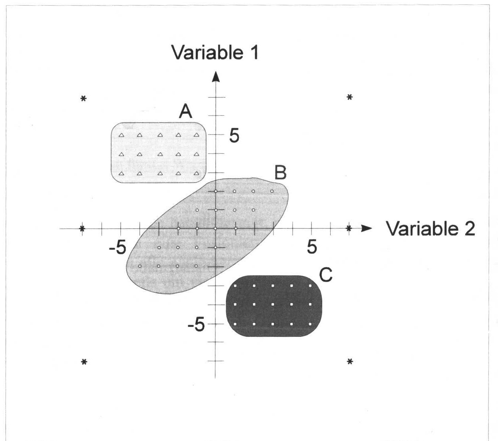
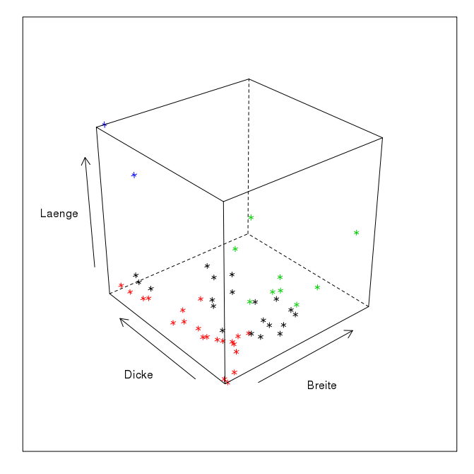
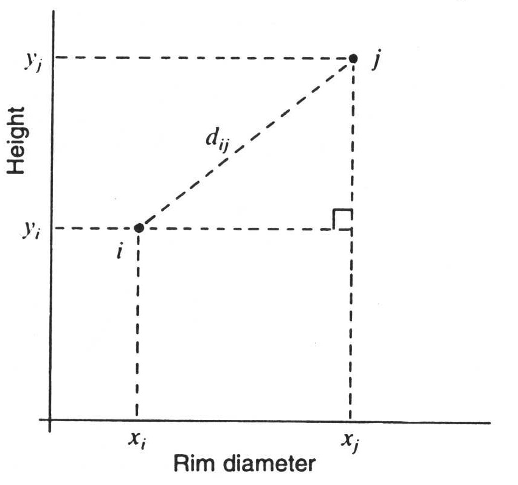
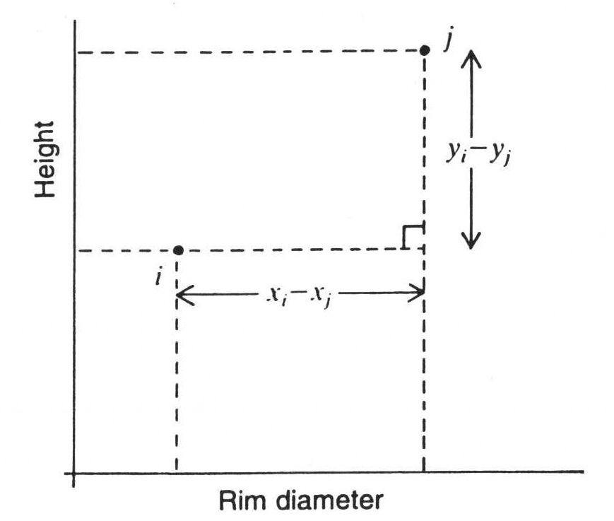
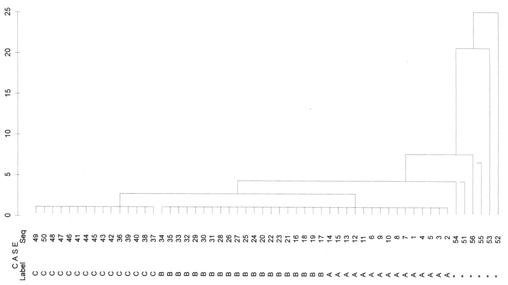
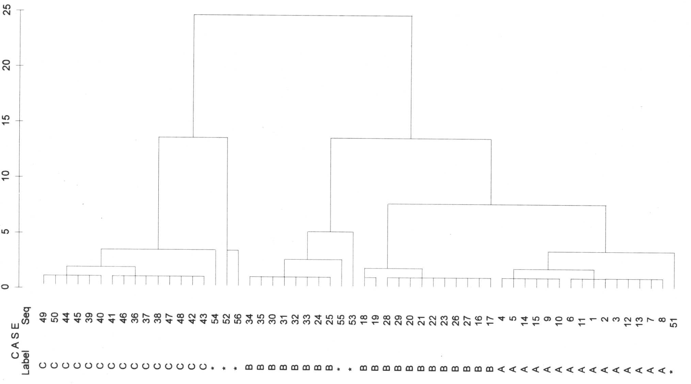
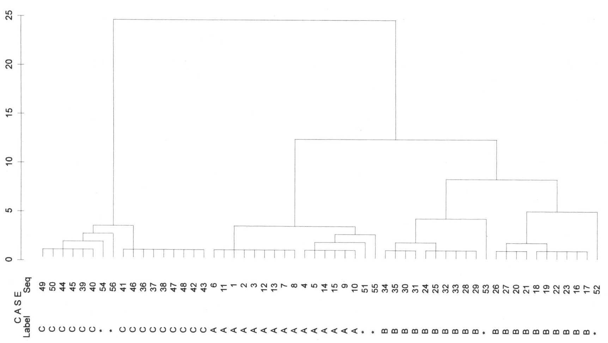

class: title-slide, center, middle

```{r setup, echo=F, error=FALSE, warning=F, message=F, results='hide'}
rm(list = ls())
#options(digits = 3)
Sys.setlocale("LC_MESSAGES", "en_US.utf8")
library(DiagrammeR)
```

```{r, echo = FALSE, results="asis"}
cat('# ', rmarkdown::metadata$title)
```

```{r, echo = FALSE, results="asis"}
cat('## ', rmarkdown::metadata$subtitle)
```

```{r, echo = FALSE, results="asis"}
cat('### ', rmarkdown::metadata$author)
```

```{r, echo = FALSE, results="asis"}
cat('#### ', rmarkdown::metadata$institute)
```

```{r, echo = FALSE, results="asis"}
cat(rmarkdown::metadata$date)
```

.footnote[
.right[
.tiny[
You can download a [pdf of this presentation](smada09.pdf).
]
]
]

---

## Cluster Analysis: Idea and Basics

### Similar things have similar characteristics...
Group formation on the basis of characteristic attributes that (clearly?) distinguish them from other groups

Intuitive basis of archaeological work

With late 60s (New archaeology) request,
- to uncouple criteria for forming groups from subjective decisions
- enable processing of large, intuitively unmanageable amounts of data

→ multivariate analyses

### Cluster analysis
1. measurement of a distance (of any kind) between data
2. grouping data that is similar to each other and differentiating from data that are dissimilar 

→ Classification

---



---



---

## Cluster Analysis: Methods [1]

March separately, strike together... right?
Hierarchical

Which objects are most similar?

Which objects are 2. most similar?

Which objects are 3. most similar?
...

.pull-left[
### agglomerative

Starting from the smallest unit (individual objects)

Combine the two most similar to one object (1st cluster)

Combine the two most similar [Cluster|Objects].
...
]

.pull-right[
### divisive

Start with the largest possible unit (all objects as 1 cluster)

Divide them into two groups as dissimilar as possible

Divide one of the groups into two groups that are as dissimilar as possible.
...

]

Example: **Hierarchical clustering**, e.g. according to the Ward method

---

```{r, echo = FALSE, results="asis"}
grViz("digraph flowchart {
      # node definitions with substituted label text
      node [fontname = Helvetica, shape = rectangle]        
      tab1 [label = '@@1']
      tab2 [label = '@@2']
      tab3 [label = '@@3']
      tab4 [label = '@@4']
      tab5 [label = '@@5']
      tab6 [label = '@@6', shape=diamond]
      tab7 [label = '@@7']

      # edge definitions with the node IDs
      tab1 -> tab2 -> tab3 -> tab4 -> tab5 -> tab6;
      tab6 -> tab7 [label='yes'];
      tab6 -> tab3 [label='no'];
      }

      [1]: 'Start with\\nfinest partition'
      [2]: 'Calculate initial\\ndistance matrix'
      [3]: 'Search for the two\\nObjects/Clusters with the\\nleast distance'
      [4]: 'Combine the most similar\\nObjects/Clusters\\ninto one Cluster'
      [5]: 'Calculate new\\ndistance matrix'
      [6]: 'Are all objects\\njoint in one group?'
      [7]: 'Finished'
      ")
```

---


## Cluster Analysis: Methods [2]

Divide and rule... or?

Partitioning

What is the best way to divide the data into n groups?

Possible procedure:

1. select n cluster centers randomly.
2. combine data most similar to these cluster centers
3. recalculate the cluster centers if necessary
4. Does anything change?

If yes, again to 2.

Otherwise: ready!

Example: **kmeans clustering**

---
.center[

]
---

## Cluster Analysis: Methods [3]

### Hierarchical
*Advantage*: No number of clusters is specified, hierarchies of clusters can be observed (representation in a dendrogram)

*Disadvantage*: Once a solution has been found, it cannot be resolved again, even if the cluster is no longer optimal in a later step.

### Partitioning
*Advantage*: Clusters are still variable afterwards, i.e. if a better solution is found after a cluster cycle, this solution can be chosen.

*Disadvantage*: A cluster number is specified.

---

## Distance calculations: Euclidean distance (metric variables)

### How the crow flies

The closer two points are to each other, whose position in a coordinate system is determined by the values of the respective variables, the more similar the data sets are.

Calculation of the distance to each other:

Theorem of Pythagoras...

$a^2=b^2+c^2$

The distance between two data with the variables x,y is thus:

$d_{ij} = \sqrt{(x_i - x_j)^2 + (y_i - y_j)^2}$

---



---



---

## Distance calculations: City-Block Distance (or Manhattan metric) (metric variables)

### How the taxi driver drives

Representation of the absolute distance between two objects

*Problem*: If the two variables are somehow interdependent, the resulting coordinate system is not rectangular.

Therefore, distances would be over- or underestimated with Euclidean metrics.

*Solution*: City block distance

The distance between two data with the variables x,y is thus:

$d_{ij} = |x_i - x_j| + |y_i -y_j|$

---

## Distance calculation: non-metric variables (presence/absence matrices) [1]

### When distances can no longer be calculated

With nominal or ordinal variables there are no more defined distances between the values (hopefully still known...)

Therefore they can no longer be calculated in Euclidean space.

Possible solutions: Calculation over similarity coefficients from contingency tables.

Example burial inventories

| Burial 1 | Burial 2 ||
| - | - | - |
|  | \+ | \- |
| \+ | a | b |
| \- | c | d |

---

## Distance calculation: non-metric variables (presence/absence matrices) [2]

### Calculation of similarities over equal/different characteristics

.pull-left[It is checked in how many cases the graves match (a,d) and in how many cases there are differences (b,c).]
.pull-right[
| Burial 1 | Burial 2 ||
| - | - | - |
|  | \+ | \- |
| \+ | a | b |
| \- | c | d |
]

.pull-left[
| Types    | 1 | 2 | 3 | 4 | 5 | 6 | 7 | 8 | 9 |
| -        | - | - | - | - | - | - | - | - | - |
| Burial 1 | 1 | 1 | 0 | 1 | 0 | 0 | 1 | 1 | 1 |
| Burial 2 | 1 | 0 | 0 | 0 | 0 | 0 | 1 | 0 | 1 |
]

.pull-right[
| Burial 1 | Burial 2 ||
| - | - | - |
|  | \+ | \- |
| \+ | 3 | 3 |
| \- | 0 | 3 |
]

---

## Distance calculation: non-metric variables (presence/absence matrices) [3]

### Calculation of similarities over equal/different characteristics

.pull-left[
Various possibilities to calculate the distances:

Tanimoto (Jaccard) $d = \frac{a}{a+b+c}$

Simple Matching $d = \frac{a+d}{a+b+c+d}$

Russel & Rao (RR) $d = \frac{a}{a+b+c+d}$

This example in Jaccard $d = \frac{3}{3+3+0} = 0.5$
]

.pull-right[
| Burial 1 | Burial 2 ||
| - | - | - |
|  | \+ | \- |
| \+ | 3 (a) | 3 (b) |
| \- | 0 (c) | 3 (d)|
]

---

## Distance calculation: non-metric variables (presence/absence matrices) [3]

### in R:
.tiny[

File: `r xfun::embed_file('leather.csv', text = "leather.csv")`

```{r eval=FALSE}
leather <- read.csv("leather.csv")
dist(leather[,c("length","width","thickness")],method="euclid")
dist(leather[,c("length","width","thickness")],method="manhattan")
```

File: `r xfun::embed_file('burial_pa.csv', text = "burial_pa.csv")`

```{r message=FALSE, warning=FALSE}
burials <- read.csv("burial_pa.csv", row.names = 1)
burials[1:2,]
library(vegan)
vegdist(burials,method="jaccard")
```
]
---
class:inverse

## Distance calculations: exercise

The inventories of different (hypothetical) settlements are given.

Calculate the appropriate distance matrix.

File: `r xfun::embed_file('inv_settlement.csv', text = "inv_settlement.csv")`

---

## Hierarchical clustering [1]

### When we have the distances...

.pull-left[
Example Backhaus et al: Magarine

Euclidean Distance Matrix, Calculated from Versch. Factors

The most similar:

Flora and Rama.

These form our first cluster at a distance of 4

For the further steps there are different procedures to determine the value for the new cluster...

clustering: {4}
]

.pull-right[
|                  | Rama | Homa | Flora | SB | 
|------------------| ---- | ---- | ----- | -- | 
| Homa             | 6    |      |       |    |
| Flora            | 4    | 6    |       |    |
| SB               | 56   | 26   | 44    |    |
| Weihnachtsbutter | 75   | 41   | 59    | 11 |
]

---

## Hierarchical clustering [2]

Positions of clusters, methods

Single linkage process

Nearest neighbour: The distance from the group {Rama,Flora} is determined by the smallest distance from this group to all other values.

.pull-left[
|                  | Rama | Homa | Flora | SB | 
|------------------| ---- | ---- | ----- | -- | 
| Homa             | **6**|      |         |    |
| Flora            | **4**| 6    |         |    |
| SB               | **56**| 26   | **44**|    |
| Weihnachtsbutter | **75**| 41   | **59**| 11 |
]

.pull-right[
|                  | Rama, Flora     | Homa | SB | 
|------------------| --------------- | ---- | -- | 
| Homa             | **6**           |      |    |
| SB               | **44**          | 26   |    |
| Weihnachtsbutter | **59**          | 41   | 11 |

clustering: {4}

]

---

## Hierarchical clustering [3]

Positions of clusters, methods

Single linkage process

Nearest neighbour: The distance from the group {Rama,Flora, Homa} is determined by the smallest distance from this group to all other values.

.pull-left[
|                  | Rama, Flora     | Homa | SB | 
|------------------| --------------- | ---- | -- | 
| Homa             | **6**           |      |    |
| SB               | **44**          | 26   |    |
| Weihnachtsbutter | **59**          | 41   | 11 |
]

.pull-right[
|                  | Rama, Flora, Homa | SB | 
|------------------| --------------- | -- | 
| SB               | **26**          |    |
| Weihnachtsbutter | **41**          | 11 |

clustering: {4, 6}

]

---

## Hierarchical clustering [4]

Positions of clusters, methods

Single linkage process

Nearest neighbour: The distance from the group {Rama,Flora, Homa} is determined by the smallest distance from this group to all other values.

.pull-left[
|                  | Rama, Flora, Homa | SB | 
|------------------| --------------- | -- | 
| SB               | **26**          |    |
| Weihnachtsbutter | **41**          | 11 |
]

.pull-right[
|                  | Rama, Flora, Homa |
|------------------| --------------- |
| SB, Weihnachtsbutter               | **26**          |

clustering: {4, 6, 11} -> clustering: {4, 6, 11, 26}

]

---

## Hierarchical clustering [5]

### Dendrogram

Representation of the process of the cluster combination

```{r echo=F, fig.height=5}
test <- matrix(c(
  0, NA, NA, NA, NA,
  6, 0, NA, NA, NA,
  4, 6, 0, NA,NA,
  56,26,44,0, NA,
  75,41,59,11, 0
), nrow=5, byrow = T)
rownames(test) <- colnames(test) <- c("Rama", "Homa", "Flora", "SB", "Weihnachtsbutter")
test <- as.dist(test)

plot(hclust(test, method = "single"))
```

clustering: {4, 6, 11, 26}

---

## Hierarchical clustering: Methods

### Other methods

**Complete linkage process:**

The most distant neighbor is selected.

**Average Linkage Procedure**

The mean value of the paired distances of all data is selected.

**Ward method**

Those groups are united in which the combination least increases the variance within the group. Good (best?) procedure for determining clusters when distance measures (metric variables) are available.

---


---
## Single linkage

.pull-left[

]
.pull-right[

]
---

## Average linkage
.pull-left[

]
.pull-right[

]
---

## Ward
.pull-left[

]
.pull-right[

]
---

## Hierarchical clustering: Ward Method

### Procedure when metric data is available
.pull-left[
The value is added to a cluster that causes the least increase in variance within the cluster.

**Advantage**: usually finds "natural" groupings best.

**Disadvantage**: is only applicable for metrically scaled variables [but: Jaccard distance can be processed].

Poor in finding groups with small number of elements or stretched groups
In R:
.tiny[
```{r}
leather <- read.csv("leather.csv")

leather.dist <- dist(leather[,c("length",
                                "width",
                                "thickness")],
                     method="euclid")

leather.hclust<-hclust(leather.dist,method="ward")
```

]
]

.pull-right[
In R:
.tiny[
```{r}
plot(leather.hclust)
```
]
]
---

## Hierarchical clustering: average linkage method

### A procedure when only nominal data are available

.pull-left[
The new distance dimension is calculated from the average of all pairwise Comparisons of the distances of the members of two clusters calculated

Advantage: can also be used with nominally scaled variables, takes into account all elements of a cluster when redetermining the distances

Disadvantage: Not as well suited as Ward to create "natural" groups.

In R:
.tiny[
```{r}
burials <- read.csv("burial_pa.csv", row.names = 1)

burials.dist <- vegdist(burials,
                     method="jacc")

burials.hclust<-hclust(burials.dist,method="average")
```

]
]

.pull-right[
```{r}
plot(burials.hclust)
```

]

---

## Hierarchical Clustering: Number of Clusters
.pull-left[
How many groups are enough?

* **content related considerations**

How many groups do I expect? Do they make sense? Can I read it from the dendrogram?

* **Elbow criterion**

For ward clustering: If the variance within the clusters no longer increases significantly, good clustering is found.
]

.pull-right[
In R:

Display for the last 10 clusters:
.tiny[
```{r fig.height=5}
plot(rev(leather.hclust$height)[1:10],type="l")
```
]

"Elbow" at 5: 5 cluster solution seems to make sense
]
---

## Hierarchical Clustering: Visualisation

.pull-left[
Dendrogram
.tiny[
```{r}
plot(leather.hclust)
```
]
]

.pull-right[
Using the cluster results for coloring plots:
.tiny[
```{r}
leather$clusters <- cutree(leather.hclust,5)
plot(leather[,c("length", "width", "thickness")],
     col=rainbow(5)[leather$clusters])
```
]
]
---
class: inverse

## Hierarchical Clustering: Excercise

Ceramics with various decorative elements

Given are ceramic artefacts with different properties.

Determine which distance measure is appropriate, calculate the distance matrix and carry out a cluster analysis using a suitable method.

Determine a good cluster solution and display the dendrogram.

File: `r xfun::embed_file('ceramics.csv', text = "ceramics.csv")`

---

## Non-hierarchical clustering [1]

### If a cluster number can be assumed...

In each step, the clusters are reassembled and new distances are calculated. If the solution is as optimal as possible, the procedure stops.

Example kmeans:

Possible procedure: identify the optimal cluster number with hierarchical method (Ward), then actual clustering with kmeans

File: `r xfun::embed_file('andean_sites.csv', text = "andean_sites.csv")`

---

## Non-hierarchical clustering [2]

### If a cluster number can be assumed...

.pull-left[
.tiny[
```{r fig.height=5}
andean <- read.csv2("andean_sites.csv", row.names = 1)
andean.hclust<-hclust(dist(andean),method="ward")
plot(rev(andean.hclust$height),type="l")
```
Ellbow at 3, so 3 clusters:
]]

.pull-right[
.tiny[
```{r}
andean.kmeans<-kmeans(andean,3)
plot(andean,col=andean.kmeans$cluster)
```
]]
