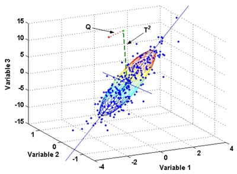
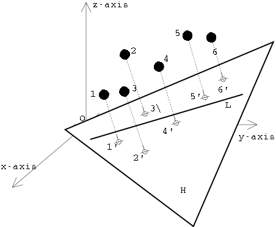
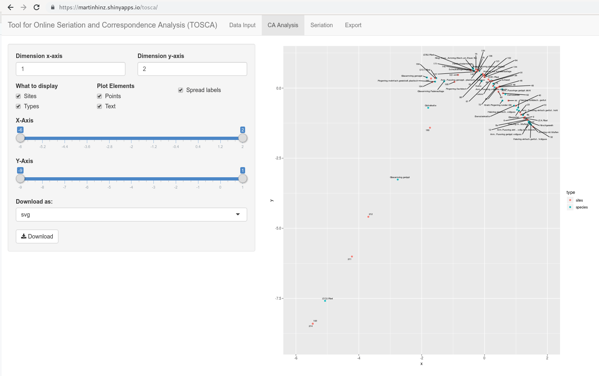
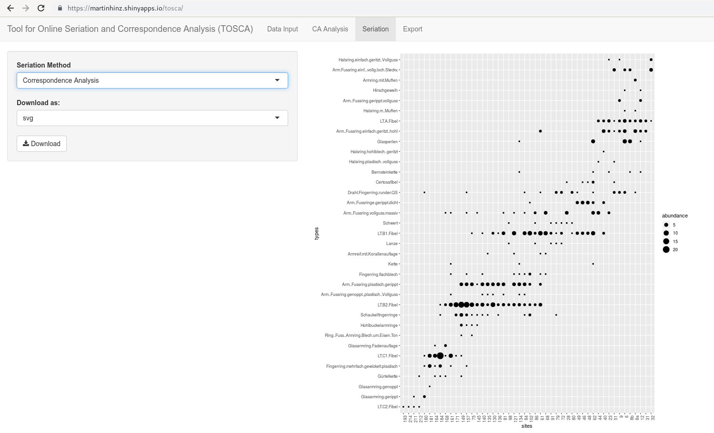

```{r include=FALSE}
#knitr::opts_knit$set(root.dir = '10_session/')
xfun::pkg_load2(c("htmltools", "mime", "rgl", "magrittr", "knitr", "kableExtra"))
remove(list = ls())
```

# Correspondence analysis
## Background
### Idea and Basics

The basic assumption underlying correspondence analysis is the same as the one we used in cluster analysis: similar things have similar characteristics, and can therefore be grouped together based on their features. Just like cluster analysis, correspondence analysis is a Pattern Detection technique. Both could also be called exploratory methods. Their aim is to discover patterns in the data. Using correspondence analysis as a statistical procedure does not in any way prove that the patterns found are actually significant. For the purpose of significance testing, one must resort to standard procedures of statistical hypothesis testing.

In contrast to cluster analysis, correspondence analysis is inherently a visual procedure. It is primarily used to visualise contingency tables or presents absence matrices. Correspondence analysis belongs to the broader field of ordination methods, which involves ordering objects according to their characteristics and then visually representing this order.

The basic idea of visualisation by means of a correspondence analysis is the following: the representation of the objects (called 'sites' in vegan jargon) and the properties (mostly types in archaeology, called 'species' in vegan jargon) are represented in a common coordinate system. The intuition here is that objects that are closer together should also be more similar than those objects that are positioned far away from each other. For this, of course, similarities must first be determined. This similarity determination is carried out in the context of the correspondence analysis by means of the chi-square method, as we have already become familiar with in the context of the chi-square test.

Just like the chi-square test, the correspondence analysis has very low requirements for the data quality of the variables due to the underlying mathematical method (the chi-square method). A data matrix with at least nominally scaled variables is sufficient for the procedure. Higher scaled variables are also possible, but then the information contained in this higher scale level is lost. These low demands on the scaling level make the correspondence particularly attractive for archaeological questions, as we often only have nominally scaled variables, such as different types at a site, or different nominally determined features on pottery vessels.

The basic sequence can be stated as follows. 1:

1. the data are standardised across data sets to a comparable measure
2. the data standardised in this way are projected into the multidimensional variable space.
3. those vectors are determined that gradually absorb the most information from the data and are oriented at right angles to each other at the same time.
4. the data points of the objects as well as of the properties are projected with their coordinates onto those planes which are formed by the vectors.
5. the resulting new coordinates can now be represented in a diagram in relation to the individual vectors (dimensions).


.caption[.tiny[source: http://www.aapspharmscitech.org] \label{multivariablespace}]


.caption[.tiny[source: http://www.cs.mcgill.ca]]


### History

Correspondence analysis itself was developed in the context of biological and psychological studies. Its algebraic foundations were laid in the 1940s by Hartley and Guttmann. The first explicit use of correspondence analysis was by Benzéncri in the 1960s in the field of linguistic studies. Subsequently, correspondence analysis was further explored and developed by various research groups. This led to the emergence of different versions, but also to the establishment of different names for the same procedure. In 1984, Greenacre wrote the basic monograph on the method, which is still considered the standard work on the subject.

In archaeology, correspondence analysis appeared first and mainly in the context of seriation. Seriations were already carried out and published in 1899 by William Flinders Petri. However, these were still done by hand and eye, and were not yet supported by mathematical methods. In the 1960s, the application of various mathematical methods for seriation studies experienced a great upswing (Kendall, Münsingen). In Germany, the first experiments with seriation using computer-assisted methods were published by Goldmann in 1979 as part of his dissertation, in which the method of reciprocal averaging was used for seriation. Only subsequently did correspondence analysis emerge as a method for this purpose. This procedure was used particularly extensively in the chronological order of the Rhenish Linearband Pottery. The procedures used in this context were further developed especially by the University of Cologne. Another focus of the application of correspondence analysis in German-speaking countries is the University of Kiel.

## Conducting a correspondence analysis
### Data formats

For correspondence analysis, data is usually available in two-dimensional form: the individual rows of the data table represent the individual items. These can be individual sites, but also individual pottery vessels, depending on the scale of the respective investigation. The individual columns, in turn, represent the features that were observed on the individual items. Depending on the scale of the investigation, this can also reach very different levels of granularity.

#### Presence-absence data

The table can contain presence-absence data. Here, a one in the corresponding cell indicates that the feature is present on the object, whereas the zero represents the absence of this feature.

```{r echo=F}
burials <- data.frame(row.names=c("Pot","Cup","Fibula"))

burials["Burial1"] = c(1,1,0)
burials["Burial2"] = c(0,1,1)
burials["Burial3"] = c(1,1,1)
burials["Burial4"] = c(1,0,1)

burials <- t(burials)
```

```{r}
library(magrittr)
library(kableExtra)
burials %>% addmargins() %>%
  kbl() %>%
  kable_styling()
```

#### Contingency table

Another possibility, which is particularly useful for more comprehensive analyses, is the representation as a contingency table: Here, an absolute number is used to indicate how many of the characteristics are observable on the respective item.

|             | Pot | Cup | Fibula | Sum |
|-------------|-----|-----|--------|-----|
| Settlements | 20  | 23  | 40     | 83  |
| Hoards      | 23  | 10  | 6      | 39  |
| Burials     | 10  | 56  | 4      | 70  |
| Sum         | 53  | 89  | 50     | 192 |

#### Burt matrices

Another possibility how data can be used in a correspondence analysis is the so-called Burt matrix. In this case, features and items are no longer listed with respect to each other in a table, but only the correspondence between features matching items, or the correspondence between items matching features.

To illustrate this, let us transform the table of grave goods and individual burials from above into one respectively two Burt matrices. Let us start with the matrix for the items. For all burials, we look in pairs at how many present attribute values they match. This number marks the cell content for a table in which all items (in our case, burials) are plotted against each other in the rows and columns.

In the case of burial one, pot and cup are present. This means that burial one is assigned the value two in relation to burial one itself, since we have two positive feature values present. In relation to burial two, the value one is assigned, as both are in agreement positively only in relation to the cup. In relation to burial three, the value is again two, as both top and cup match, but burial one does not include a fibula. In relation to burial four, again, only the pot matches, cup and fibula are missing in one of the two graves respectively. This now continues for all pairwise items. At the end of this procedure we should arrive at the following table:

```{r echo=F}
burials %*% t(burials)  %>%
  kbl() %>%
  kable_styling()
```

Instead of counting out the individual values directly, we can also use an operation from matrix algebra: we multiply the matrix of presence-absence data by itself, with the second instance transposed, i.e. rotated by 90°. The result is the same as that of the process we performed by hand above.

```{r}
burials %*% t(burials)
```

In this way we have created a Burt matrix for the sites. In the same way, we can also create a matrix for the features, i.e. the species. Only we have to exchange which of the matrices we rotate by 90°.

```{r}
t(burials) %*% burials
```

The resulting matrices each record the relevant matches, but focus only on either the characteristics or the items. The diagonal contains the number of matches observed for the individual features or items with themselves. These are not actually relevant to the original problem of the seriation. Therefore, one can also set this diagonal to zero in order to focus even more strongly on the correlations between the individual variables or items. Such a modified Burt matrix can often give a clearer seriation and correspondence analysis result.

```{r}
burt.s <- burials %*% t(burials)
diag(burt.s) <- 0
burt.s
```


### Standardising to relative frequency

In the next step, we bring the values within the data table (be it the presence absence or contingency table) to a uniform measure. Here we use the relative numbers per cell, i.e. we divide the total table by the total sum of all entries in this table.

Let us continue to illustrate this with the presence-absence table for the burials:

```{r echo=F}
burials %>% addmargins() %>%
  kbl() %>%
  kable_styling()
```

Here I have included the marginal sums. The total sum of the table is nine. If we now divide each individual cell of the table by nine, the total sum is only one, and the respective entries are one ninth.

```{r echo=F}
p <- (burials / sum(burials))

p %>%
  addmargins() %>%
  kbl(digits = 2) %>%
  kable_styling()
```

In addition to the individual values within the table, which now represent the relative frequency, the newly created marginal sums are also relevant. We will need these to calculate the expected values for the Chi Square value. Furthermore, we will need this information later for scaling the coordinates for the visual representation. These marginal sums are also called row or column profiles, the individual values within these are also called row masses or column masses.

.tiny[
Row profile:
```{r echo=F}
p %>%
  rowSums() %>% round(2)
```

Column profile:
```{r echo=F}
p %>%
  colSums() %>% round(2)
```

### Calculation of expected values

The correspondence analysis, as already indicated several times, is based on the chi-square value in its measure for the individual similarities. We have covered the following formula for the calculation of the chi-square value within the chi-square test:

$\chi^2=\sum_{i=1}^n \frac{(O_i - E_i)^2}{E_i}$

So we relate the observed values to the expected values, assuming that no specific pattern exists, and thus measure the degree of our surprise with regard to the pattern in the data. For this calculation, we need the expected values as well as the observed values. In fact, the measure used in the correspondence analysis is a slight modification of the above formula: instead of the chi-squared value, we use a Z value that is not squared, which means that we can have positive and negative values. 

$z_{ij}=\frac{(O_i - E_i)}{\sqrt{E_i}}$

Nevertheless, we also need the expected values for the calculation of this value, which, as you will remember from the lesson on the chiquadrat test, results from the marginal sums. In the case that no pattern exists, the expected value for the individual cell is the column sum times the row sum, divided by the total sum. The latter is omitted in our case here, since the total sum is already normalised to one. Thus, we can calculate the total expected value for the table quite quickly:

```{r echo=F}
e <- rowSums(p) %*% t(colSums(p)) / sum(p)^2
rownames(e) <- rownames(p)
e %>%
  addmargins() %>%
  kbl(digits = 2) %>%
  kable_styling()
```

Now, with the expected values at hand, we can put them together with the observed values into the formula above. I will spare you the actual calculation, as we have already done this in a similar way for the chi-square test. Instead, below is just the table with the results for the normalised values:

```{r echo=F}
z <- (p - e)/sqrt(e)
write.csv2(z, file = "burial_z.csv")
knitr::kable(round(addmargins(z),2), format="html")
```

The first thing we can derive directly from this table is the measure of the overall dispersion of the data. This means how much variability (or potential for surprise, to stick with the language I have now used more often) there is in our data set. The measure of surprise is, in fact, the chi-square value. To make this comparable between different data sets, we have to divide it by the number of cases. In purely mathematical terms (I will spare us all the derivation), however, we can also sum up the normalised values over the entire table and obtain the same number as a result. This can also be expressed as a formula, which looks quite impressive due to its two sums signs, but is basically quite trivial. The second part of the formula means nothing other than that all values are simply summed up over all rows and columns of the table.

$I = \frac{\chi^2}{n} = \sum_i \sum_j z_{ij}^2$

The result of this calculation is a measure of the dispersion of the data in relation to the number of cases. This measure is also called inertia. This term appears frequently when correspondence analysis is involved. It means nothing other than how volatile or dissimilar the individual data in the overall data set are to each other.

The total inertia in our example is: `r sum(z^2)`

The second thing we can derive are the coordinates of our data in the multidimensional data space. This is nothing other than the values of the individual data sets in relation to the individual variables. In our case, these variables are normalised with the normalisation we just did. The individual axes, however, still correspond to the original variables that we have provided. This corresponds to the representation we have already used above (Figure \ref{multivariablespace}).

There are three variables in our data set. In a three-dimensional representation, we can now plot all three variables in a coordinate system and represent our points (our individual data) in it. In the HTML version of this book, the following picture is movable with the mouse: Just click on it, keep the mouse button pressed and move the mouse. I am not yet sure how to do this in the printed version.

```{r echo=FALSE}
library(rgl)
plot3d(z[,1], z[,2], z[,3], type="s", size=1, lit=TRUE)
text3d(z[,1], z[,2], z[,3], rownames(z))
rglwidget()
```

But this is exactly where the problem lies. Normally, we are not able to see all variables at the same time, even with a three-dimensional representation. Therefore, one of the most important concerns in correspondence analysis is to reduce the dimensions while at the same time reflecting as much information as possible. Correspondence analysis thus belongs to the so-called dimension reduction methods. As already explained above, we now look for the vectors that run through the largest scatter in our data cloud. The first vector to be determined is the one that covers the largest extent and thus also absorbs the most variability in the data set. The next vector is determined in such a way that it lies at right angles to the first, and at the same time runs through the next largest possible extent of the data cloud. And so on.

Two vectors in space describe a plane. So once we have determined the first and second vectors, we can use these two to define a plane that represents our future coordinate space. The vectors themselves become the axes of the new coordinate system. Projected perpendicularly onto this plane (as if you were looking at it from above, or as if you were shining a torch on the scenery from above so that the data points cast shadows), the individual data points can now be represented on this plane. And with this, we have obtained a new view of our data, in which the greatest dissimilarities are mapped via the vectors. So we get a representation that captures as much of the information of the original data set as possible, but does it with only two dimensions. And this can be done for any combination of vectors (dimensions).


.caption[.tiny[source: http://www.cs.mcgill.ca]]
]


### Extraction of dimensions

Mathematically, this determination of the largest extension of the point cloud and the projection of the points onto the resulting vectors is the solution of a complex linear equation system. And a proven means for such a task is the so-called [singular value decomposition](https://en.wikipedia.org/wiki/Singular_value_decomposition) (SVD). This method is used in many fields, ranging from image compression methods such as JPEG, to the reconstruction of three-dimensional objects, to such esoteric applications as particle physics. In our humble use case, it is used to perform data reduction. But because of the importance of this process in many areas, one of its developers (Gene Golub) has appropriated the abbreviation for his car registration plate:


.caption[.tiny[Gene Golub’s license plate, photographed by Professor P. M. Kroonenberg of Leiden University.]]

Specifically, the data matrix of our similarities is decomposed into three matrices.

$Z=U∗S∗V'$

Z : Matrix with the standardized data (our input)

U : Matrix for the row elements

V : Matrix for the column elements

S : Diagonal matrix with the singular values

Z are the normalised values we calculated above. Three matrices are created from these. U is the matrix that gives the new coordinates on the vectors for the rows of our original data (i.e. the cases, in our case the burials). V is in the same sense the matrix for the columns, in our case the different types. These can also be oriented in the coordinate system, so to speak as an ideal case for the occurrence of this form. We can determine similarities of the objects in relation to their properties, but in the same framework we can also determine similarities of the properties in relation to the objects in which they are represented. The last matrix S is a diagonal matrix, i.e. it consists almost exclusively of zeros, only its diagonal has values. In our case, these values represent the information about how much of the variability of the total data set is included in the individual dimensions of the new coordinate system. If all three matrices are multiplied together by means of matrix multiplication, the initial matrix Z is obtained again.

How this matrix decomposition works is hard to do and even harder to understand if you haven't done a semester of matrix algebra. Fortunately, R takes care of that for us. And of course, as we will see later, there is also a command that does all the correspondence analysis for us in one piece. Nevertheless, we will proceed step by step here, and first perform the singular value decomposition for our normalised data:

```{r}
burial.z<-read.csv2("burial_z.csv",row.names=1)
burial.svd<-svd(burial.z)
burial.svd
```

---
SVD and Inertia
The singular values (eigenvalues) represent the inertia.
The eigenvalues
```{r}
burial.svd$d
```

The squared eigenvalues are the inertia of the individual dimensions
```{r}
burial.svd$d^2
```

The sum of the squared eigenvalues is equal to the total of the intertia.
```{r}
sum(burial.svd$d^2)
```

If the inertia of the individual dimensions is divided by the total inertia, the (eigenvalue) proportion of the dimensions is obtained.

```{r}
burial.svd$d^2/sum(burial.svd$d^2)
```

---
## Correspondence analysis: Procedure (using a presence/absence matrix)

### Normalization of coordinates
Scaling of the coordinates in such a way that

The dimensions are weighted according to their proportion of the total inertia.

The rows/columns are weighted according to their proportion of the mass.

.pull-left[

Row (*sites*) Points: $r_{ik} = \frac{u_{ik}*\sqrt{s_k}}{\sqrt{p_i}}$

]
.pull-right[

Column (*species*) Points: $c_{jk} = \frac{v_{jk}*\sqrt{s_k}}{\sqrt{p_j}}$

]

$u$, $v$ → Matrices of rows/columns from the SVD

$s_k$ → Diagonal matrix

$p_i$ , $p_j$ → Masses of rows/columns from the relative frequency

---

## Correspondence analysis: Procedure (using a presence/absence matrix)

Everything in R:

.pull-left[
```{r eval=F}
library(vegan)

burial <- read.csv("burials.csv",
                   row.names = 1)
burial.cca <- cca(burial)
plot(burial.cca, scaling=3)

```
scaling=3: by default R normalizes only the species (types)

- scaling = 1 : Normalization of sites

- scaling = 2 : Normalization of the Species

- scaling = 3 : Symmetrical normalization of sites and species

- scaling = 0 : No normalization
]

.pull-right[
```{r echo=F, message=F}
library(vegan)

burial <- read.csv("burials.csv", row.names = 1)
burial.cca <- cca(burial)
plot(burial.cca, scaling=3)

```
]

---

## Correspondence analysis: Real World case

### Münsingen Burial Site

.pull-left[
.small[
```{r eval=F, message=F}
muensingen <- read.csv("muensingen_ideal.csv",
                       row.names = 1)
muensingen.cca <- cca(muensingen)
plot(muensingen.cca, scaling=3)
```
]
]

.pull-right[
```{r echo=F, message=F}
muensingen <- read.csv("muensingen_ideal.csv", row.names = 1)
muensingen.cca <- cca(muensingen)
plot(muensingen.cca, scaling=3)
```
]

---

## Correspondence analysis: Real World case

### Münsingen Burial Site

.pull-left[
.tiny[
```{r message=F}
scores(muensingen.cca, display = "sites")
```
]
]

.pull-right[
.tiny[
```{r message=F}
scores(muensingen.cca, display = "species")
```
]
]
---
## Correspondence analysis: Real World case

### Münsingen Burial Site

.pull-left[
.tiny[
```{r message=F}
plot(muensingen.cca, display = "sites")
```
]
]

.pull-right[
.tiny[
```{r message=F}
plot(muensingen.cca, display = "species")
```
]
]
---
## Correspondence analysis: Real World case

### Münsingen Burial Site

.pull-left[
.tiny[
```{r message=F}
plot(muensingen.cca, choices = c(1,2))
```
]
]

.pull-right[
.tiny[
```{r message=F}
plot(muensingen.cca, choices = c(1,3))
```
]
]

---
## Correspondence analysis: Real World case

### Münsingen Burial Site

.pull-left[
.tiny[
```{r eval=F, message=F}
library(ggplot2)
library(ggrepel)

muensingen.species <- data.frame(
  scores(muensingen.cca)$species
  )
ggplot(muensingen.species,
       aes(x=CA1,
           y=CA2,
           label=rownames(muensingen.species))) +
  geom_point() + geom_text_repel(size=2)
```
]
]

.pull-right[
```{r echo=F, message=F}
library(ggplot2)
library(ggrepel)

muensingen.species <- data.frame(scores(muensingen.cca)$species)
ggplot(muensingen.species,aes(x=CA1,y=CA2,label=rownames(muensingen.species))) + geom_point() + geom_text_repel(size=2)
```
]

---
## Correspondence analysis: Real World case

### Münsingen Burial Site

.pull-left[

]

.pull-right[

]

[http://tosca.archaeological.science](http://tosca.archaeological.science)
---

## Correspondence Analysis: Interpretation

### Guttman effect (horseshoe, parabola)

.pull-left[
In archaeology, this is often regarded as evidence of a temporal orientation.

The Guttman effect occurs when a process affects the data on multiple levels.

The largest influencing factor, given a longer runtime, is mostly the time, but:

This does not always have to be the case.

Check against other information necessary.
]

.pull-right[
```{r echo=F, message=F}
muensingen.sites <- data.frame(scores(muensingen.cca)$sites)
ggplot(muensingen.sites,aes(x=CA1,y=CA2,label=rownames(muensingen.sites))) + geom_point()
```
]